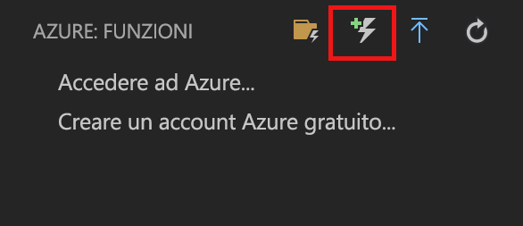
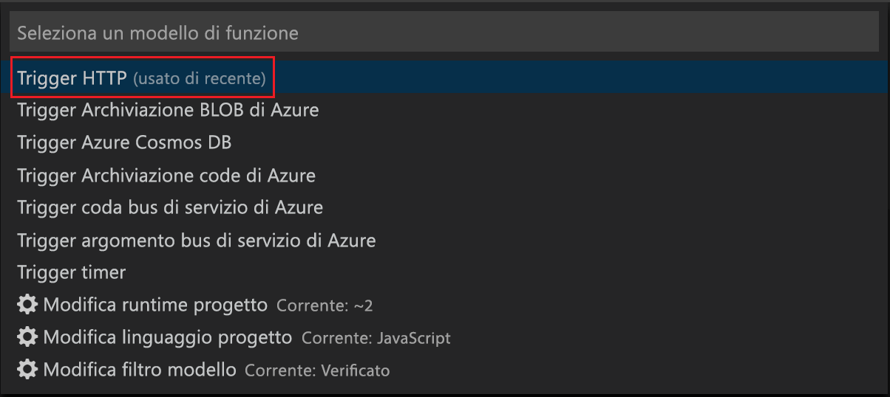
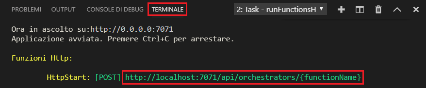
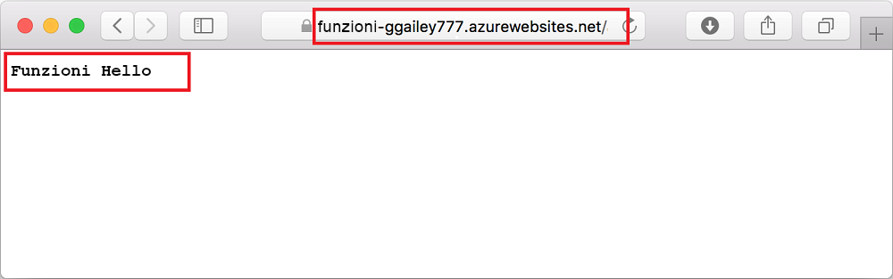

# Creare la prima funzione con Visual Studio Code

Funzioni di Azure consente di eseguire il codice in un ambiente [senza server](https://azure.microsoft.com/solutions/serverless/), senza dover prima creare una macchina virtuale o pubblicare un'applicazione Web.

In questo articolo verrà illustrato come usare l'[estensione Funzioni di Azure per Visual Studio Code] per creare e testare una funzione "hello world" nel computer locale mediante Microsoft Visual Studio Code. Il codice della funzione verrà quindi pubblicato in Azure da Visual Studio Code.

L'estensione supporta attualmente funzioni C#, JavaScript e Java. La procedura illustrata in questo articolo potrebbe variare in base al linguaggio scelto per il progetto di Funzioni di Azure. L'estensione è attualmente disponibile anteprima. Per altre informazioni, vedere la pagina relativa all'[estensione Funzioni di Azure per Visual Studio Code].

## Prerequisiti

Per completare questa guida introduttiva:

* Installare [Visual Studio Code](https://code.visualstudio.com/) in una delle [piattaforme supportate](https://code.visualstudio.com/docs/supporting/requirements#_platforms). Questo articolo è stato sviluppato e testato in un dispositivo che esegue macOS (High Sierra).

* Installare la versione 2.x degli [strumenti di base di Funzioni di Azure](functions-run-local.md#v2), ancora in anteprima.

* Installare i requisiti specifici per il linguaggio scelto:

    | Linguaggio | Estensione |
    | -------- | --------- |
    | **C#** | [C# per Visual Studio Code](https://marketplace.visualstudio.com/items?itemName=ms-vscode.csharp) [Strumenti dell'interfaccia della riga di comando di .NET Core](https://docs.microsoft.com/dotnet/core/tools/?tabs=netcore2x)*   |
    | **Java** | [Debugger per Java](https://marketplace.visualstudio.com/items?itemName=vscjava.vscode-java-debug) [Java 8](https://aka.ms/azure-jdks) [Maven 3+](https://maven.apache.org/) |
    | **JavaScript** | [Node 8.0+](https://nodejs.org/)  |

    \* Richiesto anche dagli strumenti di base.

[!INCLUDE [quickstarts-free-trial-note](../../includes/quickstarts-free-trial-note.md)]

[!INCLUDE [functions-install-vs-code-extension](../../includes/functions-install-vs-code-extension.md)]

[!INCLUDE [functions-create-function-app-vs-code](../../includes/functions-create-function-app-vs-code.md)]

## Creare una funzione attivata tramite HTTP

1. Da **Azure: Funzioni** scegliere l'icona Crea funzione.

    

1. Selezionare la cartella contenente il progetto di app per le funzioni e quindi selezionare il modello di funzione **Trigger HTTP**.

    

1. Digitare `HTTPTrigger` come nome della funzione, premere INVIO e quindi selezionare **Anonima** come tipo di autenticazione.

    

    Viene creata una funzione nel linguaggio prescelto usando il modello per una funzione attivata tramite HTTP.

    

È possibile aggiungere associazioni di input e output alla funzione modificando il file function.json. Per altre informazioni, vedere [Concetti relativi a trigger e associazioni in Funzioni di Azure](functions-triggers-bindings.md).

Ora che è stato creato il progetto di funzione con una funzione attivata tramite HTTP, è possibile testare la funzione nel computer locale.

## Testare la funzione in locale

Azure Functions Core Tools consente di eseguire un progetto Funzioni di Azure nel computer di sviluppo locale. Viene richiesto di installare questi strumenti al primo avvio di una funzione da Visual Studio Code.  

1. Per testare la funzione, impostare un punto di interruzione nel codice della funzione e premere F5 per avviare il progetto di app per le funzioni. L'output dagli strumenti di base viene visualizzato nel pannello **Terminale**.

1. Nel pannello **Terminale** copiare l'endpoint dell'URL della funzione attivata da HTTP.

    

1. Incollare l'URL per la richiesta HTTP nella barra degli indirizzi del browser. Aggiungere la stringa di query `?name=<yourname>` all'URL ed eseguire la richiesta. L'esecuzione viene sospesa quando viene raggiunto il punto di interruzione.

    

1. Quando si continua l'esecuzione, viene mostrata la risposta seguente nel browser per la richiesta GET:

    

1. Per interrompere il debug, premere MAIUSC+F1.

Dopo aver verificato la corretta esecuzione della funzione nel computer locale, è possibile pubblicare il progetto in Azure.

[!INCLUDE [functions-sign-in-vs-code](../../includes/functions-sign-in-vs-code.md)]

[!INCLUDE [functions-publish-project-vscode](../../includes/functions-publish-project-vscode.md)]

## Testare la funzione in Azure

1. Copiare l'URL del trigger HTTP dal pannello **Output**. Come prima, assicurarsi di aggiungere la stringa di query `?name=<yourname>` alla fine dell'URL ed eseguire la richiesta.

    Il formato dell'URL che chiama la funzione attivata tramite HTTP sarà simile al seguente:

        http://<functionappname>.azurewebsites.net/api/<functionname>?name=<yourname> 

1. Incollare questo nuovo URL per la richiesta HTTP nella barra degli indirizzi del browser. Di seguito è illustrata la risposta nel browser alla richiesta GET remota restituita dalla funzione: 

    

## Passaggi successivi

È stato usato Visual Studio Code per creare un'app per le funzioni con una semplice funzione attivata tramite HTTP. Per altre informazioni sullo sviluppo di funzioni in un linguaggio specifico, vedere le guide di riferimento ai linguaggi per [JavaScript](functions-reference-node.md), [.NET](functions-dotnet-class-library.md) o [Java](functions-reference-java.md).

Sono quindi disponibili altre informazioni sul test locale e sul debug dal terminale o dal prompt dei comandi mediante gli strumenti di base di Funzioni di Azure.

> [!div class="nextstepaction"]
> [Scrivere codice ed eseguire test in locale](functions-run-local.md)

[Azure Functions Core Tools]: functions-run-local.md
[Estensione Funzioni di Azure per Visual Studio Code]: https://marketplace.visualstudio.com/items?itemName=ms-azuretools.vscode-azurefunctions
