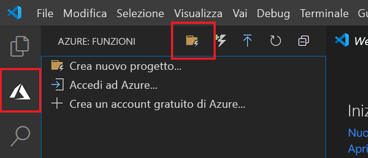
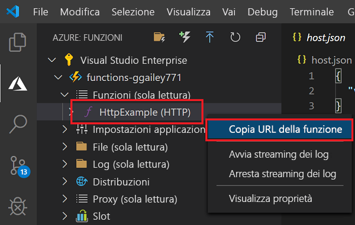

# <a name="quickstart-create-a-function-in-azure-using-visual-studio-code"></a>Avvio rapido: Creare una funzione in Azure con Visual Studio Code

::: zone pivot="programming-language-csharp"
In questo articolo viene usato Visual Studio Code per creare una funzione basata sulla libreria di classi C# che risponde alle richieste HTTP. Dopo aver testato il codice in locale, verrà distribuito nell'ambiente serverless di Funzioni di Azure.
::: zone-end
::: zone pivot="programming-language-javascript"
In questo articolo si userà Visual Studio Code per creare una funzione JavaScript che risponde alle richieste HTTP. Dopo aver testato il codice in locale, verrà distribuito nell'ambiente serverless di Funzioni di Azure.
::: zone-end
::: zone pivot="programming-language-typescript"
In questo articolo si userà Visual Studio Code per creare una funzione TypeScript che risponde alle richieste HTTP. Dopo aver testato il codice in locale, verrà distribuito nell'ambiente serverless di Funzioni di Azure.
::: zone-end 
::: zone pivot="programming-language-powershell"
In questo articolo si userà Visual Studio Code per creare una funzione PowerShell che risponde alle richieste HTTP. Dopo aver testato il codice in locale, verrà distribuito nell'ambiente serverless di Funzioni di Azure.
::: zone-end
::: zone pivot="programming-language-python"
In questo articolo si userà Visual Studio Code per creare una funzione Python che risponde alle richieste HTTP. Dopo aver testato il codice in locale, verrà distribuito nell'ambiente serverless di Funzioni di Azure.
::: zone-end
::: zone pivot="programming-language-java"
In questo articolo si userà Visual Studio Code per creare una funzione Java che risponde alle richieste HTTP. Dopo aver testato il codice in locale, verrà distribuito nell'ambiente serverless di Funzioni di Azure.
::: zone-end

Le procedure illustrate in questa guida di avvio rapido comportano l'addebito di qualche centesimo (USD) o meno nell'account Azure. 

::: zone pivot="programming-language-csharp,programming-language-javascript,programming-language-typescript,programming-language-powershell,programming-language-python"
È inoltre disponibile una [versione di questo articolo basata sull'interfaccia della riga di comando](functions-create-first-azure-function-azure-cli.md).
::: zone-end
::: zone pivot="programming-language-java"
> [!NOTE]
> Se si preferisce non usare Visual Studio Code come strumento di sviluppo, vedere le esercitazioni simili per sviluppatori Java che usano [Maven](./functions-create-first-azure-function-azure-cli.md?pivots=programming-language-java), [Gradle](./functions-create-first-java-gradle.md) e [IntelliJ IDEA](/azure/developer/java/toolkit-for-intellij/quickstart-functions).
::: zone-end

## <a name="configure-your-environment"></a>Configurare l'ambiente

Prima di iniziare, verificare che siano soddisfatti i requisiti seguenti:

- Un account Azure con una sottoscrizione attiva. [Creare un account gratuitamente](https://azure.microsoft.com/free/?ref=microsoft.com&utm_source=microsoft.com&utm_medium=docs&utm_campaign=visualstudio).

::: zone pivot="programming-language-csharp,programming-language-powershell,programming-language-python"
- [Node.js](https://nodejs.org/), richiesto da Windows per npm. Solo le [versioni Active LTS e Maintenance LT](https://nodejs.org/about/releases/). Usare il comando `node --version` per controllare la versione in uso.
    Non necessario per lo sviluppo locale in macOS e Linux. 
::: zone-end 
::: zone pivot="programming-language-javascript,programming-language-typescript"
- [Node.js](https://nodejs.org/), versioni Active LTS e Maintenance LTS (10.14.1 scelta consigliata). Usare il comando `node --version` per controllare la versione in uso.
::: zone-end
::: zone pivot="programming-language-python"
- [Python 3.8](https://www.python.org/downloads/release/python-381/), [Python 3.7](https://www.python.org/downloads/release/python-375/) e [Python 3.6](https://www.python.org/downloads/release/python-368/) sono supportati da Funzioni di Azure (x64).
::: zone-end 
::: zone pivot="programming-language-powershell"
- [PowerShell 7](/powershell/scripting/install/installing-powershell-core-on-windows)

- Sia [.NET Core 3.1](https://www.microsoft.com/net/download) che [.NET Core 2.1](https://dotnet.microsoft.com/download/dotnet-core/2.2)
::: zone-end
::: zone pivot="programming-language-java"
- [Java Developer Kit](/azure/developer/java/fundamentals/java-jdk-long-term-support), versione 8 o 11.

- [Apache Maven](https://maven.apache.org), versione 3.0 o successiva.
::: zone-end
- [Visual Studio Code](https://code.visualstudio.com/) in una delle [piattaforme supportate](https://code.visualstudio.com/docs/supporting/requirements#_platforms).  
::: zone pivot="programming-language-csharp"
- [Estensione C#](https://marketplace.visualstudio.com/items?itemName=ms-dotnettools.csharp) per Visual Studio Code.
::: zone-end
::: zone pivot="programming-language-python"
- [Estensione Python](https://marketplace.visualstudio.com/items?itemName=ms-python.python) per Visual Studio Code.
::: zone-end
::: zone pivot="programming-language-powershell"
- [Estensione PowerShell per Visual Studio Code](https://marketplace.visualstudio.com/items?itemName=ms-vscode.PowerShell).
::: zone-end
::: zone pivot="programming-language-java"
- [Java Extension Pack](https://marketplace.visualstudio.com/items?itemName=vscjava.vscode-java-pack)
::: zone-end

- [Estensione Funzioni di Azure](https://marketplace.visualstudio.com/items?itemName=ms-azuretools.vscode-azurefunctions) per Visual Studio Code.

## <a name="create-your-local-project"></a><a name="create-an-azure-functions-project"></a>Creare il progetto locale

In questa sezione si userà Visual Studio Code per creare un progetto di Funzioni di Azure locale nel linguaggio scelto. Più avanti in questo articolo verrà pubblicato il codice della funzione in Azure. 

1. Selezionare l'icona di Azure nella barra attività, quindi nell'area **Azure: Funzioni** selezionare l'icona **Crea nuovo progetto...** .

    

1. Scegliere una posizione della directory per l'area di lavoro del progetto e quindi scegliere **Seleziona**.

    > [!NOTE]
    > Questa procedura è stata progettata per il completamento all'esterno di un'area di lavoro. In questo caso, non selezionare una cartella di progetto inclusa in un'area di lavoro.

1. Quando richiesto, immettere le informazioni seguenti:

    ::: zone pivot="programming-language-csharp"
    - **Selezionare un linguaggio per il progetto di funzione** : Scegliere `C#`.
    ::: zone-end
    ::: zone pivot="programming-language-javascript"
    - **Selezionare un linguaggio per il progetto di funzione** : Scegliere `JavaScript`.
    ::: zone-end
    ::: zone pivot="programming-language-typescript"
    - **Selezionare un linguaggio per il progetto di funzione** : Scegliere `TypeScript`.
    ::: zone-end
    ::: zone pivot="programming-language-powershell"
    - **Selezionare un linguaggio per il progetto di funzione** : Scegliere `PowerShell`.
    ::: zone-end
    ::: zone pivot="programming-language-python"
    - **Selezionare un linguaggio per il progetto di funzione** : Scegliere `Python`.

    - **Selezionare un alias Python per creare un ambiente virtuale** : Scegliere la posizione dell'interprete Python. Se la posizione non viene visualizzata, digitare il percorso completo del file binario di Python.
    ::: zone-end

    ::: zone pivot="programming-language-java"
    - **Selezionare un linguaggio per il progetto di funzione** : Scegliere `Java`.

    - **Selezionare una versione di Java** : Scegliere una versione tra `Java 8` e `Java 11`, in cui eseguire le funzioni in Azure. Scegliere una versione di Java che è stata verificata in locale.

    - **Specificare un ID gruppo** : Scegliere `com.function`.

    - **Specificare un ID artefatto** : Scegliere `myFunction`.

    - **Specificare una versione** : Scegliere `1.0-SNAPSHOT`.

    - **Specificare un nome di pacchetto** : Scegliere `com.function`.

    - **Specificare un nome di app** : Scegliere `myFunction-12345`.
    ::: zone-end
    ::: zone pivot="programming-language-csharp,programming-language-javascript,programming-language-typescript,programming-language-powershell,programming-language-python"
    - **Selezionare un modello per la prima funzione del progetto** : Scegliere `HTTP trigger`.
  
    - **Specificare un nome di funzione** : Digitare `HttpExample`.
    ::: zone-end
    ::: zone pivot="programming-language-csharp"
    - **Specificare uno spazio dei nomi** : Digitare `My.Functions`.
    ::: zone-end
    ::: zone pivot="programming-language-csharp,programming-language-javascript,programming-language-typescript,programming-language-powershell,programming-language-python"
    - **Livello di autorizzazione** : Scegliere `Anonymous`, che consente a chiunque di chiamare l'endpoint della funzione. Per informazioni sul livello di autorizzazione, vedere [Chiavi di autorizzazione](functions-bindings-http-webhook-trigger.md#authorization-keys).
    ::: zone-end
    - **Selezionare come si vuole aprire il progetto** : Scegliere `Add to workspace`.

1. Usando queste informazioni, Visual Studio Code genera un progetto di Funzioni di Azure con un trigger HTTP. È possibile visualizzare i file di progetto locali in Explorer. Per altre informazioni sui file che vengono creati, vedere [File di progetto generati](functions-develop-vs-code.md#generated-project-files). 

::: zone pivot="programming-language-csharp,programming-language-javascript,programming-language-python,programming-language-java"

[!INCLUDE [functions-run-function-test-local-vs-code](../../includes/functions-run-function-test-local-vs-code.md)]

::: zone-end

::: zone pivot="programming-language-powershell"

[!INCLUDE [functions-run-function-test-local-vs-code-ps](../../includes/functions-run-function-test-local-vs-code-ps.md)]

::: zone-end

Dopo aver verificato la corretta esecuzione della funzione nel computer locale, è possibile usare Visual Studio Code per pubblicare il progetto direttamente in Azure.

[!INCLUDE [functions-sign-in-vs-code](../../includes/functions-sign-in-vs-code.md)]

[!INCLUDE [functions-publish-project-vscode](../../includes/functions-publish-project-vscode.md)]

## <a name="run-the-function-in-azure"></a>Eseguire la funzione in Azure

1. Nell'area **Azure: Funzioni** nella barra laterale espandere la nuova app per le funzioni nella sottoscrizione. Espandere **Funzioni** , fare clic con il pulsante destro del mouse su (Windows) o premere <kbd>CTRL +</kbd> clic (macOS) su **HttpExample** e quindi scegliere **Copy function URL** (Copia URL funzione).

    

1. Incollare questo URL per la richiesta HTTP nella barra degli indirizzi del browser, aggiungere alla fine la stringa di query `name` come `?name=Functions`, quindi eseguire la richiesta. Il formato dell'URL che chiama la funzione attivata tramite HTTP sarà simile al seguente:

    ```http
    http://<functionappname>.azurewebsites.net/api/httpexample?name=Functions
    ```

    L'esempio seguente mostra la risposta nel browser alla richiesta GET remota restituita dalla funzione: 

    

## <a name="clean-up-resources"></a>Pulire le risorse

Per continuare con il passaggio successivo, [Aggiungere alla funzione un'associazione alla coda di archiviazione di Azure](functions-add-output-binding-storage-queue-vs-code.md), sarà necessario mantenere tutte le risorse esistenti per poterle riutilizzare.

In caso contrario, seguire questa procedura per eliminare l'app per le funzioni e le risorse correlate per evitare l'addebito di costi aggiuntivi.

[!INCLUDE [functions-cleanup-resources-vs-code.md](../../includes/functions-cleanup-resources-vs-code.md)]

Per altre informazioni sui costi di Funzioni di Azure, vedere [Stima dei costi del piano a consumo](functions-consumption-costs.md).

## <a name="next-steps"></a>Passaggi successivi

È stato usato Visual Studio Code per creare un'app per le funzioni con una semplice funzione attivata tramite HTTP. Il prossimo articolo descrive come espandere questa funzione aggiungendo un binding di output. Questo binding scrive la stringa della richiesta HTTP in un messaggio in una coda dell'archiviazione code di Azure. 

> [!div class="nextstepaction"]
> [Aggiungere un binding della coda di archiviazione di Azure alla funzione](functions-add-output-binding-storage-queue-vs-code.md)

[Azure Functions Core Tools]: functions-run-local.md
[Azure Functions extension for Visual Studio Code]: https://marketplace.visualstudio.com/items?itemName=ms-azuretools.vscode-azurefunctions
