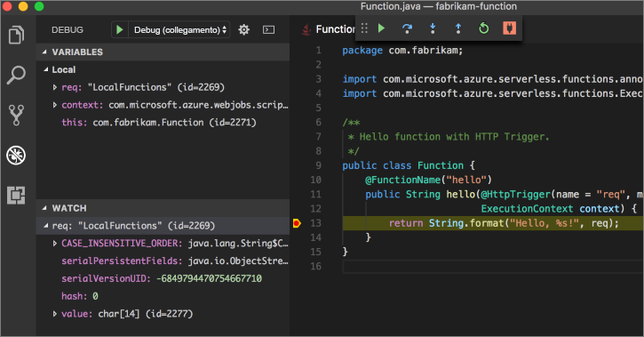

# <a name="create-your-first-function-with-java-and-maven-preview"></a>Creare la prima funzione con Java e Maven (anteprima)

Questa guida introduttiva fornisce istruzioni dettagliate su come creare un progetto di funzione [senza server](https://azure.microsoft.com/overview/serverless-computing/) con Maven, eseguirne il test in locale e distribuirlo in Funzioni di Azure. Al termine, si otterrà un'app per le funzioni attivate da HTTP in esecuzione in Azure.

 

[!INCLUDE [quickstarts-free-trial-note](../../includes/quickstarts-free-trial-note.md)]

## <a name="prerequisites"></a>Prerequisiti
Per sviluppare app per le funzioni con Java, è necessario che siano installati gli elementi seguenti:

-  [.NET Core](https://www.microsoft.com/net/core), versione più recente.
-  [Java Development Kit (JDK)](https://www.azul.com/downloads/zulu/), versione 1.8.
-  [Interfaccia della riga di comando di Azure](https://docs.microsoft.com/cli/azure)
-  [Apache Maven](https://maven.apache.org), versione 3.0 o successiva.
-  [Node.js](https://nodejs.org/download/), versione 8.6 o successiva.

> [!IMPORTANT] 
> Per completare questa guida introduttiva, è necessario impostare la variabile di ambiente JAVA_HOME sul percorso di installazione di JDK.

## <a name="install-the-azure-functions-core-tools"></a>Installare gli strumenti di base per Funzioni di Azure

Gli [strumenti di base di Funzioni di Azure 2.0](https://www.npmjs.com/package/azure-functions-core-tools) offrono un ambiente di sviluppo locale per la scrittura, l'esecuzione e il debug di Funzioni di Azure. Installare gli strumenti con [npm](https://www.npmjs.com/), incluso con [Node.js](https://nodejs.org/).

```
npm install -g azure-functions-core-tools@core
```

> [!NOTE]
> Se si verificano problemi durante l'installazione degli strumenti di base di Funzioni di Azure versione 2.0, vedere [Version di runtime 2.x](/azure/azure-functions/functions-run-local#version-2x-runtime).

## <a name="generate-a-new-functions-project"></a>Generare un nuovo progetto di Funzioni

In una cartella vuota eseguire il comando seguente per generare il progetto di Funzioni da un [archetipo Maven](https://maven.apache.org/guides/introduction/introduction-to-archetypes.html).

### <a name="linuxmacos"></a>Linux/MacOS

```bash
mvn archetype:generate \
    -DarchetypeGroupId=com.microsoft.azure \
    -DarchetypeArtifactId=azure-functions-archetype 
```

### <a name="windows-cmd"></a>Windows (CMD)
```cmd
mvn archetype:generate ^
    -DarchetypeGroupId=com.microsoft.azure ^
    -DarchetypeArtifactId=azure-functions-archetype
```

Maven richiede l'immissione dei valori necessari per completare la generazione del progetto. Per i valori _groupId_, _artifactId_ e _version_, vedere le informazioni di riferimento relative alle [convenzioni di denominazione Maven](https://maven.apache.org/guides/mini/guide-naming-conventions.html). Il valore _appName_ deve essere univoco in Azure. Maven genera pertanto un nome di app in base al valore _artifactId_ precedentemente immesso come nome predefinito. Il valore _packageName_ determina il pacchetto Java per il codice funzione generato.

```Output
Define value for property 'groupId': com.fabrikam.functions
Define value for property 'artifactId' : fabrikam-functions
Define value for property 'version' 1.0-SNAPSHOT : 
Define value for property 'package': com.fabrikam.functions
Define value for property 'appName' fabrikam-functions-20170927220323382:
Confirm properties configuration: Y
```

Maven crea i file di progetto in una nuova cartella denominata _artifactId_. Il codice generato nel progetto è una funzione [attivata da HTTP](/azure/azure-functions/functions-bindings-http-webhook) semplice che restituisce il corpo della richiesta:

```java
public class Function {
    @FunctionName("hello")
    public String hello(@HttpTrigger(name = "req", methods = {"get", "post"}, authLevel = AuthorizationLevel.ANONYMOUS) String req,
                        ExecutionContext context) {
        return String.format("Hello, %s!", req);
    }
}
```

## <a name="run-the-function-locally"></a>Eseguire la funzione in locale

Passare alla cartella in cui si trova il nuovo progetto creato e quindi generare ed eseguire la funzione con Maven:

```
cd fabrikam-function
mvn clean package 
mvn azure-functions:run
```

Quando la funzione è in esecuzione, viene visualizzato l'output seguente:

```Output
Listening on http://localhost:7071
Hit CTRL-C to exit...

Http Functions:

   hello: http://localhost:7071/api/hello
```

Attivare la funzione dalla riga di comando usando curl in un nuovo terminale:

```
curl -w '\n' -d LocalFunction http://localhost:7071/api/hello
```

```Output
Hello LocalFunction!
```

Usare `Ctrl-C` nel terminal per interrompere il codice funzione.

## <a name="deploy-the-function-to-azure"></a>Distribuire la funzione in Azure

Il processo di distribuzione in Funzioni di Azure usa le credenziali dell'account dell'interfaccia della riga di comando di Azure. [Accedere con l'interfaccia della riga di comando di Azure](/cli/azure/authenticate-azure-cli?view=azure-cli-latest) e quindi distribuire il codice in una nuova app per le funzioni usando la destinazione Maven `azure-functions:deploy`.

```
az login
mvn azure-functions:deploy
```

Quando la distribuzione è stata completata, viene visualizzato l'URL da usare per accedere all'app per le funzioni di Azure:

```output
[INFO] Successfully deployed Function App with package.
[INFO] Deleting deployment package from Azure Storage...
[INFO] Successfully deleted deployment package fabrikam-function-20170920120101928.20170920143621915.zip
[INFO] Successfully deployed Function App at https://fabrikam-function-20170920120101928.azurewebsites.net
[INFO] ------------------------------------------------------------------------
```

Eseguire il test dell'app per le funzioni in esecuzione in Azure usando curl:

```
curl -w '\n' https://fabrikam-function-20170920120101928.azurewebsites.net/api/hello -d AzureFunctions
```

```Output
Hello AzureFunctions!
```

## <a name="next-steps"></a>Passaggi successivi

Dopo avere creato un'app per le funzioni Java con un trigger HTTP semplice trigger e averla distribuita in Funzioni di Azure, eseguire le operazioni seguenti.

- Vedere il [manuale dello sviluppatore di funzioni Java](functions-reference-java.md) per altre informazioni sullo sviluppo di funzioni Java.
- Al progetto aggiungere altre funzioni con trigger diversi usando la destinazione Maven `azure-functions:add`.
- Eseguire il debug delle funzioni in locale con Visual Studio Code. Con il [pacchetto di estensioni Java](https://marketplace.visualstudio.com/items?itemName=vscjava.vscode-java-pack) installato e con il progetto Funzioni aperto in Visual Studio Code, [collegare il debugger](https://code.visualstudio.com/Docs/editor/debugging#_launch-configurations) alla porta 5005. Impostare quindi un punto di interruzione nell'editor e attivare la funzione mentre è in esecuzione in locale: 


