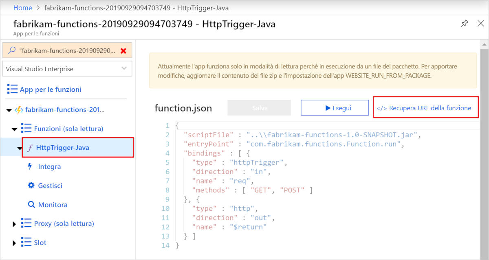

# <a name="quickstart-use-java-and-maven-to-create-and-publish-a-function-to-azure"></a>Guida introduttiva: Usare Java e Maven per creare e pubblicare una funzione in Azure

Questo articolo illustra come creare e pubblicare una funzione Java in Funzioni di Azure con lo strumento da riga di comando Maven. Al termine, il codice della funzione viene eseguito in Azure in un [piano di hosting serverless](functions-scale.md#consumption-plan) e viene attivato da una richiesta HTTP.

<!--
> [!NOTE] 
> You can also create a Kotlin-based Azure Functions project by using the azure-functions-kotlin-archetype instead. Visit the [GitHub repository](https://github.com/microsoft/azure-maven-archetypes/tree/develop/azure-functions-kotlin-archetype) for more information.
-->

## <a name="prerequisites"></a>Prerequisiti

Per sviluppare funzioni con Java, è necessario che siano installati gli elementi seguenti:

- [Java Developer Kit](https://aka.ms/azure-jdks), versione 8
- [Apache Maven](https://maven.apache.org), versione 3.0 o successive
- [Interfaccia della riga di comando di Azure]
- [Azure Functions Core Tools](./functions-run-local.md#v2) versione 2.6.666 o successive
- Una sottoscrizione di Azure.

[!INCLUDE [quickstarts-free-trial-note](../../includes/quickstarts-free-trial-note.md)]


> [!IMPORTANT]
> Per completare questa guida introduttiva, è necessario impostare la variabile di ambiente JAVA_HOME sul percorso di installazione di JDK.

## <a name="generate-a-new-functions-project"></a>Generare un nuovo progetto di Funzioni

In una cartella vuota eseguire il comando seguente per generare il progetto di Funzioni da un [archetipo Maven](https://maven.apache.org/guides/introduction/introduction-to-archetypes.html).

### <a name="linuxmacos"></a>Linux/macOS

```bash
mvn archetype:generate \
    -DarchetypeGroupId=com.microsoft.azure \
    -DarchetypeArtifactId=azure-functions-archetype 
```

> [!NOTE]
> Se si verificano problemi durante l'esecuzione del comando, esaminare quale versione di `maven-archetype-plugin` è in uso. Poiché il comando viene eseguito in una directory vuota senza file `.pom`, potrebbe provare a usare un plug-in della versione meno recente di `~/.m2/repository/org/apache/maven/plugins/maven-archetype-plugin`, se Maven è stato aggiornato da una versione precedente. In questo caso, provare a eliminare la directory `maven-archetype-plugin` e a eseguire di nuovo il comando.

### <a name="windows"></a>Windows

```powershell
mvn archetype:generate `
    "-DarchetypeGroupId=com.microsoft.azure" `
    "-DarchetypeArtifactId=azure-functions-archetype"
```

```cmd
mvn archetype:generate ^
    "-DarchetypeGroupId=com.microsoft.azure" ^
    "-DarchetypeArtifactId=azure-functions-archetype"
```

Maven chiede i valori necessari per completare la generazione del progetto nella distribuzione. Quando richiesto, specificare i valori seguenti:

| Valore | DESCRIZIONE |
| ----- | ----------- |
| **groupId** | Un valore che identifica in modo univoco il progetto tra tutti gli altri, seguendo le [regole di denominazione dei pacchetti](https://docs.oracle.com/javase/specs/jls/se6/html/packages.html#7.7) per Java. Gli esempi di questo argomento di avvio rapido usano `com.fabrikam.functions`. |
| **artifactId** | Un valore che corrisponde al nome del jar, senza un numero di versione. Gli esempi di questo argomento di avvio rapido usano `fabrikam-functions`. |
| **version** | Scegliere il valore predefinito di `1.0-SNAPSHOT`. |
| **package** | Un valore che corrisponde al pacchetto Java per il codice della funzione generato. Usare il valore predefinito. Gli esempi di questo argomento di avvio rapido usano `com.fabrikam.functions`. |
| **appName** | Un nome univoco globale che identifica la nuova app per le funzioni in Azure. Usare il valore predefinito, ossia _artifactId_ con l'aggiunta finale di un numero casuale. Prendere nota di questo valore perché sarà necessario in seguito. |
| **appRegion** | Scegliere un'[area](https://azure.microsoft.com/regions/) nelle vicinanze o vicino ad altri servizi a cui accedono le funzioni. Il valore predefinito è `westus`. Eseguire questo comando dell'[interfaccia della riga di comando di Azure] per ottenere un elenco di tutte le aree:<br/>`az account list-locations --query '[].{Name:name}' -o tsv` |
| **resourceGroup** | Il nome del nuovo [gruppo di risorse](../azure-resource-manager/resource-group-overview.md) in cui viene creata l'app per le funzioni. Usare `myResourceGroup`, che viene usato dagli esempi di questo argomento di avvio rapido. Un gruppo di risorse deve essere univoco nella sottoscrizione di Azure.|

Digitare `Y` o premere INVIO per confermare.

Maven crea i file di progetto in una nuova cartella denominata _artifactId_, che in questo esempio è `fabrikam-functions`. 

Aprire il nuovo file Function.java dal percorso *src/main/java* in un editor di testo e rivedere il codice generato. Questo codice è una funzione [attivata da HTTP](functions-bindings-http-webhook.md) che restituisce il corpo della richiesta. 

## <a name="run-the-function-locally"></a>Eseguire la funzione in locale

Eseguire il comando seguente, che passa alla cartella appena creata, quindi crea ed esegue il progetto di funzione:

```console
cd fabrikam-function
mvn clean package 
mvn azure-functions:run
```

Quando si esegue il progetto in locale, viene visualizzato un output di Azure Functions Core Tools simile al seguente:

```Output
...

Now listening on: http://0.0.0.0:7071
Application started. Press Ctrl+C to shut down.

Http Functions:

    HttpTrigger-Java: [GET,POST] http://localhost:7071/api/HttpTrigger-Java
...
```

Attivare la funzione dalla riga di comando usando cURL in una nuova finestra del terminale:

```CMD
curl -w "\n" http://localhost:7071/api/HttpTrigger-Java --data AzureFunctions
```

```Output
Hello AzureFunctions!
```
La [chiave della funzione](functions-bindings-http-webhook.md#authorization-keys) non è necessaria durante l'esecuzione in locale. Usare `Ctrl+C` nel terminal per interrompere il codice funzione.

## <a name="deploy-the-function-to-azure"></a>Distribuire la funzione in Azure

La prima volta che si distribuisce la nuova app per le funzioni, in Azure vengono create un'app per le funzioni e le risorse correlate. Prima di procedere alla distribuzione, è necessario usare il comando [az login](/cli/azure/authenticate-azure-cli) dell'interfaccia della riga di comando di Azure per accedere alla sottoscrizione di Azure. 

```azurecli
az login
```

> [!TIP]
> Se l'account può accedere a più sottoscrizioni, usare [az account set](/cli/azure/account#az-account-set) per impostare quella predefinita per questa sessione. 

Usare il comando Maven seguente per distribuire il progetto in una nuova app per le funzioni. 

```azurecli
mvn azure-functions:deploy
```

Questa destinazione Maven `azure-functions:deploy` crea le risorse seguenti in Azure:

+ Gruppo di risorse. Con il nome _resourceGroup_ specificato.
+ Account di archiviazione. Richiesto da Funzioni. Il nome viene generato in modo casuale in base ai requisiti di denominazione degli account di archiviazione.
+ Piano del servizio app. Hosting serverless per l'app per le funzioni nell'area _appRegion_ specificata. Il nome viene generato in modo casuale.
+ App per le funzioni. Un'app per le funzioni è l'unità di distribuzione ed esecuzione per le funzioni. Il nome è _appName_, con l'aggiunta finale di un numero generato in modo casuale. 

La distribuzione inserisce inoltre i file di progetto in un pacchetto e li distribuisce nella nuova app per le funzioni tramite [ZipDeploy](functions-deployment-technologies.md#zip-deploy), con la modalità run-from-package abilitata.

Al termine della distribuzione, è possibile visualizzare l'URL utilizzabile per accedere agli endpoint dell'app per le funzioni. Poiché il trigger HTTP pubblicato usa `authLevel = AuthorizationLevel.FUNCTION`, è necessario ottenere la chiave della funzione per chiamare l'endpoint della funzione tramite HTTP. Il modo più semplice per farlo è tramite il [portale di Azure].

## <a name="get-the-http-trigger-url"></a>Ottenere l'URL del trigger HTTP

<!--- We can updates this to remove portal dependency after the Maven archetype returns the full URLs with keys on publish (https://github.com/microsoft/azure-maven-plugins/issues/571). -->

È possibile ottenere l'URL necessario per attivare la funzione, con la chiave della funzione, nel portale di Azure. 

1. Passare al [portale di Azure], accedere, digitare il nome _appName_ dell'app per le funzioni nella casella **Cerca** nella parte superiore della pagina, quindi premere INVIO.
 
1. Nell'app per le funzioni espandere **Funzioni (sola lettura)** , scegliere la funzione, quindi selezionare **</> Recupera URL della funzione** in alto a destra. 

    

1. Scegliere il **valore predefinito (chiave della funzione)** e selezionare **Copia**. 

È ora possibile usare l'URL copiato per accedere alla funzione.

## <a name="verify-the-function-in-azure"></a>Verificare la funzione in Azure

Per verificare l'app per le funzioni in esecuzione in Azure tramite `cURL`, sostituire l'URL dell'esempio seguente con l'URL copiato dal portale.

```azurecli
curl -w "\n" https://fabrikam-functions-20190929094703749.azurewebsites.net/api/HttpTrigger-Java?code=zYRohsTwBlZ68YF.... --data AzureFunctions
```

Viene inviata una richiesta POST all'endpoint della funzione con `AzureFunctions` nel corpo. Verrà visualizzata la risposta seguente.

```Output
Hello AzureFunctions!
```

## <a name="next-steps"></a>Passaggi successivi

È stato creato un progetto di funzioni Java con una funzione attivata tramite HTTP. Il progetto è stato quindi eseguito in un computer locale e distribuito in Azure. A questo punto, estendere la funzione effettuando l'operazione seguente.

> [!div class="nextstepaction"]
> [Aggiungere un'associazione di output della coda di Archiviazione di Azure](functions-add-output-binding-storage-queue-java.md)


[Interfaccia della riga di comando di Azure]: /cli/azure
[Portale di Azure]: https://portal.azure.com