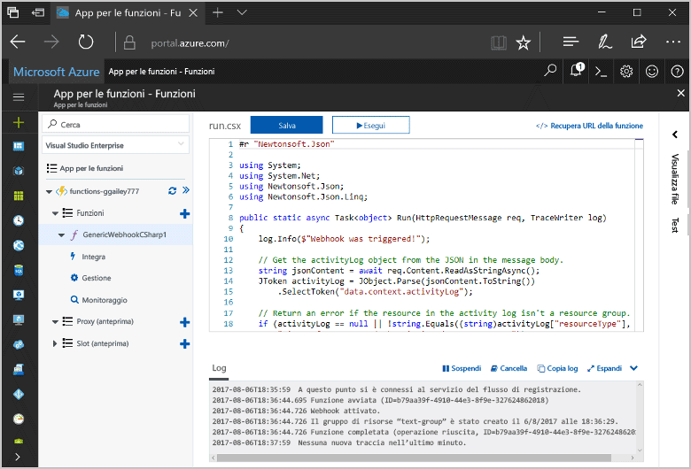
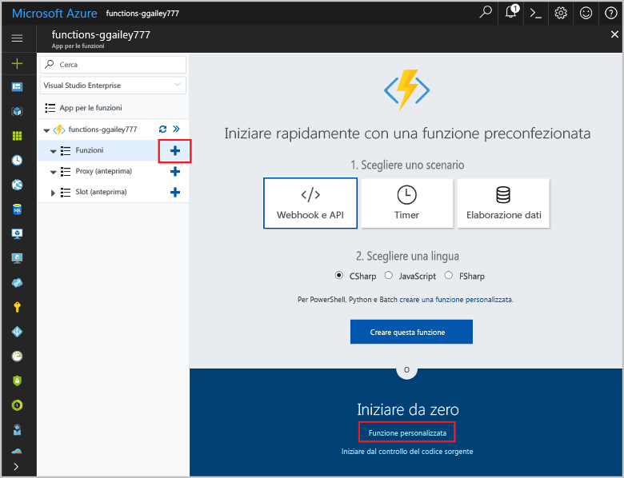
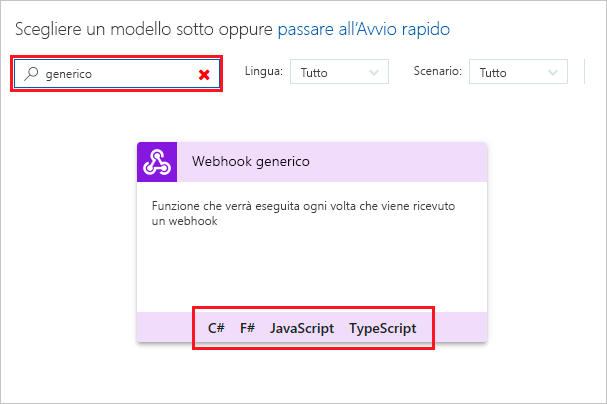
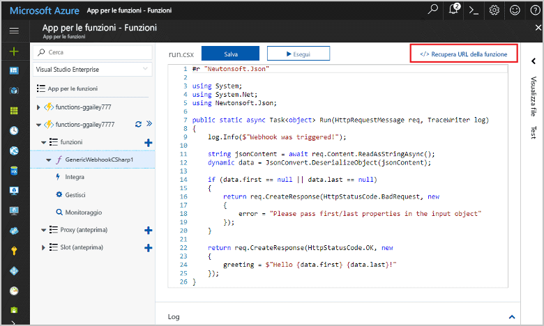
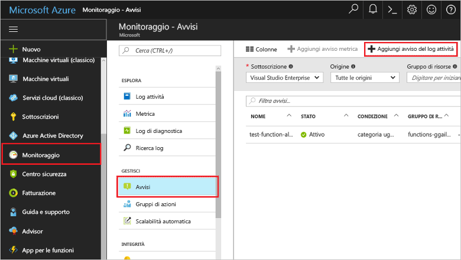
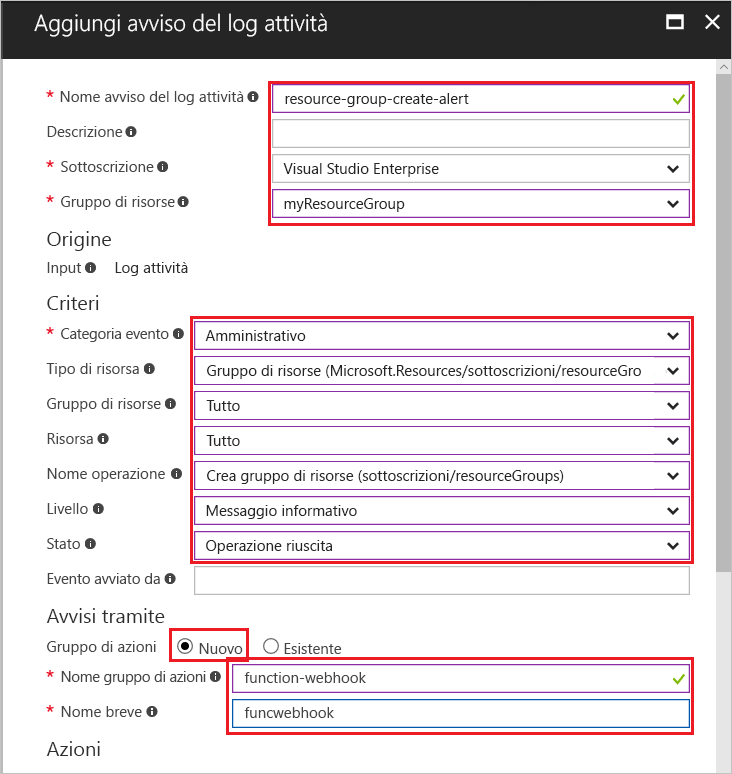
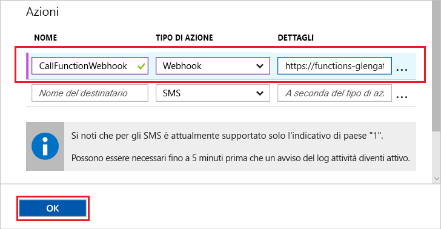
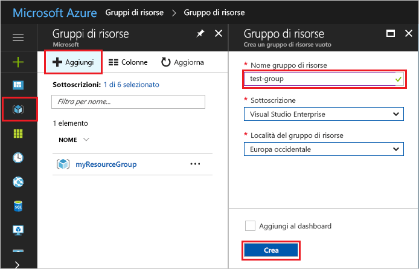
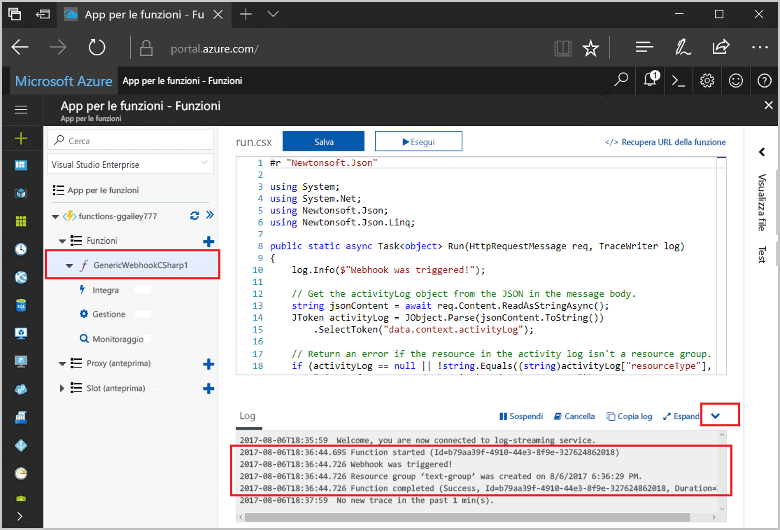

# <a name="create-a-function-triggered-by-a-generic-webhook"></a>Creare una funzione attivata da un webhook generico

Funzioni di Azure consente di eseguire il codice in un ambiente senza server senza dover prima creare una macchina virtuale o pubblicare un'applicazione Web. Ad esempio, è possibile configurare una funzione che verrà attivata da un avviso generato da Monitoraggio di Azure. Questo argomento illustra come eseguire codice C# quando viene aggiunto un gruppo di risorse alla sottoscrizione.   



## <a name="prerequisites"></a>Prerequisiti 

Per completare questa esercitazione:

+ Se non si ha una sottoscrizione di Azure, creare un [account gratuito](https://azure.microsoft.com/free/?WT.mc_id=A261C142F) prima di iniziare.

[!INCLUDE [functions-portal-favorite-function-apps](../../includes/functions-portal-favorite-function-apps.md)]

## <a name="create-an-azure-function-app"></a>Creare un'app per le funzioni di Azure

[!INCLUDE [Create function app Azure portal](../../includes/functions-create-function-app-portal.md)]

Si creerà ora una funzione nella nuova app per le funzioni.

## <a name="create-function"></a>Creare una funzione attivata da un webhook generico

1. Espandere l'app per le funzioni e fare clic sul pulsante **+** accanto a **Funzioni**. Se questa è la prima funzione nell'app per le funzioni, selezionare **Funzione personalizzata**. Verrà visualizzato il set completo di modelli di funzione.

    

2. Selezionare il modello **Generic WebHook - C#** (Webhook generico - C#). Digitare un nome per la funzione C# e quindi selezionare **Crea**.

      

2. Nella nuova funzione fare clic su **</> Get function URL** (Ottieni URL funzione) e quindi copiare e salvare il valore. Questo valore viene usato per configurare il webhook. 

    
         
Creare quindi un endpoint del webhook in un avviso del log attività in Monitoraggio di Azure. 

## <a name="create-an-activity-log-alert"></a>Creare un avviso del log attività

1. Nel portale di Azure passare al servizio **Monitoraggio**, selezionare **Avvisi** e fare clic su **Aggiungi avviso del log attività**.   

    

2. Usare le impostazioni specificate nella tabella:

    

    | Impostazione      |  Valore consigliato   | Descrizione                              |
    | ------------ |  ------- | -------------------------------------------------- |
    | **Nome avviso del log attività** | resource-group-create-alert | Nome dell'avviso del log attività. |
    | **Sottoscrizione** | Sottoscrizione in uso | Sottoscrizione usata per questa esercitazione. | 
    |  **Gruppo di risorse** | myResourceGroup | Gruppo di risorse in cui vengono distribuite le risorse dell'avviso. L'uso dello stesso gruppo di risorse dell'app per le funzioni semplifica l'operazione di pulizia al termine dell'esercitazione. |
    | **Categoria evento** | Amministrativo | Questa categoria include le modifiche apportate alle risorse di Azure.  |
    | **Tipo di risorsa** | Gruppi di risorse | Filtra gli avvisi per ottenere le attività dei gruppi di risorse. |
    | **Gruppo di risorse**<br/>e **Risorsa** | Tutti | Vengono monitorate tutte le risorse. |
    | **Nome operazione** | Crea gruppo di risorse | Filtra gli avvisi per ottenere le operazioni di creazione. |
    | **Level** | Informazioni | Vengono inclusi gli avvisi di livello informativo. | 
    | **Status** | Operazione completata | Filtra gli avvisi per ottenere le azioni completate correttamente. |
    | **Gruppo di azione** | Nuovo | Viene creato un nuovo gruppo di azione, che definisce l'azione eseguita quando viene generato un avviso. |
    | **Nome gruppo di azione** | function-webhook | Nome per identificare il gruppo di azione.  | 
    | **Nome breve** | funcwebhook | Nome breve per il gruppo di azione. |  

3. In **Azioni** aggiungere un'azione usando le impostazioni specificate nella tabella: 

    

    | Impostazione      |  Valore consigliato   | Descrizione                              |
    | ------------ |  ------- | -------------------------------------------------- |
    | **Nome** | CallFunctionWebhook | Nome dell'azione. |
    | **Tipo di azione** | webhook | La risposta all'avviso è la chiamata di un URL webhook. |
    | **Dettagli** | URL della funzione | Incollare l'URL webhook della funzione copiato in precedenza. |v

4. Fare clic su **OK** per creare l'avviso e il gruppo di azione.  

Il webhook verrà chiamato quando viene creato un gruppo di risorse nella sottoscrizione. Aggiornare quindi il codice nella funzione per gestire i dati di log JSON nel corpo della richiesta.   

## <a name="update-the-function-code"></a>Aggiornare il codice funzione

1. Tornare all'app per le funzioni nel portale ed espandere la funzione. 

2. Sostituire il codice script C# nella funzione nel portale con il codice seguente:

    ```csharp
    #r "Newtonsoft.Json"
    
    using System;
    using System.Net;
    using Newtonsoft.Json;
    using Newtonsoft.Json.Linq;
    
    public static async Task<object> Run(HttpRequestMessage req, TraceWriter log)
    {
        log.Info($"Webhook was triggered!");
    
        // Get the activityLog object from the JSON in the message body.
        string jsonContent = await req.Content.ReadAsStringAsync();
        JToken activityLog = JObject.Parse(jsonContent.ToString())
            .SelectToken("data.context.activityLog");
    
        // Return an error if the resource in the activity log isn't a resource group. 
        if (activityLog == null || !string.Equals((string)activityLog["resourceType"], 
            "Microsoft.Resources/subscriptions/resourcegroups"))
        {
            log.Error("An error occured");
            return req.CreateResponse(HttpStatusCode.BadRequest, new
            {
                error = "Unexpected message payload or wrong alert received."
            });
        }
    
        // Write information about the created resource group to the streaming log.
        log.Info(string.Format("Resource group '{0}' was {1} on {2}.",
            (string)activityLog["resourceGroupName"],
            ((string)activityLog["subStatus"]).ToLower(), 
            (DateTime)activityLog["submissionTimestamp"]));
    
        return req.CreateResponse(HttpStatusCode.OK);    
    }
    ```

È ora possibile testare la funzione creando un nuovo gruppo di risorse nella sottoscrizione.

## <a name="test-the-function"></a>Testare la funzione

1. Fare clic sull'icona dei gruppi di risorse sul lato sinistro del portale di Azure, selezionare **+ Aggiungi**, digitare un valore in **Nome gruppo di risorse** e selezionare **Crea** per creare un gruppo di risorse vuoto.
    
    

2. Tornare alla funzione ed espandere la finestra **Log**. Dopo la creazione del gruppo di risorse, l'avviso del log attività attiva il webhook e viene eseguita la funzione. Nei log visualizzati viene scritto il nome del nuovo gruppo di risorse.  

    

3. (Facoltativo) Tornare indietro ed eliminare il gruppo di risorse creato. Si noti che questa attività non attiva la funzione, perché le operazioni di eliminazione sono escluse dal filtro dell'avviso. 

## <a name="clean-up-resources"></a>Pulire le risorse

[!INCLUDE [Next steps note](../../includes/functions-quickstart-cleanup.md)]

## <a name="next-steps"></a>Passaggi successivi

È stata creata una funzione che viene eseguita quando viene ricevuta una richiesta da un webhook generico. 

[!INCLUDE [Next steps note](../../includes/functions-quickstart-next-steps.md)]

Per altre informazioni sui trigger webhook, vedere [Associazioni HTTP e webhook in Funzioni di Azure](functions-bindings-http-webhook.md). Per altre informazioni sullo sviluppo di funzioni in C#, vedere [Guida di riferimento a Funzioni di Azure per sviluppatori di script C#](functions-reference-csharp.md).


