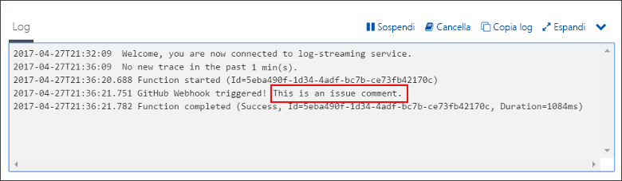

# Creare una funzione attivata da un webhook GitHub

Informazioni su come creare una funzione attivata da una richiesta di webhook HTTP con un payload specifico di GitHub.

Per completare tutti i passaggi di questo argomento, saranno sufficienti meno di cinque minuti.

## Prerequisiti

Prima di eseguire questo esempio, è necessario disporre di quanto segue:

- Un account GitHub con almeno un progetto.

Se non si ha una sottoscrizione di Azure, creare un [account gratuito](https://azure.microsoft.com/free/?WT.mc_id=A261C142F) prima di iniziare.

[!INCLUDE [functions-portal-favorite-function-apps](../../includes/functions-portal-favorite-function-apps.md)]

## Creare un'app per le funzioni di Azure

[!INCLUDE [Create function app Azure portal](../../includes/functions-create-function-app-portal.md)]

Si creerà ora una funzione nella nuova app per le funzioni.

## Creare una funzione attivata da webhook GitHub

1. Espandere l'app per le funzioni, fare clic sul pulsante **+** accanto a **Funzioni** e fare clic sul modello **GitHubWebHook** per il linguaggio desiderato. **Assegnare un nome alla funzione** e quindi fare clic su **Crea**.

1. Nella nuova funzione fare clic su **</> Get function URL** (Ottieni URL funzione) e quindi copiare e salvare i valori. Eseguire la stessa operazione per **</> Recupera segreto GitHub**. Questi valori servono per configurare il webhook in GitHub.

    

Viene successivamente creato un webhook nel repository GitHub.

## Configurare il webhook

1. In GitHub passare a un repository di cui si è proprietari. È possibile usare anche qualsiasi repository biforcato. Se è necessario creare una copia tramite fork di un repository, usare <https://github.com/Azure-Samples/functions-quickstart>.

1. Fare clic su **Impostazioni**, quindi su **Webhook** e infine su **Aggiungi webhook**.

    

1. Usare le impostazioni come indicato nella tabella e quindi fare clic su **Add webhook** (Aggiungi webhook).

    

| Impostazione | Valore consigliato | Descrizione |
|---|---|---|
| **Payload URL** (URL payload) | Valore copiato | Usare il valore restituito da **</> Get function URL** (Ottieni URL funzione). |
| **Segreto**   | Valore copiato | Usare il valore restituito da **</> Get GitHub secret** (Ottieni segreto GitHub). |
| **Tipo contenuto** | application/json | La funzione prevede un payload JSON. |
| Trigger di evento | Selezione di singoli eventi | Attivazione solo in caso di eventi di commento al problema.  |
| | Commento al problema |  |

Il webhook ora è configurato per attivare la funzione quando un nuovo commento al problema viene aggiunto.

## Testare la funzione

1. Nel repository GitHub aprire la scheda **Issues** (Problemi) in una nuova finestra del browser.

1. Nella nuova finestra fare clic su **Nuovo problema**, digitare un titolo e quindi fare clic su **Submit new issue** (Invia nuovo problema).

1. Nel problema, digitare un commento e fare clic su **Comment (Commento)**.

    

1. Tornare al portale e visualizzare i log. Verrà visualizzata una voce di traccia con il nuovo testo del commento.

     

## Pulire le risorse

[!INCLUDE [Next steps note](../../includes/functions-quickstart-cleanup.md)]

## Passaggi successivi

È stata creata una funzione che viene eseguita quando viene ricevuta una richiesta da un webhook GitHub. 
[!INCLUDE [Next steps note](../../includes/functions-quickstart-next-steps.md)] Per altre informazioni sui trigger webhook, vedere [Binding HTTP e webhook di Funzioni di Azure](functions-bindings-http-webhook.md).
