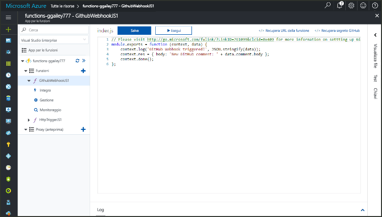
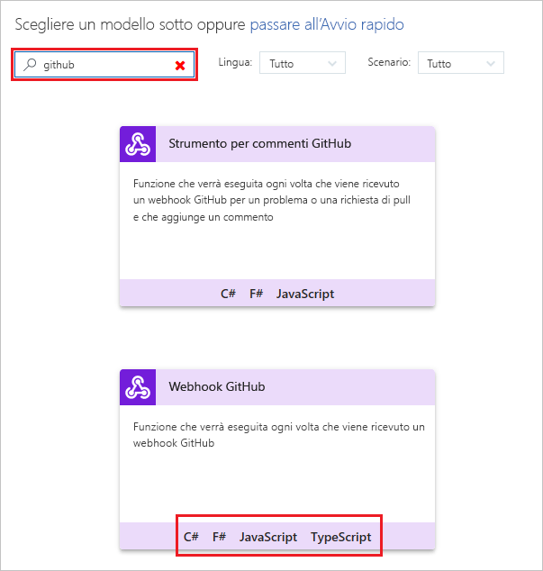
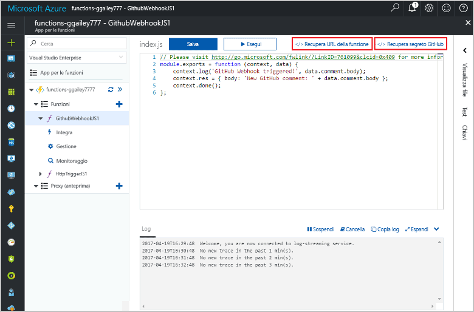

# Creare una funzione attivata da un webhook GitHub

Informazioni su come creare una funzione che viene attivata da un webhook GitHub. 

Per questo argomento sono necessarie le risorse create nell'argomento [Creare la prima funzione dal portale di Azure](functions-create-first-azure-function.md).

È necessario anche un account GitHub. È possibile [iscriversi per ottenere un account GitHub gratuito](https://github.com/join), se non se ne ha già uno. 

Per completare tutti i passaggi di questo argomento, saranno sufficienti meno di cinque minuti.

## Trovare l'app per le funzioni    

1. Accedere al [Portale di Azure](https://portal.azure.com/). 

2. Nella barra di ricerca nella parte superiore del portale digitare il nome dell'app per le funzioni e selezionarla dall'elenco.

## Creare una funzione attivata da webhook GitHub

1. Nell'app per le funzioni fare clic sul pulsante **+** accanto a **Funzioni**, fare clic sul modello **GitHubWebHook** per il linguaggio desiderato e fare clic su **Crea**.
   
     

2. Fare clic su **</> Recupera URL della funzione**, quindi copiare e salvare i valori. Eseguire la stessa operazione per **</> Recupera segreto GitHub**. Questi valori servono per configurare il webhook in GitHub. 

     
         
Viene successivamente creato un webhook nel repository GitHub. 

## Configurare il webhook
1. In GitHub passare a un repository di cui si è proprietari. È possibile usare anche qualsiasi repository biforcato.
 
2. Fare clic su **Impostazioni**, quindi su **Webhook** e infine su **Aggiungi webhook**.
   
    

3. Incollare l'URL e il segreto della funzione in **Payload URL** (URL payload) e in **Secret** (Segreto) e selezionare **application/json** in **Content type** (Tipo di contenuto).

4. Fare clic su **Let me select individual events** (Consenti selezione di singoli eventi), selezionare **Issue comment** (Commento problema) e fare clic su **Add webhook** (Aggiungi webhook).
   
    

Il webhook ora è configurato per attivare la funzione quando un nuovo commento al problema viene aggiunto. 

## Testare la funzione
1. Nel repository GitHub aprire la scheda **Issues** (Problemi) in una nuova finestra del browser.

2. Nella nuova finestra fare clic su **New Issue** (Nuovo problema), digitare un titolo, quindi fare clic su **Submit new issue** (Invia nuovo problema). 

2. Nel problema, digitare un commento e fare clic su **Comment (Commento)**. 

3. Nell'altra finestra di GitHub fare clic su **Edit** (Modifica) accanto al nuovo webhook, scorrere verso il basso fino a **Recent Deliveries** (Recapiti recenti) e verificare che la funzione abbia elaborato una richiesta di un webhook. 
 
    

   La risposta dalla funzione dovrà contenere `New GitHub comment: <Your issue comment text>`.

## Passaggi successivi

[!INCLUDE [Next steps note](../../includes/functions-quickstart-next-steps.md)]

[!INCLUDE [Getting Started Note](../../includes/functions-get-help.md)]

