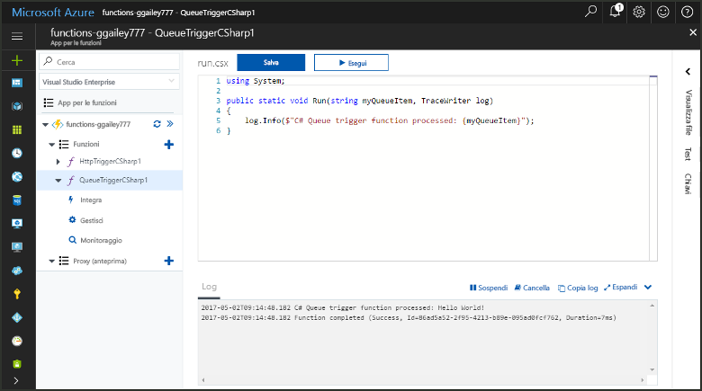
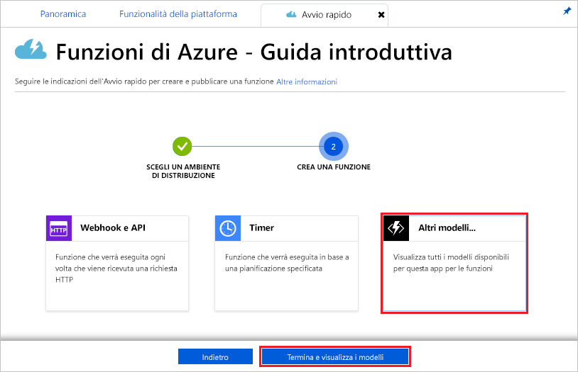
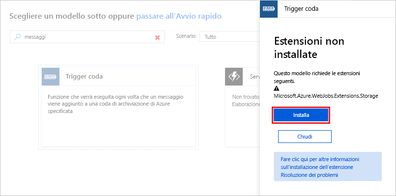
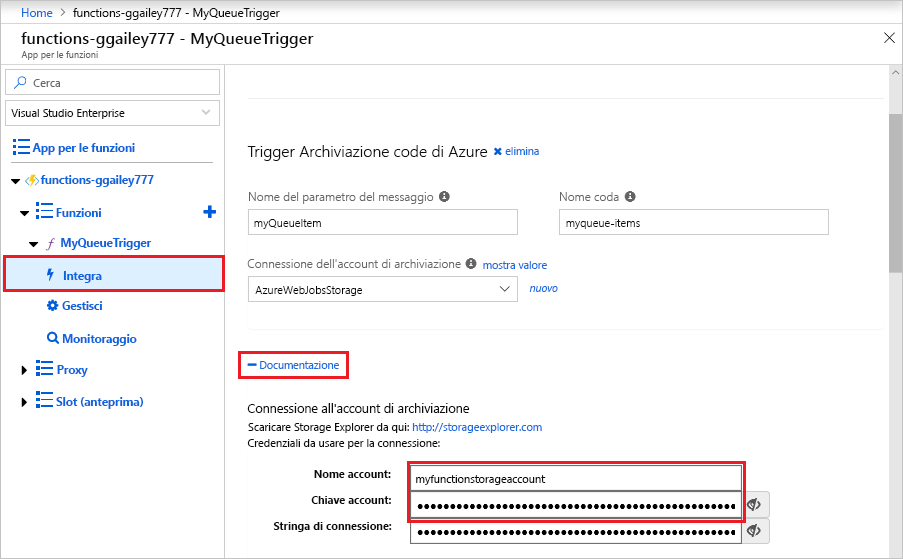
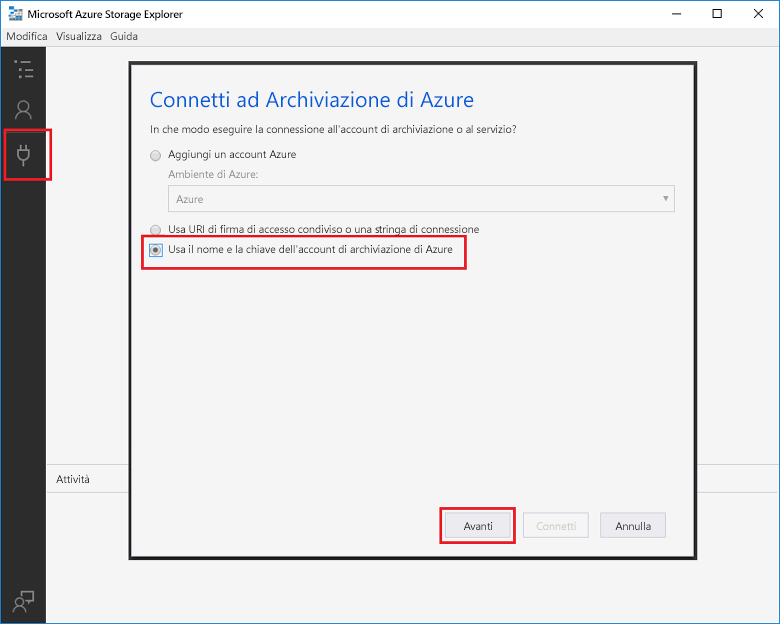
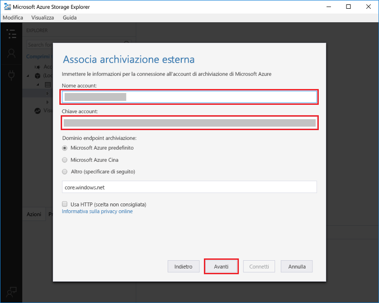
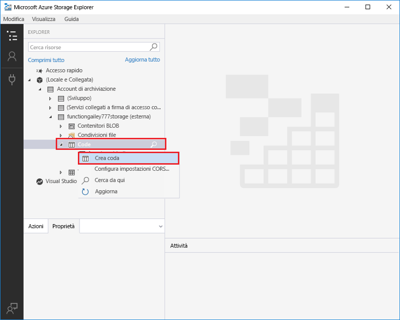
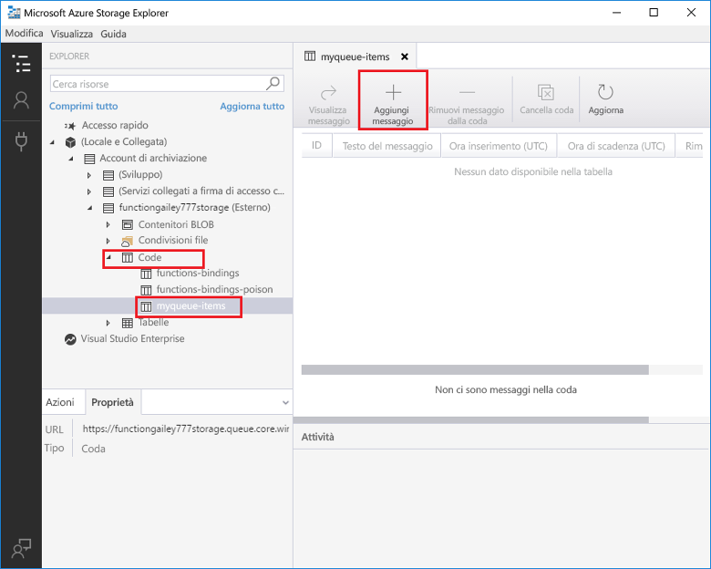
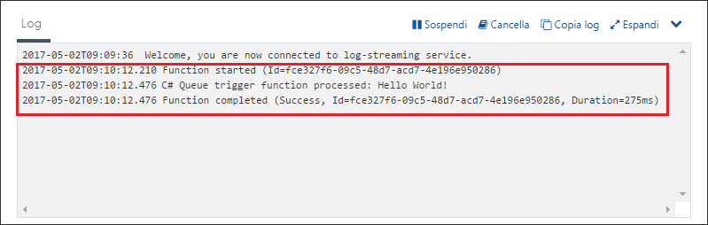

# Creare una funzione attivata dall'archiviazione code di Azure

Informazioni su come creare una funzione attivata nel momento in cui vengono inviati messaggi a una coda di archiviazione di Azure.

## Prerequisiti

- Scaricare e installare [Microsoft Azure Storage Explorer](http://storageexplorer.com/).

- Una sottoscrizione di Azure. Se non se ne ha una, creare un [account gratuito](https://azure.microsoft.com/free/?WT.mc_id=A261C142F) prima di iniziare.

[!INCLUDE [functions-portal-favorite-function-apps](../../includes/functions-portal-favorite-function-apps.md)]

## Creare un'app per le funzioni di Azure

[!INCLUDE [Create function app Azure portal](../../includes/functions-create-function-app-portal.md)]

Si creerà ora una funzione nella nuova app per le funzioni.

## Creare una funzione attivata da una coda

1. Espandere l'app per le funzioni e fare clic sul pulsante **+** accanto a **Funzioni**. Se questa è la prima funzione nell'app per le funzioni, selezionare **Funzione personalizzata**. Verrà visualizzato il set completo di modelli di funzione.

    

2. Selezionare il modello **QueueTrigger** per la lingua desiderata e usare le impostazioni specificate nella tabella.

    
    
    | Impostazione | Valore consigliato | Descrizione |
    |---|---|---|
    | **Nome coda**   | myqueue-items    | Nome della coda a cui connettersi nell'account di archiviazione. |
    | **Connessione dell'account di archiviazione** | AzureWebJobStorage | È possibile usare la connessione dell'account di archiviazione già usata dall'app per le funzioni oppure crearne una nuova.  |
    | **Dare un nome alla funzione** | Univoco nell'app per le funzioni | Nome della funzione attivata dalla coda. |

3. Fare clic su **Crea** per creare la funzione.

Connettersi quindi all'account di archiviazione di Azure e creare la coda di archiviazione **myqueue-items**.

## Creare la coda

1. Nella funzione fare clic su **Integrazione**, espandere **Documentazione** e copiare sia **Nome account** sia **Chiave account**. Usare queste credenziali per connettersi all'account di archiviazione. Se si è già connessi all'account di archiviazione, andare al passaggio 4.

    v

1. Eseguire lo strumento [Microsoft Azure Storage Explorer](http://storageexplorer.com/), fare clic sull'icona di connessione a sinistra, scegliere **Use a storage account name and key** (Usare il nome e la chiave di un account di archiviazione) e fare clic su **Avanti**.

    

1. Immettere i valori **Nome account** e **Chiave account** definiti nel passaggio 1, fare clic su **Avanti** e quindi su **Connetti**.

    

1. Espandere l'account di archiviazione associato, fare doppio clic su **Code**, fare clic su **Crea coda**, digitare `myqueue-items` e quindi premere INVIO.

    

È possibile ora testare la funzione aggiungendo un messaggio alla coda.

## Testare la funzione

1. Tornare al portale di Azure, selezionare la funzione, espandere i **log** nella parte inferiore della pagina e assicurarsi che lo streaming dei log non sia stato interrotto.

1. In Esplora archivi espandere l'account di archiviazione, **Code** e **myqueue-items** e quindi fare clic su **Aggiungi messaggio**.

    

1. Digitare il proprio messaggio di benvenuto nel campo **Testo del messaggio** e fare clic su **OK**.

1. Attendere alcuni secondi, tornare ai log di funzione e verificare che il nuovo messaggio sia stato letto dalla coda.

    

1. Tornare a Esplora archivi, fare clic su **Aggiorna** e verificare che il messaggio sia stato elaborato e non sia più in coda.

## Pulire le risorse

[!INCLUDE [Next steps note](../../includes/functions-quickstart-cleanup.md)]

## Passaggi successivi

È stata creata una funzione che viene eseguita nel momento in cui un messaggio viene aggiunto a una coda di archiviazione.

[!INCLUDE [Next steps note](../../includes/functions-quickstart-next-steps.md)]

Per altre informazioni sui trigger dell'archiviazione code, vedere [Associazioni della coda dell'archiviazione di Funzioni di Azure](functions-bindings-storage-queue.md).
