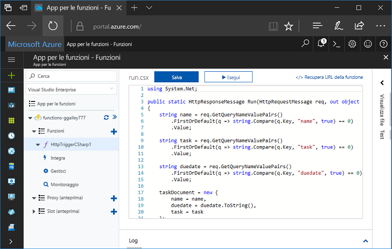
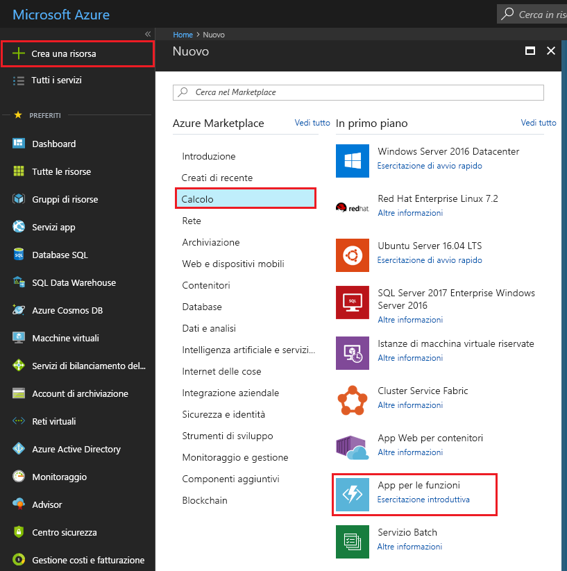
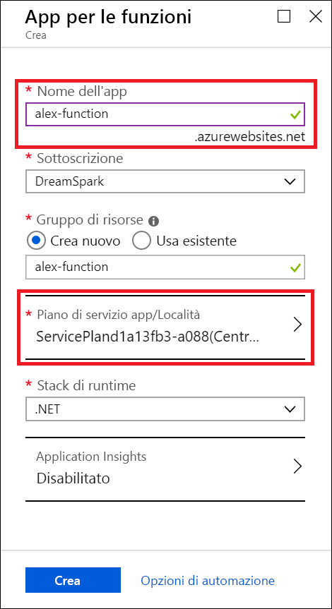
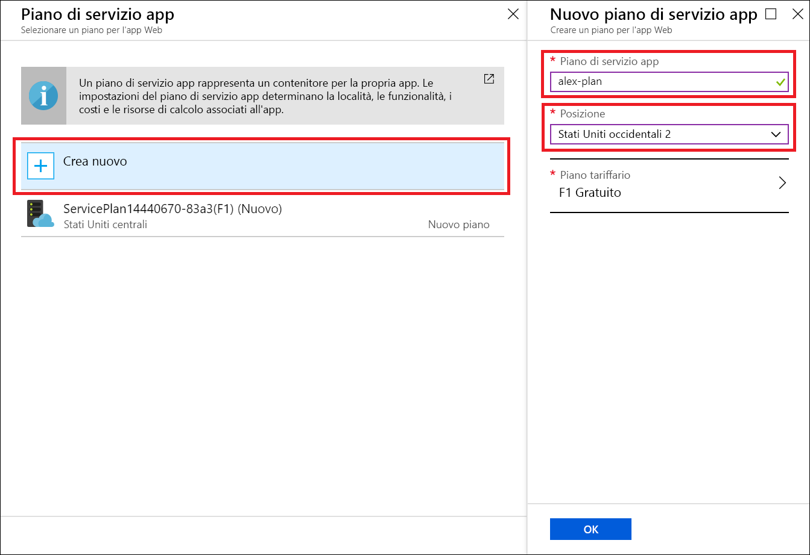
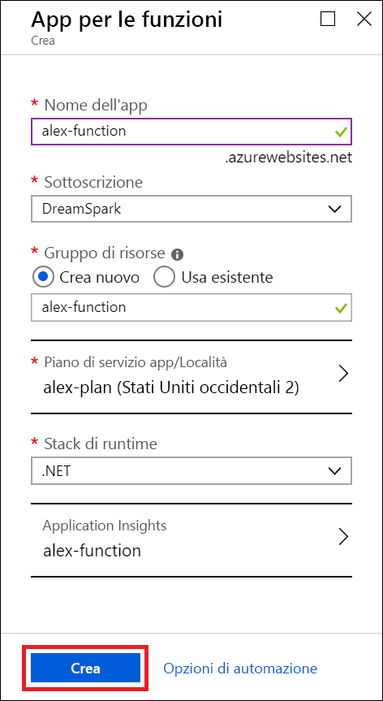
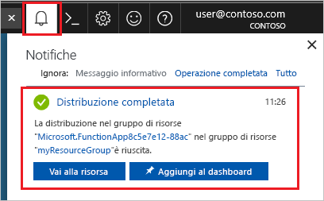
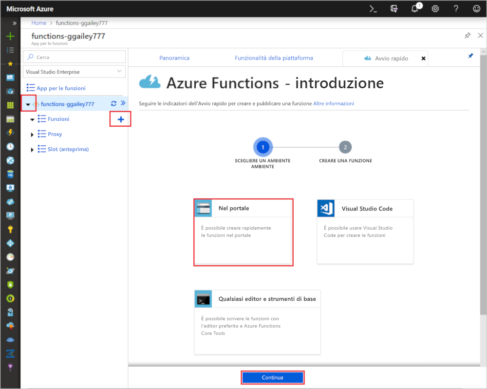
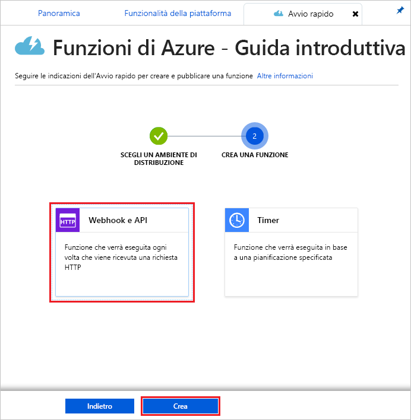
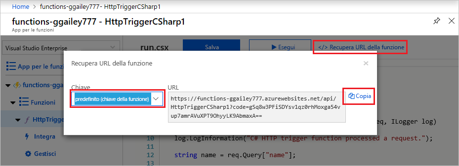
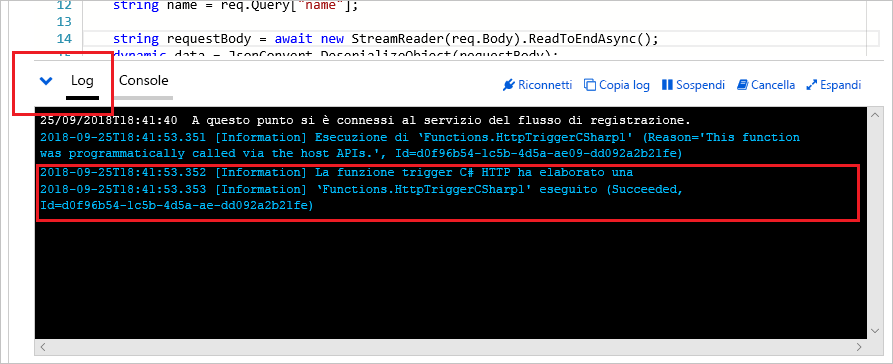

# Creare una funzione usando Azure for Students Starter

In questa esercitazione si creerà una funzione HTTP di benvenuto in una sottoscrizione di Azure for Students Starter. Verranno anche illustrate le funzionalità disponibili in Funzioni di Azure in questo tipo di sottoscrizione.

Microsoft *Azure for Students Starter* permette di iniziare a usare i prodotti di Azure che servono per sviluppare sul cloud gratuitamente. [Altre informazioni su questa offerta.](https://azure.microsoft.com/offers/ms-azr-0144p/)

Funzioni di Azure consente di eseguire il codice in un ambiente [senza server](https://azure.microsoft.com/solutions/serverless/), senza dover prima creare una macchina virtuale o pubblicare un'applicazione Web. [Altre informazioni su Funzioni di Azure.](./functions-overview.md)

## Creare una funzione

 Questo argomento fornisce informazioni su come usare Funzioni di Azure per creare una funzione di benvenuto attivata da HTTP nel portale di Azure.

## Accedere ad Azure

Accedere al portale di Azure all'indirizzo <https://portal.azure.com> con il proprio account Azure.

## Creare un'app per le funzioni

Per ospitare l'esecuzione delle funzioni è necessaria un'app per le funzioni. Un'app per le funzioni consente di raggruppare le funzioni come un'unità logica per semplificare la gestione, la distribuzione e la condivisione delle risorse. 

1. Selezionare il pulsante **Nuovo** nell'angolo superiore sinistro del portale di Azure e quindi selezionare **Calcolo** > **App per le funzioni**.

    

2. Usare le impostazioni dell'app per le funzioni come indicato nella tabella sottostante l'immagine.

    

    | Impostazione      | Valore consigliato  | DESCRIZIONE                                        |
    | ------------ |  ------- | -------------------------------------------------- |
    | **Nome app** | Nome globalmente univoco | Nome che identifica la nuova app per le funzioni. I caratteri validi sono `a-z`, `0-9` e `-`.  | 
    | **Sottoscrizione** | Sottoscrizione in uso | Sottoscrizione in cui viene creata questa nuova app per le funzioni. | 
    | **[Gruppo di risorse](../azure-resource-manager/resource-group-overview.md)** |  myResourceGroup | Nome del nuovo gruppo di risorse in cui creare l'app per le funzioni. |
   | **[Piano di servizio app/Località](./functions-scale.md)** | Nuovo | Il piano di hosting che controlla l'area in cui viene distribuita l'app per le funzioni e la densità delle risorse. Più app per le funzioni distribuite nello stesso piano condividono la stessa singola istanza gratuita. Si tratta di una restrizione del piano Student Starters. Le opzioni di hosting complete sono [illustrate qui.](./functions-scale.md)|
    | **Stack di runtime** | Lingua preferita | Scegliere un runtime che supporti il linguaggio di programmazione della funzione preferito. Scegliere **.NET** per le funzioni C# e F #. |
    |**[Application Insights](./functions-monitoring.md)**| Attivato | Application Insights viene usato per archiviare e analizzare i log dell'app per le funzioni. È abilitato per impostazione predefinita se si sceglie una località che supporta Application Insights. Application Insights può essere abilitato per qualsiasi funzione scegliendo manualmente un'area nelle vicinanze in cui distribuirlo. Senza Application Insights è possibile solo visualizzare i log in streaming live.

3. Selezionare **Piano di servizio app/Località** per scegliere una località diversa

4. Selezionare **Crea nuovo** e assegnare al piano un nome univoco.

5. Selezionare la località più vicina. [Una mappa completa delle aree di Azure è disponibile qui.](https://azure.microsoft.com/global-infrastructure/regions/) 

    

6. Selezionare **Crea** per effettuare il provisioning dell'app per le funzioni e distribuirla.

    

7. Selezionare l'icona di notifica nell'angolo superiore destro del portale e attendere la visualizzazione del messaggio **La distribuzione è riuscita**.

    

8. Selezionare **Vai alla risorsa** per visualizzare la nuova app per le funzioni.

Si creerà ora una funzione nella nuova app per le funzioni.

## Creare una funzione attivata tramite HTTP

1. Espandere la nuova app per le funzioni, selezionare il pulsante **+** accanto a to **Funzioni**, scegliere **Nel portale** e quindi selezionare **Continua**.

    

1. Scegliere **WebHook e API** e quindi selezionare **Crea**.

    

Viene creata una funzione usando il modello specifico del linguaggio per una funzione attivata tramite HTTP.

Ora è possibile eseguire la nuova funzione inviando una richiesta HTTP.

## Testare la funzione

1. Nella nuova funzione fare clic su **</> Recupera URL della funzione** nell'angolo in alto a destra, selezionare **default (Function key)** (predefinita - tasto funzione) e quindi fare clic su **Copia**. 

    

2. Incollare l'URL della funzione nella barra degli indirizzi del browser. Aggiungere il valore della stringa di query `&name=<yourname>` alla fine dell'URL e premere il tasto `Enter` per eseguire la richiesta. Nel browser dovrebbe venire visualizzata la risposta restituita dalla funzione.  

    L'esempio seguente mostra la risposta nel browser:

    

    L'URL della richiesta include una chiave necessaria per impostazione predefinita per accedere a una funzione tramite HTTP.

3. Quando viene eseguita la funzione, vengono scritte nei log informazioni di traccia. Per visualizzare l'output di traccia dell'esecuzione precedente, tornare alla funzione nel portale e fare clic sulla freccia nella parte inferiore della schermata per espandere **Log**.

   

## Pulire le risorse

[!INCLUDE [Clean-up resources](../../includes/functions-quickstart-cleanup.md)]

## Funzionalità supportate in Azure for Students Starter

Azure for Student Starter offre l'accesso alla maggior parte delle funzioni del runtime di Funzioni di Azure, ma con diverse limitazioni chiave, elencate di seguito:

* Il trigger HTTP è l'unico tipo di trigger supportato.
    * Sono supportati tutti i binding di input e output. [L'elenco completo è disponibile qui.](functions-triggers-bindings.md)
* Linguaggi supportati: 
    * C# (.NET Core 2)
    * Javascript (Node.js 8 e 10)
    * F# (.NET Core 2)
    * [Linguaggi supportati nei piani superiori](supported-languages.md)
* Windows è l'unico sistema operativo supportato.
* Il ridimensionamento è limitato a [una sola istanza di livello gratuito](https://azure.microsoft.com/pricing/details/app-service/windows/) eseguita per un massimo di 60 minuti al giorno. È possibile ridimensionare automaticamente in modalità serverless da 0 a 1 istanza quando si riceve traffico HTTP, ma non oltre.
* È supportato solo il [runtime 2.x](functions-versions.md).
* Sono supportati tutti gli strumenti di sviluppo per la modifica e la pubblicazione di funzioni, inclusi VS Code, Visual Studio, l'interfaccia della riga di comando di Azure e il portale di Azure. Se non si vuole usare il portale, occorre prima creare un'app nel portale e quindi selezionarla come destinazione della distribuzione nello strumento che si preferisce.

## Passaggi successivi

È stata creata un'app per le funzioni con una semplice funzione attivata tramite HTTP. A questo punto è possibile esplorare gli strumenti locali, altri linguaggi, funzionalità di monitoraggio e integrazioni.

 * [Creare la prima funzione con Visual Studio](./functions-create-your-first-function-visual-studio.md)
 * [Creare la prima funzione con Visual Studio Code](./functions-create-first-function-vs-code.md)
 * [Guida per gli sviluppatori JavaScript di Funzioni di Azure](./functions-reference-node.md)
 * [Usare Funzioni di Azure per connettersi al database SQL di Azure](./functions-scenario-database-table-cleanup.md)
 * [Trigger e associazioni HTTP di Funzioni di Azure](./functions-bindings-http-webhook.md)
 * [Monitorare Funzioni di Azure](./functions-monitoring.md)
