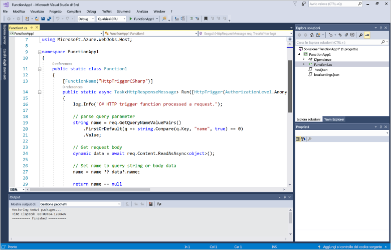
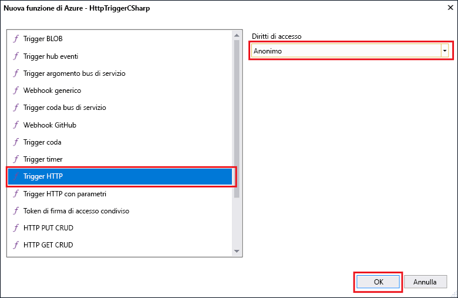
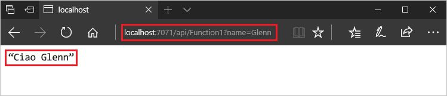
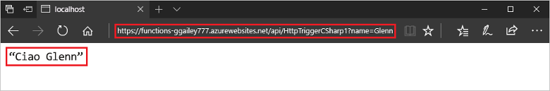

---
title: Creare la prima funzione in Azure con Visual Studio | Microsoft Docs
description: Creare e pubblicare una semplice funzione attivata tramite HTTP in Azure usando Azure Functions Tools for Visual Studio.
services: functions
documentationcenter: na
author: rachelappel
manager: erikre
editor: 
tags: 
keywords: Funzioni di Azure, funzioni, elaborazione eventi, calcolo, architettura senza server
ms.assetid: 82db1177-2295-4e39-bd42-763f6082e796
ms.service: functions
ms.devlang: multiple
ms.topic: quickstart
ms.tgt_pltfrm: multiple
ms.workload: na
ms.date: 07/05/2017
ms.author: glenga
ms.custom: mvc
ms.translationtype: HT
ms.sourcegitcommit: 83f19cfdff37ce4bb03eae4d8d69ba3cbcdc42f3
ms.openlocfilehash: 7e1fcecbf77da402b8c223caf6a2e81c704c3219
ms.contentlocale: it-it
ms.lasthandoff: 08/21/2017

---
# Creare la prima funzione con Visual Studio

Funzioni di Azure consente di eseguire il codice in un ambiente senza server senza dover prima creare una macchina virtuale o pubblicare un'applicazione Web.

Questo argomento illustra come usare gli strumenti di Visual Studio 2017 per Funzioni di Azure per creare e testare una funzione "hello world" in locale. Il codice della funzione verrà quindi pubblicato in Azure. Questi strumenti sono disponibili come parte del carico di lavoro di sviluppo di Azure in Visual Studio 2017 versione 15.3 o successiva.

## Prerequisiti

Per completare questa esercitazione, installare:

* [Visual Studio 2017 versione 15.3](https://www.visualstudio.com/vs/preview/), con il carico di lavoro di **sviluppo di Azure**.

    
    
    >[!NOTE]  
    Dopo l'installazione o l'aggiornamento a Visual Studio 2017 versione 15.3, potrebbe essere necessario anche aggiornare manualmente gli strumenti di Visual Studio 2017 per Funzioni di Azure. È possibile aggiornare gli strumenti dal menu **Strumenti** scegliendo **Estensioni e aggiornamenti** > **Aggiornamenti** > **Visual Studio Marketplace** > **Azure Functions and Web Jobs Tools** (Strumenti per Funzioni di Azure e processi Web) > **Aggiorna**. 

[!INCLUDE [quickstarts-free-trial-note](../../includes/quickstarts-free-trial-note.md)] 

## Creare un progetto Funzioni di Azure in Visual Studio

[!INCLUDE [Create a project using the Azure Functions template](../../includes/functions-vstools-create.md)]

Ora che è stato creato il progetto, si può creare la prima funzione.

## Creare la funzione

1. In **Esplora soluzioni** fare clic con il pulsante destro del mouse sul nodo del progetto e scegliere **Aggiungi** > **Nuovo elemento**. Selezionare **Funzione di Azure** e fare clic su **Aggiungi**.

2. Selezionare **HttpTrigger**, digitare un **nome di funzione**, selezionare **Anonimo** in **Diritti di accesso** e fare clic su **Crea**. La funzione creata è accessibile da una richiesta HTTP proveniente da qualsiasi client. 

    

Ora che è stata creata una funzione attivata tramite HTTP, si può testare la funzione nel computer locale.

## Testare la funzione in locale

Azure Functions Core Tools consente di eseguire il progetto Funzioni di Azure nel computer di sviluppo locale. Verrà richiesto di installare questi strumenti al primo avvio di una funzione da Visual Studio.  

1. Per testare la funzione premere F5. Se viene visualizzata, accettare la richiesta di Visual Studio di scaricare e installare gli strumenti dell'interfaccia della riga di comando Azure Functions Core Tools.  Potrebbe essere necessario anche abilitare un'eccezione del firewall per consentire agli strumenti di gestire le richieste HTTP.

2. Copiare l'URL della funzione dall'output di runtime di Funzioni di Azure.  

    

3. Incollare l'URL per la richiesta HTTP nella barra degli indirizzi del browser. Aggiungere la stringa di query `&name=<yourname>` all'URL ed eseguire la richiesta. Di seguito è illustrata la risposta nel browser alla richiesta GET locale restituita dalla funzione: 

    

4. Per interrompere il debug, fare clic sul pulsante **Interrompi** sulla barra degli strumenti di Visual Studio.

Dopo aver verificato la corretta esecuzione della funzione nel computer locale, è possibile pubblicare il progetto in Azure.

## Pubblicare il progetto in Azure

Per poter pubblicare il progetto, è necessario che la sottoscrizione di Azure includa un'app per le funzioni. È possibile creare un'app per le funzioni direttamente da Visual Studio.

[!INCLUDE [Publish the project to Azure](../../includes/functions-vstools-publish.md)]

## Testare la funzione in Azure

1. Copiare l'URL di base dell'app per le funzioni dalla pagina del profilo di pubblicazione. Sostituire la parte `localhost:port` dell'URL usato durante il test della funzione in locale con il nuovo URL di base. Come prima, assicurarsi di accodare la stringa di query `&name=<yourname>` all'URL ed eseguire la richiesta.

    L'URL che chiama la funzione attivata tramite HTTP sarà simile al seguente:

        http://<functionappname>.azurewebsites.net/api/<functionname>?name=<yourname> 

2. Incollare questo nuovo URL per la richiesta HTTP nella barra degli indirizzi del browser. Di seguito è illustrata la risposta nel browser alla richiesta GET remota restituita dalla funzione: 

    
 
## Passaggi successivi

È stato usato Visual Studio per creare un'app per le funzioni C# con una semplice funzione attivata tramite HTTP. 

+ Per informazioni su come configurare il progetto per il supporto di altri tipi di trigger e binding, vedere la sezione [Configurare il progetto per lo sviluppo locale](functions-develop-vs.md#configure-the-project-for-local-development) in [Azure Functions Tools for Visual Studio](functions-develop-vs.md).
+ Per altre informazioni sul test e il debug in locale con Azure Functions Core Tools, vedere [Scrivere codice per le funzioni di Azure e testarle in locale](functions-run-local.md). 
+ Per altre informazioni sullo sviluppo di funzioni quali le librerie della classe .NET, vedere [Uso di librerie di classi .NET con Funzioni di Azure](functions-dotnet-class-library.md). 

