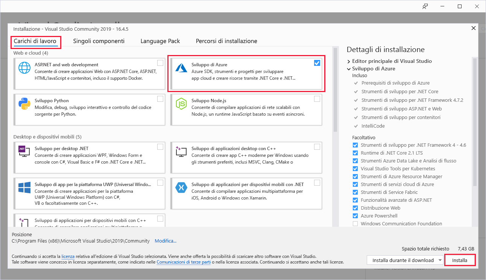
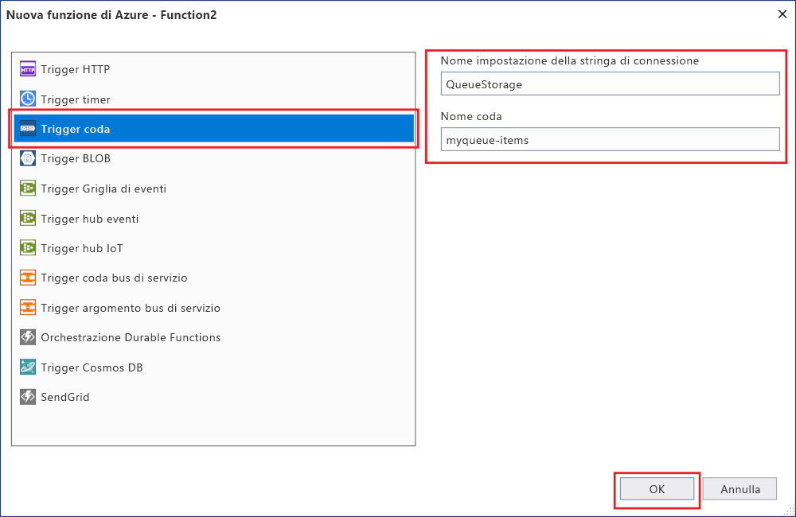

# <a name="azure-functions-tools-for-visual-studio"></a>Azure Functions Tools for Visual Studio  

Azure Functions Tools for Visual Studio 2017 è un'estensione di Visual Studio che consente di sviluppare, testare e distribuire funzioni C# in Azure. Se questa è la prima esperienza con Funzioni di Azure, è consigliabile leggere altre informazioni in [Introduzione a Funzioni di Azure](functions-overview.md).

Azure Functions Tools offre i vantaggi seguenti: 

* Modifica, compilazione ed esecuzione di funzioni nel computer di sviluppo locale. 
* Pubblicazione del proprio progetto di Funzioni di Azure direttamente in Azure. 
* Utilizzo di attributi di processi Web per dichiarare associazioni di funzione direttamente nel codice C# anziché mantenere un file function.json separato per le definizioni di associazione.
* Sviluppo e distribuzione di funzioni C# precompilate. Le funzioni precompilate offrono migliori prestazioni nell'avvio a freddo rispetto alle funzioni basate su script C#. 
* Possibilità di scrivere il codice delle funzioni in C# sfruttando al contempo tutti i vantaggi dello sviluppo in Visual Studio. 

Questo argomento illustra come usare Azure Functions Tools for Visual Studio 2017 per sviluppare le funzioni in C#. Spiega anche come pubblicare il progetto in Azure come assembly .NET.

## <a name="prerequisites"></a>Prerequisiti

Gli strumenti di Funzioni di Azure sono inclusi nel carico di lavoro di sviluppo di Azure in [Visual Studio 2017 15.3](https://www.visualstudio.com/vs/) o versione successiva. Assicurarsi di includere il carico di lavoro di **sviluppo di Azure** nell'installazione di Visual Studio 2017 versione 15.3:



Per creare e distribuire funzioni, è necessario disporre anche di quanto segue:

* Una sottoscrizione di Azure attiva. Se non si possiede una sottoscrizione di Azure, sono disponibili [account gratuiti](https://azure.microsoft.com/free/?WT.mc_id=A261C142F).

* Un account dell'Archiviazione di Azure. Per creare un account di archiviazione, vedere [Creare un account di archiviazione](../storage/common/storage-create-storage-account.md#create-a-storage-account).  
## <a name="create-an-azure-functions-project"></a>Creare un progetto di Funzioni di Azure 

[!INCLUDE [Create a project using the Azure Functions](../../includes/functions-vstools-create.md)]


## <a name="configure-the-project-for-local-development"></a>Configurare il progetto per lo sviluppo locale

Quando si crea un nuovo progetto usando il modello di Funzioni di Azure, si ottiene un progetto C# vuoto che contiene i file seguenti:

* **host.json**: consente di configurare l'host di Funzioni. Queste impostazioni si applicano sia durante l'esecuzione in locale che nell'esecuzione in Azure. Per altre informazioni, vedere l'articolo di riferimento su [host.json](https://github.com/Azure/azure-webjobs-sdk-script/wiki/host.json).
    
* **local.settings.json**: mantiene le impostazioni usate quando si esegue Funzioni localmente. Queste impostazioni non vengono usate da Azure, bensì dagli [strumenti di base di Funzioni di Azure](functions-run-local.md). Usare questo file per specificare le impostazioni, ad esempio le stringhe di connessione ad altri servizi di Azure. Aggiungere una nuova chiave alla matrice di **Valori** per ogni connessione richiesta dalle funzioni nel progetto. Per altre informazioni, vedere [Local settings file](functions-run-local.md#local-settings-file) (File delle impostazioni locali) nell'argomento sugli strumenti di base di Funzioni di Azure.

Il runtime di Funzioni usa un account di archiviazione di Azure internamente. Per tutti i tipi di trigger diversi da HTTP e dai webhook, è necessario impostare la chiave **Values.AzureWebJobsStorage** su una stringa di connessione di account di archiviazione di Azure valida.

[!INCLUDE [Note to not use local storage](../../includes/functions-local-settings-note.md)]

 Per impostare la stringa di connessione dell'account di archiviazione:

1. In Visual Studio aprire **Cloud Explorer**, espandere **Account di archiviazione** > **Your Storage Account** (Account di archiviazione personale), quindi selezionare **Proprietà** e copiare il valore **Stringa di connessione primaria**.   

2. Nel progetto aprire il file di progetto local.settings.json e impostare il valore della chiave **AzureWebJobsStorage** sulla stringa di connessione copiata.

3. Ripetere il passaggio precedente per aggiungere chiavi univoche alla matrice di **Valori** per tutte le altre connessioni richieste dalle funzioni.  

## <a name="create-a-function"></a>Creare una funzione

Nelle funzioni precompilate le associazioni usate dalla funzione sono definite tramite l'applicazione di attributi nel codice. Quando si usa Azure Functions Tools per creare le funzioni dai modelli forniti, questi attributi vengono applicati automaticamente. 

1. In **Esplora soluzioni** fare clic con il pulsante destro del mouse sul nodo del progetto e scegliere **Aggiungi** > **Nuovo elemento**. Selezionare **Funzione di Azure**, digitare un **Nome** per la classe e fare clic su **Aggiungi**.

2. Scegliere il trigger, impostare le proprietà di associazione e fare clic su **Crea**. L'esempio seguente mostra le impostazioni quando si crea una funzione attivata da un'archiviazione code. 

    
    
    Viene specificata una chiave di stringa di connessione denominata **QueueStorage**, che è definita nel file local.settings.json. 
 
3. Si esamini la classe appena aggiunta. Si vede un metodo **Run** statico a cui è associato l'attributo **FunctionName**. Questo attributo indica che il metodo è il punto di ingresso per la funzione. 

    La classe C# seguente rappresenta ad esempio una funzione di base attivata dall'archiviazione code:

    ````csharp
    using System;
    using Microsoft.Azure.WebJobs;
    using Microsoft.Azure.WebJobs.Host;
    
    namespace FunctionApp1
    {
        public static class Function1
        {
            [FunctionName("QueueTriggerCSharp")]        
            public static void Run([QueueTrigger("myqueue-items", Connection = "QueueStorage")]string myQueueItem, TraceWriter log)
            {
                log.Info($"C# Queue trigger function processed: {myQueueItem}");
            }
        }
    } 
    ````
 
    Un attributo specifico dell'associazione viene applicato a ogni parametro di associazione fornito al metodo del punto di ingresso. L'attributo accetta le informazioni di associazione come parametri. Nell'esempio precedente il primo parametro dispone di un attributo **QueueTrigger**, che indica la funzione attivata dalla coda. Il nome della coda e il nome di impostazione della stringa di connessione vengono passati come parametri.  

## <a name="testing-functions"></a>Test delle funzioni

Azure Functions Core Tools consente di eseguire il progetto Funzioni di Azure nel computer di sviluppo locale. Verrà richiesto di installare questi strumenti al primo avvio di una funzione da Visual Studio.  

Per testare la funzione premere F5. Se viene visualizzata, accettare la richiesta di Visual Studio di scaricare e installare gli strumenti dell'interfaccia della riga di comando Azure Functions Core Tools.  Potrebbe essere necessario anche abilitare un'eccezione del firewall per consentire agli strumenti di gestire le richieste HTTP.

Con il progetto in esecuzione, è possibile testare il codice come si fa con una funzione distribuita. Per altre informazioni, vedere [Strategie per il test del codice in Funzioni di Azure](functions-test-a-function.md). Durante l'esecuzione in modalità di debug, i punti di interruzione vengono raggiunti in Visual Studio come previsto. 

Per un esempio di come testare una funzione attivata da una coda, vedere l'[esercitazione di avvio rapido alle funzioni attivate da code](functions-create-storage-queue-triggered-function.md#test-the-function).  

Per altre informazioni sull'utilizzo degli strumenti di base di Funzioni di Azure, vedere [Come scrivere codice per le funzioni di Azure e testarle in locale](functions-run-local.md).

## <a name="publish-to-azure"></a>Pubblicazione in Azure

[!INCLUDE [Publish the project to Azure](../../includes/functions-vstools-publish.md)]

>[!NOTE]  
>Le impostazioni aggiunte nel file local.settings.json devono essere aggiunte anche all'app per le funzioni in Azure. Queste impostazioni non vengono aggiunte automaticamente. È possibile aggiungere le impostazioni necessarie per l'app per le funzioni in uno dei modi seguenti:
>
>* [Uso del portale di Azure](functions-how-to-use-azure-function-app-settings.md#settings).
>* [Uso dell'opzione di pubblicazione `--publish-local-settings` negli strumenti principali di Funzioni di Azure](functions-run-local.md#publish).
>* [Uso dell'interfaccia della riga di comando di Azure](/cli/azure/functionapp/config/appsettings#set). 

## <a name="next-steps"></a>Passaggi successivi

Per altre informazioni su Azure Functions Tools, vedere la sezione Common Questions (Domande comuni) del post di blog [Visual Studio 2017 Tools for Azure Functions](https://blogs.msdn.microsoft.com/webdev/2017/05/10/azure-function-tools-for-visual-studio-2017/).

Per altre informazioni sull'utilizzo degli strumenti di base di Funzioni di Azure, vedere [Come scrivere codice per le funzioni di Azure e testarle in locale](functions-run-local.md).  
Per altre informazioni sullo sviluppo di funzioni quali le librerie della classe .NET, vedere [Uso di librerie di classi .NET con Funzioni di Azure](functions-dotnet-class-library.md). Questo argomento fornisce anche esempi d'uso degli attributi per dichiarare i vari tipi di associazioni supportate da Funzioni di Azure.    

