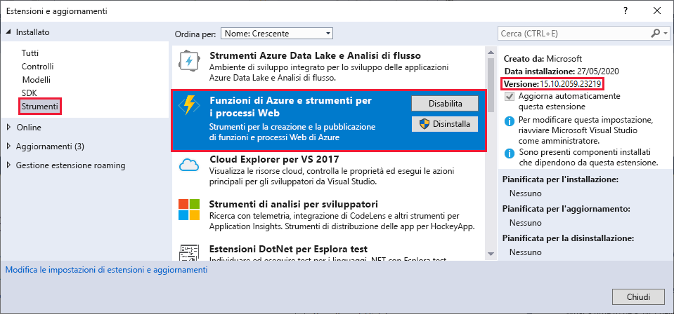
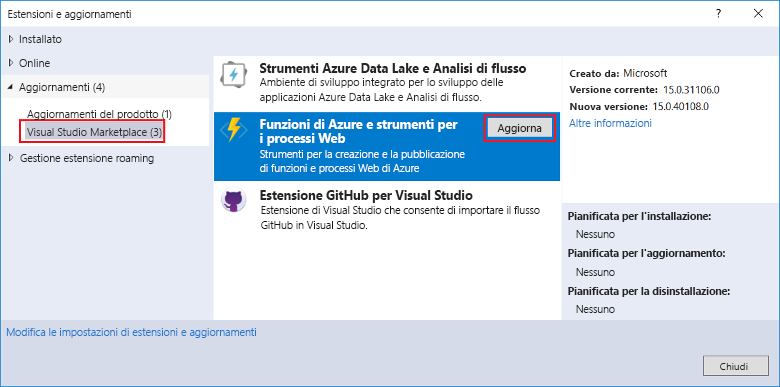
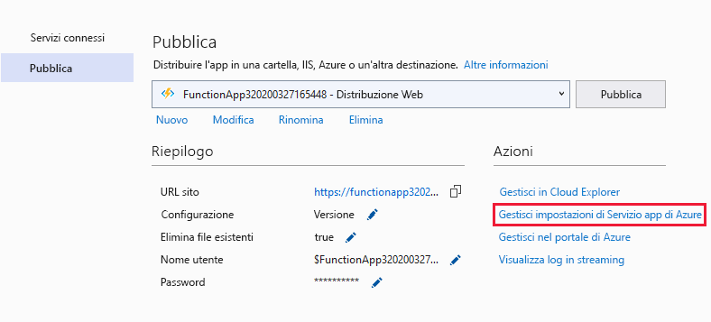
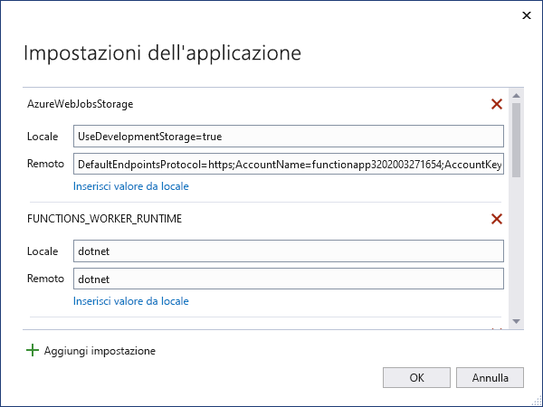

# <a name="develop-azure-functions-using-visual-studio"></a>Sviluppare Funzioni di Azure con Visual Studio  

Azure Functions Tools for Visual Studio 2017 è un'estensione di Visual Studio che consente di sviluppare, testare e distribuire funzioni C# in Azure. Se questa è la prima esperienza con Funzioni di Azure, è consigliabile leggere altre informazioni in [Introduzione a Funzioni di Azure](functions-overview.md).

Azure Functions Tools offre i vantaggi seguenti: 

* Modifica, compilazione ed esecuzione di funzioni nel computer di sviluppo locale. 
* Pubblicazione del proprio progetto di Funzioni di Azure direttamente in Azure. 
* Utilizzo di attributi di processi Web per dichiarare associazioni di funzione direttamente nel codice C# anziché mantenere un file function.json separato per le definizioni di associazione.
* Sviluppo e distribuzione di funzioni C# precompilate. Le funzioni precompilate offrono migliori prestazioni nell'avvio a freddo rispetto alle funzioni basate su script C#. 
* Possibilità di scrivere il codice delle funzioni in C# sfruttando al contempo tutti i vantaggi dello sviluppo in Visual Studio. 

Questo articolo illustra in dettaglio come usare Azure Functions Tools for Visual Studio 2017 per sviluppare funzioni in C# e pubblicarle in Azure. Prima di leggere questo articolo, completare [Creare la prima funzione con Visual Studio](functions-create-your-first-function-visual-studio.md). 

> [!IMPORTANT]
> Non combinare lo sviluppo locale con lo sviluppo del portale nella stessa app per le funzioni. Quando si pubblica da un progetto locale a un'app per le funzioni, il processo di distribuzione sovrascrive le funzioni sviluppate nel portale.

## <a name="prerequisites"></a>Prerequisiti

Gli strumenti di Funzioni di Azure sono inclusi nel carico di lavoro di sviluppo di Azure in [Visual Studio 2017 15.5](https://www.visualstudio.com/vs/) o versione successiva. Assicurarsi di includere il carico di lavoro di **sviluppo di Azure** nell'installazione di Visual Studio 2017:


Assicurarsi che Visual Studio sia aggiornato e di usare la [versione più recente](#check-your-tools-version) degli strumenti di Funzioni di Azure.

### <a name="other-requirements"></a>Altri requisiti

Per creare e distribuire funzioni, è necessario disporre anche di quanto segue:

* Una sottoscrizione di Azure attiva. Se non si possiede una sottoscrizione di Azure, sono disponibili [account gratuiti](https://azure.microsoft.com/free/?WT.mc_id=A261C142F).

* Un account dell'Archiviazione di Azure. Per creare un account di archiviazione, vedere [Creare un account di archiviazione](../storage/common/storage-quickstart-create-account.md).

### <a name="check-your-tools-version"></a>Controllare la versione degli strumenti

1. Scegliere **Estensioni e aggiornamenti** dal menu **Strumenti**. Espandere **Installati** > **Strumenti** e scegliere **Funzioni di Azure e strumenti per processi Web**.

    

2. Prendere nota della **versione** installata. È possibile confrontare questa versione con la versione più recente elencata nelle [note sulla versione](https://github.com/Azure/Azure-Functions/blob/master/VS-AzureTools-ReleaseNotes.md). 

3. Se la versione è precedente, aggiornare gli strumenti in Visual Studio come illustrato nella sezione seguente.

### <a name="update-your-tools"></a>Aggiornare gli strumenti

1. Nella finestra di dialogo **Estensioni e aggiornamenti** espandere **Aggiornamenti** > **Visual Studio Marketplace**, scegliere **Funzioni di Azure e strumenti per processi Web** e selezionare **Aggiorna**.

       

2. Dopo aver scaricato l'aggiornamento degli strumenti, chiudere Visual Studio per attivare l'aggiornamento degli strumenti con il programma di installazione di VSIX.

3. Nel programma di installazione scegliere **OK** per avviare il processo e quindi **Modifica** per aggiornare gli strumenti. 

4. Al termine dell'aggiornamento, scegliere **Chiudi** e riavviare Visual Studio.

## <a name="create-an-azure-functions-project"></a>Creare un progetto di Funzioni di Azure

[!INCLUDE [Create a project using the Azure Functions](../../includes/functions-vstools-create.md)]

Il modello di progetto crea un progetto C#, installa il pacchetto NuGet `Microsoft.NET.Sdk.Functions` e imposta il framework di destinazione. Funzioni 1.x usa .NET Framework e Funzioni 2.x usa .NET Standard. Il nuovo progetto contiene i file seguenti:

* **host.json**: consente di configurare l'host di Funzioni. Queste impostazioni si applicano sia durante l'esecuzione in locale che nell'esecuzione in Azure. Per altre informazioni, vedere il [riferimento su host.json](functions-host-json.md).

* **local.settings.json**: mantiene le impostazioni usate quando si esegue Funzioni in locale. Queste impostazioni non vengono usate da Azure, bensì dagli [strumenti di base di Funzioni di Azure](functions-run-local.md). Usare questo file per specificare le impostazioni dell'app per le variabili richieste dalle funzioni. Aggiungere un nuovo elemento alla matrice **Values** per ogni connessione richiesta dalle associazioni delle funzioni nel progetto. Per altre informazioni, vedere [File di impostazioni locali](functions-run-local.md#local-settings-file) nell'argomento sugli strumenti di base di Funzioni di Azure.

    >[!IMPORTANT]
    >Poiché il file local.settings.json può contenere segreti, è necessario escluderlo dal controllo del codice sorgente del progetto. L'impostazione **Copia nella directory di output** per questo file dovrebbe essere sempre **Copia se più recente**. 

Per altre informazioni, vedere [Progetto di libreria di classi per Funzioni](functions-dotnet-class-library.md#functions-class-library-project).

## <a name="configure-the-project-for-local-development"></a>Configurare il progetto per lo sviluppo locale

Il runtime di Funzioni usa un account di archiviazione di Azure internamente. Per tutti i tipi di trigger diversi da HTTP e dai webhook, è necessario impostare la chiave **Values.AzureWebJobsStorage** su una stringa di connessione di account di archiviazione di Azure valida. L'app per le funzioni può usare anche l'[Emulatore di archiviazione di Azure](../storage/common/storage-use-emulator.md) per le impostazioni di connessione **AzureWebJobsStorage** necessarie per il progetto. Per usare l'emulatore, impostare il valore **AzureWebJobsStorage** su `UseDevelopmentStorage=true`. È necessario modificare questa impostazione per una connessione di archiviazione effettiva prima della distribuzione.

Per impostare la stringa di connessione dell'account di archiviazione:

1. In Visual Studio aprire **Cloud Explorer**, espandere **Account di archiviazione** > **Your Storage Account** (Account di archiviazione personale), quindi selezionare **Proprietà** e copiare il valore **Stringa di connessione primaria**.

2. Nel progetto aprire il file local.settings.json e impostare il valore della chiave **AzureWebJobsStorage** sulla stringa di connessione copiata.

3. Ripetere il passaggio precedente per aggiungere chiavi univoche alla matrice di **Valori** per tutte le altre connessioni richieste dalle funzioni.

## <a name="add-a-function-to-your-project"></a>Aggiungere una funzione al progetto

Nelle funzioni precompilate le associazioni usate dalla funzione sono definite tramite l'applicazione di attributi nel codice. Quando si usa Azure Functions Tools per creare le funzioni dai modelli forniti, questi attributi vengono applicati automaticamente. 

1. In **Esplora soluzioni** fare clic con il pulsante destro del mouse sul nodo del progetto e scegliere **Aggiungi** > **Nuovo elemento**. Selezionare **Funzione di Azure**, digitare un **Nome** per la classe e fare clic su **Aggiungi**.

2. Scegliere il trigger, impostare le proprietà di associazione e fare clic su **Crea**. L'esempio seguente mostra le impostazioni quando si crea una funzione attivata da un'archiviazione code. 

    

    Questo esempio di trigger usa una stringa di connessione con una chiave denominata **QueueStorage**. Questa impostazione della stringa di connessione deve essere definita nel file [local.settings.json](functions-run-local.md#local-settings-file).

3. Si esamini la classe appena aggiunta. Si vede un metodo **Run** statico a cui è associato l'attributo **FunctionName**. Questo attributo indica che il metodo è il punto di ingresso per la funzione.

    La classe C# seguente rappresenta ad esempio una funzione di base attivata dall'archiviazione code:

    ```csharp
    using System;
    using Microsoft.Azure.WebJobs;
    using Microsoft.Azure.WebJobs.Host;
    using Microsoft.Extensions.Logging;

    namespace FunctionApp1
    {
        public static class Function1
        {
            [FunctionName("QueueTriggerCSharp")]
            public static void Run([QueueTrigger("myqueue-items", Connection = "QueueStorage")]string myQueueItem, ILogger log)
            {
                log.LogInformation($"C# Queue trigger function processed: {myQueueItem}");
            }
        }
    }
    ```
    Un attributo specifico dell'associazione viene applicato a ogni parametro di associazione fornito al metodo del punto di ingresso. L'attributo accetta le informazioni di associazione come parametri. Nell'esempio precedente il primo parametro dispone di un attributo **QueueTrigger**, che indica la funzione attivata dalla coda. Il nome della coda e il nome di impostazione della stringa di connessione vengono passati come parametri all'attributo **QueueTrigger**. Per altre informazioni, vedere [Associazioni di archiviazione code in Funzioni di Azure](functions-bindings-storage-queue.md#trigger---c-example).
    
È possibile usare la procedura descritta in precedenza per aggiungere altre funzioni al progetto di app per le funzioni. Ogni funzione nel progetto può avere un trigger diverso, ma una funzione deve avere esattamente un trigger. Per altre informazioni, vedere [Concetti relativi a trigger e associazioni in Funzioni di Azure](functions-triggers-bindings.md).

## <a name="add-bindings"></a>Aggiungere associazioni

Come nel caso dei trigger, le associazioni di input e output vengono aggiunte alla funzione come attributi di associazione. Per aggiungere associazioni a una funzione, procedere come segue:

1. Assicurarsi di avere [configurato il progetto per lo sviluppo locale](#configure-the-project-for-local-development).

2. Aggiungere il pacchetto di estensione NuGet appropriato per l'associazione specifica. Per altre informazioni, vedere [Sviluppo in C# a livello locale con Visual Studio](./functions-bindings-register.md#local-csharp) nell'articolo relativo a trigger e associazioni. I requisiti del pacchetto NuGet specifico dell'associazione sono indicati nell'articolo di riferimento per l'associazione. I requisiti del pacchetto per il trigger di Hub eventi sono ad esempio disponibili nell'[articolo di riferimento sulle associazioni di Hub eventi](functions-bindings-event-hubs.md).

3. Se ci sono impostazioni dell'app richieste dall'associazione, aggiungerle alla raccolta **Values** nel [file di impostazioni locali](functions-run-local.md#local-settings-file). Questi valori vengono usati quando la funzione viene eseguita in locale. Quando la funzione viene eseguita nell'app per le funzioni in Azure, vengono usate le [impostazioni dell'app per le funzioni](#function-app-settings).

4. Aggiungere l'attributo di associazione appropriato per la firma del metodo. Nell'esempio seguente un messaggio della coda attiva la funzione e l'associazione di output crea un nuovo messaggio della coda con lo stesso testo in una coda diversa.

    ```csharp
    public static class SimpleExampleWithOutput
    {
        [FunctionName("CopyQueueMessage")]
        public static void Run(
            [QueueTrigger("myqueue-items-source", Connection = "AzureWebJobsStorage")] string myQueueItem, 
            [Queue("myqueue-items-destination", Connection = "AzureWebJobsStorage")] out string myQueueItemCopy,
            ILogger log)
        {
            log.LogInformation($"CopyQueueMessage function processed: {myQueueItem}");
            myQueueItemCopy = myQueueItem;
        }
    }
    ```
   La connessione all'archiviazione code viene ottenuta dall'impostazione `AzureWebJobsStorage`. Per altre informazioni, vedere l'articolo di riferimento per l'associazione specifica. 

[!INCLUDE [Supported triggers and bindings](../../includes/functions-bindings.md)]

## <a name="testing-functions"></a>Test delle funzioni

Azure Functions Core Tools consente di eseguire il progetto Funzioni di Azure nel computer di sviluppo locale. Verrà richiesto di installare questi strumenti al primo avvio di una funzione da Visual Studio.

Per testare la funzione premere F5. Se viene visualizzata, accettare la richiesta di Visual Studio di scaricare e installare gli strumenti dell'interfaccia della riga di comando Azure Functions Core Tools. Potrebbe essere necessario anche abilitare un'eccezione del firewall per consentire agli strumenti di gestire le richieste HTTP.

Con il progetto in esecuzione, è possibile testare il codice come si fa con una funzione distribuita. Per altre informazioni, vedere [Strategie per il test del codice in Funzioni di Azure](functions-test-a-function.md). Durante l'esecuzione in modalità di debug, i punti di interruzione vengono raggiunti in Visual Studio come previsto. 

<!---
For an example of how to test a queue triggered function, see the [queue triggered function quickstart tutorial](functions-create-storage-queue-triggered-function.md#test-the-function).  
-->

Per altre informazioni sull'utilizzo degli strumenti di base di Funzioni di Azure, vedere [Come scrivere codice per le funzioni di Azure e testarle in locale](functions-run-local.md).

## <a name="publish-to-azure"></a>Pubblicazione in Azure

[!INCLUDE [Publish the project to Azure](../../includes/functions-vstools-publish.md)]

## <a name="function-app-settings"></a>Impostazioni dell'app per le funzioni

Le impostazioni aggiunte nel file local.settings.json devono essere aggiunte anche all'app per le funzioni in Azure. Queste impostazioni non vengono caricate automaticamente quando si pubblica il progetto.

Il modo più semplice per caricare le impostazioni necessarie per l'app per le funzioni in Azure consiste nell'usare il collegamento **Gestisci impostazioni applicazione** visualizzato dopo la pubblicazione del progetto.



Questa operazione visualizza la finestra di dialogo **Impostazioni applicazione** dell'app per le funzioni. Qui è possibile aggiungere nuove impostazioni dell'applicazione o modificare quelle esistenti.



**Locale** rappresenta un valore di impostazione del file local.settings.json, mentre **Remoto** è l'impostazione corrente nell'app per le funzioni in Azure.  Scegliere **Aggiungi impostazione** per creare una nuova impostazione dell'app. Usare il collegamento **Inserisci valore da locale** per copiare un valore di impostazione nel campo **Remoto**. Le modifiche in sospeso vengono scritte nel file delle impostazioni locali e nell'app per le funzioni quando si seleziona **OK**.

È anche possibile gestire le impostazioni dell'applicazione in questi altri modi:

* [Uso del portale di Azure](functions-how-to-use-azure-function-app-settings.md#settings).
* [Uso dell'opzione di pubblicazione `--publish-local-settings` negli strumenti principali di Funzioni di Azure](functions-run-local.md#publish).
* [Uso dell'interfaccia della riga di comando di Azure](/cli/azure/functionapp/config/appsettings#az-functionapp-config-appsettings-set).

## <a name="monitoring-functions"></a>Monitoraggio delle funzioni

È consigliabile monitorare l'esecuzione della funzione in Azure tramite l'integrazione con Azure Application Insights. Quando si crea un'app per le funzioni nel portale di Azure, questa integrazione avviene automaticamente per impostazione predefinita. Tuttavia, quando si crea l'app per le funzioni durante la pubblicazione di Visual Studio, l'integrazione nell'app per le funzioni in Azure non viene eseguita. Al contrario, si otterrà la funzionalità di registrazione predefinita, che non è consigliata.

Per abilitare Application Insights per l'app per le funzioni in Azure:

1. Creare un'istanza di Application Insights nel [portale di Azure](https://portal.azure.com) e copiare la chiave di strumentazione. Per informazioni, vedere [Connettere manualmente una risorsa di App Insights](functions-monitoring.md#manually-connect-an-app-insights-resource).  

1. Aggiungere un'impostazione dell'app denominata `APPINSIGHTS_INSTRUMENTATIONKEY` alle impostazioni dell'app per le funzioni in Azure, come descritto in [Impostazioni dell'app per le funzioni](#function-app-settings). Questa impostazione dell'app contiene la chiave di strumentazione che è stata creata nel passaggio precedente.

1. Rimuovere l'impostazione dell'app `AzureWebJobsDashboard` dall'app per le funzioni in Azure, che disabilita la registrazione predefinita.  

Per altre informazioni, vedere [Monitorare Funzioni di Azure](functions-monitoring.md).

## <a name="next-steps"></a>Passaggi successivi

Per altre informazioni sull'utilizzo degli strumenti di base di Funzioni di Azure, vedere [Come scrivere codice per le funzioni di Azure e testarle in locale](functions-run-local.md).

Per altre informazioni sullo sviluppo di funzioni come librerie di classi .NET, vedere [Guida di riferimento per gli sviluppatori C# di Funzioni di Azure](functions-dotnet-class-library.md). Questo articolo include anche collegamenti a esempi d'uso degli attributi per dichiarare i vari tipi di associazioni supportati da Funzioni di Azure.    
