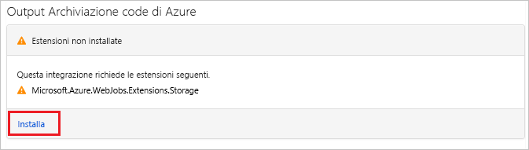

# <a name="add-messages-to-an-azure-storage-queue-using-functions"></a>Aggiungere messaggi a una coda di archiviazione di Azure tramite Funzioni

In Funzioni di Azure le associazioni di input e di output forniscono una modalità dichiarativa per rendere disponibili nel codice i dati di servizi esterni. In questa guida introduttiva viene usata un'associazione di output per creare un messaggio in una coda quando viene attivata una funzione da una richiesta HTTP. Per visualizzare i messaggi della coda creati dalla funzione si usa Azure Storage Explorer:


## <a name="prerequisites"></a>Prerequisiti

Per completare questa guida introduttiva:

* Seguire le indicazioni in [Creare la prima funzione nel portale di Azure](functions-create-first-azure-function.md) e non eseguire il passaggio **Pulire le risorse**. La guida introduttiva crea l'app per le funzioni e la funzione da usare.

* Installare [Microsoft Azure Storage Explorer](https://storageexplorer.com/). Si tratta di uno strumento che consente di esaminare i messaggi della coda creati dall'associazione di output.

## <a name="add-binding"></a>Aggiungere un binding di output

In questa sezione si usa l'interfaccia utente del portale per aggiungere un'associazione di output di archiviazione code alla funzione creata in precedenza. Questa associazione permetterà di scrivere una quantità minima di codice per creare un messaggio in una coda. Non è necessario scrivere codice per attività come aprire una connessione di archiviazione, creare una coda o ottenere un riferimento a una coda. Queste attività vengono eseguite dal runtime di Funzioni di Azure e dall'associazione di output della coda.

1. Nel portale di Azure aprire la pagina dell'app per le funzioni creata in [Creare la prima funzione nel portale di Azure](functions-create-first-azure-function.md). A tale scopo, selezionare **Tutti i servizi > App per le funzioni** e quindi selezionare l'app per le funzioni.

1. Selezionare la funzione creata nella guida introduttiva precedente.

1. Selezionare **Integrazione > Nuovo output > Archiviazione code di Azure**.

1. Fare clic su **Seleziona**.

    

1. Se viene visualizzato un messaggio **Estensioni non installate**, scegliere **Installa** per installare l'estensione dei binding di Archiviazione nell'app per le funzioni. L'operazione potrebbe richiedere un paio di minuti.

    

1. In **Azure Queue Storage output** (Output archiviazione code di Azure) usare le impostazioni specificate nella tabella riportata dopo lo screenshot: 

    

    | Impostazione      |  Valore consigliato   | DESCRIZIONE                              |
    | ------------ |  ------- | -------------------------------------------------- |
    | **Nome del parametro del messaggio** | outputQueueItem | Nome del parametro di binding di output. | 
    | **Connessione dell'account di archiviazione** | AzureWebJobsStorage | È possibile usare la connessione dell'account di archiviazione già usata dall'app per le funzioni oppure crearne una nuova.  |
    | **Nome coda**   | outqueue    | Nome della coda a cui connettersi nell'account di archiviazione. |

1. Fare clic su **Salva** per aggiungere il binding.

Dopo aver definito un binding di output, è necessario ora aggiornare il codice in modo da usare il binding per aggiungere messaggi a una coda.  

## <a name="add-code-that-uses-the-output-binding"></a>Aggiungere il codice che usa l'associazione di output

In questa sezione si aggiunge il codice che scrive un messaggio nella coda di output. Il messaggio include il valore passato al trigger HTTP nella stringa di query. Se, ad esempio, la stringa di query include `name=Azure`, il messaggio della coda sarà *Name passed to the function: Azure*.

1. Selezionare la funzione per visualizzare il codice funzione nell'editor.

1. Aggiornare il codice della funzione a seconda del linguaggio della funzione:

    # <a name="ctabcsharp"></a>[C\#](#tab/csharp)

    Aggiungere un parametro **outputQueueItem** alla firma del metodo come illustrato nell'esempio seguente.

    ```cs
    public static async Task<IActionResult> Run(HttpRequest req,
        ICollector<string> outputQueueItem, ILogger log)
    {
        ...
    }
    ```

    Nel corpo della funzione, subito prima dell'istruzione `return`, aggiungere il codice che usa il parametro per creare un messaggio della coda.

    ```cs
    outputQueueItem.Add("Name passed to the function: " + name);
    ```

    # <a name="javascripttabnodejs"></a>[JavaScript](#tab/nodejs)

    Aggiungere il codice che usa il binding di output nell'oggetto `context.bindings` per creare un messaggio della coda. Aggiungere questo codice prima dell'istruzione `context.done`.

    ```javascript
    context.bindings.outputQueueItem = "Name passed to the function: " + 
                (req.query.name || req.body.name);
    ```

    ---

1. Selezionare **Salva** per salvare le modifiche.

## <a name="test-the-function"></a>Testare la funzione

1. Dopo aver salvato le modifiche al codice, selezionare **Esegui**. 

    

    Si noti che in **Corpo della richiesta** è presente il valore di `name` *Azure*. Questo valore viene visualizzato nel messaggio della coda creato quando viene richiamata la funzione.
    
    Al posto di fare clic su **Esegui**, in questo caso è possibile chiamare la funzione immettendo un URL in un browser e specificando il valore di `name` nella stringa di query. Il metodo tramite browser è illustrato nella [guida introduttiva precedente](functions-create-first-azure-function.md#test-the-function).

2. Controllare i log per assicurarsi che la funzione abbia avuto esito positivo. 

Quando il binding di output viene usato per la prima volta, nell'account di archiviazione viene creata dal runtime Funzioni una nuova coda denominata **outqueue**. Si userà Storage Explorer per verificare che siano stati creati la coda e un messaggio al suo interno.

### <a name="connect-storage-explorer-to-your-account"></a>Connettere Storage Explorer all'account

Se Storage Explorer è già stato installato e connesso all'account di archiviazione in uso in questa guida introduttiva, ignorare questa sezione.

1. Eseguire lo strumento [Microsoft Azure Storage Explorer](https://storageexplorer.com/), selezionare l'icona di connessione a sinistra, scegliere **Use a storage account name and key** (Usare il nome e la chiave di un account di archiviazione) e selezionare **Avanti**.

    

1. Nel portale di Azure, nella pagina dell'app per le funzioni, selezionare la funzione e quindi **Integrazione**.

1. Selezionare l'associazione di output di **Archiviazione code di Azure** aggiunta in un passaggio precedente.

1. Espandere la sezione **Documentazione** nella parte inferiore della pagina. 

   Il portale mostra le credenziali che è possibile usare in Storage Explorer per connettersi all'account di archiviazione.

   

1. Copiare il valore di **Nome account** dal portale e incollarlo nella casella **Nome account** in Storage Explorer.
 
1. Fare clic sull'icona Mostra/Nascondi accanto a **Chiave account** per visualizzare il valore e quindi copiare il valore di **Chiave account** e incollarlo nella casella **Chiave account** in Storage Explorer.
  
1. Selezionare **Avanti > Connetti**.

   

### <a name="examine-the-output-queue"></a>Esaminare la coda di output

1. In Storage Explorer selezionare l'account di archiviazione in uso in questa guida rapida.

1. Espandere il nodo **Code** e quindi selezionare la coda denominata **outqueue**. 

   La coda contiene il messaggio creato dall'associazione di output della coda quando è stata eseguita la funzione attivata da HTTP. Se la funzione è stata richiamata con il valore predefinito di `name` *Azure*, il messaggio della coda è *Name passed to the function: Azure*.

    

1. Eseguire nuovamente la funzione e verrà visualizzato un nuovo messaggio nella coda.  

## <a name="clean-up-resources"></a>Pulire le risorse

[!INCLUDE [Clean up resources](../../includes/functions-quickstart-cleanup.md)]

## <a name="next-steps"></a>Passaggi successivi

In questa guida introduttiva è stata aggiunta un'associazione di output a una funzione esistente. Per altre informazioni sul binding all'archiviazione code, vedere [Associazioni della coda dell'archiviazione di Funzioni di Azure](functions-bindings-storage-queue.md).

[!INCLUDE [Next steps note](../../includes/functions-quickstart-next-steps-2.md)]
