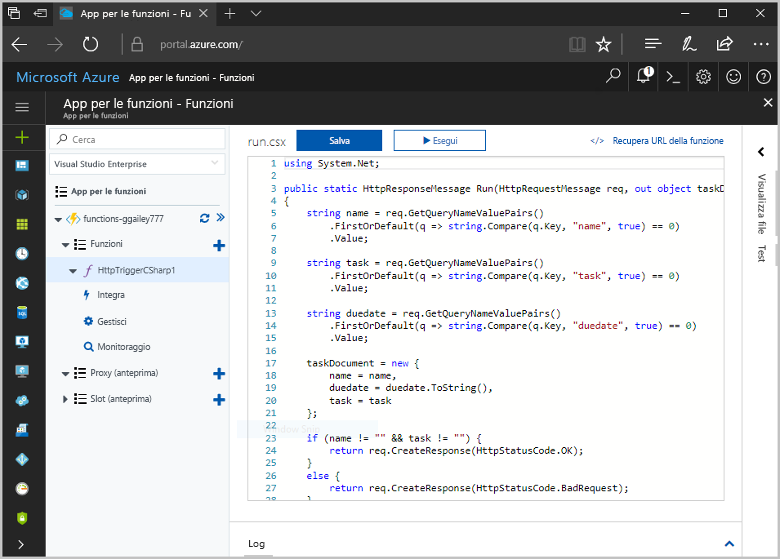
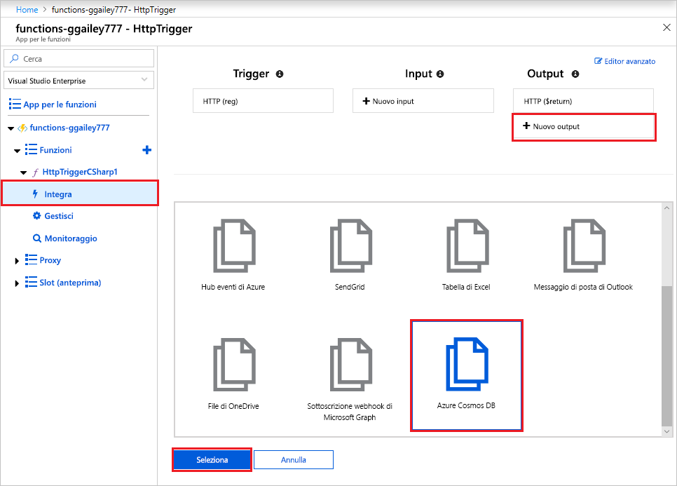
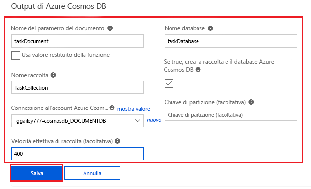
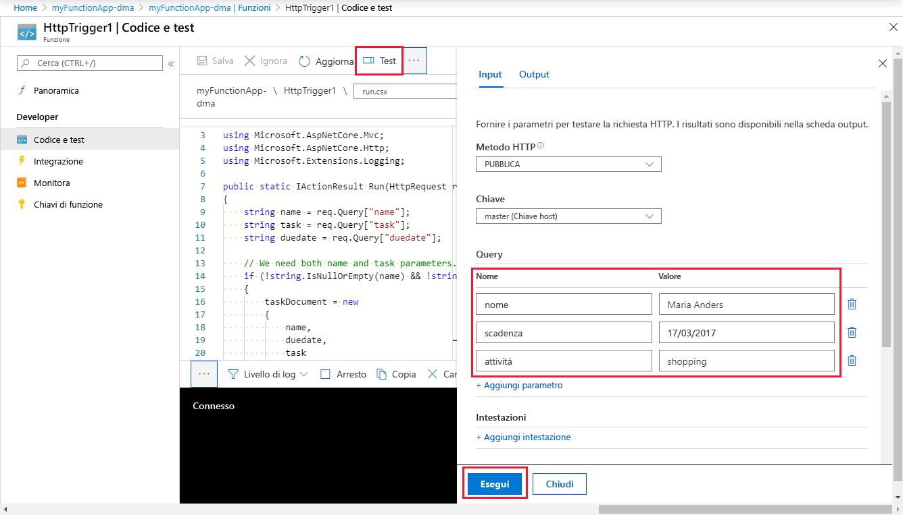
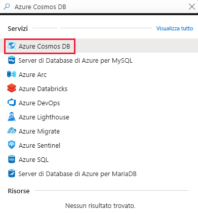
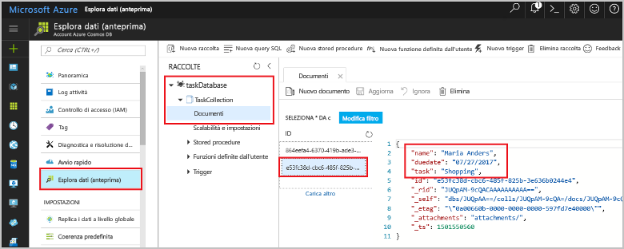

# <a name="store-unstructured-data-using-azure-functions-and-cosmos-db"></a>Archiviare dati non strutturati tramite Funzioni di Azure e Cosmos DB

[Azure Cosmos DB](https://azure.microsoft.com/services/cosmos-db/) offre un approccio ottimale per archiviare dati non strutturati e JSON. Insieme a Funzioni di Azure, Cosmos DB semplifica e velocizza l'archiviazione dei dati con una quantità minore di codice rispetto a quella necessaria per l'archiviazione dei dati in un database relazionale.

In Funzioni di Azure, i binding di input e di output forniscono una modalità dichiarativa per connettersi a dati di servizio esterni dalla funzione. Questo argomento illustra come aggiornare una funzione C# esistente per l'aggiunta di un binding di output che archivia dati non strutturati in un documento di Cosmos DB. 



## <a name="prerequisites"></a>Prerequisiti

Per completare questa esercitazione:

[!INCLUDE [Previous quickstart note](../../includes/functions-quickstart-previous-topics.md)]

## <a name="add-an-output-binding"></a>Aggiungere un binding di output

1. Espandere sia l'app per le funzioni sia la funzione.

1. Selezionare **Integrazione** e **Nuovo output** in alto a destra nella pagina. Scegliere **Azure Cosmos DB**, quindi fare clic su **Seleziona**.

    

3. Usare le impostazioni di **Azure Cosmos DB output** (Output di Azure Cosmos DB) specificate nella tabella: 

    

    | Impostazione      | Valore consigliato  | Descrizione                                |
    | ------------ | ---------------- | ------------------------------------------ |
    | **Nome del parametro del documento** | taskDocument | Nome che fa riferimento all'oggetto Cosmos DB nel codice. |
    | **Database name** (Nome database) | taskDatabase | Nome del database per il salvataggio dei documenti. |
    | **Nome raccolta** | TaskCollection | Nome della raccolta di database di Cosmos DB. |
    | **Se true, crea il database e la raccolta di Cosmos DB** | Selezionato | La raccolta non esiste ancora, quindi crearla. |

4. Fare clic sul collegamento **Nuovo** accanto all'etichetta **Connessione dell'account Cosmos DB** e quindi selezionare **Crea nuovo**. 

5. Usare quindi le impostazioni di **Nuovo account** specificate nella tabella: 

    

    | Impostazione      | Valore consigliato  | Descrizione                                |
    | ------------ | ---------------- | ------------------------------------------ |
    | **ID** | Nome del database | ID univoco per il database Cosmos DB  |
    | **API** | SQL (DocumentDB) | Selezionare l'API del database di documenti.  |
    | **Sottoscrizione** | Sottoscrizione di Azure | Sottoscrizione di Azure  |
    | **Gruppo di risorse** | myResourceGroup |  Usare il gruppo di risorse esistente che contiene l'app per le funzioni. |
    | **Posizione**  | Europa occidentale | Selezionare una località nei pressi dell'app per le funzioni o di altre app che usano i documenti archiviati.  |

6. Fare clic su **OK** per creare il database. La creazione del database può richiedere alcuni minuti. Dopo avere creato il database, la stringa di connessione del database viene archiviata come impostazione dell'app per le funzioni. Il nome di questa impostazione dell'app viene inserito nella **connessione dell'account Cosmos DB**. 
 
8. Dopo aver impostato la stringa di connessione, selezionare **Salva** per creare il binding.

## <a name="update-the-function-code"></a>Aggiornare il codice funzione

Sostituire il codice della funzione C# esistente con il seguente:

```csharp
using System.Net;

public static HttpResponseMessage Run(HttpRequestMessage req, out object taskDocument, TraceWriter log)
{
    string name = req.GetQueryNameValuePairs()
        .FirstOrDefault(q => string.Compare(q.Key, "name", true) == 0)
        .Value;

    string task = req.GetQueryNameValuePairs()
        .FirstOrDefault(q => string.Compare(q.Key, "task", true) == 0)
        .Value;

    string duedate = req.GetQueryNameValuePairs()
        .FirstOrDefault(q => string.Compare(q.Key, "duedate", true) == 0)
        .Value;

    taskDocument = new {
        name = name,
        duedate = duedate.ToString(),
        task = task
    };

    if (name != "" && task != "") {
        return req.CreateResponse(HttpStatusCode.OK);
    }
    else {
        return req.CreateResponse(HttpStatusCode.BadRequest);
    }
}

```
Questo esempio di codice legge le stringhe della query di richiesta HTTP e le assegna ai campi dell'oggetto `taskDocument`. Il binding `taskDocument` invia i dati dell'oggetto di questo parametro di binding per l'archiviazione nel database di documenti associato. Il database viene creato alla prima esecuzione della funzione.

## <a name="test-the-function-and-database"></a>Testare la funzione e il database

1. Espandere la finestra di destra e selezionare **Test**. In **Query** fare clic su **Aggiungi parametro** e aggiungere i parametri seguenti per la stringa di query:

    + `name`
    + `task`
    + `duedate`

2. Fare clic su **Esegui** e verificare che venga restituito uno stato 200.

    

1. Sul lato sinistro del portale di Azure espandere la barra delle icone, digitare `cosmos` nel campo di ricerca e selezionare **Azure Cosmos DB**.

    

2. Selezionare il database creato e quindi selezionare **Esplora dati**. Espandere i nodi **Raccolte**, selezionare il nuovo documento e verificare che il documento contenga i valori della stringa di query, oltre ad alcuni metadati aggiuntivi. 

    

È stato aggiunto un binding al trigger HTTP che archivia dati non strutturati in un database Cosmos DB.

[!INCLUDE [Clean-up section](../../includes/clean-up-section-portal.md)]

## <a name="next-steps"></a>Passaggi successivi

[!INCLUDE [functions-quickstart-next-steps](../../includes/functions-quickstart-next-steps.md)]

Per altre informazioni sul binding a un database Cosmos DB, vedere [Binding di Azure Cosmos DB in Funzioni di Azure](functions-bindings-documentdb.md).

