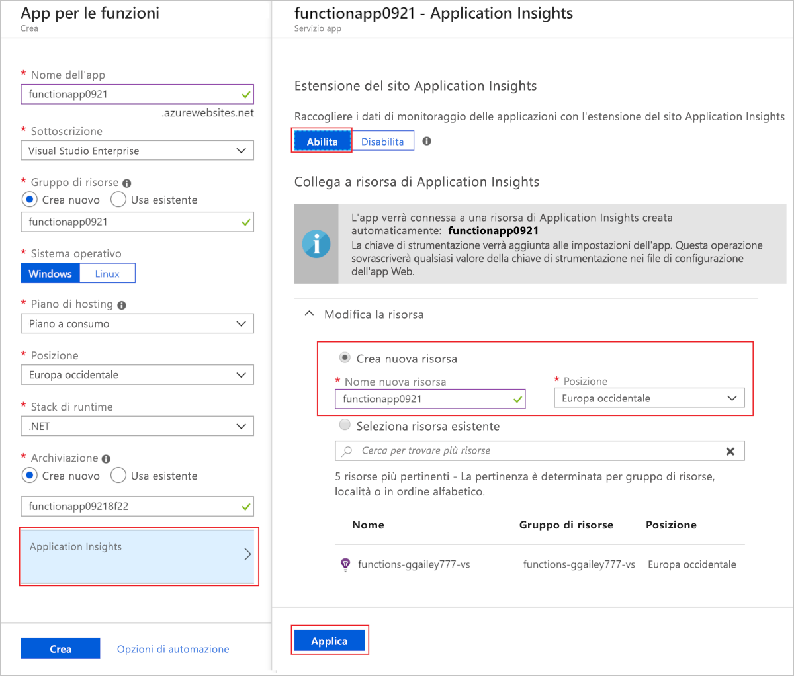
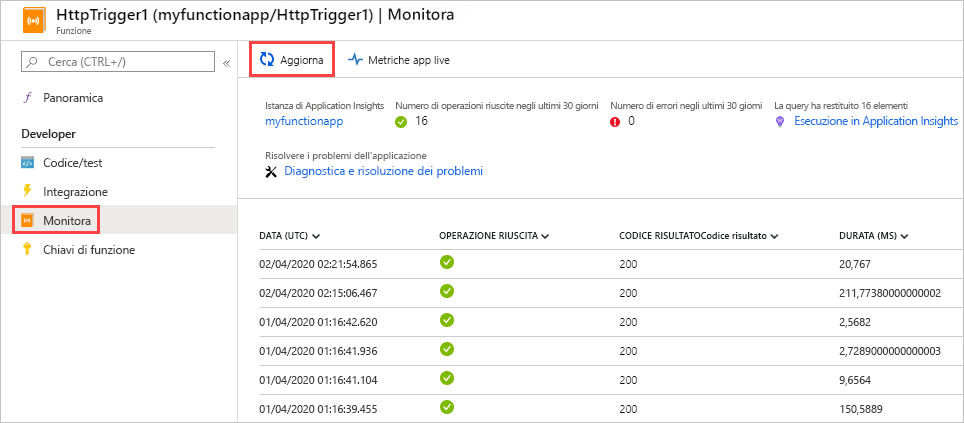
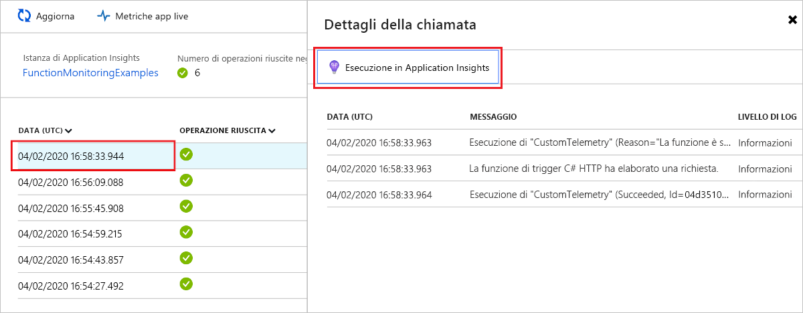
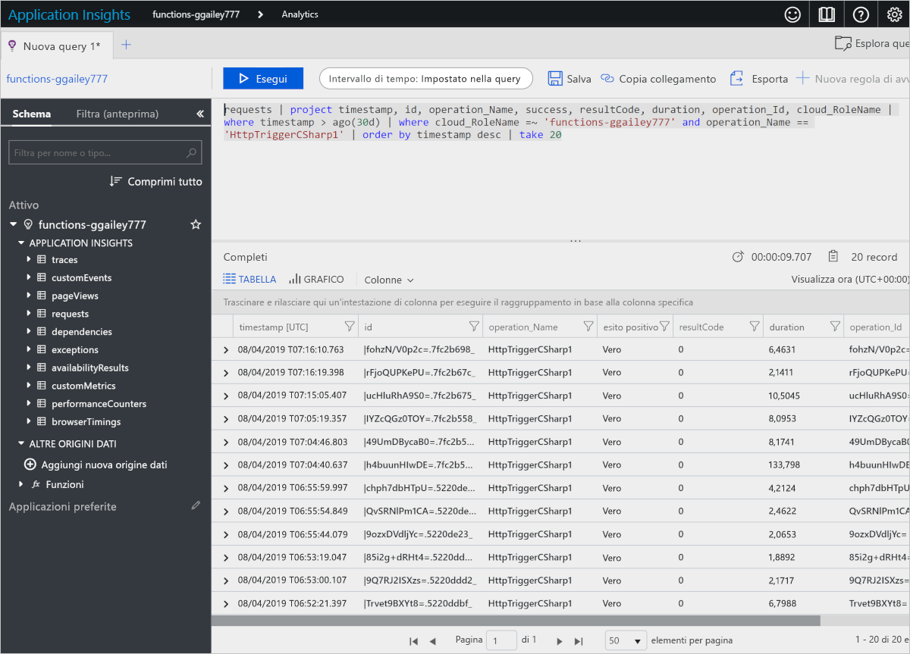
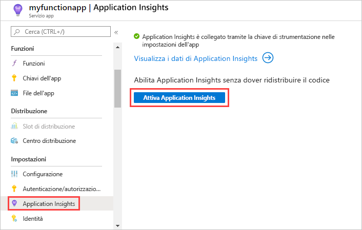
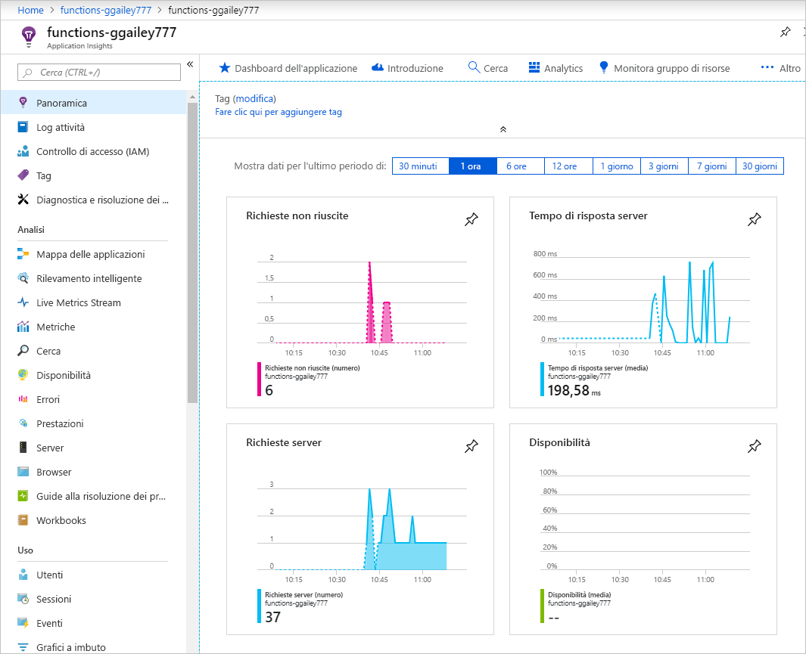
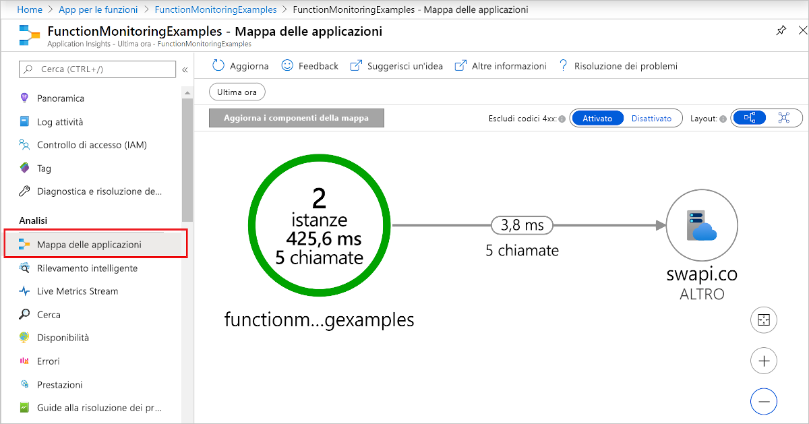
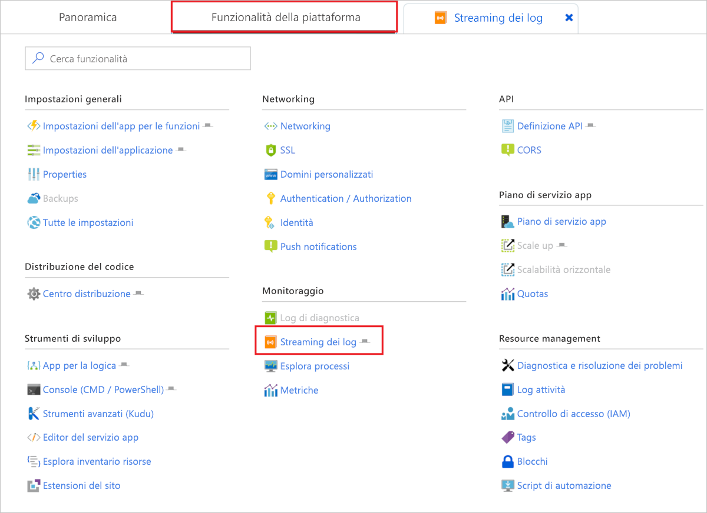
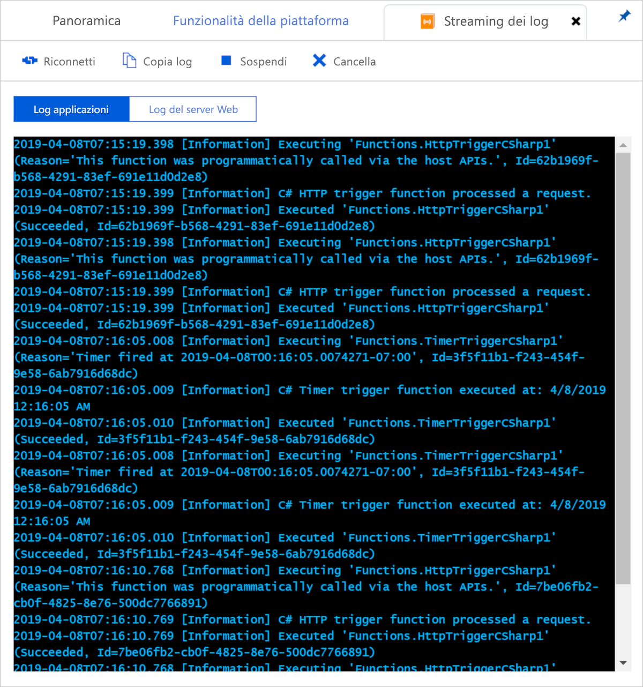

# <a name="monitor-azure-functions"></a>Monitorare Funzioni di Azure

[Funzioni di Azure](functions-overview.md) offre integrazione predefinita con [Azure Application Insights](../azure-monitor/app/app-insights-overview.md) monitorare funzioni. Questo articolo illustra come configurare funzioni di Azure per inviare i file di log generati dal sistema in Application Insights.

È consigliabile usare Application Insights perché raccoglie log, prestazioni e i dati di errore. Automaticamente rileva le anomalie nelle prestazioni e include strumenti di analitica potenti che consentono di diagnosticare i problemi e comprendere l'uso delle funzioni. Il servizio è progettato per supportare il miglioramento continuo delle prestazioni e dell'usabilità. È anche possibile usare Application Insights durante lo sviluppo di progetto app di funzione locale. Per altre informazioni, vedere [What ' s Application Insights?](../azure-monitor/app/app-insights-overview.md)

Come la strumentazione di Application Insights richiesta è incorporata in funzioni di Azure, tutto quello che serve è una chiave di strumentazione per la connessione di app per le funzioni a una risorsa di Application Insights.

## <a name="application-insights-pricing-and-limits"></a>Prezzi e limiti di Application Insights

È possibile provare gratuitamente l'integrazione di Application Insights con le app per le funzioni. È previsto un limite giornaliero per la quantità di dati possono essere elaborati gratuitamente. Si potrebbe raggiunge questo limite durante i test. Quando il limite giornaliero è quasi raggiunto, Azure invia notifiche tramite il portale e messaggi di posta elettronica. Se si perdere tali avvisi e ha raggiunto il limite, i nuovi log non sarà più visualizzato nelle query di Application Insights. Tenere presente il limite per evitare inutili tempi di risoluzione dei problemi. Per altre informazioni, vedere [Gestire volumi di dati e prezzi in Application Insights](../azure-monitor/app/pricing.md).

## <a name="enable-application-insights-integration"></a>Abilitare l'integrazione di Application Insights

Affinché un'app per le funzioni invii dati ad Application Insights, è necessario conoscere la chiave di strumentazione di una risorsa di Application Insights. La chiave deve essere specificata in un'impostazione dell'app denominata **APPINSIGHTS_INSTRUMENTATIONKEY**.

### <a name="new-function-app-in-the-portal"></a>Nuova app per le funzioni nel portale

Quando si [creare app per le funzioni nel portale di Azure](functions-create-first-azure-function.md), integrazione di Application Insights è abilitato per impostazione predefinita. La risorsa di Application Insights ha lo stesso nome dell'app per le funzioni e viene creato nella stessa area o nell'area più vicina.

Per esaminare la risorsa di Application Insights viene creata, selezionarlo per espandere la **Application Insights** finestra. È possibile modificare il **nuovo nome di risorsa** oppure scegliere un'altra **posizione** in un [area geografica di Azure](https://azure.microsoft.com/global-infrastructure/geographies/) in cui si desidera archiviare i dati.



Quando si sceglie **Create**, viene creata una risorsa di Application Insights con app per le funzioni che ha il `APPINSIGHTS_INSTRUMENTATIONKEY` impostato nelle impostazioni dell'applicazione. Tutto è pronto per iniziare.

<a id="manually-connect-an-app-insights-resource"></a>
### <a name="add-to-an-existing-function-app"></a>Aggiungere a un'app esistente (funzione) 

Quando si crea un'app di funzione usando il [Azure CLI](functions-create-first-azure-function-azure-cli.md), [Visual Studio](functions-create-your-first-function-visual-studio.md), o [Visual Studio Code](functions-create-first-function-vs-code.md), è necessario creare la risorsa di Application Insights. È quindi possibile aggiungere la chiave di strumentazione dalla risorsa come un'impostazione dell'applicazione nell'app per le funzioni.

[!INCLUDE [functions-connect-new-app-insights.md](../../includes/functions-connect-new-app-insights.md)]

Le prime versioni delle funzioni utilizzato monitoraggio predefinito, che non è più consigliato. Quando si abilita l'integrazione di Application Insights per tale app per le funzioni, è necessario inoltre [disabilitare la registrazione predefinita](#disable-built-in-logging).  

## <a name="view-telemetry-in-monitor-tab"></a>Visualizzare dati di telemetria nella scheda Monitoraggio

Con [integrazione di Application Insights abilitata](#enable-application-insights-integration), è possibile visualizzare i dati di telemetria nel **Monitor** scheda.

1. Nella pagina dell'app (funzione), selezionare una funzione che ha eseguito almeno una volta dopo che è stato configurato Application Insights. Quindi selezionare il **Monitor** scheda.

   

1. Selezionare **Aggiorna** periodicamente, fino a quando non viene visualizzato l'elenco di chiamate di funzione.

   Possono volerci fino a cinque minuti per l'elenco venga visualizzato anche se il client di telemetria invia in batch dei dati per la trasmissione al server. (Il ritardo non è valida per il [Live Stream metriche](../azure-monitor/app/live-stream.md). Tale servizio si connette all'host di Funzioni quando si carica la pagina, pertanto i registri vengono trasmessi direttamente alla pagina.

   

1. Per visualizzare i registri per una chiamata di funzione particolare, selezionare il collegamento alla colonna **Dati** per tale chiamata.

   

   L'output di registrazione per tale chiamata viene visualizzato in una nuova pagina.

   

Si noterà che entrambe le pagine hanno una **Esegui in Application Insights** collegamento alla query di Application Insights Analitica che recupera i dati.


Viene visualizzata la query seguente. È possibile vedere che l'elenco chiamate è limitato agli ultimi 30 giorni. L'elenco Mostra non più di 20 righe (`where timestamp > ago(30d) | take 20`). L'elenco di dettagli di chiamata è per gli ultimi 30 giorni senza alcun limite.



Per altre informazioni, vedere [Eseguire query sui dati di telemetria](#query-telemetry-data) più avanti in questo articolo.

## <a name="view-telemetry-in-application-insights"></a>Visualizzare i dati di telemetria in Application Insights

Per aprire Application Insights da un'app per le funzioni nel portale di Azure, fare clic per l'app per le funzioni **Panoramica** pagina. Sotto **le funzionalità configurate**, selezionare **Application Insights**.



Per informazioni su come usare Application Insights, vedere la [documentazione su Application Insights](https://docs.microsoft.com/azure/application-insights/). Questa sezione mostra alcuni esempi su come visualizzare i dati in Application Insights. Se si ha già familiarità con Application Insights, è possibile passare direttamente al [le sezioni su come configurare e personalizzare i dati di telemetria](#configure-categories-and-log-levels).



Le seguenti aree di Application Insights possono essere utile quando si valuta il comportamento, prestazioni ed errori nelle funzioni:

| TAB | DESCRIZIONE |
| ---- | ----------- |
| **[Errori](../azure-monitor/app/asp-net-exceptions.md)** |  Creare grafici e avvisi in base agli errori di funzione e le eccezioni di server. Il **nome dell'operazione** corrisponde al nome della funzione. Gli errori di dipendenze non vengono visualizzati solo se si implementano i dati di telemetria personalizzati per le dipendenze. |
| **[Prestazioni](../azure-monitor/app/performance-counters.md)** | Analizzare i problemi di prestazioni. |
| **Server** | Visualizzare l'utilizzo delle risorse e la velocità effettiva per ogni server. Questi dati possono essere utili negli scenari di debug in cui le funzioni bloccano le risorse sottostanti. I server sono denominati **Istanze del ruolo del cloud**. |
| **[Metriche](../azure-monitor/app/metrics-explorer.md)** | Creare grafici e avvisi basati sulle metriche. Le metriche includono il numero di chiamate alla funzione, il tempo di esecuzione e le percentuali di successo. |
| **[Flusso di metriche live](../azure-monitor/app/live-stream.md)** | Visualizzare i dati delle metriche durante la creazione in tempo reale. |

## <a name="query-telemetry-data"></a>Query sui dati di telemetria

[Application Insights Analitica](../azure-monitor/app/analytics.md) consente di accedere a tutti i dati di telemetria sotto forma di tabelle in un database. Analytics offre un linguaggio di query per l'estrazione, la manipolazione e la visualizzazione dei dati.


Questo è un esempio che mostra la distribuzione delle richieste per ruolo di lavoro negli ultimi 30 minuti.

```
requests
| where timestamp > ago(30m) 
| summarize count() by cloud_RoleInstance, bin(timestamp, 1m)
| render timechart
```

Le tabelle disponibili vengono visualizzate nei **Schema** scheda a sinistra. Nelle tabelle seguenti è possibile trovare i dati generati dalle chiamate alla funzione:

| Tabella | DESCRIZIONE |
| ----- | ----------- |
| **traces** | Log creati dal runtime e dal codice della funzione. |
| **requests** | Una richiesta per ogni chiamata di funzione. |
| **eccezioni** | Tutte le eccezioni generate dal runtime. |
| **customMetrics** | Numero di chiamate di esito positivo e negativo, percentuale di successo e la durata. |
| **customEvents** | Eventi rilevati dal runtime, ad esempio: richieste HTTP che attivano una funzione. |
| **performanceCounters** | Informazioni sulle prestazioni dei server che eseguono le funzioni. |

Le altre tabelle sono per i test di disponibilità e i dati di telemetria client e del browser. È possibile implementare i dati di telemetria personalizzati per aggiungerne altri.

All'interno di ogni tabella alcuni dati specifici per Funzioni si trovano nel campo `customDimensions`.  Ad esempio, la query seguente recupera tutte le tracce con livello di registrazione `Error`.

```
traces 
| where customDimensions.LogLevel == "Error"
```

Il runtime fornisce il `customDimensions.LogLevel` e `customDimensions.Category` campi. È possibile specificare campi aggiuntivi nei log che scrivono nel codice della funzione. Vedere la sezione [Registrazione strutturata](#structured-logging) più avanti in questo articolo.

## <a name="configure-categories-and-log-levels"></a>Configurare le categorie e i livelli di registrazione

È possibile usare Application Insights senza una configurazione personalizzata. La configurazione predefinita può comportare volumi elevati di dati. Se si usa una sottoscrizione di Azure di Visual Studio, si potrebbe raggiunge il limite d'uso dati per Application Insights. Più avanti in questo articolo descrive come configurare e personalizzare i dati inviati dalle funzioni ad Application Insights. Per un'app per le funzioni, la registrazione è configurata nel [host. JSON] file.

### <a name="categories"></a>Categorie

Il logger di Funzioni di Azure include un *categoria* per ogni log. La categoria indica quale parte del codice runtime o del codice funzione è stata scritta dal log. 

Il runtime di funzioni crea log con una categoria che iniziano con "Host". Il "funzione avviata," "funzione eseguita" e i log "funzione completata" dispongono della categoria "Host. executor". 

Se si scrivono i log nel codice della funzione, la categoria è "Function".

### <a name="log-levels"></a>Livelli di registrazione

Il logger di funzioni di Azure include anche un *livello di registrazione* ogni log. [LogLevel](/dotnet/api/microsoft.extensions.logging.loglevel) è un'enumerazione e il codice integer ne indica la relativa importanza:

|LogLevel    |Codice|
|------------|---|
|Trace       | 0 |
|Debug       | 1 |
|Informazioni | 2 |
|Avviso     | 3 |
|Tipi di errore       | 4 |
|Critico    | 5 |
|Nessuna        | 6 |

Il livello di registrazione `None` è illustrato nella sezione successiva. 

### <a name="log-configuration-in-hostjson"></a>Configurazione di log nell'host. JSON

Il file [host.json] configura il numero di registrazioni che un'app per le funzioni invia ad Application Insights. Per ogni categoria, si indica il livello di registrazione minimo da inviare. Ci sono due esempi: gli obiettivi di esempio prima la [funzioni versione 2.x del runtime](functions-versions.md#version-2x) (.NET Core) e il secondo esempio è per la versione 1.x del runtime.

### <a name="version-2x"></a>Versione 2.x

Il runtime della versione 2.x usa la [gerarchia di filtro del log di .NET Core](https://docs.microsoft.com/aspnet/core/fundamentals/logging/?view=aspnetcore-2.1#log-filtering). 

```json
{
  "logging": {
    "fileLoggingMode": "always",
    "logLevel": {
      "default": "Information",
      "Host.Results": "Error",
      "Function": "Error",
      "Host.Aggregator": "Trace"
    }
  }
}
```

### <a name="version-1x"></a>Versione 1.x

```json
{
  "logger": {
    "categoryFilter": {
      "defaultLevel": "Information",
      "categoryLevels": {
        "Host.Results": "Error",
        "Function": "Error",
        "Host.Aggregator": "Trace"
      }
    }
  }
}
```

In questo esempio vengono impostate due regole:

* Per i log con categoria `Host.Results` oppure `Function`, invia solo `Error` livello e versioni successive per Application Insights. I log di livello `Warning` e livelli inferiori vengono ignorati.
* Per i log con categoria `Host.Aggregator`, inviare tutti i log ad Application Insights. Il livello del log `Trace` corrisponde a quello che alcuni logger chiamano `Verbose`, ma usano `Trace` nel file [host.json].
* Per tutti gli altri log, inviare ad Application Insights solo i log di livello `Information` e superiori.

Il valore della categoria in [host.json] controlla la registrazione di tutte le categorie che iniziano con lo stesso valore. `Host` nelle [host. JSON] la registrazione per i controlli `Host.General`, `Host.Executor`, `Host.Results`e così via.

Se [host.json] include più categorie che iniziano con la stessa stringa, viene rilevata prima la corrispondenza con quelle più lunghe. Si supponga che tutti gli elementi dalla fase di esecuzione, ad eccezione `Host.Aggregator` per accedere alla `Error` livello, ma si desidera `Host.Aggregator` per accedere al `Information` livello:

### <a name="version-2x"></a>Versione 2.x 

```json
{
  "logging": {
    "fileLoggingMode": "always",
    "logLevel": {
      "default": "Information",
      "Host": "Error",
      "Function": "Error",
      "Host.Aggregator": "Information"
    }
  }
}
```

### <a name="version-1x"></a>Versione 1.x 

```json
{
  "logger": {
    "categoryFilter": {
      "defaultLevel": "Information",
      "categoryLevels": {
        "Host": "Error",
        "Function": "Error",
        "Host.Aggregator": "Information"
      }
    }
  }
}
```

Per eliminare tutti i log di una categoria, è possibile usare il livello di registrazione `None`. Nessun log viene scritto con quella categoria e non vi è alcun livello di registrazione sopra di esso.

Le sezioni seguenti descrivono le categorie principali di log create dal runtime. 

### <a name="category-hostresults"></a>Categoria Host.Results

Questi log vengono visualizzati come "richieste" in Application Insights. Indicano l'esito positivo o negativo di una funzione.


Tutti questi log vengono scritti in `Information` livello. Se si filtra in `Warning` o versioni successive, non verrà visualizzato uno di questi dati.

### <a name="category-hostaggregator"></a>Categoria Host.Aggregator

Questi log indicano il numero e le medie di chiamate alla funzione in un periodo di tempo [configurabile](#configure-the-aggregator). Il periodo predefinito è 30 secondi o 1000 risultati, ovvero quello che viene prima. 

I log sono disponibili nella tabella **customMetrics** in Application Insights. Esempi sono il numero di esecuzioni, la percentuale di successo e durata.


Tutti questi log vengono scritti in `Information` livello. Se si filtra in `Warning` o versioni successive, non verrà visualizzato uno di questi dati.

### <a name="other-categories"></a>Altre categorie

Tutti i log per le categorie diverse da quelle già elencate sono disponibili nella tabella **tracce** in Application Insights.


Tutti i log con categorie che iniziano con `Host` vengono scritti dal runtime di funzioni. I log "Funzione completata" e "Funzione avviata" hanno categoria `Host.Executor`. Per le esecuzioni riuscite, questi log sono `Information` livello. Le eccezioni vengono registrate in `Error` livello. Il runtime crea anche il livello di registrazione `Warning`, ad esempio: messaggi di coda inviati alla coda non elaborabile.

I log scritti dal codice di funzione hanno categoria `Function` e può essere qualsiasi livello di registrazione.

## <a name="configure-the-aggregator"></a>Configurare l'aggregatore

Come indicato nella sezione precedente, il runtime aggrega i dati sulle esecuzioni di funzioni in un periodo di tempo. Il periodo predefinito è 30 secondi o 1000 esecuzioni, ovvero quello che viene prima. È possibile configurare questa impostazione nel file [host.json].  Ad esempio:

```json
{
    "aggregator": {
      "batchSize": 1000,
      "flushTimeout": "00:00:30"
    }
}
```

## <a name="configure-sampling"></a>Configurare il campionamento

Application Insights include un' [campionamento](../azure-monitor/app/sampling.md) funzionalità che consente di proteggere dalla produzione di troppi dati di telemetria su completata esecuzioni nei momenti di picco di carico. Quando la frequenza di esecuzioni in ingresso supera una soglia specificata, Application Insights inizia a ignorare in modo casuale alcuni delle esecuzioni in ingresso. L'impostazione predefinita per il numero massimo di esecuzioni riuscite al secondo è pari a 20 (cinque nella versione 1.x). È possibile configurare il campionamento nel file [host.json].  Ad esempio:

### <a name="version-2x"></a>Versione 2.x 

```json
{
  "logging": {
    "applicationInsights": {
      "samplingSettings": {
        "isEnabled": true,
        "maxTelemetryItemsPerSecond" : 20
      }
    }
  }
}
```

### <a name="version-1x"></a>Versione 1.x 

```json
{
  "applicationInsights": {
    "sampling": {
      "isEnabled": true,
      "maxTelemetryItemsPerSecond" : 5
    }
  }
}
```

> [!NOTE]
> Il [campionamento](../azure-monitor/app/sampling.md) è abilitato per impostazione predefinita. Se sembra che manchino i dati, si potrebbe essere necessario regolare le impostazioni di campionamento per adattarlo allo scenario di monitoraggio particolare.

## <a name="write-logs-in-c-functions"></a>Scrivere i log nelle funzioni C#

È possibile scrivere log nel codice funzione che vengono visualizzati come tracce in Application Insights.

### <a name="ilogger"></a>ILogger

Usare il parametro [ILogger](https://docs.microsoft.com/dotnet/api/microsoft.extensions.logging.ilogger) nelle funzioni anziché il parametro `TraceWriter`. I log creati usando `TraceWriter` passare ad Application Insights, ma `ILogger` permette di svolgere [registrazione strutturata](https://softwareengineering.stackexchange.com/questions/312197/benefits-of-structured-logging-vs-basic-logging).

Con un oggetto `ILogger` è possibile chiamare i [metodi di estensione su ILogger](https://docs.microsoft.com/dotnet/api/microsoft.extensions.logging.loggerextensions#methods) `Log<level>` per creare i log. Il codice seguente scrive `Information` log con categoria "Function".

```cs
public static async Task<HttpResponseMessage> Run(HttpRequestMessage req, ILogger logger)
{
    logger.LogInformation("Request for item with key={itemKey}.", id);
```

### <a name="structured-logging"></a>Registrazione strutturata

I parametri usati nel messaggio del log sono determinati dall'ordine dei segnaposto, non dai nomi. Si supponga di avere il codice seguente:

```csharp
string partitionKey = "partitionKey";
string rowKey = "rowKey";
logger.LogInformation("partitionKey={partitionKey}, rowKey={rowKey}", partitionKey, rowKey);
```

Se si mantenere la stessa stringa del messaggio e si inverte l'ordine dei parametri, il testo del messaggio risultante mostrerebbe i valori in maniera errata.

I segnaposto vengono gestiti in modo da poter eseguire la registrazione strutturata. Application Insights archivia le coppie nome-valore di parametro e la stringa di messaggio. Il risultato è che gli argomenti del messaggio diventano campi su cui è possibile eseguire delle query.

Se la chiamata al metodo del logger è simile a quello precedente, è possibile eseguire query sul campo `customDimensions.prop__rowKey`. Il `prop__` prefisso viene aggiunto per verificare che siano presenti conflitti tra i campi aggiunti dal runtime e il codice della funzione di campi aggiunti.

È anche possibile eseguire query sulla stringa del messaggio originale facendo riferimento al campo `customDimensions.prop__{OriginalFormat}`.  

Ecco una rappresentazione JSON di esempio dei dati `customDimensions`:

```json
{
  customDimensions: {
    "prop__{OriginalFormat}":"C# Queue trigger function processed: {message}",
    "Category":"Function",
    "LogLevel":"Information",
    "prop__message":"c9519cbf-b1e6-4b9b-bf24-cb7d10b1bb89"
  }
}
```

### <a name="custom-metrics-logging"></a>Registrazione delle metriche personalizzate

Nelle funzioni di script C# è possibile usare il metodo di estensione `LogMetric` su `ILogger` per creare metriche personalizzate in Application Insights. Ecco un esempio di chiamata al metodo:

```csharp
logger.LogMetric("TestMetric", 1234);
```

Questo codice è un'alternativa alla chiamata `TrackMetric` usando l'API di Application Insights per .NET.

## <a name="write-logs-in-javascript-functions"></a>Scrivere i log in funzioni JavaScript

Nelle funzioni di Node.js usare `context.log` per scrivere i log. Non è abilitata la registrazione strutturata.

```
context.log('JavaScript HTTP trigger function processed a request.' + context.invocationId);
```

### <a name="custom-metrics-logging"></a>Registrazione delle metriche personalizzate

Quando si eseguono [versione 1.x](functions-versions.md#creating-1x-apps) del runtime di funzioni, è possono usare funzioni di Node. js di `context.log.metric` metodo per creare metriche personalizzate in Application Insights. Questo metodo non è attualmente supportato nella versione 2.x. Ecco un esempio di chiamata al metodo:

```javascript
context.log.metric("TestMetric", 1234);
```

Questo codice è un'alternativa alla chiamata `trackMetric` usando il SDK di Node. js per Application Insights.

## <a name="log-custom-telemetry-in-c-functions"></a>Dati di telemetria personalizzati di log in C# funzioni

È possibile usare il pacchetto NuGet [Microsoft.ApplicationInsights](https://www.nuget.org/packages/Microsoft.ApplicationInsights/) per inviare i dati di telemetria personalizzati ad Application Insights. L'esempio C# seguente usa l'[API di telemetria personalizzata](../azure-monitor/app/api-custom-events-metrics.md). L'esempio fa riferimento a una libreria di classi .NET, ma il codice di Application Insights è lo stesso per lo script C#.

### <a name="version-2x"></a>Versione 2.x

La versione 2.x del runtime usa le funzionalità più recenti in Application Insights per correlare automaticamente i dati di telemetria con l'operazione corrente. Non è necessario impostare manualmente l'operazione `Id`, `ParentId`, o `Name` campi.

```cs
using System;
using System.Linq;
using System.Threading.Tasks;
using Microsoft.ApplicationInsights;
using Microsoft.ApplicationInsights.DataContracts;
using Microsoft.AspNetCore.Http;
using Microsoft.AspNetCore.Mvc;
using Microsoft.Azure.WebJobs;
using Microsoft.Azure.WebJobs.Extensions.Http;
using Microsoft.Extensions.Logging;

namespace functionapp0915
{
    public class HttpTrigger2
    {
        private readonly TelemetryClient telemetryClient;

        /// Using dependency injection will guarantee that you use the same configuration for telemetry collected automatically and manually.
        public HttpTrigger2(TelemetryConfiguration telemetryConfiguration)
        {
            this.telemetryClient = new TelemetryClient(telemetryConfiguration);
        }

        [FunctionName("HttpTrigger2")]
        public Task<IActionResult> Run(
            [HttpTrigger(AuthorizationLevel.Anonymous, "get", Route = null)]
            HttpRequest req, ExecutionContext context, ILogger log)
        {
            log.LogInformation("C# HTTP trigger function processed a request.");
            DateTime start = DateTime.UtcNow;

            // Parse query parameter
            string name = req.Query
                .FirstOrDefault(q => string.Compare(q.Key, "name", true) == 0)
                .Value;

            // Track an Event
            var evt = new EventTelemetry("Function called");
            evt.Context.User.Id = name;
            this.telemetryClient.TrackEvent(evt);

            // Track a Metric
            var metric = new MetricTelemetry("Test Metric", DateTime.Now.Millisecond);
            metric.Context.User.Id = name;
            this.telemetryClient.TrackMetric(metric);

            // Track a Dependency
            var dependency = new DependencyTelemetry
            {
                Name = "GET api/planets/1/",
                Target = "swapi.co",
                Data = "https://swapi.co/api/planets/1/",
                Timestamp = start,
                Duration = DateTime.UtcNow - start,
                Success = true
            };
            dependency.Context.User.Id = name;
            this.telemetryClient.TrackDependency(dependency);

            return Task.FromResult<IActionResult>(new OkResult());
        }
    }
}
```

### <a name="version-1x"></a>Versione 1.x

```cs
using System;
using System.Net;
using Microsoft.ApplicationInsights;
using Microsoft.ApplicationInsights.DataContracts;
using Microsoft.ApplicationInsights.Extensibility;
using Microsoft.Azure.WebJobs;
using System.Net.Http;
using System.Threading.Tasks;
using Microsoft.Azure.WebJobs.Extensions.Http;
using Microsoft.Extensions.Logging;
using System.Linq;

namespace functionapp0915
{
    public static class HttpTrigger2
    {
        private static string key = TelemetryConfiguration.Active.InstrumentationKey = 
            System.Environment.GetEnvironmentVariable(
                "APPINSIGHTS_INSTRUMENTATIONKEY", EnvironmentVariableTarget.Process);

        private static TelemetryClient telemetryClient = 
            new TelemetryClient() { InstrumentationKey = key };

        [FunctionName("HttpTrigger2")]
        public static async Task<HttpResponseMessage> Run(
            [HttpTrigger(AuthorizationLevel.Anonymous, "get", "post", Route = null)]
            HttpRequestMessage req, ExecutionContext context, ILogger log)
        {
            log.LogInformation("C# HTTP trigger function processed a request.");
            DateTime start = DateTime.UtcNow;

            // Parse query parameter
            string name = req.GetQueryNameValuePairs()
                .FirstOrDefault(q => string.Compare(q.Key, "name", true) == 0)
                .Value;

            // Get request body
            dynamic data = await req.Content.ReadAsAsync<object>();

            // Set name to query string or body data
            name = name ?? data?.name;
         
            // Track an Event
            var evt = new EventTelemetry("Function called");
            UpdateTelemetryContext(evt.Context, context, name);
            telemetryClient.TrackEvent(evt);
            
            // Track a Metric
            var metric = new MetricTelemetry("Test Metric", DateTime.Now.Millisecond);
            UpdateTelemetryContext(metric.Context, context, name);
            telemetryClient.TrackMetric(metric);
            
            // Track a Dependency
            var dependency = new DependencyTelemetry
                {
                    Name = "GET api/planets/1/",
                    Target = "swapi.co",
                    Data = "https://swapi.co/api/planets/1/",
                    Timestamp = start,
                    Duration = DateTime.UtcNow - start,
                    Success = true
                };
            UpdateTelemetryContext(dependency.Context, context, name);
            telemetryClient.TrackDependency(dependency);
        }
        
        // Correlate all telemetry with the current Function invocation
        private static void UpdateTelemetryContext(TelemetryContext context, ExecutionContext functionContext, string userName)
        {
            context.Operation.Id = functionContext.InvocationId.ToString();
            context.Operation.ParentId = functionContext.InvocationId.ToString();
            context.Operation.Name = functionContext.FunctionName;
            context.User.Id = userName;
        }
    }    
}
```

Non chiamare `TrackRequest` o `StartOperation<RequestTelemetry>` quanto compariranno le richieste di duplicazione per una chiamata alla funzione.  Il runtime di Funzioni rileva automaticamente le richieste.

Non impostare `telemetryClient.Context.Operation.Id`. Questa impostazione globale, non corretta di correlazione quando molte funzioni vengono eseguite contemporaneamente. Creare invece una nuova istanza di telemetria (`DependencyTelemetry`, `EventTelemetry`) e modificare la relativa proprietà `Context`. Passare quindi l'istanza di telemetria al metodo `Track` corrispondente `TelemetryClient` in (`TrackDependency()`, `TrackEvent()`). Questo metodo assicura che i dati di telemetria con i dettagli di correlazione corretti per la chiamata alla funzione corrente.

## <a name="log-custom-telemetry-in-javascript-functions"></a>Dati di telemetria personalizzati log nelle funzioni JavaScript

L'[SDK di Node.js per Application Insights](https://www.npmjs.com/package/applicationinsights) è attualmente in versione beta. Di seguito è riportato un codice di esempio che invia i dati di telemetria personalizzati ad Application Insights:

```javascript
const appInsights = require("applicationinsights");
appInsights.setup();
const client = appInsights.defaultClient;

module.exports = function (context, req) {
    context.log('JavaScript HTTP trigger function processed a request.');

    client.trackEvent({name: "my custom event", tagOverrides:{"ai.operation.id": context.invocationId}, properties: {customProperty2: "custom property value"}});
    client.trackException({exception: new Error("handled exceptions can be logged with this method"), tagOverrides:{"ai.operation.id": context.invocationId}});
    client.trackMetric({name: "custom metric", value: 3, tagOverrides:{"ai.operation.id": context.invocationId}});
    client.trackTrace({message: "trace message", tagOverrides:{"ai.operation.id": context.invocationId}});
    client.trackDependency({target:"http://dbname", name:"select customers proc", data:"SELECT * FROM Customers", duration:231, resultCode:0, success: true, dependencyTypeName: "ZSQL", tagOverrides:{"ai.operation.id": context.invocationId}});
    client.trackRequest({name:"GET /customers", url:"http://myserver/customers", duration:309, resultCode:200, success:true, tagOverrides:{"ai.operation.id": context.invocationId}});

    context.done();
};
```

Il `tagOverrides` set di parametri di `operation_Id` all'ID di chiamata. della funzione Questa impostazione consente di correlare tutti i dati di telemetria personalizzati e generati automaticamente per una chiamata di funzione specifica.

## <a name="dependencies"></a>Dependencies

Dipendenze con la funzione agli altri servizi non vengono visualizzati automaticamente. È possibile scrivere codice personalizzato per visualizzare le dipendenze. Per esempi, vedere il codice di esempio il [ C# sezione dati di telemetria personalizzati](#log-custom-telemetry-in-c-functions). Il codice di esempio crea un' *mappa delle applicazioni* in Application Insights simile a quello riportato nell'immagine seguente:



## <a name="report-issues"></a>Segnalare i problemi

Per segnalare un problema con l'integrazione di Application Insights in Funzioni o per inviare un suggerimento o una richiesta, [creare un problema in GitHub](https://github.com/Azure/Azure-Functions/issues/new).

## <a name="streaming-logs"></a>Log in streaming

Durante lo sviluppo di un'applicazione, è spesso utile visualizzare le informazioni di registrazione in tempo quasi reale. È possibile visualizzare un flusso di file di log generati dalle funzioni nel portale di Azure o in una sessione della riga di comando nel computer locale.

Ciò equivale all'output visualizzato quando si esegue il debug delle funzioni durante [lo sviluppo locale](functions-develop-local.md). Per altre informazioni, vedere [Procedura: Eseguire lo streaming dei log](../app-service/troubleshoot-diagnostic-logs.md#streamlogs).

> [!NOTE]
> I log in streaming supportano una sola istanza dell'host di funzioni. Quando la funzione viene ridimensionata a più istanze, i dati da altre istanze non vengono visualizzati nel flusso di log. Il [Live Stream metriche](../azure-monitor/app/live-stream.md) in Application Insights supportate più istanze. Sebbene anche in quasi in tempo reale, analitica streaming è inoltre basati sulla [dati campionati](#configure-sampling).

### <a name="portal"></a>Portale

Per visualizzare i log in streaming nel portale, selezionare la **funzionalità della piattaforma** scheda nell'app per le funzioni. Quindi, sotto **Monitoring**, scegliere **lo streaming dei Log**.



Questo si connette all'app per il servizio di streaming dei log e i log dell'applicazione vengono visualizzati nella finestra. È possibile attivare alternativamente **log applicazioni** e **log del server Web**.  



### <a name="azure-cli"></a>Interfaccia della riga di comando di Azure

È possibile abilitare i log in streaming tramite il [interfaccia della riga di comando di Azure (CLI)](/cli/azure/install-azure-cli). Per il comando di Azure, usare i comandi seguenti per accedere, scegliere la sottoscrizione e i file di log di flusso:

```azurecli
az login
az account list
az account set --subscription <subscriptionNameOrId>
az webapp log tail --resource-group <RESOURCE_GROUP_NAME> --name <FUNCTION_APP_NAME>
```

### <a name="azure-powershell"></a>Azure PowerShell

È possibile abilitare i log in streaming tramite [Azure PowerShell](/powershell/azure/overview). Per PowerShell, usare i comandi seguenti per aggiungere l'account di Azure, scegliere la sottoscrizione e i file di log di flusso:

```powershell
Add-AzAccount
Get-AzSubscription
Get-AzSubscription -SubscriptionName "<subscription name>" | Select-AzSubscription
Get-AzWebSiteLog -Name <FUNCTION_APP_NAME> -Tail
```

## <a name="disable-built-in-logging"></a>Disabilitare la registrazione predefinita

Quando si abilita Application Insights, disabilitare la registrazione predefinita che usa l'archiviazione di Azure. La registrazione predefinita risulta utile per i test con carichi di lavoro leggeri, ma non è destinata all'uso in produzione di carichi elevati. Per il monitoraggio della produzione, si consiglia di Application Insights. Se la registrazione predefinita viene usata nell'ambiente di produzione, il record di registrazione potrebbe essere incompleto a causa di limitazione delle richieste nell'archiviazione di Azure.

Per disabilitare la registrazione predefinita, eliminare l'impostazione app `AzureWebJobsDashboard`. Per informazioni su come eliminare le impostazioni app nel portale di Azure, vedere la sezione relativa alle **impostazioni dell'applicazione** in [Come gestire un'app per le funzioni nel portale di Azure](functions-how-to-use-azure-function-app-settings.md#settings). Prima di eliminare l'impostazione dell'app, assicurarsi che nessuna funzione esistente nella stessa app per le funzioni usano l'impostazione per i trigger di archiviazione di Azure o le associazioni.

## <a name="next-steps"></a>Passaggi successivi

Per altre informazioni, vedere le seguenti risorse:

* [Application Insights](/azure/application-insights/)
* [Registrazione di ASP.NET Core](/aspnet/core/fundamentals/logging/)

[host.json]: functions-host-json.md
