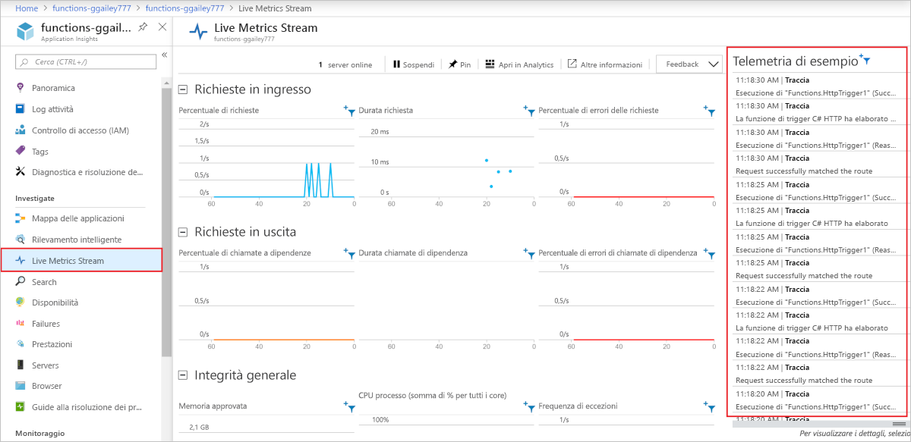

# <a name="monitor-azure-functions"></a>Monitorare Funzioni di Azure

[Funzioni di Azure](functions-overview.md) offre l'integrazione incorporata con [applicazione Azure Insights](../azure-monitor/app/app-insights-overview.md) per monitorare le funzioni. Questo articolo illustra come configurare funzioni di Azure per inviare i file di log generati dal sistema a Application Insights.

È consigliabile usare Application Insights perché raccoglie i dati di log, delle prestazioni e degli errori. Rileva automaticamente le anomalie delle prestazioni e include potenti strumenti di analisi che consentono di diagnosticare i problemi e di comprendere come vengono usate le funzioni. Il servizio è progettato per supportare il miglioramento continuo delle prestazioni e dell'usabilità. È anche possibile usare Application Insights durante lo sviluppo del progetto di app per le funzioni locali. Per ulteriori informazioni, vedere [che cos'è Application Insights?](../azure-monitor/app/app-insights-overview.md).

Poiché la strumentazione Application Insights necessaria è incorporata in funzioni di Azure, è sufficiente una chiave di strumentazione valida per connettere l'app per le funzioni a una risorsa Application Insights.

## <a name="application-insights-pricing-and-limits"></a>Prezzi e limiti di Application Insights

È possibile provare gratuitamente l'integrazione di Application Insights con le app per le funzioni. È previsto un limite giornaliero per la quantità di dati che possono essere elaborati gratuitamente. Questo limite può essere raggiunto durante i test. Quando il limite giornaliero è quasi raggiunto, Azure invia notifiche tramite il portale e messaggi di posta elettronica. Se si dimenticano tali avvisi e si raggiunge il limite, i nuovi log non verranno visualizzati nelle query Application Insights. Tenere presente il limite per evitare inutili tempi di risoluzione dei problemi. Per altre informazioni, vedere [Gestire volumi di dati e prezzi in Application Insights](../azure-monitor/app/pricing.md).

L'elenco completo delle funzionalità di Application Insights disponibili per l'app per le funzioni è descritto in [Application Insights per le funzionalità supportate di funzioni di Azure](../azure-monitor/app/azure-functions-supported-features.md).

## <a name="enable-application-insights-integration"></a>Abilitare l'integrazione di Application Insights

Affinché un'app per le funzioni invii dati ad Application Insights, è necessario conoscere la chiave di strumentazione di una risorsa di Application Insights. La chiave deve essere specificata in un'impostazione dell'app denominata **APPINSIGHTS_INSTRUMENTATIONKEY**.

### <a name="new-function-app-in-the-portal"></a>Nuova app per le funzioni nel portale

Quando si [crea l'app per le funzioni nella portale di Azure](functions-create-first-azure-function.md), Application Insights integrazione è abilitata per impostazione predefinita. La risorsa Application Insights ha lo stesso nome dell'app per le funzioni e viene creata nella stessa area o nell'area più vicina.

Per esaminare la risorsa Application Insights creata, selezionarla per espandere la finestra di **Application Insights** . È possibile modificare il **nome della nuova risorsa** o scegliere un **percorso** diverso in una [geografia di Azure](https://azure.microsoft.com/global-infrastructure/geographies/) in cui si vogliono archiviare i dati.


Quando si sceglie **Crea**, viene creata una risorsa Application Insights con l'app per le funzioni, che ha il `APPINSIGHTS_INSTRUMENTATIONKEY` impostato nelle impostazioni dell'applicazione. Tutto è pronto per iniziare.

<a id="manually-connect-an-app-insights-resource"></a>
### <a name="add-to-an-existing-function-app"></a>Aggiungi a un'app per le funzioni esistente 

Quando si crea un'app per le funzioni usando l'interfaccia della riga di comando di [Azure](functions-create-first-azure-function-azure-cli.md), [Visual Studio](functions-create-your-first-function-visual-studio.md)o [Visual Studio Code](functions-create-first-function-vs-code.md), è necessario creare la risorsa Application Insights. È quindi possibile aggiungere la chiave di strumentazione da tale risorsa come impostazione dell'applicazione nell'app per le funzioni.

[!INCLUDE [functions-connect-new-app-insights.md](../../includes/functions-connect-new-app-insights.md)]

Nelle prime versioni delle funzioni è stato utilizzato il monitoraggio incorporato, che non è più consigliato. Quando si Abilita l'integrazione Application Insights per un'app per le funzioni di questo tipo, è necessario disabilitare anche la [registrazione incorporata](#disable-built-in-logging).  

## <a name="view-telemetry-in-monitor-tab"></a>Visualizzare dati di telemetria nella scheda Monitoraggio

Con [Application Insights integrazione abilitata](#enable-application-insights-integration), è possibile visualizzare i dati di telemetria nella scheda **monitoraggio** .

1. Nella pagina app per le funzioni selezionare una funzione che è stata eseguita almeno una volta dopo la configurazione di Application Insights. Quindi selezionare la scheda **monitoraggio** .

   

1. Selezionare **Aggiorna** periodicamente, fino a quando non viene visualizzato l'elenco di chiamate di funzione.

   Possono essere necessari fino a cinque minuti per la visualizzazione dell'elenco mentre il client di telemetria raggruppa i dati per la trasmissione al server. Il ritardo non si applica al [Live Metrics Stream](../azure-monitor/app/live-stream.md). Tale servizio si connette all'host di Funzioni quando si carica la pagina, pertanto i log vengono trasmessi direttamente alla pagina.

   

1. Per visualizzare i log per una chiamata di funzione particolare, selezionare il collegamento alla colonna **Dati** per tale chiamata.

   

   L'output di registrazione per tale chiamata viene visualizzato in una nuova pagina.

   

È possibile osservare che in entrambe le pagine è presente un collegamento **Esegui in Application Insights** alla query di Application Insights Analytics che recupera i dati.


Viene visualizzata la query seguente. Si può notare che l'elenco chiamate è limitato agli ultimi 30 giorni. L'elenco non contiene più di 20 righe (`where timestamp > ago(30d) | take 20`). L'elenco dei dettagli della chiamata è per gli ultimi 30 giorni senza limite.


Per altre informazioni, vedere [Eseguire query sui dati di telemetria](#query-telemetry-data) più avanti in questo articolo.

## <a name="view-telemetry-in-application-insights"></a>Visualizzare i dati di telemetria in Application Insights

Per aprire Application Insights da un'app per le funzioni nella portale di Azure, passare alla pagina **Panoramica** dell'app per le funzioni. In **funzionalità configurate**selezionare **Application Insights**.


Per informazioni su come usare Application Insights, vedere la [documentazione su Application Insights](https://docs.microsoft.com/azure/application-insights/). Questa sezione mostra alcuni esempi su come visualizzare i dati in Application Insights. Se si ha già familiarità con Application Insights, è possibile passare direttamente alle [sezioni su come configurare e personalizzare i dati di telemetria](#configure-categories-and-log-levels).


Le aree di Application Insights seguenti possono essere utili quando si valutano il comportamento, le prestazioni e gli errori nelle funzioni:

| TAB | DESCRIZIONE |
| ---- | ----------- |
| **[Fallimenti](../azure-monitor/app/asp-net-exceptions.md)** |  Creare grafici e avvisi in base agli errori di funzione e alle eccezioni del server. Il **nome dell'operazione** corrisponde al nome della funzione. Gli errori nelle dipendenze non vengono visualizzati, a meno che non si implementino i dati di telemetria personalizzati |
| **[Prestazioni](../azure-monitor/app/performance-counters.md)** | Analizzare i problemi di prestazioni. |
| **Server** | Visualizzare l'utilizzo delle risorse e la velocità effettiva per server. Questi dati possono essere utili negli scenari di debug in cui le funzioni bloccano le risorse sottostanti. I server sono denominati **Istanze del ruolo del cloud**. |
| **[Metriche](../azure-monitor/app/metrics-explorer.md)** | Creare grafici e avvisi basati sulle metriche. Le metriche includono il numero di chiamate di funzione, il tempo di esecuzione e le percentuali di successo. |
| **[Flusso di metriche in tempo reale](../azure-monitor/app/live-stream.md)** | Visualizza i dati di metrica così come vengono creati in tempo reale. |

## <a name="query-telemetry-data"></a>Query sui dati di telemetria

[Application Insights Analytics](../azure-monitor/app/analytics.md) consente di accedere a tutti i dati di telemetria sotto forma di tabelle in un database. Analytics offre un linguaggio di query per l'estrazione, la manipolazione e la visualizzazione dei dati.


Questo è un esempio che mostra la distribuzione delle richieste per ruolo di lavoro negli ultimi 30 minuti.

```
requests
| where timestamp > ago(30m) 
| summarize count() by cloud_RoleInstance, bin(timestamp, 1m)
| render timechart
```

Le tabelle disponibili vengono visualizzate nella scheda **schema** a sinistra. Nelle tabelle seguenti è possibile trovare i dati generati dalle chiamate alla funzione:

| tabella | DESCRIZIONE |
| ----- | ----------- |
| **tracce** | Log creati dal runtime e dal codice della funzione. |
| **requests** | Una richiesta per ogni chiamata di funzione. |
| **exceptions** | Tutte le eccezioni generate dal runtime. |
| **customMetrics** | Numero di chiamate con esito positivo e negativo, frequenza di esito positivo e durata. |
| **customEvents** | Eventi rilevati dal runtime, ad esempio: richieste HTTP che attivano una funzione. |
| **performanceCounters** | Informazioni sulle prestazioni dei server in cui le funzioni sono in esecuzione. |

Le altre tabelle sono per i test di disponibilità e i dati di telemetria del client e del browser. È possibile implementare i dati di telemetria personalizzati per aggiungerne altri.

All'interno di ogni tabella alcuni dati specifici per Funzioni si trovano nel campo `customDimensions`.  Ad esempio, la query seguente recupera tutte le tracce con livello di registrazione `Error`.

```
traces 
| where customDimensions.LogLevel == "Error"
```

Il runtime fornisce i campi `customDimensions.LogLevel` e `customDimensions.Category`. È possibile specificare campi aggiuntivi nei log scritti nel codice della funzione. Vedere la sezione [Registrazione strutturata](#structured-logging) più avanti in questo articolo.

## <a name="configure-categories-and-log-levels"></a>Configurare le categorie e i livelli di registrazione

È possibile usare Application Insights senza alcuna configurazione personalizzata. La configurazione predefinita può produrre volumi elevati di dati. Se si usa una sottoscrizione di Azure di Visual Studio, si potrebbe raggiunge il limite d'uso dati per Application Insights. Più avanti in questo articolo si apprenderà come configurare e personalizzare i dati che le funzioni inviano a Application Insights. Per un'app per le funzioni, la registrazione è configurata nel file [host. JSON] .

### <a name="categories"></a>categorie

Il logger di Funzioni di Azure include un *categoria* per ogni log. La categoria indica quale parte del codice runtime o del codice funzione è stata scritta dal log. 

Il runtime di funzioni crea log con una categoria che inizia con "host". Nella versione 1. x i registri `function started`, `function executed`e `function completed` hanno la categoria `Host.Executor`. A partire dalla versione 2. x, questi log hanno la categoria `Function.<YOUR_FUNCTION_NAME>`.

Se si scrivono log nel codice della funzione, la categoria viene `Function` nella versione 1. x del runtime di funzioni. Nella versione 2. x, la categoria è `Function.<YOUR_FUNCTION_NAME>.User`.

### <a name="log-levels"></a>Livelli di registrazione

Il logger di funzioni di Azure include anche un *livello di registrazione* con ogni log. [LogLevel](/dotnet/api/microsoft.extensions.logging.loglevel) è un'enumerazione e il codice integer ne indica la relativa importanza:

|LogLevel    |Codice|
|------------|---|
|Trace       | 0 |
|Debug       | 1 |
|Informazioni | 2 |
|Avviso     | 3 |
|Tipi di errore       | 4 |
|Critico    | 5 |
|nessuno        | 6 |

Il livello di registrazione `None` è illustrato nella sezione successiva. 

### <a name="log-configuration-in-hostjson"></a>Configurazione del log in host. JSON

Il file [host. JSON] configura il numero di registrazioni che un'app per le funzioni invia ad Application Insights. Per ogni categoria, si indica il livello di registrazione minimo da inviare. Esistono due esempi: il primo esempio è destinato al [runtime di funzioni versione 2. x](functions-versions.md#version-2x) (.NET Core) e il secondo esempio è per il runtime della versione 1. x.

### <a name="version-2x"></a>Versione 2.x

Il runtime della versione 2.x usa la [gerarchia di filtro del log di .NET Core](https://docs.microsoft.com/aspnet/core/fundamentals/logging/?view=aspnetcore-2.1#log-filtering). 

```json
{
  "logging": {
    "fileLoggingMode": "always",
    "logLevel": {
      "default": "Information",
      "Host.Results": "Error",
      "Function": "Error",
      "Host.Aggregator": "Trace"
    }
  }
}
```

### <a name="version-1x"></a>Versione 1.x

```json
{
  "logger": {
    "categoryFilter": {
      "defaultLevel": "Information",
      "categoryLevels": {
        "Host.Results": "Error",
        "Function": "Error",
        "Host.Aggregator": "Trace"
      }
    }
  }
}
```

In questo esempio vengono impostate due regole:

* Per i log con categoria `Host.Results` o `Function`, inviare solo `Error` livello e superiore a Application Insights. I log di livello `Warning` e livelli inferiori vengono ignorati.
* Per i log con categoria `Host.Aggregator`, inviare tutti i log ad Application Insights. Il livello del log `Trace` corrisponde a quello che alcuni logger chiamano `Verbose`, ma usano `Trace` nel file [host. JSON].
* Per tutti gli altri log, inviare ad Application Insights solo i log di livello `Information` e superiori.

Il valore della categoria in [host. JSON] controlla la registrazione di tutte le categorie che iniziano con lo stesso valore. `Host` in [host. JSON] controlla la registrazione per `Host.General`, `Host.Executor`, `Host.Results`e così via.

Se [host. JSON] include più categorie che iniziano con la stessa stringa, viene rilevata prima la corrispondenza con quelle più lunghe. Si supponga di voler eseguire tutte le operazioni dal runtime, ad eccezione `Host.Aggregator` di registrare a livello di `Error`, ma si vuole che `Host.Aggregator` log a livello di `Information`:

### <a name="version-2x"></a>Versione 2.x 

```json
{
  "logging": {
    "fileLoggingMode": "always",
    "logLevel": {
      "default": "Information",
      "Host": "Error",
      "Function": "Error",
      "Host.Aggregator": "Information"
    }
  }
}
```

### <a name="version-1x"></a>Versione 1.x 

```json
{
  "logger": {
    "categoryFilter": {
      "defaultLevel": "Information",
      "categoryLevels": {
        "Host": "Error",
        "Function": "Error",
        "Host.Aggregator": "Information"
      }
    }
  }
}
```

Per eliminare tutti i log di una categoria, è possibile usare il livello di registrazione `None`. Nessun log viene scritto con tale categoria e non è presente alcun livello di log.

Le sezioni seguenti descrivono le categorie principali di log create dal runtime. 

### <a name="category-hostresults"></a>Categoria Host.Results

Questi log vengono visualizzati come "richieste" in Application Insights. Indicano l'esito positivo o negativo di una funzione.


Tutti questi log vengono scritti a `Information` livello. Se si filtra in `Warning` o versione successiva, non verrà visualizzato alcun dato.

### <a name="category-hostaggregator"></a>Categoria Host.Aggregator

Questi log indicano il numero e le medie di chiamate alla funzione in un periodo di tempo [configurabile](#configure-the-aggregator). Il periodo predefinito è 30 secondi o 1000 risultati, ovvero quello che viene prima. 

I log sono disponibili nella tabella **customMetrics** in Application Insights. Esempi sono il numero di esecuzioni, la frequenza di operazioni riuscite e la durata.


Tutti questi log vengono scritti a `Information` livello. Se si filtra in `Warning` o versione successiva, non verrà visualizzato alcun dato.

### <a name="other-categories"></a>Altre categorie

Tutti i log per le categorie diverse da quelle già elencate sono disponibili nella tabella **tracce** in Application Insights.


Tutti i log con categorie che iniziano con `Host` vengono scritti dal runtime di funzioni. I registri "funzione avviata" e "funzione completata" hanno `Host.Executor`di categoria. Per le esecuzioni riuscite, questi log sono `Information` livello. Le eccezioni vengono registrate a livello `Error`. Il runtime crea anche il livello di registrazione `Warning`, ad esempio: messaggi di coda inviati alla coda non elaborabile.

I log scritti dal codice della funzione hanno `Function` di categoria e possono essere di qualsiasi livello di log.

## <a name="configure-the-aggregator"></a>Configurare l'aggregatore

Come indicato nella sezione precedente, il runtime aggrega i dati sulle esecuzioni di funzioni in un periodo di tempo. Il periodo predefinito è 30 secondi o 1000 esecuzioni, ovvero quello che viene prima. È possibile configurare questa impostazione nel file [host. JSON].  Ecco un esempio:

```json
{
    "aggregator": {
      "batchSize": 1000,
      "flushTimeout": "00:00:30"
    }
}
```

## <a name="configure-sampling"></a>Configurare il campionamento

Application Insights dispone di una funzionalità di [campionamento](../azure-monitor/app/sampling.md) che può impedire la produzione di troppi dati di telemetria sulle esecuzioni completate in momenti di picco del carico. Quando la frequenza delle esecuzioni in ingresso supera una soglia specificata, Application Insights inizia a ignorare in modo casuale alcune delle esecuzioni in ingresso. L'impostazione predefinita per il numero massimo di esecuzioni al secondo è 20 (cinque nella versione 1. x). È possibile configurare il campionamento nel file [host. JSON].  Ecco un esempio:

### <a name="version-2x"></a>Versione 2.x 

```json
{
  "logging": {
    "applicationInsights": {
      "samplingSettings": {
        "isEnabled": true,
        "maxTelemetryItemsPerSecond" : 20
      }
    }
  }
}
```

### <a name="version-1x"></a>Versione 1.x 

```json
{
  "applicationInsights": {
    "sampling": {
      "isEnabled": true,
      "maxTelemetryItemsPerSecond" : 5
    }
  }
}
```

> [!NOTE]
> Il [campionamento](../azure-monitor/app/sampling.md) è abilitato per impostazione predefinita. Se risultano mancanti dati, potrebbe essere necessario modificare le impostazioni di campionamento per adattarlo a uno specifico scenario di monitoraggio.

## <a name="write-logs-in-c-functions"></a>Scrivere i log nelle funzioni C#

È possibile scrivere log nel codice funzione che vengono visualizzati come tracce in Application Insights.

### <a name="ilogger"></a>ILogger

Usare il parametro [ILogger](https://docs.microsoft.com/dotnet/api/microsoft.extensions.logging.ilogger) nelle funzioni anziché il parametro `TraceWriter`. I log creati usando `TraceWriter` passano a Application Insights, ma `ILogger` consente di eseguire la [registrazione strutturata](https://softwareengineering.stackexchange.com/questions/312197/benefits-of-structured-logging-vs-basic-logging).

Con un oggetto `ILogger` è possibile chiamare i `Log<level>` [metodi di estensione su ILogger ](https://docs.microsoft.com/dotnet/api/microsoft.extensions.logging.loggerextensions#methods) per creare i log. Il codice seguente scrive `Information` log con la categoria "Function".

```cs
public static async Task<HttpResponseMessage> Run(HttpRequestMessage req, ILogger logger)
{
    logger.LogInformation("Request for item with key={itemKey}.", id);
```

### <a name="structured-logging"></a>Registrazione strutturata

I parametri usati nel messaggio del log sono determinati dall'ordine dei segnaposto, non dai nomi. Si supponga di avere il codice seguente:

```csharp
string partitionKey = "partitionKey";
string rowKey = "rowKey";
logger.LogInformation("partitionKey={partitionKey}, rowKey={rowKey}", partitionKey, rowKey);
```

Se si mantenere la stessa stringa del messaggio e si inverte l'ordine dei parametri, il testo del messaggio risultante mostrerebbe i valori in maniera errata.

I segnaposto vengono gestiti in modo da poter eseguire la registrazione strutturata. Application Insights archivia le coppie nome/valore del parametro e la stringa del messaggio. Il risultato è che gli argomenti del messaggio diventano campi su cui è possibile eseguire delle query.

Se la chiamata al metodo del logger ha un aspetto simile all'esempio precedente, è possibile eseguire una query sul campo `customDimensions.prop__rowKey`. Il prefisso `prop__` viene aggiunto per assicurarsi che non ci siano conflitti tra i campi aggiunti dal runtime e i campi aggiunti dal codice della funzione.

È anche possibile eseguire query sulla stringa del messaggio originale facendo riferimento al campo `customDimensions.prop__{OriginalFormat}`.  

Ecco una rappresentazione JSON di esempio dei dati `customDimensions`:

```json
{
  customDimensions: {
    "prop__{OriginalFormat}":"C# Queue trigger function processed: {message}",
    "Category":"Function",
    "LogLevel":"Information",
    "prop__message":"c9519cbf-b1e6-4b9b-bf24-cb7d10b1bb89"
  }
}
```

### <a name="custom-metrics-logging"></a>Registrazione delle metriche personalizzate

Nelle funzioni di script C# è possibile usare il metodo di estensione `LogMetric` su `ILogger` per creare metriche personalizzate in Application Insights. Ecco un esempio di chiamata al metodo:

```csharp
logger.LogMetric("TestMetric", 1234);
```

Questo codice è un'alternativa alla chiamata di `TrackMetric` tramite l'API Application Insights per .NET.

## <a name="write-logs-in-javascript-functions"></a>Scrivere i log in funzioni JavaScript

Nelle funzioni di Node.js usare `context.log` per scrivere i log. La registrazione strutturata non è abilitata.

```
context.log('JavaScript HTTP trigger function processed a request.' + context.invocationId);
```

### <a name="custom-metrics-logging"></a>Registrazione delle metriche personalizzate

Quando si esegue la [versione 1. x](functions-versions.md#creating-1x-apps) del runtime di funzioni, le funzioni node. js possono usare il metodo `context.log.metric` per creare metriche personalizzate in Application Insights. Questo metodo non è attualmente supportato nella versione 2. x. Ecco un esempio di chiamata al metodo:

```javascript
context.log.metric("TestMetric", 1234);
```

Questo codice è un'alternativa alla chiamata di `trackMetric` usando node. js SDK per Application Insights.

## <a name="log-custom-telemetry-in-c-functions"></a>Registrare i dati di telemetria personalizzati nelle C# funzioni

È possibile usare il pacchetto NuGet [Microsoft.ApplicationInsights](https://www.nuget.org/packages/Microsoft.ApplicationInsights/) per inviare i dati di telemetria personalizzati ad Application Insights. L'esempio C# seguente usa l'[API di telemetria personalizzata](../azure-monitor/app/api-custom-events-metrics.md). L'esempio fa riferimento a una libreria di classi .NET, ma il codice di Application Insights è lo stesso per lo script C#.

### <a name="version-2x"></a>Versione 2.x

La versione 2.x del runtime usa le funzionalità più recenti in Application Insights per correlare automaticamente i dati di telemetria con l'operazione corrente. Non è necessario impostare manualmente i campi `Id`, `ParentId`o `Name` dell'operazione.

```cs
using System;
using System.Linq;
using System.Threading.Tasks;
using Microsoft.ApplicationInsights;
using Microsoft.ApplicationInsights.DataContracts;
using Microsoft.AspNetCore.Http;
using Microsoft.AspNetCore.Mvc;
using Microsoft.Azure.WebJobs;
using Microsoft.Azure.WebJobs.Extensions.Http;
using Microsoft.Extensions.Logging;

namespace functionapp0915
{
    public class HttpTrigger2
    {
        private readonly TelemetryClient telemetryClient;

        /// Using dependency injection will guarantee that you use the same configuration for telemetry collected automatically and manually.
        public HttpTrigger2(TelemetryConfiguration telemetryConfiguration)
        {
            this.telemetryClient = new TelemetryClient(telemetryConfiguration);
        }

        [FunctionName("HttpTrigger2")]
        public Task<IActionResult> Run(
            [HttpTrigger(AuthorizationLevel.Anonymous, "get", Route = null)]
            HttpRequest req, ExecutionContext context, ILogger log)
        {
            log.LogInformation("C# HTTP trigger function processed a request.");
            DateTime start = DateTime.UtcNow;

            // Parse query parameter
            string name = req.Query
                .FirstOrDefault(q => string.Compare(q.Key, "name", true) == 0)
                .Value;

            // Track an Event
            var evt = new EventTelemetry("Function called");
            evt.Context.User.Id = name;
            this.telemetryClient.TrackEvent(evt);

            // Track a Metric
            var metric = new MetricTelemetry("Test Metric", DateTime.Now.Millisecond);
            metric.Context.User.Id = name;
            this.telemetryClient.TrackMetric(metric);

            // Track a Dependency
            var dependency = new DependencyTelemetry
            {
                Name = "GET api/planets/1/",
                Target = "swapi.co",
                Data = "https://swapi.co/api/planets/1/",
                Timestamp = start,
                Duration = DateTime.UtcNow - start,
                Success = true
            };
            dependency.Context.User.Id = name;
            this.telemetryClient.TrackDependency(dependency);

            return Task.FromResult<IActionResult>(new OkResult());
        }
    }
}
```

### <a name="version-1x"></a>Versione 1.x

```cs
using System;
using System.Net;
using Microsoft.ApplicationInsights;
using Microsoft.ApplicationInsights.DataContracts;
using Microsoft.ApplicationInsights.Extensibility;
using Microsoft.Azure.WebJobs;
using System.Net.Http;
using System.Threading.Tasks;
using Microsoft.Azure.WebJobs.Extensions.Http;
using Microsoft.Extensions.Logging;
using System.Linq;

namespace functionapp0915
{
    public static class HttpTrigger2
    {
        private static string key = TelemetryConfiguration.Active.InstrumentationKey = 
            System.Environment.GetEnvironmentVariable(
                "APPINSIGHTS_INSTRUMENTATIONKEY", EnvironmentVariableTarget.Process);

        private static TelemetryClient telemetryClient = 
            new TelemetryClient() { InstrumentationKey = key };

        [FunctionName("HttpTrigger2")]
        public static async Task<HttpResponseMessage> Run(
            [HttpTrigger(AuthorizationLevel.Anonymous, "get", "post", Route = null)]
            HttpRequestMessage req, ExecutionContext context, ILogger log)
        {
            log.LogInformation("C# HTTP trigger function processed a request.");
            DateTime start = DateTime.UtcNow;

            // Parse query parameter
            string name = req.GetQueryNameValuePairs()
                .FirstOrDefault(q => string.Compare(q.Key, "name", true) == 0)
                .Value;

            // Get request body
            dynamic data = await req.Content.ReadAsAsync<object>();

            // Set name to query string or body data
            name = name ?? data?.name;
         
            // Track an Event
            var evt = new EventTelemetry("Function called");
            UpdateTelemetryContext(evt.Context, context, name);
            telemetryClient.TrackEvent(evt);
            
            // Track a Metric
            var metric = new MetricTelemetry("Test Metric", DateTime.Now.Millisecond);
            UpdateTelemetryContext(metric.Context, context, name);
            telemetryClient.TrackMetric(metric);
            
            // Track a Dependency
            var dependency = new DependencyTelemetry
                {
                    Name = "GET api/planets/1/",
                    Target = "swapi.co",
                    Data = "https://swapi.co/api/planets/1/",
                    Timestamp = start,
                    Duration = DateTime.UtcNow - start,
                    Success = true
                };
            UpdateTelemetryContext(dependency.Context, context, name);
            telemetryClient.TrackDependency(dependency);
        }
        
        // Correlate all telemetry with the current Function invocation
        private static void UpdateTelemetryContext(TelemetryContext context, ExecutionContext functionContext, string userName)
        {
            context.Operation.Id = functionContext.InvocationId.ToString();
            context.Operation.ParentId = functionContext.InvocationId.ToString();
            context.Operation.Name = functionContext.FunctionName;
            context.User.Id = userName;
        }
    }    
}
```

Non chiamare `TrackRequest` o `StartOperation<RequestTelemetry>` perché verranno visualizzate richieste duplicate per una chiamata di funzione.  Il runtime di Funzioni rileva automaticamente le richieste.

Non impostare `telemetryClient.Context.Operation.Id`. Questa impostazione globale causa una correlazione errata quando molte funzioni sono in esecuzione simultaneamente. Creare invece una nuova istanza di telemetria (`DependencyTelemetry`, `EventTelemetry`) e modificare la relativa proprietà `Context`. Passare quindi l'istanza di telemetria al metodo `Track` corrispondente `TelemetryClient` in (`TrackDependency()`, `TrackEvent()`). Questo metodo assicura che i dati di telemetria abbiano i dettagli di correlazione corretti per la chiamata di funzione corrente.

## <a name="log-custom-telemetry-in-javascript-functions"></a>Registrare i dati di telemetria personalizzati nelle funzioni JavaScript

Ecco un frammento di codice di esempio che invia dati di telemetria personalizzati con il [Application Insights node. js SDK](https://github.com/microsoft/applicationinsights-node.js):

```javascript
const appInsights = require("applicationinsights");
appInsights.setup();
const client = appInsights.defaultClient;

module.exports = function (context, req) {
    context.log('JavaScript HTTP trigger function processed a request.');

    client.trackEvent({name: "my custom event", tagOverrides:{"ai.operation.id": context.invocationId}, properties: {customProperty2: "custom property value"}});
    client.trackException({exception: new Error("handled exceptions can be logged with this method"), tagOverrides:{"ai.operation.id": context.invocationId}});
    client.trackMetric({name: "custom metric", value: 3, tagOverrides:{"ai.operation.id": context.invocationId}});
    client.trackTrace({message: "trace message", tagOverrides:{"ai.operation.id": context.invocationId}});
    client.trackDependency({target:"http://dbname", name:"select customers proc", data:"SELECT * FROM Customers", duration:231, resultCode:0, success: true, dependencyTypeName: "ZSQL", tagOverrides:{"ai.operation.id": context.invocationId}});
    client.trackRequest({name:"GET /customers", url:"http://myserver/customers", duration:309, resultCode:200, success:true, tagOverrides:{"ai.operation.id": context.invocationId}});

    context.done();
};
```

Il parametro `tagOverrides` imposta l'`operation_Id` sull'ID di chiamata della funzione. Questa impostazione consente di correlare tutti i dati di telemetria personalizzati e generati automaticamente per una chiamata di funzione specifica.

## <a name="dependencies"></a>Dependencies

Funzioni V2 raccoglie automaticamente le dipendenze per le richieste HTTP, ServiceBus e SQL.

È possibile scrivere codice personalizzato per visualizzare le dipendenze. Per esempi, vedere il codice di esempio nella [ C# sezione telemetria personalizzata](#log-custom-telemetry-in-c-functions). Il codice di esempio produce una *mappa delle applicazioni* in Application Insights simile all'immagine seguente:


## <a name="report-issues"></a>Segnalare i problemi

Per segnalare un problema con l'integrazione di Application Insights in Funzioni o per inviare un suggerimento o una richiesta, [creare un problema in GitHub](https://github.com/Azure/Azure-Functions/issues/new).

## <a name="streaming-logs"></a>Log in streaming

Durante lo sviluppo di un'applicazione, è spesso necessario vedere cosa viene scritto nei log quasi in tempo reale durante l'esecuzione in Azure.

Esistono due modi per visualizzare un flusso di file di log generati dalle esecuzioni di funzioni.

* **Streaming di log predefinito**: la piattaforma del servizio app consente di visualizzare un flusso dei file di log dell'applicazione. Questa operazione equivale all'output visualizzato quando si esegue il debug delle funzioni durante [lo sviluppo locale](functions-develop-local.md) e quando si usa la scheda **test** nel portale. Vengono visualizzate tutte le informazioni basate su log. Per altre informazioni, vedere [flussi di log](../app-service/troubleshoot-diagnostic-logs.md#stream-logs). Questo metodo di streaming supporta solo una singola istanza e non può essere usato con un'app in esecuzione su Linux in un piano a consumo.

* **Live Metrics Stream**: quando l'app per le funzioni è [connessa a Application Insights](#enable-application-insights-integration), è possibile visualizzare i dati di log e altre metriche quasi in tempo reale nel portale di Azure usando [Live Metrics Stream](../azure-monitor/app/live-stream.md). Usare questo metodo quando si monitorano le funzioni in esecuzione in più istanze o in Linux in un piano a consumo. Questo metodo usa [i dati campionati](#configure-sampling).

I flussi di log possono essere visualizzati sia nel portale che nella maggior parte degli ambienti di sviluppo locali. 

### <a name="portal"></a>di Microsoft Azure

È possibile visualizzare entrambi i tipi di flussi di log nel portale.

#### <a name="built-in-log-streaming"></a>Streaming di log predefinito

Per visualizzare i log in streaming nel portale, selezionare la scheda **funzionalità della piattaforma** nell'app per le funzioni. Quindi, in **monitoraggio**scegliere **flusso di log**.


In questo modo l'app viene connessa al servizio di streaming di log e i log dell'applicazione vengono visualizzati nella finestra. È possibile passare tra i **registri applicazioni** e i **log del server Web**.  


#### <a name="live-metrics-stream"></a>Flusso di metriche live

Per visualizzare i Live Metrics Stream per l'app, selezionare la scheda **Panoramica** dell'app per le funzioni. Quando è abilitata la Application Insights, viene visualizzato un collegamento **Application Insights** in **funzionalità configurate**. Questo collegamento consente di portarsi alla pagina Application Insights per l'app.

In Application Insights selezionare **Live Metrics Stream**. Le [voci di log campionate](#configure-sampling) vengono visualizzate sotto la **telemetria di esempio**.

 

### <a name="visual-studio-code"></a>Visual Studio Code

[!INCLUDE [functions-enable-log-stream-vs-code](../../includes/functions-enable-log-stream-vs-code.md)]

### <a name="core-tools"></a>Strumenti di base

[!INCLUDE [functions-streaming-logs-core-tools](../../includes/functions-streaming-logs-core-tools.md)]

### <a name="azure-cli"></a>Interfaccia della riga di comando di Azure

È possibile abilitare i log in streaming usando l'interfaccia della riga di comando di [Azure](/cli/azure/install-azure-cli). Usare i comandi seguenti per accedere, scegliere la sottoscrizione e trasmettere in streaming i file di log:

```azurecli
az login
az account list
az account set --subscription <subscriptionNameOrId>
az webapp log tail --resource-group <RESOURCE_GROUP_NAME> --name <FUNCTION_APP_NAME>
```

### <a name="azure-powershell"></a>Azure PowerShell

È possibile abilitare i log di streaming usando [Azure PowerShell](/powershell/azure/overview). Per PowerShell, usare i comandi seguenti per aggiungere l'account di Azure, scegliere la sottoscrizione e trasmettere in streaming i file di log:

```powershell
Add-AzAccount
Get-AzSubscription
Get-AzSubscription -SubscriptionName "<subscription name>" | Select-AzSubscription
Get-AzWebSiteLog -Name <FUNCTION_APP_NAME> -Tail
```

## <a name="disable-built-in-logging"></a>Disabilitare la registrazione predefinita

Quando si Abilita Application Insights, disabilitare la registrazione predefinita che usa archiviazione di Azure. La registrazione incorporata è utile per i test con carichi di lavoro leggeri, ma non è destinata all'uso di produzione a elevato carico. Per il monitoraggio della produzione, è consigliabile Application Insights. Se la registrazione predefinita viene usata nell'ambiente di produzione, il record di registrazione potrebbe essere incompleto a causa della limitazione delle richieste in archiviazione di Azure.

Per disabilitare la registrazione predefinita, eliminare l'impostazione app `AzureWebJobsDashboard`. Per informazioni su come eliminare le impostazioni app nel portale di Azure, vedere la sezione relativa alle **impostazioni dell'applicazione** in [Come gestire un'app per le funzioni nel portale di Azure](functions-how-to-use-azure-function-app-settings.md#settings). Prima di eliminare l'impostazione dell'app, assicurarsi che nessuna funzione esistente nella stessa app per le funzioni usi l'impostazione per i trigger o le associazioni di archiviazione di Azure.

## <a name="next-steps"></a>Passaggi successivi

Per altre informazioni, vedere le seguenti risorse:

* [Application Insights](/azure/application-insights/)
* [Registrazione di ASP.NET Core](/aspnet/core/fundamentals/logging/)

[host. JSON]: functions-host-json.md
