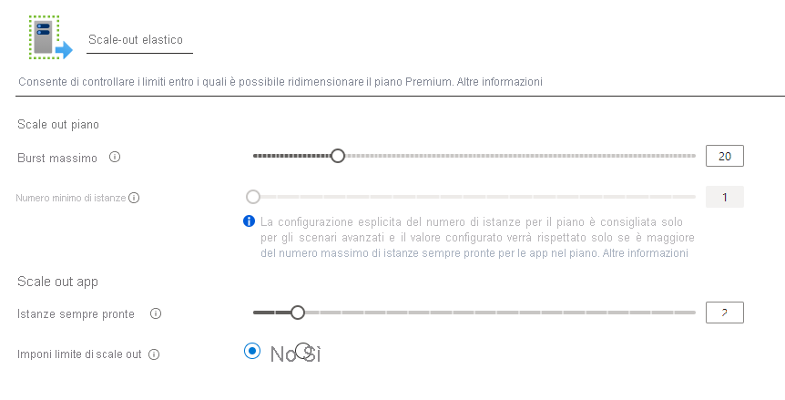

# <a name="azure-functions-premium-plan"></a>Piano Premium di Funzioni di Azure

Il piano Premium di funzioni di Azure è un'opzione di hosting per le app per le funzioni. Il piano Premium offre funzionalità come la connettività VNet, l'avvio a freddo e l'hardware Premium.  È possibile distribuire più app per le funzioni nello stesso piano Premium e il piano consente di configurare le dimensioni dell'istanza di calcolo, le dimensioni del piano di base e la dimensione massima del piano.  Per un confronto tra il piano Premium e altri tipi di piano e hosting, vedere [Opzioni di scalabilità e hosting delle funzioni](functions-scale.md).

## <a name="create-a-premium-plan"></a>Creare un piano Premium

[!INCLUDE [functions-premium-create](../../includes/functions-premium-create.md)]

È anche possibile creare un piano Premium usando il comando [AZ functionapp Plan create](/cli/azure/functionapp/plan#az-functionapp-plan-create) nell'interfaccia della riga di comando di Azure. L'esempio seguente crea un piano di livello _Premium a 1 elastico_ :

```azurecli-interactive
az functionapp plan create --resource-group <RESOURCE_GROUP> --name <PLAN_NAME> \
--location <REGION> --sku EP1
```

In questo esempio, sostituire `<RESOURCE_GROUP>` con il gruppo di risorse e `<PLAN_NAME>` con un nome per il piano univoco nel gruppo di risorse. Specificare una [`<REGION>`supportata ](#regions). Per creare un piano Premium che supporta Linux, includere l'opzione `--is-linux`.

Dopo aver creato il piano, è possibile usare il comando [AZ functionapp create](/cli/azure/functionapp#az-functionapp-create) per creare l'app per le funzioni. Nel portale vengono creati contemporaneamente il piano e l'app. 

## <a name="features"></a>Funzionalità

Per le app per le funzioni distribuite in un piano Premium sono disponibili le funzionalità seguenti.

### <a name="pre-warmed-instances"></a>Istanze pre-riscaldate

Se attualmente non si verificano eventi ed esecuzioni nel piano a consumo, l'app può essere ridotta a zero istanze. Quando vengono rilasciati nuovi eventi, è necessario specializzare una nuova istanza con l'app in esecuzione su di essa.  La specializzazione di nuove istanze può richiedere del tempo a seconda dell'app.  Questa latenza aggiuntiva alla prima chiamata viene spesso chiamata avvio a freddo dell'app.

Nel piano Premium è possibile fare in modo che l'app sia già riscaldata su un numero specificato di istanze, fino alla dimensione minima del piano.  Le istanze pre-surriscaldate consentono inoltre di pre-ridimensionare un'app prima di un carico elevato. Quando l'app viene scalata in orizzontale, viene prima di tutto ridimensionata nelle istanze pre-riscaldate. Altre istanze continuano a eseguire il buffering e a caldo immediatamente in preparazione per l'operazione di ridimensionamento successiva. Grazie alla presenza di un buffer di istanze già riscaldate, è possibile evitare latenze di avvio a freddo.  Le istanze pre-riscaldate sono una funzionalità del piano Premium ed è necessario che almeno un'istanza sia in esecuzione e disponibile in qualsiasi momento il piano sia attivo.

È possibile configurare il numero di istanze pre-riscaldate nel portale di Azure selezionando il **app per le funzioni**, passando alla scheda **funzionalità della piattaforma** e selezionando le opzioni di **scale out** . Nella finestra di modifica dell'app per le funzioni, le istanze pre-riscaldate sono specifiche dell'app, ma le istanze minime e massime si applicano all'intero piano.



È anche possibile configurare istanze pre-surriscaldate per un'app con l'interfaccia della riga di comando di Azure

```azurecli-interactive
az resource update -g <resource_group> -n <function_app_name>/config/web --set properties.preWarmedInstanceCount=<desired_prewarmed_count> --resource-type Microsoft.Web/sites
```

### <a name="private-network-connectivity"></a>Connettività di rete privata

Funzioni di Azure distribuite in un piano Premium sfrutta la [nuova integrazione VNet per le app Web](../app-service/web-sites-integrate-with-vnet.md).  Quando viene configurata, l'app può comunicare con le risorse all'interno della VNet o essere protetta tramite endpoint di servizio.  Le restrizioni IP sono disponibili anche nell'app per limitare il traffico in ingresso.

Quando si assegna una subnet all'app per le funzioni in un piano Premium, è necessaria una subnet con un numero sufficiente di indirizzi IP per ogni potenziale istanza. È necessario un blocco IP con almeno 100 indirizzi disponibili.

Per altre informazioni, vedere [integrare l'app per le funzioni con un VNet](functions-create-vnet.md).

### <a name="rapid-elastic-scale"></a>Scalabilità elastica rapida

Altre istanze di calcolo vengono aggiunte automaticamente per l'app usando la stessa logica di scalabilità rapida del piano a consumo.  Per altre informazioni sul funzionamento della scalabilità, vedere [scalabilità e hosting di funzioni](./functions-scale.md#how-the-consumption-and-premium-plans-work).

### <a name="unbounded-run-duration"></a>Durata dell'esecuzione non associata

Per una singola esecuzione, le funzioni di Azure in un piano a consumo sono limitate a 10 minuti.  Nel piano Premium, per la durata dell'esecuzione viene impostato un valore predefinito di 30 minuti per impedire l'esecuzione di Runaway. Tuttavia, è possibile [modificare la configurazione host. JSON](./functions-host-json.md#functiontimeout) per rendere questa operazione non vincolata per le app del piano Premium.

## <a name="plan-and-sku-settings"></a>Impostazioni del piano e dello SKU

Quando si crea il piano, si configurano due impostazioni: il numero minimo di istanze (o le dimensioni del piano) e il limite massimo di picchi.  Le istanze minime sono riservate e sempre in esecuzione.

> [!IMPORTANT]
> Viene addebitato il costo di ogni istanza allocata nel numero minimo di istanze indipendentemente dall'esecuzione delle funzioni.

Se l'app richiede istanze oltre le dimensioni del piano, può continuare a eseguire la scalabilità orizzontale finché il numero di istanze raggiunge il limite massimo di picchi.  Vengono addebitati i costi per le istanze oltre le dimensioni del piano solo quando sono in esecuzione e affittate all'utente.  Verrà effettuato il massimo sforzo per la scalabilità dell'app al limite massimo definito, mentre le istanze del piano minimo sono garantite per l'app.

È possibile configurare le dimensioni del piano e i valori massimi nell'portale di Azure selezionando le opzioni **scale out** nel piano o in un'app per le funzioni distribuita in tale piano (in **funzionalità della piattaforma**).

È anche possibile aumentare il limite massimo di picchi dall'interfaccia della riga di comando di Azure:

```azurecli-interactive
az resource update -g <resource_group> -n <premium_plan_name> --set properties.maximumElasticWorkerCount=<desired_max_burst> --resource-type Microsoft.Web/serverfarms 
```

### <a name="available-instance-skus"></a>SKU di istanze disponibili

Quando si crea o si ridimensiona il piano, è possibile scegliere tra tre dimensioni delle istanze.  Ti verrà addebitato il numero totale di core e memoria utilizzati al secondo.  L'app può essere ridimensionata automaticamente a più istanze in base alle esigenze.  

|SKU|Core|Memoria|Archiviazione|
|--|--|--|--|
|EP1|1|3,5 GB|250 GB|
|EP2|2|7 GB|250 GB|
|EP3|4|14 GB|250 GB|

## <a name="regions"></a>Regioni

Di seguito sono elencate le aree attualmente supportate per ogni sistema operativo.

|Region| Windows | Linux |
|--| -- | -- |
|Australia centrale| ✔<sup>1</sup> | |
|Australia centrale 2| ✔<sup>1</sup> | |
|Australia orientale| ✔ | |
|Australia sudorientale | ✔ | ✔ |
|Brasile meridionale| ✔<sup>2</sup> |  |
|Canada centrale| ✔ |  |
|Stati Uniti centrali| ✔ |  |
|Asia orientale| ✔ |  |
|Stati Uniti orientali | ✔ | ✔ |
|Stati Uniti orientali 2| ✔ |  |
|Francia centrale| ✔ |  |
|Giappone orientale| ✔ | ✔ |
|Giappone occidentale| ✔ | |
|Corea del Sud centrale| ✔ |  |
|Stati Uniti centro-settentrionali| ✔ |  |
|Europa settentrionale| ✔ | ✔ |
|Stati Uniti centro-meridionali| ✔ |  |
|India meridionale | ✔ | |
|Asia sudorientale| ✔ | ✔ |
|Regno Unito meridionale| ✔ | |
|Regno Unito occidentale| ✔ |  |
|Europa occidentale| ✔ | ✔ |
|India occidentale| ✔ |  |
|Stati Uniti occidentali| ✔ | ✔ |
|Stati Uniti occidentali 2| ✔ |  |

<sup>1</sup> Scalabilità orizzontale massima limitata a 20 istanze.  
<sup>2</sup> Scalabilità orizzontale massima limitata a 60 istanze.


## <a name="next-steps"></a>Passaggi successivi

> [!div class="nextstepaction"]
> [Informazioni sulle opzioni di scalabilità e hosting di funzioni di Azure](functions-scale.md)
