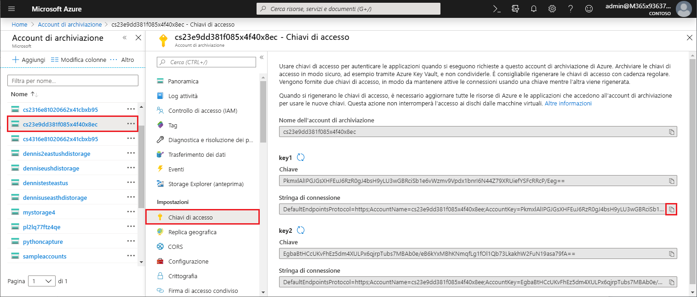
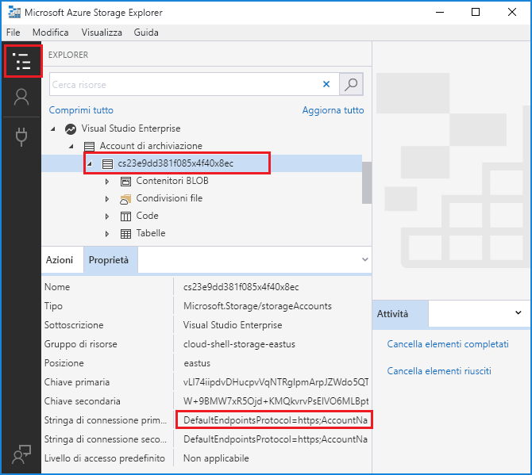

# <a name="work-with-azure-functions-core-tools"></a>Usare Strumenti di base di Funzioni di Azure

Strumenti di base di Funzioni di Azure consente di sviluppare e testare le funzioni nel computer locale dal prompt dei comandi o terminale. Le funzioni locali possono connettersi ai servizi di Azure attivi ed è possibile eseguire il debug delle funzioni nel computer locale usando il runtime completo di Funzioni di Azure. È anche possibile distribuire un'app per le funzioni all'abbonamento di Azure.

[!INCLUDE [Don't mix development environments](../../includes/functions-mixed-dev-environments.md)]

Lo sviluppo di funzioni nel computer locale e la relativa pubblicazione in Azure usando strumenti di base segue questi passaggi di base:

> [!div class="checklist"]
> * [Installare gli strumenti di base e le dipendenze.](#v2)
> * [Creare un progetto di app di funzione da un modello specifico del linguaggio.](#create-a-local-functions-project)
> * [Registrare le estensioni di binding e trigger.](#register-extensions)
> * [Definire l'archiviazione e altre connessioni.](#local-settings-file)
> * [Creare una funzione da un trigger e un modello specifico del linguaggio.](#create-func)
> * [Eseguire la funzione in locale](#start)
> * [Pubblicare il progetto in Azure](#publish)

## <a name="core-tools-versions"></a>Le versioni degli strumenti di base

Sono disponibili due versioni degli strumenti di base di Funzioni di Azure. La versione in uso dipende dall'ambiente di sviluppo locale, [dalla scelta della lingua](supported-languages.md) e dal livello di supporto richiesto:

+ Versione 1.x: supporta la versione 1.x del runtime. Questa versione degli strumenti è supportata solo nei computer Windows e viene installata da un [pacchetto npm](https://docs.npmjs.com/getting-started/what-is-npm). Con questa versione, è possibile creare funzioni nei linguaggi sperimentali che non sono ufficialmente supportati. Per altre informazioni, vedere [Linguaggi supportati nelle Funzioni di Azure](supported-languages.md)

+ [Versione 2.x](#v2): supporta la [versione 2.x del runtime](functions-versions.md). Questa versione supporta [Windows](#windows-npm), [macOS](#brew) e [Linux](#linux). Usa gestori di pacchetti specifici della piattaforma o npm per l'installazione.

Se non specificato diversamente, gli esempi in questo articolo si riferiscono alla versione 2.x.

## <a name="install-the-azure-functions-core-tools"></a>Installare gli strumenti di base per Funzioni di Azure

[Strumenti di base di Funzioni di Azure] comprende una versione dello stesso runtime che alimenta Funzioni di Azure che è possibile eseguire nel computer di sviluppo locale. Fornisce anche i comandi per creare le funzioni, connettersi ad Azure e distribuire i progetti della funzione.

### <a name="v2"></a>Versione 2.x

La versione 2.x degli strumenti usa il runtime di Funzioni di Azure 2.x basata su .NET Core. Questa versione è supportata su tutte le piattaforme supportate da .NET Core 2.x, incluse [Windows](#windows-npm), [macOS](#brew) e [Linux](#linux). 

> [!IMPORTANT]
> È possibile ignorare il requisito dell'installazione di .NET Core 2.x SDK usando [bundle estensione].

#### <a name="windows-npm"></a>Windows

I passaggi seguenti usano npm per installare gli strumenti di base in Windows. È anche possibile usare [Chocolatey](https://chocolatey.org/). Per altre informazioni, vedere il [file leggimi degli strumenti di base](https://github.com/Azure/azure-functions-core-tools/blob/master/README.md#windows).

1. Installare [Node.js], che include npm. Per la versione 2.x degli strumenti, sono supportate solo le versioni Node.js 8.5 e successive.

1. Installare il pacchetto degli strumenti di base:

    ```bash
    npm install -g azure-functions-core-tools
    ```

   Potrebbero occorrere alcuni minuti per Monitoraggio prestazioni rete scaricare e installare il pacchetto di strumenti di base.

1. Se non si prevede di utilizzare [bundle estensione], installare il [.NET Core 2.x SDK per Windows](https://www.microsoft.com/net/download/windows).

#### <a name="brew"></a>MacOS con Homebrew

I passaggi seguenti usano Homebrew per installare gli strumenti di base su macOS.

1. Installare [Homebrew](https://brew.sh/), se non è già installato.

1. Installare il pacchetto degli strumenti di base:

    ```bash
    brew tap azure/functions
    brew install azure-functions-core-tools
    ```

1. Se non si prevede di utilizzare [bundle estensione], installare [.NET Core 2.x SDK per macOS](https://www.microsoft.com/net/download/macos).


#### <a name="linux"></a> Linux (Ubuntu/Debian) con APT

La procedura seguente usa [APT](https://wiki.debian.org/Apt) per installare gli strumenti di base nella distribuzione Ubuntu/Debian Linux. Per altre distribuzioni Linux, vedere il [file leggimi degli strumenti di base](https://github.com/Azure/azure-functions-core-tools/blob/master/README.md#linux).

1. Registrare il codice Product Key di Microsoft come attendibile:

    ```bash
    curl https://packages.microsoft.com/keys/microsoft.asc | gpg --dearmor > microsoft.gpg
    sudo mv microsoft.gpg /etc/apt/trusted.gpg.d/microsoft.gpg
    ```

1. Verificare che il server Ubuntu esegua uno delle versioni appropriate nella tabella seguente. Per aggiungere l'origine apt, eseguire:

    ```bash
    sudo sh -c 'echo "deb [arch=amd64] https://packages.microsoft.com/repos/microsoft-ubuntu-$(lsb_release -cs)-prod $(lsb_release -cs) main" > /etc/apt/sources.list.d/dotnetdev.list'
    sudo apt-get update
    ```

    | Distribuzione Linux | Version |
    | --------------- | ----------- |
    | Ubuntu 18.10    | `cosmic`    |
    | Ubuntu 18.04    | `bionic`    |
    | Ubuntu 17.04    | `zesty`     |
    | Ubuntu 16.04/Linux Mint 18    | `xenial`  |

1. Installare il pacchetto degli strumenti di base:

    ```bash
    sudo apt-get install azure-functions-core-tools
    ```

1. Se non si prevede di utilizzare [bundle estensione], installare [.NET Core 2.x SDK per Linux](https://www.microsoft.com/net/download/linux).

## <a name="create-a-local-functions-project"></a>Creare un progetto Funzioni locale

Una directory del progetto Funzioni contiene i file [host.json](functions-host-json.md) e [local.settings.json](#local-settings-file) nonché le sottocartelle che includono il codice per le singole funzioni. Questa directory è l'equivalente di un'app per le funzioni in Azure. Per altre informazioni sulla struttura delle cartelle di Funzioni, vedere la [Guida per sviluppatori di Funzioni di Azure](functions-reference.md#folder-structure).

La versione 2.x richiede la selezione di una lingua predefinita per il progetto quando esso viene inizializzato e tutte le funzioni aggiunte usano modelli di lingua predefiniti. Nella versione 1.x, specificare la lingua ogni volta che si crea una funzione.

Nella finestra del terminale o da un prompt dei comandi, eseguire il comando seguente per creare il progetto e l’archivio Git locale:

```bash
func init MyFunctionProj
```

Quando si fornisce un nome di progetto, viene creata e inizializzata una nuova cartella con lo stesso nome. In caso contrario, viene inizializzata la cartella corrente.  
Nella versione 2.x, quando si esegue il comando è necessario scegliere un runtime per il progetto. Se si prevede di sviluppare funzioni di JavaScript, scegliere **nodo**:

```output
Select a worker runtime:
dotnet
node
```

Usare le frecce su/giù per scegliere una lingua, quindi premere INVIO. L'output ha un aspetto simile all'esempio seguente per un progetto JavaScript:

```output
Select a worker runtime: node
Writing .gitignore
Writing host.json
Writing local.settings.json
Writing C:\myfunctions\myMyFunctionProj\.vscode\extensions.json
Initialized empty Git repository in C:/myfunctions/myMyFunctionProj/.git/
```

`func init` supporta le opzioni seguenti, che sono disponibili solo nella versione 2.x, se non specificato diversamente:

| Opzione     | Descrizione                            |
| ------------ | -------------------------------------- |
| **`--csx`** | Inizializza un progetto di script C# (file con estensione csx). È necessario specificare `--csx` nei comandi successivi. |
| **`--docker`** | Creare un Dockerfile per un contenitore usando un'immagine di base che è basata sulla classe `--worker-runtime` selezionata. Usare questa opzione quando si prevede di pubblicare in un contenitore Linux personalizzato. |
| **`--force`** | Inizializzare il progetto anche se contiene file esistenti. Questa impostazione sovrascrive i file esistenti con lo stesso nome. Gli altri file nella cartella del progetto non sono interessati. |
| **`--no-source-control -n`** | Impedisce la creazione predefinita di un repository GIT nella versione 1.x. Nella versione 2.x il repository GIT non viene creato per impostazione predefinita. |
| **`--source-control`** | Controlla se viene creato un repository GIT. Per impostazione predefinita, non viene creato un repository. Quando è `true` viene creato un repository. |
| **`--worker-runtime`** | Imposta il runtime del linguaggio per il progetto. I valori supportati sono `dotnet`, `node` (JavaScript), `java` e `python`. Quando non è impostato, durante l'inizializzazione viene richiesto di scegliere il runtime. |

> [!IMPORTANT]
> Per impostazione predefinita, la versione 2.x degli strumenti di base crea progetti di app per le funzioni per il runtime .NET come [progetti di classe C#](functions-dotnet-class-library.md) (file con estensione csproj). Tali progetti C#, che possono essere usati con Visual Studio o Visual Studio Code, vengono compilati durante la fase di test e alla pubblicazione in Azure. Se invece si prevede di creare e usare gli stessi file di script C# (con estensione csx) creati nella versione 1.x e nel portale, è necessario includere il parametro `--csx` quando si creano e si distribuiscono funzioni.

[!INCLUDE [functions-core-tools-install-extension](../../includes/functions-core-tools-install-extension.md)]

[!INCLUDE [functions-local-settings-file](../../includes/functions-local-settings-file.md)]

Per impostazione predefinita, queste impostazioni non vengono migrate automaticamente quando il progetto viene pubblicato in Azure. Utilizzare lo switch `--publish-local-settings` [durante la pubblicazione](#publish) per assicurarsi che queste impostazioni vengano aggiunte all'app della funzione in Azure. Si noti che i valori in **ConnectionStrings** non vengono mai pubblicati.

I valori delle impostazioni dell'app di funzione possono anche essere letti nel codice come variabili di ambiente. Per altre informazioni, vedere la sezione Variabili di ambiente negli argomenti di riferimento specifici del linguaggio seguenti:

* [C# precompilato](functions-dotnet-class-library.md#environment-variables)
* [Script C# (file con estensione csx)](functions-reference-csharp.md#environment-variables)
* [Java](functions-reference-java.md#environment-variables)
* [JavaScript](functions-reference-node.md#environment-variables)

Quando non è impostata alcuna stringa di connessione di archiviazione valida per [ `AzureWebJobsStorage` ] e l'emulatore non viene usata, viene visualizzato il messaggio di errore seguente:

> Valore mancante per AzureWebJobsStorage in local.settings.json. È necessario per tutti i trigger diversi da HTTP. È possibile eseguire 'func azure functionapp fetch-app-settings \<functionAppName\>' o specificare una stringa di connessione in local.settings.json.

### <a name="get-your-storage-connection-strings"></a>Ottenere le stringhe di connessione di archiviazione

Anche quando si usa l'emulatore di archiviazione per lo sviluppo, si può desiderare di eseguire il test con una connessione di archiviazione effettiva. Se si dispone che si è già [creato un account di archiviazione](../storage/common/storage-create-storage-account.md), è possibile ottenere una stringa di connessione di archiviazione valida in uno dei modi seguenti:

+ Nel [portale di Azure]. Passare all'account di archiviazione, selezionare **Chiavi di accesso** in **Impostazioni**, quindi copiare uno dei valori della **Stringa di connessione**.

  

+ Usare [Azure Storage Explorer](https://storageexplorer.com/) per collegarsi all'account di Azure. In **Explorer**, espandere la propria sottoscrizione, selezionare l'account di archiviazione e copiare la stringa di connessione primaria o secondaria.

  

+ Usare strumenti di base per scaricare la stringa di connessione da Azure con uno dei seguenti comandi:

  + Scaricare tutte le impostazioni di un'app di funzione esistente:

    ```bash
    func azure functionapp fetch-app-settings <FunctionAppName>
    ```
  + Ottenere la stringa di connessione per uno specifico account di archiviazione:

    ```bash
    func azure storage fetch-connection-string <StorageAccountName>
    ```

    Quando l'accesso ad Azure non è ancora stato eseguito, viene richiesto di farlo.

## <a name="create-func"></a>Creare una funzione

Eseguire il comando seguente per creare una funzione:

```bash
func new
```

Nella versione 2.x, quando si esegue `func new` viene richiesto di scegliere un modello nella lingua predefinita dell'app per le funzioni, quindi viene anche richiesto di scegliere un nome per la funzione. Nella versione 1.x, viene anche richiesto di scegliere la lingua.

```output
Select a language: Select a template:
Blob trigger
Cosmos DB trigger
Event Grid trigger
HTTP trigger
Queue trigger
SendGrid
Service Bus Queue trigger
Service Bus Topic trigger
Timer trigger
```

Il codice della funzione viene generato in una sottocartella con il nome della funzione fornito, come è possibile vedere nell'output del trigger della coda seguente:

```output
Select a language: Select a template: Queue trigger
Function name: [QueueTriggerJS] MyQueueTrigger
Writing C:\myfunctions\myMyFunctionProj\MyQueueTrigger\index.js
Writing C:\myfunctions\myMyFunctionProj\MyQueueTrigger\readme.md
Writing C:\myfunctions\myMyFunctionProj\MyQueueTrigger\sample.dat
Writing C:\myfunctions\myMyFunctionProj\MyQueueTrigger\function.json
```

È anche possibile specificare queste opzioni nel comando usando gli argomenti seguenti:

| Argomento     | Descrizione                            |
| ------------------------------------------ | -------------------------------------- |
| **`--csx`** | (Versione 2.x) Genera gli stessi modelli script C# (con estensione csx) usati nella versione 1.x e nel portale. |
| **`--language -l`**| Il linguaggio di programmazione del modello, come C#, F# o JavaScript. Questa opzione è necessaria nella versione 1.x. Nella versione 2.x non usare questa opzione o scegliere una lingua che corrisponda al runtime del ruolo di lavoro. |
| **`--name -n`** | Il nome della funzione. |
| **`--template -t`** | Usare il comando `func templates list` per visualizzare l'elenco completo dei modelli disponibili per ogni linguaggio supportato.   |

Ad esempio, per creare un trigger HTTP JavaScript in un singolo comando, eseguire:

```bash
func new --template "Http Trigger" --name MyHttpTrigger
```

Per creare una funzione attivata dalla coda in un singolo comando, eseguire:

```bash
func new --template "Queue Trigger" --name QueueTriggerJS
```

## <a name="start"></a>Eseguire funzioni localmente

Per eseguire un progetto Funzioni, eseguire l'host di Funzioni. L'host abilita i trigger per tutte le funzioni del progetto:

```bash
func host start
```

Il comando `host` è richiesto solo nella versione 1.x.

`func host start` supporta le opzioni seguenti:

| Opzione     | Descrizione                            |
| ------------ | -------------------------------------- |
| **`--no-build`** | Per il progetto corrente non viene creata una build prima dell'esecuzione. Solo per progetti dotnet. Il valore predefinito è false. Solo versione 2.x. |
| **`--cert`** | Il percorso in un file con estensione pfx che contiene una chiave privata. Usato solo con `--useHttps`. Solo versione 2.x. |
| **`--cors-credentials`** | Consente richieste autenticate da più origini, ad esempio cookie e l'intestazione di autenticazione. Solo versione 2.x. |
| **`--cors`** | Un elenco delimitato dalla virgola di origini CORS, senza spazi. |
| **`--language-worker`** | Argomenti per configurare il ruolo di lavoro del linguaggio. Solo versione 2.x. |
| **`--nodeDebugPort -n`** | La porta per il debugger di nodo da usare. Predefinito: un valore di launch.json o 5858. Solo versione 1.x. |
| **`--password`** | La password o un file che contiene la password per un file con estensione pfx. Usati solo con `--cert`. Solo versione 2.x. |
| **`--port -p`** | La porta locale su cui ascoltare. Valore predefinito: 7071. |
| **`--pause-on-error`** | Sospendere per l'input aggiuntivo prima dell'uscita dal processo. Viene usato quando si avvia Core Tools da un ambiente di sviluppo integrato (IDE).|
| **`--script-root --prefix`** | Viene usato per specificare il percorso della radice dell'app per le funzioni da eseguire o distribuire. Viene usato per progetti compilati che generano file di progetto in una sottocartella. Ad esempio, quando si crea un progetto di libreria di classi C#, i file host.json, local.settings.json e function.json vengono generati in una sottocartella *radice* con un percorso simile a `MyProject/bin/Debug/netstandard2.0`. In questo caso, impostare il prefisso come `--script-root MyProject/bin/Debug/netstandard2.0`. Questa è la radice dell'app per le funzioni durante l'esecuzione in Azure. |
| **`--timeout -t`** | Il timeout per l'host di Funzioni da avviare, in secondi. Predefinito: 20 secondi.|
| **`--useHttps`** | Eseguire l'associazione a `https://localhost:{port}` anziché a `http://localhost:{port}`. Per impostazione predefinita, questa opzione crea un certificato attendibile nel computer in uso.|

Per un progetto di libreria di classi C# (con estensione csproj), è necessario includere l'opzione `--build` per generare la libreria .dll.

Quando viene avviato l'host di Funzioni, restituisce come output l'URL delle funzioni attivate da HTTP:

```output
Found the following functions:
Host.Functions.MyHttpTrigger

Job host started
Http Function MyHttpTrigger: http://localhost:7071/api/MyHttpTrigger
```

>[!IMPORTANT]
>Per l'esecuzione in locale, l'autenticazione non viene applicata per gli endpoint HTTP. Questo significa che tutte le richieste HTTP locali vengono gestite come `authLevel = "anonymous"`. Per altre informazioni, vedere l'[articolo sul binding HTTP](functions-bindings-http-webhook.md#authorization-keys).

### <a name="passing-test-data-to-a-function"></a>Passaggio di dati di test a una funzione

Per testare le funzioni localmente, [avviare l'host di Funzioni](#start) e chiamare gli endpoint nel server locale usando richieste HTTP. L'endpoint chiamato dipende dal tipo di funzione.

>[!NOTE]
> Gli esempi in questo argomento usano lo strumento cURL per inviare richieste HTTP dal terminale o da un prompt dei comandi. È possibile usare lo strumento preferito per inviare richieste HTTP al server locale. Lo strumento cURL è disponibile per impostazione predefinita nei sistemi basati su Linux. In Windows è necessario prima scaricare e installare lo [strumento cURL](https://curl.haxx.se/).

Per informazioni più generali sui test delle funzioni, vedere [Strategie per il test del codice in Funzioni di Azure](functions-test-a-function.md).

#### <a name="http-and-webhook-triggered-functions"></a>Funzioni attivate tramite HTTP e webhook

È possibile chiamare l'endpoint seguente per eseguire localmente funzioni attivate tramite HTTP e webhook:

    http://localhost:{port}/api/{function_name}

Assicurarsi di usare lo stesso nome server e la stessa porta su cui è in ascolto l'host di Funzioni. Questi valori sono visualizzati nell'output generato all'avvio dell'host di Funzioni. È possibile chiamare questo URL usando qualsiasi metodo HTTP supportato dal trigger.

Il comando cURL seguente attiva la funzione di avvio rapido `MyHttpTrigger` da una richiesta GET con il parametro _name_ passato nella stringa di query.

```bash
curl --get http://localhost:7071/api/MyHttpTrigger?name=Azure%20Rocks
```

L'esempio seguente è la stessa funzione chiamata da una richiesta POST passando _name_ nel corpo della richiesta:

```bash
curl --request POST http://localhost:7071/api/MyHttpTrigger --data '{"name":"Azure Rocks"}'
```

È possibile effettuare richieste GET da un browser passando dati nella stringa di query. Per tutti gli altri metodi HTTP è necessario usare cURL, Fiddler, Postman o uno strumento analogo per i test HTTP.

#### <a name="non-http-triggered-functions"></a>Funzione attivate non da HTTP

Per tutti i tipi di funzioni diverse dai trigger HTTP e dai webhook, è possibile testare localmente le funzioni chiamando un endpoint di amministrazione. Chiamando questo endpoint con una richiesta HTTP POST sul server locale si attiva la funzione. È facoltativamente possibile passare dati di test all'esecuzione nel corpo del messaggio della richiesta POST. Questa funzionalità è analoga alla scheda **Test** del portale di Azure.

Chiamare l'endpoint di amministrazione seguente per attivare funzioni non HTTP:

    http://localhost:{port}/admin/functions/{function_name}

Per passare dati di test all'endpoint di amministrazione di una funzione, è necessario fornire i dati nel corpo di un messaggio di richiesta POST. Il corpo del messaggio deve avere il formato JSON seguente:

```JSON
{
    "input": "<trigger_input>"
}
```

Il valore `<trigger_input>` contiene dati nel formato previsto dalla funzione. L'esempio cURL seguente è una richiesta POST per una funzione `QueueTriggerJS`. In questo caso l'input è una stringa che equivale al messaggio previsto nella coda.

```bash
curl --request POST -H "Content-Type:application/json" --data '{"input":"sample queue data"}' http://localhost:7071/admin/functions/QueueTriggerJS
```

#### <a name="using-the-func-run-command-in-version-1x"></a>Uso del comando `func run` nella versione 1.x

>[!IMPORTANT]
> Il comando `func run` non è supportato nella versione 2.x degli strumenti. Per altre informazioni, vedere l'argomento [Come specificare le versioni del runtime per Funzioni di Azure](set-runtime-version.md).

È anche possibile richiamare una funzione direttamente tramite `func run <FunctionName>` e offrire dati di input per la funzione. Questo comando è simile all'esecuzione di una funzione con la scheda **Test** nel portale di Azure.

`func run` supporta le opzioni seguenti:

| Opzione     | Descrizione                            |
| ------------ | -------------------------------------- |
| **`--content -c`** | Contenuto inline. |
| **`--debug -d`** | Associare un debugger al processo host prima di eseguire la funzione.|
| **`--timeout -t`** | Tempo di attesa (in secondi) fino a quando l'host locale di Funzioni è pronto.|
| **`--file -f`** | Il nome del file da usare come contenuto.|
| **`--no-interactive`** | Non richiede input. Utile per scenari di automazione.|

Ad esempio, per chiamare una funzione attivata da HTTP e passare il corpo del contenuto, eseguire il comando seguente:

```bash
func run MyHttpTrigger -c '{\"name\": \"Azure\"}'
```

## <a name="publish"></a> Pubblicazione in Azure

Azure Functions Core Tools supporta due tipi di distribuzione: distribuzione di file di progetto (funzione) direttamente in app per le funzioni tramite [Zipdeploy](functions-deployment-technologies.md#zip-deploy) e [distribuendo un contenitore Docker personalizzato](functions-deployment-technologies.md#docker-container). È necessario disporre già [creata un'app per le funzioni nella sottoscrizione di Azure](functions-cli-samples.md#create), a cui si distribuirà il codice. I progetti che richiedono la compilazione devono essere compilati in modo che i file binari possano essere distribuiti.

### <a name="project-file-deployment"></a>Distribuzione (file di progetto)

Per pubblicare il codice locale in un'app per le funzioni in Azure, usare il `publish` comando:

```bash
func azure functionapp publish <FunctionAppName>
```

Questo comando consente di pubblicare un'app per le funzioni esistente in Azure. Si otterrà un errore se si prova a pubblicare una `<FunctionAppName>` che non esiste nella sottoscrizione. Per informazioni su come creare un'app per le funzioni dal prompt dei comandi o dalla finestra del terminale usando l'interfaccia della riga di comando di Azure, vedere [Creare un'app per le funzioni per l'esecuzione senza server](./scripts/functions-cli-create-serverless.md). Per impostazione predefinita, il comando abiliterà l'app venga eseguita [eseguiti dal pacchetto](run-functions-from-deployment-package.md) modalità.

>[!IMPORTANT]
> Quando si crea un'app per le funzioni nel portale di Azure, questa usa la versione 2.x del runtime di Funzioni per impostazione predefinita. Per far eseguire la versione 1.x del runtime all'app per le funzioni, osservare le istruzioni riportate in [Run on version 1.x](functions-versions.md#creating-1x-apps) (Esecuzione sulla versione 1.x).
> Non è possibile modificare la versione di runtime per un'app per le funzioni che ha funzioni esistenti.

Le opzioni di pubblicazione seguenti si applicano per entrambe le versioni, versioni 1.x e 2.x:

| Opzione     | Descrizione                            |
| ------------ | -------------------------------------- |
| **`--publish-local-settings -i`** |  Pubblicare le impostazioni di local.settings.json in Azure, suggerendo di sovrascrivere eventuali impostazioni esistenti. Se si usa l'emulatore di archiviazione, prima di tutto modificare l'impostazione dell'app a un [connessione di archiviazione effettivo](#get-your-storage-connection-strings). |
| **`--overwrite-settings -y`** | Eliminare il prompt per sovrascrivere le impostazioni dell'app quando si usa `--publish-local-settings -i`.|

Le opzioni di pubblicazione seguenti sono supportate solo nella versione 2.x:

| Opzione     | Descrizione                            |
| ------------ | -------------------------------------- |
| **`--publish-settings-only -o`** |  Pubblicare solo le impostazioni e ignorare il contenuto. Viene suggerito il valore predefinito. |
|**`--list-ignored-files`** | Visualizza un elenco di file che vengono ignorati durante la pubblicazione basato sul file con estensione funcignore. |
| **`--list-included-files`** | Visualizza un elenco di file che vengono pubblicati basato sul file con estensione .funcignore. |
| **`--nozip`** | Disattiva la modalità `Run-From-Package` predefinita. |
| **`--build-native-deps`** | Ignora la generazione della cartella .wheels durante la pubblicazione delle app per le funzioni di python. |
| **`--additional-packages`** | Elenco di pacchetti da installare durante la creazione di dipendenze native. Ad esempio: `python3-dev libevent-dev`. |
| **`--force`** | Ignora la verifica preliminare alla pubblicazione in determinati scenari. |
| **`--csx`** | Pubblica un progetto di script C# (file con estensione csx). |
| **`--no-build`** | Ignora la compilazione di funzioni dotnet. |
| **`--dotnet-cli-params`** | Quando si pubblicano funzioni C# compilate (con estensione csproj), Core Tools chiama "dotnet build --output bin/publish". Tutti i parametri passati a questa opzione verranno aggiunti alla riga di comando. |

### <a name="deployment-custom-container"></a>Distribuzione (il contenitore personalizzato)

Funzioni di Azure ti permette di distribuire il progetto di funzione in una [contenitore Docker personalizzato](functions-deployment-technologies.md#docker-container). Per altre informazioni, consultare [Creare una funzione in Linux tramite un'immagine personalizzata (anteprima)](functions-create-function-linux-custom-image.md). I contenitori personalizzati devono disporre di un Dockerfile. Per creare un'app con un Dockerfile, utilizzare l'opzione - dockerfile su `func init`.

```bash
func deploy
```

Sono disponibili le opzioni di distribuzione del contenitore personalizzato seguenti:

| Opzione     | Descrizione                            |
| ------------ | -------------------------------------- |
| **`--registry`** | Il nome di un registro Docker a cui l'utente corrente ha eseguito l'accesso. |
| **`--platform`** | Piattaforma di hosting per le app per le funzioni. Le opzioni valide sono `kubernetes` |
| **`--name`** | Nome dell'app per le funzioni. |
| **`--max`**  | Facoltativamente, imposta il numero massimo di istanze di app per le funzioni su cui eseguire la distribuzione. |
| **`--min`**  | Facoltativamente, imposta il numero minimo di istanze di app per le funzioni su cui eseguire la distribuzione. |
| **`--config`** | Imposta un file di configurazione della distribuzione opzionale. |

## <a name="monitoring-functions"></a>Monitoraggio delle funzioni

È consigliabile monitorare l'esecuzione delle funzioni grazie all'integrazione con Azure Application Insights. Quando si crea un'app per le funzioni nel portale di Azure, questa integrazione avviene automaticamente per impostazione predefinita. Quando tuttavia si crea l'app per le funzioni usando l'interfaccia della riga di comando di Azure, l'integrazione nell'app per le funzioni in Azure non viene eseguita.

Per abilitare Application Insights per l'app per le funzioni:

[!INCLUDE [functions-connect-new-app-insights.md](../../includes/functions-connect-new-app-insights.md)]

Per altre informazioni, vedere [Monitorare Funzioni di Azure](functions-monitoring.md).
## <a name="next-steps"></a>Passaggi successivi

Strumenti di base di Funzioni di Azure è [open source ed è ospitato su GitHub](https://github.com/azure/azure-functions-cli).  
Per registrare una richiesta per un bug o una funzionalità [aprire un problema di GitHub](https://github.com/azure/azure-functions-cli/issues).

<!-- LINKS -->

[Strumenti di base di Funzioni di Azure]: https://www.npmjs.com/package/azure-functions-core-tools
[Portale di Azure]: https://portal.azure.com 
[Node.js]: https://docs.npmjs.com/getting-started/installing-node#osx-or-windows
[`FUNCTIONS_WORKER_RUNTIME`]: functions-app-settings.md#functions_worker_runtime
[`AzureWebJobsStorage`]: functions-app-settings.md#azurewebjobsstorage
[bundle estensione]: functions-bindings-register.md#extension-bundles
