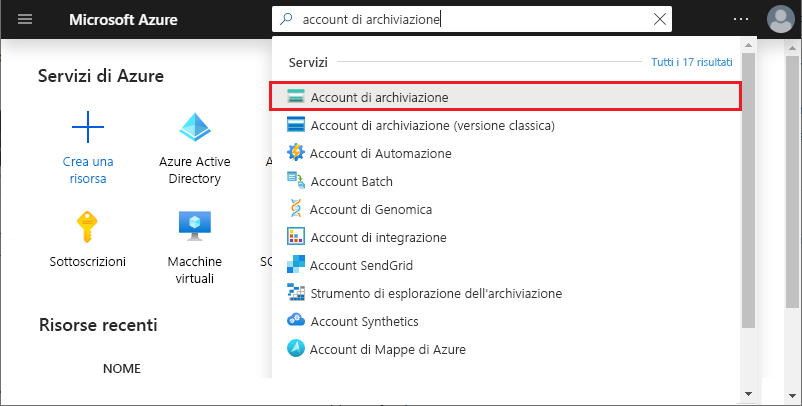

# <a name="work-with-azure-functions-core-tools"></a>Usare Strumenti di base di Funzioni di Azure

Azure Functions Core Tools consente di sviluppare e testare le funzioni nel computer locale dal prompt dei comandi o dal terminale. Le funzioni locali possono connettersi ai servizi di Azure attivi ed è possibile eseguire il debug delle funzioni nel computer locale usando il runtime completo di Funzioni di Azure. È anche possibile distribuire un'app per le funzioni all'abbonamento di Azure.

[!INCLUDE [Don't mix development environments](../../includes/functions-mixed-dev-environments.md)]

Per lo sviluppo di funzioni sul computer locale e la relativa pubblicazione in Azure con gli strumenti di base, attenersi alla procedura seguente:

> [!div class="checklist"]
> * [Installare gli strumenti e le dipendenze di base.](#v2)
> * [Creare un progetto di app per le funzioni da un modello specifico della lingua.](#create-a-local-functions-project)
> * [Registrare le estensioni di binding e trigger.](#register-extensions)
> * [Definire lo spazio di archiviazione e altre connessioni.](#local-settings-file)
> * [Creare una funzione da un trigger e da un modello specifico della lingua.](#create-func)
> * [Eseguire la funzione localmente.](#start)
> * [Pubblicare il progetto in Azure.](#publish)

## <a name="core-tools-versions"></a>Versioni di Core Tools

Sono disponibili tre versioni di Azure Functions Core Tools. La versione in uso dipende dall'ambiente di sviluppo locale, dalla [scelta del linguaggio](supported-languages.md)e dal livello di supporto necessari:

+ [**Versione 3. x/2. x**](#v2): supporta [la versione 3. x o 2. x del runtime di funzioni di Azure](functions-versions.md). Queste versioni supportano [Windows](?tabs=windows#v2), [MacOS](?tabs=macos#v2)e [Linux](?tabs=linux#v2) e usano i gestori di pacchetti specifici della piattaforma o NPM per l'installazione.

+ **Versione 1. x**: supporta la versione 1. x del runtime di funzioni di Azure. Questa versione degli strumenti è supportata solo nei computer Windows e viene installata da un [pacchetto npm](https://www.npmjs.com/package/azure-functions-core-tools).

È possibile installare una sola versione degli strumenti di base in un determinato computer. Se non specificato diversamente, gli esempi in questo articolo sono per la versione 3. x.

## <a name="prerequisites"></a>Prerequisiti

Azure Functions Core Tools attualmente dipende dall'interfaccia della riga di comando di Azure per l'autenticazione con l'account Azure. Ciò significa che è necessario [installare l'interfaccia della](/cli/azure/install-azure-cli) riga di comando di Azure localmente per poter eseguire la [pubblicazione in Azure](#publish) da Azure Functions Core Tools. 

## <a name="install-the-azure-functions-core-tools"></a>Installare gli strumenti di base per Funzioni di Azure

[Strumenti di base di Funzioni di Azure] comprende una versione dello stesso runtime che alimenta Funzioni di Azure che è possibile eseguire nel computer di sviluppo locale. Fornisce anche i comandi per creare le funzioni, connettersi ad Azure e distribuire i progetti della funzione.

### <a name="version-3x-and-2x"></a><a name="v2"></a>Versione 3. x e 2. x

La versione 3. x/2. x degli strumenti usa il runtime di funzioni di Azure compilato in .NET Core. Questa versione è supportata su tutte le piattaforme supportate da .NET Core, tra cui [Windows](?tabs=windows#v2), [MacOS](?tabs=macos#v2)e [Linux](?tabs=linux#v2). 

> [!IMPORTANT]
> È possibile ignorare il requisito per l'installazione del .NET Core SDK usando i [bundle di estensione].

# <a name="windows"></a>[Windows](#tab/windows)

I passaggi seguenti usano Windows Installer (MSI) per installare gli strumenti di base V3. x. Per ulteriori informazioni su altri programmi di installazione basati su pacchetti, necessari per installare gli strumenti di base V2. x, vedere il [file Leggimi degli strumenti di base](https://github.com/Azure/azure-functions-core-tools/blob/master/README.md#windows).

1. Scaricare ed eseguire il programma di installazione degli strumenti di base, in base alla versione di Windows in uso:

    - [v3. x: Windows a 64 bit](https://go.microsoft.com/fwlink/?linkid=2135274) (scelta consigliata. Il [debug di Visual Studio Code](functions-develop-vs-code.md#debugging-functions-locally) richiede 64 bit).
    - [V3. x-Windows 32 bit](https://go.microsoft.com/fwlink/?linkid=2135275)

1. Se non si prevede di usare i [bundle di estensione](functions-bindings-register.md#extension-bundles), installare [.NET Core 3. x SDK per Windows](https://dotnet.microsoft.com/download).

# <a name="macos"></a>[macOS](#tab/macos)

I passaggi seguenti usano Homebrew per installare gli strumenti di base su macOS.

1. Installare [Homebrew](https://brew.sh/), se non è già installato.

1. Installare il pacchetto degli strumenti di base:

    ##### <a name="v3x-recommended"></a>V3. x (scelta consigliata)

    ```bash
    brew tap azure/functions
    brew install azure-functions-core-tools@3
    # if upgrading on a machine that has 2.x installed
    brew link --overwrite azure-functions-core-tools@3
    ```
    
    ##### <a name="v2x"></a>v2.x

    ```bash
    brew tap azure/functions
    brew install azure-functions-core-tools@2
    ```
    
1. Se non si prevede di usare i [bundle di estensione](functions-bindings-register.md#extension-bundles), installare [.NET Core 3. x SDK per MacOS](https://dotnet.microsoft.com/download).

# <a name="linux"></a>[Linux](#tab/linux)

La procedura seguente usa [APT](https://wiki.debian.org/Apt) per installare gli strumenti di base nella distribuzione Ubuntu/Debian Linux. Per altre distribuzioni Linux, vedere il [file leggimi degli strumenti di base](https://github.com/Azure/azure-functions-core-tools/blob/master/README.md#linux).

1. Installare la chiave GPG del repository del pacchetto Microsoft per convalidare l'integrità del pacchetto:

    ```bash
    curl https://packages.microsoft.com/keys/microsoft.asc | gpg --dearmor > microsoft.gpg
    sudo mv microsoft.gpg /etc/apt/trusted.gpg.d/microsoft.gpg
    ```

1. Configurare l'elenco di origine APT prima di eseguire un aggiornamento APT.

    ##### <a name="ubuntu"></a>Ubuntu

    ```bash
    sudo sh -c 'echo "deb [arch=amd64] https://packages.microsoft.com/repos/microsoft-ubuntu-$(lsb_release -cs)-prod $(lsb_release -cs) main" > /etc/apt/sources.list.d/dotnetdev.list'
    ```

    ##### <a name="debian"></a>Debian

    ```bash
    sudo sh -c 'echo "deb [arch=amd64] https://packages.microsoft.com/debian/$(lsb_release -rs | cut -d'.' -f 1)/prod $(lsb_release -cs) main" > /etc/apt/sources.list.d/dotnetdev.list'
    ```

1. Controllare il `/etc/apt/sources.list.d/dotnetdev.list` file per una delle stringhe di versione di Linux appropriate elencate di seguito:

    | Distribuzione di Linux | Versione |
    | --------------- | ----------- |
    | Debian 10 | `buster`  |
    | Debian 9  | `stretch` |
    | Ubuntu 20.04    | `focal`     |
    | Ubuntu 19.04    | `disco`     |
    | Ubuntu 18.10    | `cosmic`    |
    | Ubuntu 18.04    | `bionic`    |
    | Ubuntu 17.04    | `zesty`     |
    | Ubuntu 16.04/Linux Mint 18    | `xenial`  |

1. Avviare l'aggiornamento dell'origine APT:

    ```bash
    sudo apt-get update
    ```

1. Installare il pacchetto degli strumenti di base:

    ##### <a name="v3x-recommended"></a>V3. x (scelta consigliata)
    ```bash
    sudo apt-get update
    sudo apt-get install azure-functions-core-tools-3
    ```
    
    ##### <a name="v2x"></a>v2.x
    ```bash
    sudo apt-get update
    sudo apt-get install azure-functions-core-tools-2
    ```

1. Se non si prevede di usare i [bundle di estensione](functions-bindings-register.md#extension-bundles), installare [.NET Core 3. x SDK per Linux](https://dotnet.microsoft.com/download).

---

## <a name="create-a-local-functions-project"></a>Creare un progetto Funzioni locale

Una directory del progetto Funzioni contiene i file [host.json](functions-host-json.md) e [local.settings.json](#local-settings-file) nonché le sottocartelle che includono il codice per le singole funzioni. Questa directory è l'equivalente di un'app per le funzioni in Azure. Per altre informazioni sulla struttura delle cartelle di Funzioni, vedere la [Guida per sviluppatori di Funzioni di Azure](functions-reference.md#folder-structure).

Per la versione 3. x/2. x è necessario selezionare una lingua predefinita per il progetto quando viene inizializzata. Nella versione 3. x/2. x, tutte le funzioni aggiunte usano i modelli di lingua predefiniti. Nella versione 1.x, specificare la lingua ogni volta che si crea una funzione.

Nella finestra del terminale o da un prompt dei comandi, eseguire il comando seguente per creare il progetto e l’archivio Git locale:

```
func init MyFunctionProj
```

>[!IMPORTANT]
> Java usa un archetipo Maven per creare il progetto di funzioni locali, insieme alla prima funzione attivata tramite HTTP. Usare il comando seguente per creare il progetto Java: `mvn archetype:generate -DarchetypeGroupId=com.microsoft.azure -DarchetypeArtifactId=azure-functions-archetype` . Per un esempio di utilizzo dell'archetipo Maven, vedere la [Guida introduttiva alla riga di comando](/azure/azure-functions/functions-create-first-azure-function-azure-cli?pivots=programming-language-java).  

Quando si fornisce un nome di progetto, viene creata e inizializzata una nuova cartella con lo stesso nome. In caso contrario, viene inizializzata la cartella corrente.  
Nella versione 3. x/2. x, quando si esegue il comando è necessario scegliere un runtime per il progetto. 

<pre>
Select a worker runtime:
dotnet
node
python 
powershell
</pre>

Usare le frecce su/giù per scegliere una lingua, quindi premere INVIO. Se si prevede di sviluppare funzioni JavaScript o TypeScript, scegliere **nodo**, quindi selezionare la lingua. TypeScript presenta [alcuni requisiti aggiuntivi](functions-reference-node.md#typescript). 

L'output ha un aspetto simile all'esempio seguente per un progetto JavaScript:

<pre>
Select a worker runtime: node
Writing .gitignore
Writing host.json
Writing local.settings.json
Writing C:\myfunctions\myMyFunctionProj\.vscode\extensions.json
Initialized empty Git repository in C:/myfunctions/myMyFunctionProj/.git/
</pre>

`func init` supporta le opzioni seguenti, ovvero la versione 3. x/2. x-only, salvo diversa indicazione:

| Opzione     | Descrizione                            |
| ------------ | -------------------------------------- |
| **`--csx`** | Crea funzioni .NET come script C#, che è il comportamento della versione 1. x. È valido esclusivamente con `--worker-runtime dotnet`. |
| **`--docker`** | Crea un Dockerfile per un contenitore usando un'immagine di base basata sull'oggetto selezionato `--worker-runtime` . Usare questa opzione quando si prevede di pubblicare in un contenitore Linux personalizzato. |
| **`--docker-only`** |  Aggiunge un Dockerfile a un progetto esistente. Richiede il runtime del ruolo di lavoro se non è specificato o impostato in local.settings.js. Usare questa opzione quando si prevede di pubblicare un progetto esistente in un contenitore Linux personalizzato. |
| **`--force`** | Inizializzare il progetto anche se contiene file esistenti. Questa impostazione sovrascrive i file esistenti con lo stesso nome. Gli altri file nella cartella del progetto non sono interessati. |
| **`--language`** | Inizializza un progetto specifico del linguaggio. Attualmente supportato quando è `--worker-runtime` impostato su `node` . Le opzioni sono `typescript` e `javascript` . È inoltre possibile utilizzare `--worker-runtime javascript` o `--worker-runtime typescript` .  |
| **`--managed-dependencies`**  | Installa le dipendenze gestite. Attualmente, solo il runtime del ruolo di lavoro PowerShell supporta questa funzionalità. |
| **`--source-control`** | Controlla se viene creato un repository GIT. Per impostazione predefinita, non viene creato un repository. Quando è `true` viene creato un repository. |
| **`--worker-runtime`** | Imposta il runtime del linguaggio per il progetto. I valori supportati sono: `csharp` ,, `dotnet` `javascript` , `node` (JavaScript),, `powershell` `python` e `typescript` . Per Java, usare [Maven](functions-reference-java.md#create-java-functions). Quando non è impostato, viene richiesto di scegliere il runtime durante l'inizializzazione. |
|
> [!IMPORTANT]
> Per impostazione predefinita, la versione 2. x e le versioni successive degli strumenti di base creano progetti di app per le funzioni per il Runtime .NET come [progetti di classe C#](functions-dotnet-class-library.md) (csproj). Tali progetti C#, che possono essere usati con Visual Studio o Visual Studio Code, vengono compilati durante la fase di test e alla pubblicazione in Azure. Se invece si prevede di creare e usare gli stessi file di script C# (con estensione csx) creati nella versione 1.x e nel portale, è necessario includere il parametro `--csx` quando si creano e si distribuiscono funzioni.

## <a name="register-extensions"></a>Registrare le estensioni

Fatta eccezione per i trigger HTTP e timer, le associazioni di funzioni in Runtime versione 2. x e successive vengono implementate come pacchetti di estensione. Le associazioni HTTP e i trigger timer non richiedono estensioni. 

Per ridurre le incompatibilità tra i vari pacchetti di estensione, funzioni consente di fare riferimento a un bundle di estensione nel host.jsfile di progetto. Se si sceglie di non usare i bundle di estensione, è anche necessario installare .NET Core 2. x SDK localmente e mantenere un estensione csproj con il progetto funzioni.  

Nella versione 2. x e oltre al runtime di funzioni di Azure, è necessario registrare in modo esplicito le estensioni per i tipi di binding usati nelle funzioni. È possibile scegliere di installare le estensioni di binding singolarmente oppure è possibile aggiungere un riferimento al bundle di estensione all'host.jsnel file di progetto. I bundle di estensione rimuovono la possibilità di problemi di compatibilità dei pacchetti quando si usano più tipi di binding. Si tratta dell'approccio consigliato per la registrazione delle estensioni di binding. I bundle di estensione eliminano anche il requisito di installazione di .NET Core 2. x SDK. 

### <a name="use-extension-bundles"></a>Usare bundle di estensione

[!INCLUDE [Register extensions](../../includes/functions-extension-bundles.md)]

Per altre informazioni, vedere [registrare le estensioni di binding di funzioni di Azure](functions-bindings-register.md#extension-bundles). Prima di aggiungere binding al function.jssu file, è necessario aggiungere i bundle di estensione al host.js.

### <a name="explicitly-install-extensions"></a>Installare le estensioni in modo esplicito

[!INCLUDE [functions-extension-register-core-tools](../../includes/functions-extension-register-core-tools.md)]

[!INCLUDE [functions-local-settings-file](../../includes/functions-local-settings-file.md)]

Per impostazione predefinita, queste impostazioni non vengono migrate automaticamente quando il progetto viene pubblicato in Azure. Utilizzare lo switch `--publish-local-settings`[durante la pubblicazione](#publish) per assicurarsi che queste impostazioni vengano aggiunte all'app della funzione in Azure. Si noti che i valori in **ConnectionStrings** non vengono mai pubblicati.

I valori delle impostazioni dell'app di funzione possono anche essere letti nel codice come variabili di ambiente. Per altre informazioni, vedere la sezione Variabili di ambiente negli argomenti di riferimento specifici del linguaggio seguenti:

* [C# precompilato](functions-dotnet-class-library.md#environment-variables)
* [Script C# (file con estensione csx)](functions-reference-csharp.md#environment-variables)
* [Java](functions-reference-java.md#environment-variables)
* [JavaScript](functions-reference-node.md#environment-variables)
* [PowerShell](functions-reference-powershell.md#environment-variables)
* [Python](functions-reference-python.md#environment-variables)

Quando non è impostata alcuna stringa di connessione di archiviazione valida per [`AzureWebJobsStorage`] e l'emulatore non viene usato, viene visualizzato il messaggio di errore seguente:

> Valore mancante per AzureWebJobsStorage in local.settings.json. È necessario per tutti i trigger diversi da HTTP. È possibile eseguire "func azure functionapp fetch-app-settings \<functionAppName\>" o specificare una stringa di connessione in local.settings.json.

### <a name="get-your-storage-connection-strings"></a>Ottenere le stringhe di connessione di archiviazione

Anche quando si usa la Emulatore di archiviazione di Microsoft Azure per lo sviluppo, è consigliabile eseguire il test con una connessione di archiviazione effettiva. Se si dispone che si è già [creato un account di archiviazione](../storage/common/storage-account-create.md), è possibile ottenere una stringa di connessione di archiviazione valida in uno dei modi seguenti:

- Dalla [portale di Azure]cercare e selezionare **account di archiviazione**. 
  
  
  Selezionare l'account di archiviazione, selezionare **chiavi di accesso** in **Impostazioni**, quindi copiare uno dei valori della stringa di **connessione** .
  

- Usare [Azure Storage Explorer](https://storageexplorer.com/) per collegarsi all'account di Azure. Nella finestra di **esplorazione**espandere la sottoscrizione, espandere **account di archiviazione**, selezionare l'account di archiviazione e copiare la stringa di connessione primaria o secondaria.

  

+ Usare gli strumenti di base dalla radice del progetto per scaricare la stringa di connessione da Azure con uno dei comandi seguenti:

  + Scaricare tutte le impostazioni di un'app di funzione esistente:

    ```
    func azure functionapp fetch-app-settings <FunctionAppName>
    ```

  + Ottenere la stringa di connessione per uno specifico account di archiviazione:

    ```
    func azure storage fetch-connection-string <StorageAccountName>
    ```

    Quando non è già stato effettuato l'accesso ad Azure, viene richiesto di eseguire questa operazione. Questi comandi sovrascrivono le impostazioni esistenti nel local.settings.jssu file. 

## <a name="create-a-function"></a><a name="create-func"></a>Creare una funzione

Eseguire il comando seguente per creare una funzione:

```
func new
```

Nella versione 3. x/2. x, quando si esegue viene `func new` richiesto di scegliere un modello nella lingua predefinita dell'app per le funzioni, viene inoltre richiesto di scegliere un nome per la funzione. Nella versione 1.x, viene anche richiesto di scegliere la lingua.

<pre>
Select a language: Select a template:
Blob trigger
Cosmos DB trigger
Event Grid trigger
HTTP trigger
Queue trigger
SendGrid
Service Bus Queue trigger
Service Bus Topic trigger
Timer trigger
</pre>

Il codice della funzione viene generato in una sottocartella con il nome della funzione fornito, come è possibile vedere nell'output del trigger della coda seguente:

<pre>
Select a language: Select a template: Queue trigger
Function name: [QueueTriggerJS] MyQueueTrigger
Writing C:\myfunctions\myMyFunctionProj\MyQueueTrigger\index.js
Writing C:\myfunctions\myMyFunctionProj\MyQueueTrigger\readme.md
Writing C:\myfunctions\myMyFunctionProj\MyQueueTrigger\sample.dat
Writing C:\myfunctions\myMyFunctionProj\MyQueueTrigger\function.json
</pre>

È anche possibile specificare queste opzioni nel comando usando gli argomenti seguenti:

| Argomento     | Descrizione                            |
| ------------------------------------------ | -------------------------------------- |
| **`--csx`** | (Versione 2. x e versioni successive). Genera gli stessi modelli di script C# (. CSX) usati nella versione 1. x e nel portale. |
| **`--language`**, **`-l`**| Il linguaggio di programmazione del modello, come C#, F# o JavaScript. Questa opzione è necessaria nella versione 1.x. Nella versione 2. x e versioni successive, non usare questa opzione o scegliere una lingua corrispondente al runtime del ruolo di lavoro. |
| **`--name`**, **`-n`** | Nome della funzione. |
| **`--template`**, **`-t`** | Usare il comando `func templates list` per visualizzare l'elenco completo dei modelli disponibili per ogni linguaggio supportato.   |


Ad esempio, per creare un trigger HTTP JavaScript in un singolo comando, eseguire:

```
func new --template "Http Trigger" --name MyHttpTrigger
```

Per creare una funzione attivata dalla coda in un singolo comando, eseguire:

```
func new --template "Queue Trigger" --name QueueTriggerJS
```

## <a name="run-functions-locally"></a><a name="start"></a>Eseguire funzioni localmente

Per eseguire un progetto Funzioni, eseguire l'host di Funzioni. L'host Abilita i trigger per tutte le funzioni del progetto. Il comando di avvio varia a seconda del linguaggio del progetto.

# <a name="c"></a>[C\#](#tab/csharp)

```
func start --build
```

# <a name="java"></a>[Java](#tab/java)

```
mvn clean package 
mvn azure-functions:run
```

# <a name="javascript"></a>[JavaScript](#tab/node)

```
func start
```

# <a name="python"></a>[Python](#tab/python)

```
func start
```
Questo comando deve essere [eseguito in un ambiente virtuale](./functions-create-first-azure-function-azure-cli.md?pivots=programming-language-python#create-venv).

# <a name="typescript"></a>[TypeScript](#tab/ts)

```
npm install
npm start     
```

---

>[!NOTE]  
> La versione 1. x del runtime di funzioni richiede il `host` comando, come nell'esempio seguente:
>
> ```
> func host start
> ```

`func start` supporta le opzioni seguenti:

| Opzione     | Descrizione                            |
| ------------ | -------------------------------------- |
| **`--no-build`** | Per il progetto corrente non viene creata una build prima dell'esecuzione. Solo per progetti dotnet. Il valore predefinito è false. Non supportato per la versione 1. x. |
| **`--cors-credentials`** | Consenti le richieste autenticate tra le origini, ad esempio i cookie e l'intestazione di autenticazione, non sono supportate per la versione 1. x. |
| **`--cors`** | Un elenco delimitato dalla virgola di origini CORS, senza spazi. |
| **`--language-worker`** | Argomenti per configurare il ruolo di lavoro del linguaggio. Ad esempio, è possibile abilitare il debug per Language Worker fornendo la [porta di debug e altri argomenti obbligatori](https://github.com/Azure/azure-functions-core-tools/wiki/Enable-Debugging-for-language-workers). Non supportato per la versione 1. x. |
| **`--cert`** | Il percorso in un file con estensione pfx che contiene una chiave privata. Usati solo con `--useHttps`. Non supportato per la versione 1. x. |
| **`--password`** | La password o un file che contiene la password per un file con estensione pfx. Usati solo con `--cert`. Non supportato per la versione 1. x. |
| **`--port`**, **`-p`** | La porta locale su cui ascoltare. Valore predefinito: 7071. |
| **`--pause-on-error`** | Sospendere per l'input aggiuntivo prima dell'uscita dal processo. Viene usato quando si avvia Core Tools da un ambiente di sviluppo integrato (IDE).|
| **`--script-root`**, **`--prefix`** | Viene usato per specificare il percorso della radice dell'app per le funzioni da eseguire o distribuire. Viene usato per progetti compilati che generano file di progetto in una sottocartella. Ad esempio, quando si crea un progetto di libreria di classi C#, i file host.json, local.settings.json e function.json vengono generati in una sottocartella *radice* con un percorso simile a `MyProject/bin/Debug/netstandard2.0`. In questo caso, impostare il prefisso come `--script-root MyProject/bin/Debug/netstandard2.0`. Questa è la radice dell'app per le funzioni durante l'esecuzione in Azure. |
| **`--timeout`**, **`-t`** | Il timeout per l'host di Funzioni da avviare, in secondi. Impostazione predefinita: 20 secondi.|
| **`--useHttps`** | Eseguire l'associazione a `https://localhost:{port}` anziché a `http://localhost:{port}`. Per impostazione predefinita, questa opzione crea un certificato attendibile nel computer in uso.|

Quando viene avviato l'host di Funzioni, restituisce come output l'URL delle funzioni attivate da HTTP:

<pre>
Found the following functions:
Host.Functions.MyHttpTrigger

Job host started
Http Function MyHttpTrigger: http://localhost:7071/api/MyHttpTrigger
</pre>

>[!IMPORTANT]
>Durante l'esecuzione in locale, l'autorizzazione non viene applicata per gli endpoint HTTP. Questo significa che tutte le richieste HTTP locali vengono gestite come `authLevel = "anonymous"`. Per altre informazioni, vedere l'[articolo sul binding HTTP](functions-bindings-http-webhook-trigger.md#authorization-keys).

### <a name="passing-test-data-to-a-function"></a>Passaggio di dati di test a una funzione

Per testare le funzioni localmente, [avviare l'host di Funzioni](#start) e chiamare gli endpoint nel server locale usando richieste HTTP. L'endpoint chiamato dipende dal tipo di funzione.

>[!NOTE]
> Gli esempi in questo argomento usano lo strumento cURL per inviare richieste HTTP dal terminale o da un prompt dei comandi. È possibile usare lo strumento preferito per inviare richieste HTTP al server locale. Lo strumento cURL è disponibile per impostazione predefinita nei sistemi basati su Linux e in Windows 10 Build 17063 e versioni successive. Nelle finestre precedenti è necessario prima scaricare e installare lo [strumento curl](https://curl.haxx.se/).

Per informazioni più generali sui test delle funzioni, vedere [Strategie per il test del codice in Funzioni di Azure](functions-test-a-function.md).

#### <a name="http-and-webhook-triggered-functions"></a>Funzioni attivate tramite HTTP e webhook

È possibile chiamare l'endpoint seguente per eseguire localmente funzioni attivate tramite HTTP e webhook:

```
http://localhost:{port}/api/{function_name}
```

Assicurarsi di usare lo stesso nome server e la stessa porta su cui è in ascolto l'host di Funzioni. Questi valori sono visualizzati nell'output generato all'avvio dell'host di Funzioni. È possibile chiamare questo URL usando qualsiasi metodo HTTP supportato dal trigger.

Il comando cURL seguente attiva la funzione di avvio rapido `MyHttpTrigger` da una richiesta GET con il parametro _name_ passato nella stringa di query.

```
curl --get http://localhost:7071/api/MyHttpTrigger?name=Azure%20Rocks
```

L'esempio seguente è la stessa funzione chiamata da una richiesta POST passando _name_ nel corpo della richiesta:

# <a name="bash"></a>[Bash](#tab/bash)
```bash
curl --request POST http://localhost:7071/api/MyHttpTrigger --data '{"name":"Azure Rocks"}'
```
# <a name="cmd"></a>[Cmd](#tab/cmd)
```cmd
curl --request POST http://localhost:7071/api/MyHttpTrigger --data "{'name':'Azure Rocks'}"
```
---

È possibile effettuare richieste GET da un browser passando dati nella stringa di query. Per tutti gli altri metodi HTTP è necessario usare cURL, Fiddler, Postman o uno strumento analogo per i test HTTP.

#### <a name="non-http-triggered-functions"></a>Funzione attivate non da HTTP

Per tutti i tipi di funzioni diverse da trigger HTTP e webhook e trigger di griglia di eventi, è possibile testare localmente le funzioni chiamando un endpoint di amministrazione. Chiamando questo endpoint con una richiesta HTTP POST sul server locale si attiva la funzione. 

Per testare localmente le funzioni attivate da griglia di eventi, vedere [local Testing with Viewer Web App](functions-bindings-event-grid-trigger.md#local-testing-with-viewer-web-app).

È facoltativamente possibile passare dati di test all'esecuzione nel corpo del messaggio della richiesta POST. Questa funzionalità è analoga alla scheda **Test** del portale di Azure.

Chiamare l'endpoint di amministrazione seguente per attivare funzioni non HTTP:

```
http://localhost:{port}/admin/functions/{function_name}
```

Per passare dati di test all'endpoint di amministrazione di una funzione, è necessario fornire i dati nel corpo di un messaggio di richiesta POST. Il corpo del messaggio deve avere il formato JSON seguente:

```JSON
{
    "input": "<trigger_input>"
}
```

Il valore `<trigger_input>` contiene dati nel formato previsto dalla funzione. L'esempio cURL seguente è una richiesta POST per una funzione `QueueTriggerJS`. In questo caso l'input è una stringa che equivale al messaggio previsto nella coda.

# <a name="bash"></a>[Bash](#tab/bash)
```bash
curl --request POST -H "Content-Type:application/json" --data '{"input":"sample queue data"}' http://localhost:7071/admin/functions/QueueTrigger
```
# <a name="cmd"></a>[Cmd](#tab/cmd)
```bash
curl --request POST -H "Content-Type:application/json" --data "{'input':'sample queue data'}" http://localhost:7071/admin/functions/QueueTrigger
```
---

#### <a name="using-the-func-run-command-version-1x-only"></a>Utilizzando il `func run` comando (solo versione 1. x)

>[!IMPORTANT]
> Il `func run` comando è supportato solo nella versione 1. x degli strumenti. Per altre informazioni, vedere l'argomento [Come specificare le versioni del runtime per Funzioni di Azure](set-runtime-version.md).

Nella versione 1. x, è anche possibile richiamare una funzione direttamente usando `func run <FunctionName>` e fornire i dati di input per la funzione. Questo comando è simile all'esecuzione di una funzione con la scheda **Test** nel portale di Azure.

`func run` supporta le opzioni seguenti:

| Opzione     | Descrizione                            |
| ------------ | -------------------------------------- |
| **`--content`**, **`-c`** | Contenuto inline. |
| **`--debug`**, **`-d`** | Associare un debugger al processo host prima di eseguire la funzione.|
| **`--timeout`**, **`-t`** | Tempo di attesa (in secondi) fino a quando l'host locale di Funzioni è pronto.|
| **`--file`**, **`-f`** | Il nome del file da usare come contenuto.|
| **`--no-interactive`** | Non richiede input. Utile per scenari di automazione.|

Ad esempio, per chiamare una funzione attivata da HTTP e passare il corpo del contenuto, eseguire il comando seguente:

```
func run MyHttpTrigger -c '{\"name\": \"Azure\"}'
```

## <a name="publish-to-azure"></a><a name="publish"></a>Pubblicazione in Azure

Il Azure Functions Core Tools supporta due tipi di distribuzione: la distribuzione di file di progetto di funzione direttamente nell'app per le funzioni tramite la distribuzione [zip](functions-deployment-technologies.md#zip-deploy) e [la distribuzione di un contenitore Docker personalizzato](functions-deployment-technologies.md#docker-container). È necessario avere già [creato un'app per le funzioni nella sottoscrizione di Azure](functions-cli-samples.md#create)in cui verrà distribuito il codice. I progetti che richiedono la compilazione devono essere compilati in modo che i file binari possano essere distribuiti.

>[!IMPORTANT]
>È necessario che l' [interfaccia](/cli/azure/install-azure-cli) della riga di comando di Azure sia installata localmente per poter eseguire la pubblicazione in Azure da strumenti di base.  

Una cartella di progetto può contenere file e directory specifici della lingua che non devono essere pubblicati. Gli elementi esclusi vengono elencati in un file con estensione funcignore nella cartella radice del progetto.     

### <a name="deploy-project-files"></a><a name="project-file-deployment"></a>Distribuire i file di progetto

Per pubblicare il codice locale in un'app per le funzioni in Azure, usare il comando `publish`:

```
func azure functionapp publish <FunctionAppName>
```

>[!IMPORTANT]
> Java USA Maven per pubblicare il progetto locale in Azure. Usare il comando seguente per pubblicare in Azure: `mvn azure-functions:deploy` . Le risorse di Azure vengono create durante la distribuzione iniziale.

Questo comando consente di pubblicare un'app per le funzioni esistente in Azure. Se si prova a pubblicare in un `<FunctionAppName>` che non esiste nella sottoscrizione, viene ricevuto un errore. Per informazioni su come creare un'app per le funzioni dal prompt dei comandi o dalla finestra del terminale usando l'interfaccia della riga di comando di Azure, vedere [Creare un'app per le funzioni per l'esecuzione senza server](./scripts/functions-cli-create-serverless.md). Per impostazione predefinita, questo comando usa la [compilazione remota](functions-deployment-technologies.md#remote-build) e distribuisce l'app per [l'esecuzione dal pacchetto di distribuzione](run-functions-from-deployment-package.md). Per disabilitare la modalità di distribuzione consigliata, utilizzare l' `--nozip` opzione.

>[!IMPORTANT]
> Quando si crea un'app per le funzioni nella portale di Azure, per impostazione predefinita viene usata la versione 3. x del runtime di funzione. Per far eseguire la versione 1.x del runtime all'app per le funzioni, osservare le istruzioni riportate in [Run on version 1.x](functions-versions.md#creating-1x-apps) (Esecuzione sulla versione 1.x).
> Non è possibile modificare la versione di runtime per un'app per le funzioni che ha funzioni esistenti.

Le seguenti opzioni di pubblicazione si applicano a tutte le versioni:

| Opzione     | Descrizione                            |
| ------------ | -------------------------------------- |
| **`--publish-local-settings -i`** |  Pubblicare le impostazioni di local.settings.json in Azure, suggerendo di sovrascrivere eventuali impostazioni esistenti. Se si usa il Emulatore di archiviazione di Microsoft Azure, modificare prima l'impostazione dell'app in una [connessione di archiviazione effettiva](#get-your-storage-connection-strings). |
| **`--overwrite-settings -y`** | Eliminare il prompt per sovrascrivere le impostazioni dell'app quando si usa `--publish-local-settings -i`.|

Le opzioni di pubblicazione seguenti sono supportate solo per la versione 2. x e le versioni successive:

| Opzione     | Descrizione                            |
| ------------ | -------------------------------------- |
| **`--publish-settings-only`**, **`-o`** |  Pubblicare solo le impostazioni e ignorare il contenuto. Viene suggerito il valore predefinito. |
|**`--list-ignored-files`** | Visualizza un elenco di file che vengono ignorati durante la pubblicazione basato sul file con estensione funcignore. |
| **`--list-included-files`** | Visualizza un elenco di file che vengono pubblicati basato sul file con estensione .funcignore. |
| **`--nozip`** | Disattiva la modalità `Run-From-Package` predefinita. |
| **`--build-native-deps`** | Ignora la generazione della cartella. Wheels durante la pubblicazione di app per le funzioni Python. |
| **`--build`**, **`-b`** | Esegue un'azione di compilazione durante la distribuzione in un'app per le funzioni Linux. Accetta: `remote` e `local` . |
| **`--additional-packages`** | Elenco di pacchetti da installare durante la creazione di dipendenze native. Ad esempio: `python3-dev libevent-dev`. |
| **`--force`** | Ignora la verifica preliminare alla pubblicazione in determinati scenari. |
| **`--csx`** | Pubblica un progetto di script C# (file con estensione csx). |
| **`--no-build`** | Il progetto non viene compilato durante la pubblicazione. Per Python `pip install` non viene eseguito. |
| **`--dotnet-cli-params`** | Quando si pubblicano funzioni C# compilate (con estensione csproj), Core Tools chiama "dotnet build --output bin/publish". Tutti i parametri passati a questa opzione verranno aggiunti alla riga di comando. |

### <a name="deploy-custom-container"></a>Distribuire un contenitore personalizzato

Funzioni di Azure consente di distribuire il progetto di funzione in un [contenitore Docker personalizzato](functions-deployment-technologies.md#docker-container). Per altre informazioni, consultare [Creare una funzione in Linux tramite un'immagine personalizzata (anteprima)](functions-create-function-linux-custom-image.md). I contenitori personalizzati devono disporre di un Dockerfile. Per creare un'app con un Dockerfile, usare l'opzione--Dockerfile in `func init` .

```
func deploy
```

Sono disponibili le opzioni di distribuzione del contenitore personalizzato seguenti:

| Opzione     | Descrizione                            |
| ------------ | -------------------------------------- |
| **`--registry`** | Il nome di un registro Docker a cui l'utente corrente ha eseguito l'accesso. |
| **`--platform`** | Piattaforma di hosting per le app per le funzioni. Le opzioni valide sono `kubernetes` |
| **`--name`** | Nome dell'app per le funzioni. |
| **`--max`**  | Facoltativamente, imposta il numero massimo di istanze di app per le funzioni su cui eseguire la distribuzione. |
| **`--min`**  | Facoltativamente, imposta il numero minimo di istanze di app per le funzioni su cui eseguire la distribuzione. |
| **`--config`** | Imposta un file di configurazione della distribuzione opzionale. |

## <a name="monitoring-functions"></a>Monitoraggio delle funzioni

Il modo consigliato per monitorare l'esecuzione delle funzioni è l'integrazione con applicazione Azure Insights. È anche possibile eseguire lo streaming dei log di esecuzione nel computer locale. Per altre informazioni, vedere [Monitorare Funzioni di Azure](functions-monitoring.md).

### <a name="application-insights-integration"></a>Integrazione di Application Insights

L'integrazione di Application Insights deve essere abilitata quando si crea l'app per le funzioni in Azure. Se per qualche motivo l'app per le funzioni non è connessa a un'istanza di Application Insights, è facile eseguire questa integrazione nel portale di Azure. 

[!INCLUDE [functions-connect-new-app-insights.md](../../includes/functions-connect-new-app-insights.md)]

### <a name="enable-streaming-logs"></a>Abilitare i log in streaming

È possibile visualizzare un flusso di file di log generati dalle funzioni in una sessione della riga di comando nel computer locale. 

#### <a name="native-streaming-logs"></a>Log in streaming nativi

[!INCLUDE [functions-streaming-logs-core-tools](../../includes/functions-streaming-logs-core-tools.md)]

Questo tipo di log di streaming richiede l'abilitazione dell'integrazione di Application Insights per l'app per le funzioni.   


## <a name="next-steps"></a>Passaggi successivi

Scopri come sviluppare, testare e pubblicare funzioni di Azure usando Azure Functions Core Tools [modulo Microsoft learn](/learn/modules/develop-test-deploy-azure-functions-with-core-tools/) Azure Functions Core Tools è [Open Source e ospitato su GitHub](https://github.com/azure/azure-functions-cli).  
Per registrare una richiesta per un bug o una funzionalità [aprire un problema di GitHub](https://github.com/azure/azure-functions-cli/issues).

<!-- LINKS -->

[Azure Functions Core Tools]: https://www.npmjs.com/package/azure-functions-core-tools
[Portale di Azure]: https://portal.azure.com 
[Node.js]: https://docs.npmjs.com/getting-started/installing-node#osx-or-windows
[`FUNCTIONS_WORKER_RUNTIME`]: functions-app-settings.md#functions_worker_runtime
[`AzureWebJobsStorage`]: functions-app-settings.md#azurewebjobsstorage
[Bundle di estensione]: functions-bindings-register.md#extension-bundles
