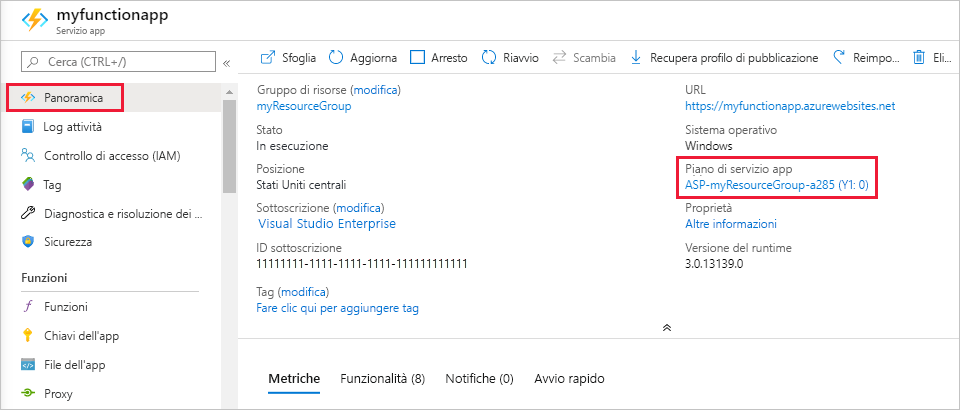

# <a name="azure-functions-scale-and-hosting"></a>Ridimensionamento e hosting di Funzioni di Azure

Quando si crea un'app per le funzioni in Azure, è necessario scegliere un piano di hosting per l'app. Sono disponibili tre piani di hosting per funzioni di Azure: Piano a [consumo](#consumption-plan), [piano Premium](#premium-plan)e [piano di servizio app](#app-service-plan).

Il piano di hosting scelto determina i comportamenti seguenti:

* Modalità di ridimensionamento dell'app per le funzioni.
* Risorse disponibili per ogni istanza dell'app per le funzioni.
* Supporto per le funzionalità avanzate, ad esempio la connettività VNET.

Sia il consumo che i piani Premium aggiungono automaticamente la potenza di calcolo quando il codice è in esecuzione. L'app viene scalata orizzontalmente quando necessario per gestire il carico e viene ridotta quando il codice viene arrestato. Per il piano a consumo, non è necessario pagare in anticipo le macchine virtuali inattive o la capacità di riserva.  

Il piano Premium offre funzionalità aggiuntive, ad esempio le istanze di calcolo Premium, la possibilità di limitare le istanze a tempo indefinito e la connettività VNet.

Il piano di servizio app consente di sfruttare i vantaggi dell'infrastruttura dedicata, che è possibile gestire. L'app per le funzioni non viene ridimensionata in base agli eventi, il che significa che non viene mai ridimensionato fino a zero. Richiede che [Always on](#always-on) sia abilitato.

> [!NOTE]
> È possibile passare tra i piani di consumo e Premium modificando la proprietà del piano della risorsa dell'app per le funzioni.

## <a name="hosting-plan-support"></a>Supporto del piano di hosting

Il supporto delle funzionalità rientra nelle due categorie seguenti:

* _Disponibile a livello generale (GA)_ : completamente supportato e approvato per l'uso in produzione.
* _Anteprima_: non ancora completamente supportato e approvato per l'uso in produzione.

La tabella seguente indica il livello di supporto corrente per i tre piani di hosting, quando è in esecuzione in Windows o Linux:

| | Piano a consumo | Piano Premium | Piano dedicato |
|-|:----------------:|:------------:|:----------------:|
| Windows | GA | anteprima | GA |
| Linux | GA | anteprima | GA |

## <a name="consumption-plan"></a>Piano a consumo

Quando si usa il piano a consumo, le istanze dell'host di funzioni di Azure vengono aggiunte e rimosse in modo dinamico in base al numero di eventi in ingresso. Questo piano senza server offre la scalabilità automatica e sono previsti costi per le risorse di calcolo solo quando le funzioni sono in esecuzione. In un piano A consumo, il timeout dell'esecuzione di una funzione si verifica dopo un periodo di tempo configurabile.

La fatturazione si basa sul numero di esecuzioni, il tempo di esecuzione e la memoria usata. La fatturazione viene aggregata tra tutte le funzioni all'interno di un'app per le funzioni. Per altre informazioni, vedere la [pagina relativa ai prezzi per Funzioni di Azure](https://azure.microsoft.com/pricing/details/functions/).

Il piano a consumo è l'opzione di hosting predefinita e offre i vantaggi seguenti:

* Addebiti solo quando le funzioni sono in esecuzione
* Aumento automatico del numero di istanze anche in periodo di carico elevato

Le app per le funzioni nella stessa area possono essere assegnate allo stesso piano a consumo. Non ci sono svantaggi o conseguenze per l'esecuzione di più app nello stesso piano a consumo. L'assegnazione di più app allo stesso piano a consumo non ha alcun effetto sulla resilienza, la scalabilità o l'affidabilità di ogni app.

## <a name="premium-plan"></a>Piano Premium (anteprima)

Quando si usa il piano Premium, le istanze dell'host di funzioni di Azure vengono aggiunte e rimosse in base al numero di eventi in ingresso esattamente come il piano a consumo.  Il piano Premium supporta le funzionalità seguenti:

* Istanze perennemente calde per evitare l'avvio a freddo
* Connettività di rete virtuale
* Durata di esecuzione illimitata
* Dimensioni delle istanze Premium (un core, due core e quattro istanze Core)
* Prezzo più prevedibile
* Allocazione di app ad alta densità per i piani con più app per le funzioni

Informazioni su come è possibile configurare queste opzioni sono disponibili nel documento del [piano Premium di funzioni di Azure](functions-premium-plan.md).

Anziché eseguire la fatturazione per esecuzione e la memoria utilizzata, la fatturazione per il piano Premium si basa sul numero di secondi core, sul tempo di esecuzione e sulla memoria usata nelle istanze necessarie e riservate.  Almeno un'istanza deve essere sempre calda. Ciò significa che esiste un costo mensile fisso per ogni piano attivo, indipendentemente dal numero di esecuzioni.

Si consideri il piano Premium di funzioni di Azure nelle situazioni seguenti:

* Le app per le funzioni vengono eseguite in modo continuo o quasi continuo.
* Sono necessarie più opzioni di CPU o memoria rispetto a quelle fornite dal piano a consumo.
* Il codice deve essere eseguito più a lungo del [tempo di esecuzione massimo consentito](#timeout) nel piano a consumo.
* Sono necessarie funzionalità disponibili solo in un piano Premium, ad esempio connettività VNET/VPN.

Quando si eseguono funzioni JavaScript in un piano Premium, è consigliabile scegliere un'istanza con un minor numero di vCPU. Per ulteriori informazioni, vedere la pagina relativa alla [scelta dei piani Premium a core singolo](functions-reference-node.md#considerations-for-javascript-functions).  

## <a name="app-service-plan"></a>Piano dedicato (servizio app)

Le app per le funzioni possono anche essere eseguite sulle stesse VM dedicate di altre app del servizio app (SKU Basic, standard, Premium e isolated).

Si consideri un piano di servizio app nelle situazioni seguenti:

* Sono presenti macchine virtuali sottoutilizzate, che eseguono già altre istanze del servizio app.
* Si desidera fornire un'immagine personalizzata su cui eseguire le funzioni.

Si paga lo stesso per le app per le funzioni in un piano di servizio app come per le altre risorse del servizio app, ad esempio le app Web. Per informazioni dettagliate sul funzionamento del piano di servizio app, vedere [Panoramica approfondita dei piani di servizio app di Azure](../app-service/overview-hosting-plans.md).

Con un piano di servizio app, è possibile aumentare manualmente il numero di istanze aggiungendo altre istanze di VM. È anche possibile abilitare la scalabilità automatica. Per altre informazioni, vedere [Scalare il conteggio delle istanze manualmente o automaticamente](../azure-monitor/platform/autoscale-get-started.md?toc=%2fazure%2fapp-service%2ftoc.json). Per aumentare le prestazioni è anche possibile scegliere un piano di servizio App diverso. Per altre informazioni, vedere [Aumentare le prestazioni di un'app in Azure](../app-service/web-sites-scale.md). 

Quando si eseguono funzioni JavaScript in un piano di servizio app, è necessario scegliere un piano con un minor numero di vCPU. Per altre informazioni, vedere [scegliere i piani di servizio app Single Core](functions-reference-node.md#choose-single-vcpu-app-service-plans). 
<!-- Note: the portal links to this section via fwlink https://go.microsoft.com/fwlink/?linkid=830855 --> 

### <a name="always-on"></a>Always On

Se per l'esecuzione si usa un piano di servizio app, è necessario abilitare l'impostazione **Always on** in modo che l'app per le funzioni venga eseguita correttamente. In un piano di servizio app il runtime delle funzioni risulta inattivo dopo pochi minuti di inattività. Solo i trigger HTTP "attiveranno" quindi le funzioni. L'opzione Always on è disponibile solo nel piano di servizio app. In un piano a consumo, la piattaforma attiva automaticamente le app per le funzioni.

[!INCLUDE [Timeout Duration section](../../includes/functions-timeout-duration.md)]


Anche con Always On abilitato, il timeout di esecuzione per le singole funzioni è controllato dall'impostazione `functionTimeout` nel file di progetto [host.json](functions-host-json.md#functiontimeout).

## <a name="determine-the-hosting-plan-of-an-existing-application"></a>Determinare il piano di hosting di un'applicazione esistente

Per determinare il piano di hosting usato dall'app per le funzioni, vedere **Piano di servizio app/piano tariffario** nella scheda **Panoramica** dell'app per le funzioni nel [portale di Azure](https://portal.azure.com). Per i piani di servizio app è indicato anche il piano tariffario.



È anche possibile usare l'interfaccia della riga di comando di Azure per determinare il piano, come descritto di seguito:

```azurecli-interactive
appServicePlanId=$(az functionapp show --name <my_function_app_name> --resource-group <my_resource_group> --query appServicePlanId --output tsv)
az appservice plan list --query "[?id=='$appServicePlanId'].sku.tier" --output tsv
```  

Quando l'output di questo comando è `dynamic`, l'app per le funzioni è nel piano a consumo. Quando l'output di questo comando è `ElasticPremium`, l'app per le funzioni si trova nel piano Premium. Tutti gli altri valori indicano livelli diversi di un piano di servizio app.

## <a name="storage-account-requirements"></a>Requisiti dell'account di archiviazione

In qualsiasi piano, un'app per le funzioni richiede un account di archiviazione di Azure generale che supporta archiviazione BLOB, code, file e tabelle di Azure. Questo perché le funzioni si basano sull'archiviazione di Azure per operazioni come la gestione dei trigger e la registrazione delle esecuzioni di funzioni, ma alcuni account di archiviazione non supportano code e tabelle. Questi account, che includono l'archiviazione solo BLOB (tra cui Archiviazione premium) e gli account di archiviazione per utilizzo generico con replica di archiviazione con ridondanza della zona, vengono esclusi dalle selezioni di **Account di archiviazione** esistenti quando si crea un'app per le funzioni.

<!-- JH: Does using a Premium Storage account improve perf? -->

Per altre informazioni sui tipi di account di archiviazione, vedere [Introduzione ai servizi di archiviazione di Azure](../storage/common/storage-introduction.md#azure-storage-services).

## <a name="how-the-consumption-and-premium-plans-work"></a>Come funzionano i piani di consumo e Premium

Nei piani di consumo e Premium, l'infrastruttura di funzioni di Azure consente di ridimensionare le risorse di CPU e memoria aggiungendo altre istanze dell'host di funzioni, in base al numero di eventi su cui vengono attivate le relative funzioni. Ogni istanza dell'host di funzioni nel piano a consumo è limitata a 1,5 GB di memoria e una CPU.  Un'istanza dell'host è l'intera app per le funzioni, che significa che tutte le funzioni all'interno di un'app per le funzioni condividono una risorsa all'interno di un'istanza e vengono ridimensionate allo stesso tempo. Le app per le funzioni che condividono lo stesso piano a consumo vengono ridimensionate in modo indipendente.  Nel piano Premium, le dimensioni del piano determineranno la memoria e la CPU disponibili per tutte le app del piano in tale istanza.  

I file di codice delle funzioni vengono archiviati nelle condivisioni File di Azure nell'account di archiviazione principale della funzione. Quando si elimina l'account di archiviazione principale dell'app per le funzioni, i file di codice delle funzioni vengono eliminati e non possono essere recuperati.

> [!NOTE]
> Quando si usa un trigger di tipo BLOB in un piano a consumo, può verificarsi un ritardo massimo di 10 minuti per l'elaborazione di nuovi BLOB. Questo ritardo si verifica in caso di inattività di un'app per le funzioni. Quando l'app per le funzioni è in esecuzione, i BLOB vengono elaborati immediatamente. Per evitare questo ritardo di avvio a freddo, utilizzare il piano Premium oppure utilizzare il [trigger griglia di eventi](functions-bindings-event-grid.md). Per altre informazioni, vedere l'articolo di riferimento sull'[associazione del trigger BLOB](functions-bindings-storage-blob.md#trigger).

### <a name="runtime-scaling"></a>Ridimensionamento in fase di runtime

Funzioni di Azure usa un componente denominato *controller di scalabilità* per monitorare la frequenza degli eventi e determinare se aumentare il numero di istanze o ridurre le prestazioni. Il controller di scalabilità usa le funzionalità di euristica per ogni tipo di trigger. Quando si usa ad esempio un trigger di archiviazione code di Azure, la scalabilità dipende dalla lunghezza della coda e dal tempo di attesa del messaggio meno recente della coda.

L'unità di scala per funzioni di Azure è l'app per le funzioni. In caso di aumento del numero di istanze dell'app per le funzioni, vengono allocate altre risorse per l'esecuzione di più istanze dell'host di Funzioni di Azure. In caso di riduzione delle richieste di calcolo, il controller di scalabilità rimuove le istanze dell'host di Funzioni. Il numero di istanze viene ridotto a zero quando non è in esecuzione alcuna funzione in un'app per le funzioni.


### <a name="understanding-scaling-behaviors"></a>Introduzione al ridimensionamento

Il ridimensionamento può variare in base a numerosi fattori e comportarsi diversamente a seconda del trigger e della lingua selezionati. È necessario tenere presenti alcune complessità dei comportamenti di ridimensionamento:

* Un'app per le funzioni viene ridimensionata solo fino a un massimo di 200 istanze. Una singola istanza può elaborare più di un messaggio o più di una richiesta alla volta. Pertanto, non esiste alcun limite per quanto riguarda il numero di esecuzioni parallele.
* Per i trigger HTTP, le nuove istanze verranno allocate al massimo ogni 1 secondo.
* Per i trigger non HTTP, le nuove istanze verranno allocate al massimo ogni 30 secondi.

Trigger distinti possono avere limiti di ridimensionamento diversi come illustrato di seguito:

* [Hub eventi](functions-bindings-event-hubs.md#trigger---scaling)

### <a name="best-practices-and-patterns-for-scalable-apps"></a>Procedure consigliate e modelli per app scalabili

Esistono molti aspetti di un'app per le funzioni che hanno un impatto sull'accuratezza del ridimensionamento, ad esempio la configurazione dell'host, il footprint del runtime e l'efficienza delle risorse.  Per altre informazioni, vedere la [sezione relativa alla scalabilità nell'articolo sulle prestazioni](functions-best-practices.md#scalability-best-practices). È inoltre necessario comprendere il funzionamento delle connessioni quando l'app per le funzioni viene ridimensionata. Per altre informazioni, vedere [How to manage connections in Azure Functions](manage-connections.md) (Come gestire le connessioni in Funzioni di Azure).

### <a name="billing-model"></a>Modello di fatturazione

La fatturazione per i diversi piani è descritta in dettaglio nella [pagina dei prezzi di funzioni di Azure](https://azure.microsoft.com/pricing/details/functions/). L'utilizzo viene aggregato a livello di app per le funzioni e viene calcolato solo il tempo di esecuzione del codice di tale funzione. Per la fatturazione vengono usate le unità seguenti:

* **Utilizzo delle risorse in gigabyte al secondo (GB-s)** . Calcolato come combinazione di dimensioni di memoria e tempo di esecuzione per tutte le funzioni in un'app per le funzioni. 
* **Esecuzioni**. Conteggiate ogni volta che una funzione viene eseguita in risposta a un trigger di evento.

Le query e le informazioni utili su come comprendere la fattura per il consumo sono disponibili [nelle domande frequenti sulla fatturazione](https://github.com/Azure/Azure-Functions/wiki/Consumption-Plan-Cost-Billing-FAQ).

[Azure Functions pricing page]: https://azure.microsoft.com/pricing/details/functions

## <a name="service-limits"></a>Limiti del servizio

La tabella seguente indica i limiti che si applicano alle app per le funzioni durante l'esecuzione nei diversi piani di hosting:

[!INCLUDE [functions-limits](../../includes/functions-limits.md)]
