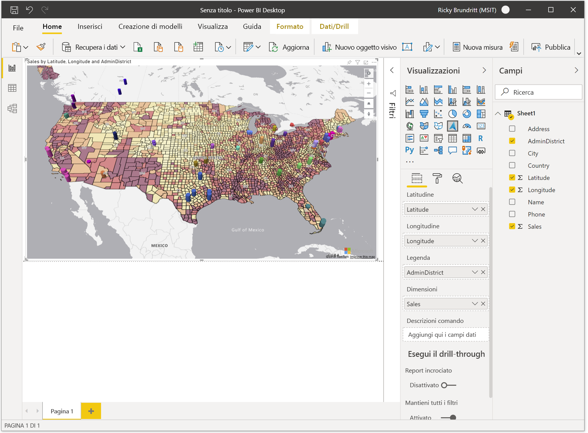

# Introduzione ad Azure Maps Power BI Visual

<Token>**si applica a:**  servizio Power BI per ***consumers***  servizio Power BI per le finestre di progettazione & sviluppatori  Power bi Desktop  licenza Pro o Premium</Token>

Questo articolo illustra come usare l'oggetto visivo Microsoft Azure Maps per Power BI.

> [!NOTE]
> Questo oggetto visivo può essere creato e visualizzato sia in Power BI Desktop che nel servizio Power BI. Le procedure e le illustrazioni in questo articolo si riferiscono a Power BI Desktop.

L'oggetto visivo Maps di Azure per Power BI offre un set completo di visualizzazioni dei dati spaziali su una mappa. Si stima che oltre il 80% dei dati aziendali disponga di un contesto di posizione. L'oggetto visivo mappe di Azure può essere usato per ottenere informazioni approfondite sul modo in cui il contesto del percorso è correlato e influisce sui dati aziendali.

## Cosa viene inviato ad Azure?

L'oggetto visivo Maps di Azure si connette al servizio cloud ospitato in Azure per recuperare i dati relativi alla posizione, ad esempio le immagini e le coordinate della mappa, usati per creare la visualizzazione mappa. 

-   I dettagli relativi all'area sulla quale si concentra la mappa vengono inviati ad Azure per recuperare le immagini necessarie per il rendering dell'area di disegno della mappa, nota anche come tessere mappa. 
-   I dati nei bucket location, latitudine e longitudine possono essere inviati ad Azure per recuperare le coordinate della mappa (un processo denominato geocodifica). 

L'utente o l'amministratore può dover aggiornare il firewall per consentire l'accesso alla piattaforma Azure Maps che usa l'URL seguente.

> `https://atlas.microsoft.com`

Per ulteriori informazioni sulla privacy e le condizioni per l'utilizzo correlate all'oggetto visivo Maps di Azure, vedere [Microsoft Azure informazioni legali](https://azure.microsoft.com/support/legal/).

## Comportamenti e requisiti dell'anteprima

Esistono alcune considerazioni e requisiti per questa versione di anteprima delle **mappe di Azure**:

-   L'oggetto visivo **mappe di Azure** è disponibile in anteprima e deve essere abilitato in Power bi desktop. Per abilitare le **mappe di Azure**, selezionare opzioni **file** &gt; **e impostazioni** &gt; **Opzioni** &gt; **Anteprima funzionalità**, quindi selezionare la casella di controllo **Visual Maps Azure** . Se l'oggetto visivo Maps di Azure non è disponibile dopo questa operazione, è probabile che sia necessario abilitare l'opzione di amministrazione del tenant nel portale di amministrazione.
-   Il set di dati deve contenere campi che contengono informazioni sulla **Latitudine** e la **Longitudine** . La geocodifica dei campi della località verrà aggiunta in un aggiornamento futuro.
-   Il controllo della legenda incorporato per Power BI attualmente non è visualizzato in questa anteprima. Verrà aggiunto in un aggiornamento futuro.

## Usare l'oggetto visivo Maps di Azure

Dopo aver abilitato l'oggetto visivo **Maps di Azure** , selezionare l'icona **mappe di Azure** nel riquadro **visualizzazioni** .

Power BI crea un'area di progettazione visiva di Azure Maps vuota. Durante la fase di anteprima, viene visualizzata un'altra dichiarazione di non responsabilità.

Per caricare l'oggetto visivo di Azure Maps, seguire questa procedura:

1.  Nel riquadro **campi** trascinare i campi dati che contengono le coordinate di latitudine e longitudine nei bucket **Latitudine** e/o **Longitudine** . Si tratta dei dati minimi necessari per caricare l'oggetto visivo mappe di Azure.
    
    > [!div class="mx-imgBorder"]
    > 

2.  Per colorare i dati in base alla categorizzazione, trascinare un campo categorico nel bucket **Legenda** del riquadro **campi** . In questo esempio viene usata la colonna **AdminDistrict** , nota anche come stato o provincia.  
    
    > [!div class="mx-imgBorder"]
    > 

    > [!NOTE]
    > Il controllo della legenda incorporato per Power BI attualmente non è visualizzato in questa anteprima. Verrà aggiunto in un aggiornamento futuro.

3.  Per ridimensionare i dati in modo relativamente, trascinare una misura nel bucket **dimensioni** del riquadro **campi** . In questo esempio viene usata la colonna **Sales** .  
    
    > [!div class="mx-imgBorder"]
    > 

4.  Utilizzare le opzioni nel riquadro **formato** per personalizzare la modalità di rendering dei dati. L'immagine seguente è la stessa mappa illustrata sopra, ma con l'opzione di trasparenza riempimento livelli bolla impostata su 50% e l'opzione di contorno a contrasto elevato abilitata.  
    
    > [!div class="mx-imgBorder"]
    > 

## Bucket del riquadro campi

I bucket di dati seguenti sono disponibili nel riquadro **campi** dell'oggetto visivo mappe di Azure.

| Campo     | Descrizione  |
|-----------|--------------|
| Latitude  | Campo utilizzato per specificare il valore di latitudine dei punti dati. I valori di latitudine devono essere compresi tra-90 e 90 in formato decimale.  |
| Longitudine | Campo utilizzato per specificare il valore di longitudine dei punti dati. I valori di longitudine devono essere compresi tra-180 e 180 in formato decimale.  |
| Legenda    | Il campo usato per suddividere in categorie i dati e assegnare un colore univoco per i punti dati in ogni categoria. Quando questo bucket viene riempito, una sezione **colori dati** verrà visualizzata nel riquadro **formato** che consente di apportare modifiche ai colori. |
| Dimensione      | Misura utilizzata per il dimensionamento relativo dei punti dati sulla mappa.   |
| Descrizioni comando  | Campi dati aggiuntivi che vengono visualizzati nelle descrizioni comandi quando le forme vengono posizionate al passaggio del mouse. |

## Impostazioni della mappa

Nella sezione **Impostazioni mappa** del riquadro formato sono disponibili opzioni per la personalizzazione della modalità di visualizzazione della mappa e la reazione degli aggiornamenti.

| Impostazione             | Descrizione  |
|---------------------|--------------|
| Zoom automatico           | Esegue lo zoom automatico della mappa nei dati caricati tramite il riquadro **campi** dell'oggetto visivo. Quando i dati vengono modificati, la relativa posizione viene aggiornata di conseguenza dalla mappa. Quando il dispositivo di scorrimento si trova nella posizione **off** , vengono visualizzate altre impostazioni della vista mappa per la visualizzazione mappa predefinita. |
| A capo automatico          | Consente all'utente di eseguire il panning orizzontale della mappa all'infinito. |
| Selezione stile        | Aggiunge un pulsante alla mappa che consente ai lettori del report di modificare lo stile della mappa. |
| Controlli di navigazione | Aggiunge pulsanti alla mappa come un altro metodo per consentire ai lettori del report di ingrandire, ruotare e modificare il passo della mappa. Per ulteriori informazioni, vedere questo documento sull' [esplorazione della mappa](map-accessibility.md#navigating-the-map) per informazioni dettagliate su tutti i diversi modi in cui gli utenti possono spostarsi nella mappa. |
| Stile mappa           | Stile della mappa. Per ulteriori informazioni sugli [stili di mappa supportati](supported-map-styles.md), vedere questo documento. |

### Impostazioni visualizzazione mappa

Se il dispositivo di scorrimento **Zoom automatico** è nella posizione **off** , vengono visualizzate le impostazioni seguenti e si consente all'utente di specificare le informazioni predefinite sulla vista mappa.

| Impostazione          | Descrizione   |
|------------------|---------------|
| Zoom             | Livello di zoom predefinito della mappa. Può essere un numero compreso tra 0 e 22. |
| Latitudine centrale  | La latitudine predefinita al centro della mappa. |
| Longitudine al centro | Longitudine predefinita al centro della mappa. |
| Prua          | L'orientamento predefinito della mappa in gradi, dove 0 è nord, 90 è est, 180 è sud e 270 è ovest. Può essere un numero qualsiasi compreso tra 0 e 360. |
| Tonalità            | L'inclinazione predefinita della mappa in gradi tra 0 e 60, dove 0 sta cercando verso il basso la mappa. |

## Considerazioni e limitazioni

L'oggetto visivo mappe di Azure è disponibile nei servizi e nelle applicazioni seguenti:

| Servizio/App                              | Disponibilità |
|------------------------------------------|--------------|
| Power BI Desktop                         | Sì          |
| Servizio Power BI (app.powerbi.com)       | Sì          |
| App Power BI per dispositivi mobili             | Sì          |
| Pubblica sul Web di Power BI                  | No           |
| Power BI Embedded                        | No           |
| Incorporamento del servizio Power BI (PowerBI.com) | Sì          |

Il supporto per altri servizi e app Power BI verrà aggiunto negli aggiornamenti futuri.

**Dove sono disponibili le mappe di Azure?**

Attualmente, Azure Maps è attualmente disponibile in tutti i paesi e le aree, ad eccezione di quanto segue:

- Cina
- Corea del Sud

Per informazioni dettagliate sulla copertura per i diversi servizi di Azure Maps che potenziano l'oggetto visivo, vedere il documento relativo alle [informazioni sulla copertura geografica](geographic-coverage.md) .

**Quali Web browser sono supportati dall'oggetto visivo Maps di Azure?**

Per informazioni sui [browser supportati da Azure Maps Web SDK](supported-browsers.md), vedere questa documentazione.

**Quanti punti dati è possibile visualizzare?**

Questo Visual supporta fino a 30.000 punti dati.

**In questo oggetti visivi possono essere usati indirizzi o altre stringhe di percorso?**

L'anteprima iniziale di questo oggetto visivo supporta solo i valori di latitudine e Longitudine in gradi decimali. Un aggiornamento futuro aggiungerà il supporto per gli indirizzi e altre stringhe di percorso.

## Passaggi successivi

Scopri di più sull'oggetto visivo Power BI mappe di Azure:

> [!div class="nextstepaction"]
> [Informazioni sui livelli nell'oggetto visivo Power BI mappe di Azure](power-bi-visual-understanding-layers.md)

> [!div class="nextstepaction"]
> [Gestire l'oggetto visivo Maps di Azure all'interno dell'organizzazione](power-bi-visual-manage-access.md)

Personalizzare l'oggetto visivo:

> [!div class="nextstepaction"]
> [Suggerimenti e consigli per la formattazione dei colori in Power BI](https://docs.microsoft.com/power-bi/visuals/service-tips-and-tricks-for-color-formatting)

> [!div class="nextstepaction"]
> [Personalizzare i titoli, gli sfondi e le legende delle visualizzazioni](https://docs.microsoft.com/power-bi/visuals/power-bi-visualization-customize-title-background-and-legend)
