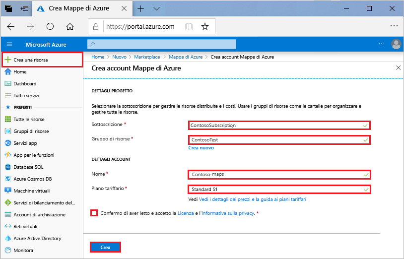
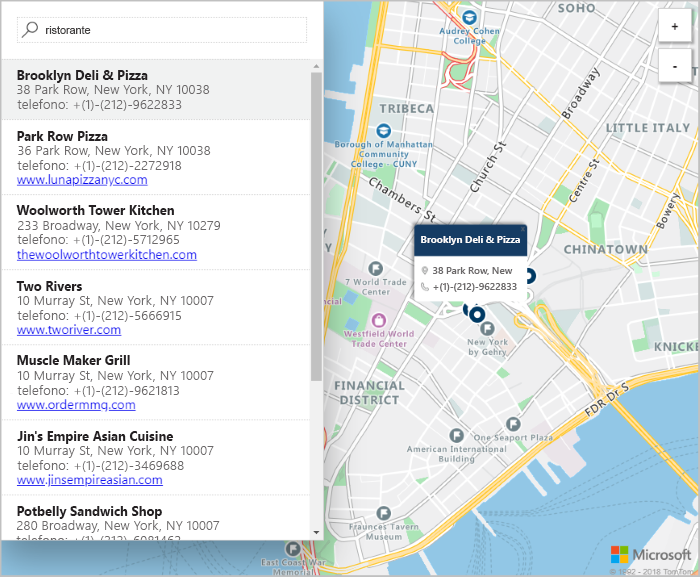

# Avviare una mappa per la ricerca interattiva con Mappe di Azure

Questo articolo illustra le funzionalità di Mappe di Azure che consentono di creare una mappa che offre agli utenti un'esperienza di ricerca interattiva. Vengono descritti i passaggi di base per creare un account di Mappe e ottenere la chiave dell'account da usare nell'applicazione Web demo. 

Se non si ha una sottoscrizione di Azure, creare un [account gratuito](https://azure.microsoft.com/free/?WT.mc_id=A261C142F) prima di iniziare.

## Accedere al Portale di Azure

Accedere al [Portale di Azure](https://portal.azure.com/).

## Creare un account e ottenere la chiave

1. Nell'angolo superiore sinistro del [portale di Azure](https://portal.azure.com) fare clic su **Crea una risorsa**.
2. Nella casella *Cerca nel Marketplace* digitare **Mappe**.
3. Fra i *risultati* selezionare **Mappe**. Fare clic sul pulsante **Crea** visualizzato sotto la mappa. 
4. Nella pagina **Crea account di Mappe** immettere i valori seguenti:
    - Il *nome* del nuovo account. 
    - La *sottoscrizione* da usare per l'account.
    - Il *gruppo di risorse* per l'account. Per il gruppo di risorse è possibile selezionare l'opzione *Crea nuovo* o *Usa esistente*.
    - Selezionare la *località del gruppo di risorse*.
    - Leggere la *Licenza* e l'*Informativa sulla Privacy* e selezionare la casella di controllo per accettare le condizioni. 
    - Infine fare clic sul pulsante **Crea**.

    

5. Dopo avere creato l'account, aprirlo e trovare la sezione delle impostazioni del menu dell'account. Fare clic su **Chiavi** per visualizzare le chiavi primaria e secondaria per l'account di Mappe di Azure. Copiare il valore di **Chiave primaria** negli Appunti in locale per usarlo nella sezione seguente. 

## Scaricare l'applicazione

1. Scaricare o copiare il contenuto del file [interactiveSearch.html](https://github.com/Azure-Samples/azure-maps-samples/blob/master/src/interactiveSearch.html).
2. Salvare il contenuto del file in locale come **AzureMapDemo.html** e aprirlo in un editor di testo.
3. Cercare la stringa `<insert-key>` e sostituirla con il valore di **Chiave primaria** ottenuto nella sezione precedente. 

## Avviare l'applicazione

1. Aprire il file **AzureMapDemo.html** nel browser che si preferisce.
2. Osservare la mappa visualizzata della città di Los Angeles. Fare zoom avanti e indietro per osservare come la mappa esegue automaticamente il rendering con più o meno informazioni a seconda del livello di zoom. 
3. Modificare il centro predefinito della mappa. Nel file **AzureMapDemo.html** cercare la variabile denominata **center**. Sostituire il valore della coppia longitudine, latitudine di questa variabile con i nuovi valori **[-74,0060, 40,7128]**. Salvare il file e aggiornare il browser. 
3. Provare l'esperienza di ricerca interattiva. Nella casella di ricerca nell'angolo in alto a sinistra dell'applicazione Web demo cercare **restaurants**. 
4. Spostare il puntatore del mouse sull'elenco di indirizzi e posizioni visualizzato sotto la casella di ricerca e osservare che l'indicatore corrispondente sulla mappa visualizza le informazioni sulla posizione corrispondente. Per la privacy delle aziende private, sono visualizzati nomi e indirizzi fittizi. 

    

## Pulire le risorse

Le esercitazioni analizzano in dettaglio come usare e configurare Mappe con l'account. Se si prevede di continuare con le esercitazioni, non eliminare le risorse create in questa guida introduttiva. Se non si prevede di continuare, usare i passaggi seguenti per eliminare tutte le risorse create da questa guida introduttiva.

1. Chiudere il browser che esegue l'applicazione Web **AzureMapDemo.html**.
2. Nel menu a sinistra del portale di Azure fare clic su **Tutte le risorse** e quindi selezionare l'account di Mappe. Nella parte superiore del pannello **Tutte le risorse** fare clic su **Elimina**.

## Passaggi successivi

In questa guida introduttiva è stato creato l'account di Mappe ed è stata avviata un'app demo. Per informazioni su come creare un'applicazione usando le API di Mappe, continuare con l'esercitazione seguente.

> [!div class="nextstepaction"]
> [Cercare i punti di interesse con Mappe](./tutorial-search-location.md)

Per altri esempi di codice e un'esperienza interattiva di codifica, vedere le guide pratiche seguenti.

> [!div class="nextstepaction"]
> [Come trovare un indirizzo usando il servizio di ricerca di Mappe di Azure](./how-to-search-for-address.md)

> [!div class="nextstepaction"]
> [Come usare il controllo mappa di Mappe di Azure](./how-to-use-map-control.md)
