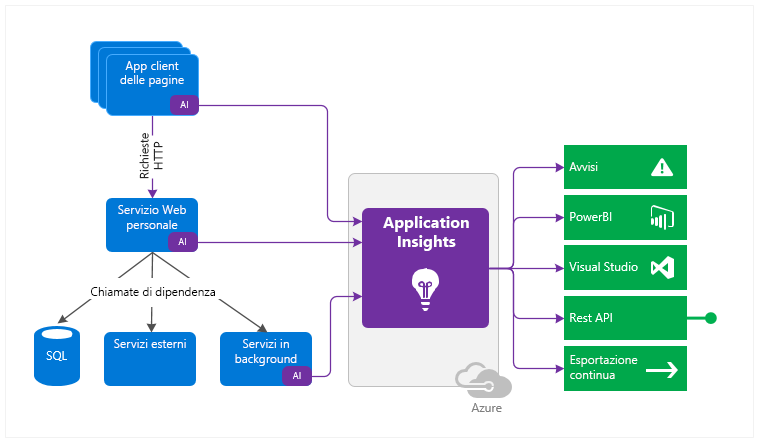
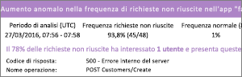
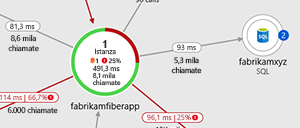
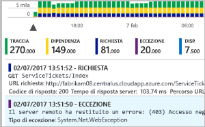
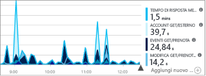
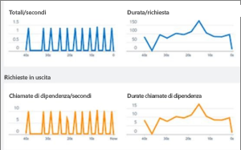
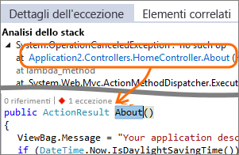
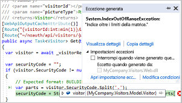
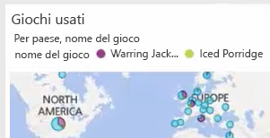

# Informazioni su Azure Application Insights
Application Insights, una funzionalità di [Monitoraggio di Azure](../overview.md), è un servizio estendibile di gestione delle prestazioni dell''applicazione per sviluppatori e professionisti DevOps. Può essere utilizzata per monitorare le applicazioni attive. Oltre a rilevare automaticamente le anomalie nelle prestazioni, include strumenti di analisi avanzati che consentono di diagnosticare i problemi e conoscere come viene effettivamente usata l'app dagli utenti.  Il servizio è progettato per supportare il miglioramento continuo delle prestazioni e dell'usabilità. Funziona per le app in un'ampia gamma di piattaforme, tra cui .NET, Node.js, Java e Python, ospitate in locale, ibride o in qualsiasi cloud pubblico. Si integra con il processo DevOps e offre punti di connessione per diversi altri strumenti di sviluppo. Può monitorare e analizzare i dati di telemetria da app per dispositivi mobili grazie all'integrazione con Visual Studio App Center.

## Come funziona Application Insights?
Si installa un pacchetto di strumentazione di piccole dimensioni (SDK) nell'applicazione o si abilita Application Insights usando l'agente di Application Insights, se [supportato](./platforms.md). La strumentazione monitora l'app e indirizza i dati di telemetria a una risorsa di Azure Application Insights usando un GUID univoco definito chiave di strumentazione.

È possibile instrumentare non solo l''applicazione del servizio Web, ma anche i componenti in background e il codice JavaScript nelle pagine Web stesse. L'applicazione e i relativi componenti possono essere eseguiti ovunque, non devono essere necessariamente ospitati in Azure.

Inoltre, è possibile effettuare il pull dei dati di telemetria dagli ambienti host, ad esempio i contatori delle prestazioni, la diagnostica di Azure o i log di Docker. È possibile configurare test web che inviano periodicamente richieste sintetiche al servizio web.

Tutti questi flussi di telemetria vengono integrati in Monitoraggio di Azure. Nel portale di Azure è possibile applicare potenti strumenti di analisi e ricerca ai dati non elaborati.

### Informazioni sul sovraccarico
L'impatto sulle prestazioni dell'app è ridotto. Le chiamate di rilevamento non sono bloccanti e vengono riunite in batch e inviate in un thread separato.

## Quali sono gli elementi monitorati da Application Insights?

Application Insights è destinato al team di sviluppo, a cui consente di comprendere le prestazioni e le modalità d'uso dell'app. Esegue il monitoraggio di:

* **Frequenza delle richieste, tempi di risposta e percentuali di errore**: trovare le pagine più visitate, gli orari di visita e la posizione degli utenti. Vedere quali pagine abbiano prestazioni migliori. Se i tempi di risposta e le percentuali di errore aumentano di pari passo con le richieste, è probabile che ci sia un problema di assegnazione delle risorse. 
* **Tassi di dipendenza, tempi di risposta e percentuali di errore**: trovare quali servizi esterni causino un rallentamento.
* **Eccezioni**: analizzare le statistiche aggregate o selezionare istanze specifiche e approfondire l'analisi dello stack e le richieste correlate. Vengono segnalate eccezioni di server e browser.
* **Visualizzazioni pagina e prestazioni di carico**, segnalate dai browser degli utenti.
* **Chiamate AJAX** dalle pagine Web: tassi, tempi di risposta e percentuali di errore.
* **Numeri di utenti e sessioni**.
* **Contatori delle prestazioni** dai computer server Windows o Linux, ad esempio l'uso di CPU, memoria e rete. 
* **Diagnostica dell'host** da Docker o Azure. 
* **Log di traccia di diagnostica** dall'app, in modo da poter correlare gli eventi di traccia con le richieste.
* **Eventi e metriche personalizzati** scritti dall'utente stesso nel codice del client o del server per tracciare eventi aziendali come gli articoli venduti o le partite vinte.

## Dove è possibile visualizzare i dati di telemetria?

È possibile esaminare i dati in numerosi modi. Vedere i seguenti articoli:

|  |  |
| --- | --- |
| [**Rilevamento intelligente e avvisi manuali**](./proactive-diagnostics.md) Configurare avvisi automatici che si adattano ai modelli normali di telemetria dell'app e si attivano quando qualcosa si discosta dal modello consueto. È anche possibile [impostare avvisi](../platform/alerts-log.md) per determinati livelli di metriche standard o personalizzate. | |
| [**Mappa delle applicazioni**](./app-map.md) Esplorare i componenti dell'app, con metriche chiave e avvisi. |  |
| [**Profiler**](./profiler.md) Ispezionare i profili di esecuzione delle richieste campionate. | |
| [**Analisi dell'utilizzo**](./usage-overview.md) Analizzare la segmentazione e la fidelizzazione degli utenti.| |
| [**Ricerca diagnostica dei dati dell'istanza**](./diagnostic-search.md) Cercare e filtrare eventi come richieste, eccezioni, chiamate di dipendenza, tracce di log e visualizzazioni di pagina.  | |
| [**Esplora metriche per i dati aggregati**](../platform/metrics-charts.md) Esaminare, filtrare e segmentare dati aggregati come frequenza delle richieste, errori, eccezioni, tempi di risposta e tempi di caricamento delle pagine. | |
| [**Dashboard**](./overview-dashboard.md) Combinare dati di più risorse e condividerli con altri utenti. Ideale per le applicazioni multi-componente e per la visualizzazione continua negli chat team. | |
| [**Flusso di metriche in tempo reale**](./live-stream.md) Quando si distribuisce una nuova build, controllare questi indicatori delle prestazioni in tempo quasi reale per verificare che tutto funzioni come previsto. | |
| [**Analisi**](../log-query/log-query-overview.md) Questo avanzato linguaggio di query consente di trovare risposta a domande approfondite sull'utilizzo e sulle prestazioni dell'app. | |
| [**Visual Studio**](./visual-studio.md) Vedere i dati sulle prestazioni nel codice. Passare al codice dalle analisi dello stack.| |
| [**Snapshot Debugger**](./snapshot-debugger.md) Eseguire il debug di snapshot campionati da operazioni attive, con i valori dei parametri.| |
| [**Power BI**](./export-power-bi.md) Integrare le metriche di uso con altra business intelligence.| |
| [**API REST**](https://dev.applicationinsights.io/) Scrivere codice per eseguire query su metriche e dati non elaborati.|  |
| [**Esportazione continua**](./export-telemetry.md) Eseguire l''esportazione in blocco dei dati non elaborati nell''archivio non appena arrivano. | |

## Come si usa Application Insights?

### Monitorare
Installare Application Insights nell'app, impostare i [test Web di disponibilità](./monitor-web-app-availability.md) e:

* Vedere il [dashboard dell'applicazione](./overview-dashboard.md) predefinito per la chat team, in modo da controllare carico, velocità di risposta e prestazioni delle dipendenze, caricamenti di pagina e chiamate AJAX.
* Scoprire quali sono le richieste più lente e con un maggior numero di errori.
* Guardare [Live Stream](./live-stream.md) quando si distribuisce una nuova versione, in modo da rendersi immediatamente conto di eventuali riduzioni delle prestazioni.

### Rilevare, eseguire una diagnosi
Quando si riceve un avviso o si individua un problema:

* Individuare il numero di utenti interessati.
* Correlare gli errori con eccezioni, chiamate alle dipendenze e tracce.
* Esaminare profiler, snapshot, dump dello stack e log di traccia.

### Compilare, misurare, acquisire informazioni
[Misurare l'efficacia](./usage-overview.md) di ogni nuova funzionalità che si distribuisce.

* Pianificare la misurazione del modo in cui i clienti usano nuove funzionalità aziendali o per l'esperienza utente.
* Scrivere dati di telemetria personalizzati nel codice.
* Basare il ciclo di sviluppo successivo sulle salde prove derivate dai dati di telemetria.

## Introduzione
Application Insights è uno dei molti servizi ospitati in Microsoft Azure e riceve i dati di telemetria per 	l''analisi e la presentazione. Prima di eseguire qualsiasi altra operazione, è necessario ottenere una sottoscrizione a [Microsoft Azure](https://azure.com). L'iscrizione è gratuita e, se si sceglie il [piano tariffario](https://azure.microsoft.com/pricing/details/application-insights/) Basic di Application Insights, la sottoscrizione resta gratuita finché l'applicazione non cresce fino a un uso sostanziale. Se l'organizzazione ha già una sottoscrizione, può aggiungervi l'account Microsoft dell'utente.

È possibile iniziare in diversi modi. Iniziare con il metodo più adatto alle proprie esigenze. È possibile aggiungere gli altri in un secondo momento.

* **In fase di esecuzione, instrumentare l'app Web sul server.** Ideale per le applicazioni già distribuite. È così possibile evitare qualsiasi aggiornamento del codice.
  * [**Applicazioni ASP.NET o ASP.NET Core ospitate in App Web di Azure**](./azure-web-apps.md)
  * [**Applicazioni ASP.NET ospitate in IIS in macchine virtuali di Azure o set di scalabilità di macchine virtuali di Azure**](./azure-vm-vmss-apps.md)
  * [**Applicazioni ASP.NET ospitate in IIS in macchine virtuali locali**](./monitor-performance-live-website-now.md)
* **In fase di sviluppo, aggiungere Application Insights al codice.** Consente di personalizzare la raccolta dei dati di telemetria e inviare dati di telemetria aggiuntivi.
  * [Applicazioni ASP.NET](./asp-net.md)
  * [Applicazioni ASP.NET Core](./asp-net-core.md)
  * [Applicazioni console .NET](./console.md)
  * [Java](./java-get-started.md)
  * [Node.js](./nodejs.md)
  * [Python](./opencensus-python.md)
  * [Altre piattaforme](./platforms.md)
* **[Instrumentare le pagine Web](./javascript.md)** per visualizzazione pagina, AJAX e altri dati di telemetria sul lato client.
* **[Analizzare l'uso di app per dispositivi mobili](../learn/mobile-center-quickstart.md)** tramite l'integrazione con Visual Studio App Center.
* **[Test di disponibilità:](./monitor-web-app-availability.md)** effettuare regolarmente il ping del sito Web dai server.

## Passaggi successivi
Introduzione in fase di esecuzione a:

* [App ospitate in IIS in macchine virtuali di Azure e set di scalabilità di macchine virtuali di Azure](./azure-vm-vmss-apps.md)
* [Server IIS](./monitor-performance-live-website-now.md)
* [App Web di Azure](./azure-web-apps.md)

Introduzione in fase di sviluppo a:

* [ASP.NET](./asp-net.md)
* [ASP.NET Core](./asp-net-core.md)
* [Java](./java-get-started.md)
* [Node.js](./nodejs.md)
* [Python](./opencensus-python.md)
* [JavaScript](./javascript.md)

## Supporto, commenti e suggerimenti
* Domande e problemi:
  * [Risoluzione dei problemi][qna]
  * [Pagina delle domande di Domande e risposte Microsoft](/answers/topics/azure-monitor.html)
  * [StackOverflow](https://stackoverflow.com/questions/tagged/ms-application-insights)
* Suggerimenti:
  * [UserVoice](https://feedback.azure.com/forums/357324-application-insights/filters/top)
* Blog:
  * [Blog di Application Insights](https://azure.microsoft.com/blog/tag/application-insights)

<!--Link references-->

[android]: ../learn/mobile-center-quickstart.md
[azure]: ../../insights-perf-analytics.md
[client]: ./javascript.md
[desktop]: ./windows-desktop.md
[greenbrown]: ./asp-net.md
[ios]: ../learn/mobile-center-quickstart.md
[java]: ./java-get-started.md
[knowUsers]: app-insights-web-track-usage.md
[platforms]: ./platforms.md
[portal]: https://portal.azure.com/
[qna]: ../faq.md
[redfield]: ./monitor-performance-live-website-now.md

