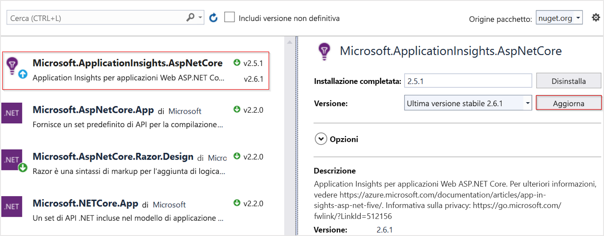

# <a name="application-insights-for-aspnet-core-applications"></a>Application Insights per le applicazioni ASP.NET Core

Questo articolo descrive come abilitare Application Insights per un'applicazione [ASP.NET Core](https://docs.microsoft.com/aspnet/core) . Al termine delle istruzioni riportate in questo articolo, Application Insights raccoglierà richieste, dipendenze, eccezioni, contatori delle prestazioni, heartbeat e log dall'applicazione ASP.NET Core.

L'esempio che verrà usato è un' [applicazione MVC](https://docs.microsoft.com/aspnet/core/tutorials/first-mvc-app) destinata a `netcoreapp2.2`. È possibile applicare queste istruzioni a tutte ASP.NET Core applicazioni.

## <a name="supported-scenarios"></a>Scenari supportati

Il [Application Insights SDK per ASP.NET Core è in grado di](https://nuget.org/packages/Microsoft.ApplicationInsights.AspNetCore) monitorare le applicazioni, indipendentemente da dove o come vengono eseguite. Se l'applicazione è in esecuzione e ha la connettività di rete ad Azure, è possibile raccogliere i dati di telemetria. Il monitoraggio Application Insights è supportato ovunque sia supportato .NET Core. Supporto tecnico:
* **Sistema operativo**: Windows, Linux o Mac.
* **Metodo di hosting**: in-process o out-of-process.
* **Metodo di distribuzione**: dipendente dal Framework o indipendente.
* **Server Web**: IIS (Internet Information Server) o gheppio.
* **Piattaforma di hosting**: la funzionalità app Web di app Azure servizio, VM di Azure, Docker, Azure Kubernetes Service (AKS) e così via.
* **Versione runtime di .NET Core**: 1. XX, 2. XX o 3. XX
* **IDE**: Visual Studio, vs code o riga di comando.

> [!NOTE]
> Se si usa ASP.NET Core 3,0 insieme a Application Insights, usare la versione [2.8.0](https://www.nuget.org/packages/Microsoft.ApplicationInsights.AspNetCore/2.8.0) o successiva. Questa è l'unica versione che supporta ASP.NET Core 3,0.

## <a name="prerequisites"></a>prerequisiti

- Applicazione ASP.NET Core funzionante. Se è necessario creare un'applicazione ASP.NET Core, seguire questa [esercitazione ASP.NET Core](https://docs.microsoft.com/aspnet/core/getting-started/).
- Chiave di strumentazione Application Insights valida. Questa chiave è necessaria per inviare i dati di telemetria a Application Insights. Se è necessario creare una nuova risorsa Application Insights per ottenere una chiave di strumentazione, vedere [creare una risorsa di Application Insights](https://docs.microsoft.com/azure/azure-monitor/app/create-new-resource).

## <a name="enable-application-insights-server-side-telemetry-visual-studio"></a>Abilitare la telemetria lato server Application Insights (Visual Studio)

1. Aprire il progetto in Visual Studio.

    > [!TIP]
    > Se lo si desidera, è possibile configurare il controllo del codice sorgente per il progetto in modo che sia possibile tenere traccia di tutte le modifiche apportate Application Insights. Per abilitare il controllo del codice sorgente, selezionare **File** > **Aggiungi al controllo del codice sorgente**.

2. Selezionare **Progetto** > **Aggiungi Application Insights Telemetry**.

3. Selezionare **Attività iniziali**. Il testo di questa selezione può variare a seconda della versione di Visual Studio. Alcune versioni precedenti usano invece un pulsante **Start Free** .

4. Selezionare la propria sottoscrizione. Selezionare quindi **Resource** > **Register**.

5. Dopo aver aggiunto Application Insights al progetto, verificare che si stia usando la versione stabile più recente dell'SDK. Passare a **Project** > **gestire i pacchetti NuGet** > **Microsoft. ApplicationInsights. AspNetCore**. Se necessario, scegliere **Aggiorna**.

     

6. Se è stato seguito il suggerimento facoltativo e il progetto è stato aggiunto al controllo del codice sorgente, passare a **View** > **Team Explorer** > **changes**. Selezionare quindi ogni file per visualizzare una visualizzazione diff delle modifiche apportate da Application Insights telemetria.

## <a name="enable-application-insights-server-side-telemetry-no-visual-studio"></a>Abilitare la telemetria lato server di Application Insights (senza Visual Studio)

1. Installare il [pacchetto NuGet di Application Insights SDK per ASP.NET Core](https://nuget.org/packages/Microsoft.ApplicationInsights.AspNetCore). È consigliabile usare sempre la versione stabile più recente. Trovare le note sulla versione complete per l'SDK nel [repository GitHub Open Source](https://github.com/Microsoft/ApplicationInsights-aspnetcore/releases).

    Nell'esempio di codice riportato di seguito vengono illustrate le modifiche da aggiungere al file di `.csproj` del progetto.

    ```xml
        <ItemGroup>
          <PackageReference Include="Microsoft.ApplicationInsights.AspNetCore" Version="2.8.0" />
        </ItemGroup>
    ```

2. Aggiungere `services.AddApplicationInsightsTelemetry();` al metodo `ConfigureServices()` nella classe `Startup`, come nell'esempio seguente:

    ```csharp
        // This method gets called by the runtime. Use this method to add services to the container.
        public void ConfigureServices(IServiceCollection services)
        {
            // The following line enables Application Insights telemetry collection.
            services.AddApplicationInsightsTelemetry();
    
            // This code adds other services for your application.
            services.AddMvc();
        }
    ```

3. Configurare la chiave di strumentazione.

    Sebbene sia possibile fornire la chiave di strumentazione come argomento per `AddApplicationInsightsTelemetry`, è consigliabile specificare la chiave di strumentazione nella configurazione. Nell'esempio di codice seguente viene illustrato come specificare una chiave di strumentazione in `appsettings.json`. Assicurarsi che `appsettings.json` venga copiato nella cartella radice dell'applicazione durante la pubblicazione.

    ```json
        {
          "ApplicationInsights": {
            "InstrumentationKey": "putinstrumentationkeyhere"
          },
          "Logging": {
            "LogLevel": {
              "Default": "Warning"
            }
          }
        }
    ```

    In alternativa, specificare la chiave di strumentazione in una delle seguenti variabili di ambiente:

    * `APPINSIGHTS_INSTRUMENTATIONKEY`

    * `ApplicationInsights:InstrumentationKey`

    Ad esempio:

    * `SET ApplicationInsights:InstrumentationKey=putinstrumentationkeyhere`

    * `SET APPINSIGHTS_INSTRUMENTATIONKEY=putinstrumentationkeyhere`

    In genere, `APPINSIGHTS_INSTRUMENTATIONKEY` specifica la chiave di strumentazione per le applicazioni distribuite in app Web di Azure.

    > [!NOTE]
    > Una chiave di strumentazione specificata nel codice prevale sulla variabile di ambiente `APPINSIGHTS_INSTRUMENTATIONKEY`, che prevale su altre opzioni.

## <a name="run-your-application"></a>Eseguire l'applicazione

Eseguire l'applicazione e creare richieste. I dati di telemetria dovrebbero ora fluire Application Insights. Il Application Insights SDK raccoglie automaticamente le richieste Web in ingresso per l'applicazione, insieme ai dati di telemetria seguenti.

### <a name="live-metrics"></a>Metriche attive

È possibile usare le metriche in tempo [reale](https://docs.microsoft.com/azure/application-insights/app-insights-live-stream) per verificare rapidamente se Application Insights il monitoraggio è configurato correttamente. Sebbene potrebbero essere necessari alcuni minuti prima che i dati di telemetria inizino a essere visualizzati nel portale e nelle analisi, le metriche attive indicheranno l'utilizzo della CPU del processo in esecuzione quasi in tempo reale. Può anche visualizzare altri dati di telemetria, ad esempio richieste, dipendenze, tracce e così via.

### <a name="ilogger-logs"></a>Log ILogger

I log emessi tramite `ILogger` di gravità `Warning` o superiore vengono acquisiti automaticamente. Seguire i [documenti di ILogger](ilogger.md#control-logging-level) per personalizzare i livelli di log acquisiti da Application Insights.

### <a name="dependencies"></a>Dependencies

La raccolta delle dipendenze è abilitata per impostazione predefinita. [Questo](asp-net-dependencies.md#automatically-tracked-dependencies) articolo illustra le dipendenze che vengono raccolte automaticamente e contiene anche i passaggi per eseguire il rilevamento manuale.

### <a name="performance-counters"></a>Contatori delle prestazioni

Il supporto per i [contatori delle prestazioni](https://azure.microsoft.com/documentation/articles/app-insights-web-monitor-performance/) in ASP.NET Core è limitato:

* Le versioni di SDK 2.4.1 e successive raccolgono i contatori delle prestazioni se l'applicazione è in esecuzione in app Web di Azure (Windows).
* Le versioni di SDK 2.7.1 e successive raccolgono contatori delle prestazioni se l'applicazione è in esecuzione in Windows e ha come destinazione `NETSTANDARD2.0` o versione successiva.
* Per le applicazioni destinate all'.NET Framework, tutte le versioni dell'SDK supportano i contatori delle prestazioni.
* Le versioni dell'SDK 2.8.0 e versioni successive supportano il contatore CPU/memoria in Linux. Nessun altro contatore è supportato in Linux. Il metodo consigliato per ottenere i contatori di sistema in Linux (e in altri ambienti non Windows) consiste nell'usare [EventCounters](#eventcounter)

### <a name="eventcounter"></a>EventCounter

`EventCounterCollectionModule` è abilitato per impostazione predefinita e verrà raccolto un set predefinito di contatori dalle app .NET Core 3,0. L'esercitazione [EventCounter](eventcounters.md) elenca il set predefinito di contatori raccolti. Sono inoltre disponibili istruzioni per la personalizzazione dell'elenco.

## <a name="enable-client-side-telemetry-for-web-applications"></a>Abilitare la telemetria sul lato client per le applicazioni Web

I passaggi precedenti sono sufficienti per iniziare a raccogliere i dati di telemetria sul lato server. Se l'applicazione ha componenti lato client, seguire i passaggi successivi per iniziare a raccogliere i [dati di telemetria sull'utilizzo](https://docs.microsoft.com/azure/azure-monitor/app/usage-overview).

1. In `_ViewImports.cshtml`aggiungere injection:

    ```cshtml
        @inject Microsoft.ApplicationInsights.AspNetCore.JavaScriptSnippet JavaScriptSnippet
    ```

2. In `_Layout.cshtml`inserire `HtmlHelper` alla fine della sezione `<head>` ma prima di qualsiasi altro script. Se si desidera segnalare i dati di telemetria JavaScript personalizzati dalla pagina, inserire il frammento di codice seguente:

    ```cshtml
        @Html.Raw(JavaScriptSnippet.FullScript)
        </head>
    ```

I nomi dei file di `.cshtml` a cui si fa riferimento in precedenza si trovano in un modello di applicazione MVC predefinito. Infine, se si desidera abilitare correttamente il monitoraggio lato client per l'applicazione, il frammento di codice JavaScript deve essere visualizzato nella sezione `<head>` di ogni pagina dell'applicazione che si desidera monitorare. È possibile raggiungere questo obiettivo per questo modello di applicazione aggiungendo il frammento di codice JavaScript per `_Layout.cshtml`. 

Se il progetto non include `_Layout.cshtml`, è comunque possibile aggiungere il [monitoraggio lato client](https://docs.microsoft.com/azure/azure-monitor/app/website-monitoring). A tale scopo, aggiungere il frammento di codice JavaScript a un file equivalente che controlla la `<head>` di tutte le pagine all'interno dell'app. In alternativa, è possibile aggiungere il frammento di codice a più pagine, ma questa soluzione è difficile da gestire e in genere non è consigliata.

## <a name="configure-the-application-insights-sdk"></a>Configurare il Application Insights SDK

Per modificare la configurazione predefinita, è possibile personalizzare l'SDK Application Insights per ASP.NET Core. Gli utenti di Application Insights SDK ASP.NET potrebbero avere familiarità con la modifica della configurazione utilizzando `ApplicationInsights.config` o modificando `TelemetryConfiguration.Active`. Modificare la configurazione in modo diverso per ASP.NET Core. Aggiungere la ASP.NET Core SDK all'applicazione e configurarla utilizzando ASP.NET Core [inserimento delle dipendenze](https://docs.microsoft.com/aspnet/core/fundamentals/dependency-injection)predefinito. Apportare quasi tutte le modifiche alla configurazione nel metodo `ConfigureServices()` della classe `Startup.cs`, a meno che non sia stato specificato diversamente. Nelle sezioni seguenti sono disponibili ulteriori informazioni.

> [!NOTE]
> Nelle applicazioni ASP.NET Core la modifica della configurazione modificando `TelemetryConfiguration.Active` non è supportata.

### <a name="using-applicationinsightsserviceoptions"></a>Uso di ApplicationInsightsServiceOptions

È possibile modificare alcune impostazioni comuni passando `ApplicationInsightsServiceOptions` al `AddApplicationInsightsTelemetry`, come nell'esempio seguente:

```csharp
public void ConfigureServices(IServiceCollection services)
{
    Microsoft.ApplicationInsights.AspNetCore.Extensions.ApplicationInsightsServiceOptions aiOptions
                = new Microsoft.ApplicationInsights.AspNetCore.Extensions.ApplicationInsightsServiceOptions();
    // Disables adaptive sampling.
    aiOptions.EnableAdaptiveSampling = false;

    // Disables QuickPulse (Live Metrics stream).
    aiOptions.EnableQuickPulseMetricStream = false;
    services.AddApplicationInsightsTelemetry(aiOptions);
}
```

Elenco completo delle impostazioni in `ApplicationInsightsServiceOptions`

|Impostazione | DESCRIZIONE | Default
|---------------|-------|-------
|EnableQuickPulseMetricStream | Abilita/Disabilita la funzionalità LiveMetrics | true
|EnableAdaptiveSampling | Abilita/Disabilita il campionamento adattivo | true
|EnableHeartbeat | Abilita/Disabilita la funzionalità heartbeat, che periodicamente (15 minuti per impostazione predefinita) Invia una metrica personalizzata denominata ' HeartBeatState ' con informazioni sul runtime come la versione .NET, le informazioni sull'ambiente di Azure, se applicabile e così via. | true
|AddAutoCollectedMetricExtractor | Abilita/Disabilita AutoCollectedMetrics Extractor, ovvero un TelemetryProcessor che invia metriche pre-aggregate relative a richieste/dipendenze prima che venga eseguita il campionamento. | true
|RequestCollectionOptions.TrackExceptions | Abilitare/disabilitare la creazione di report per il rilevamento delle eccezioni non gestite da parte del modulo di raccolta della richiesta. | false in NETSTANDARD 2.0 (poiché le eccezioni vengono rilevate con ApplicationInsightsLoggerProvider); in caso contrario, true.

Per l'elenco più aggiornato, vedere le [impostazioni configurabili in `ApplicationInsightsServiceOptions`](https://github.com/microsoft/ApplicationInsights-aspnetcore/blob/develop/src/Shared/Extensions/ApplicationInsightsServiceOptions.cs) .

### <a name="sampling"></a>Campionamento

Il Application Insights SDK per ASP.NET Core supporta sia il campionamento a frequenza fissa che quello adattivo. Il campionamento adattivo è abilitato per impostazione predefinita. 

Per altre informazioni, vedere [configurare il campionamento adattivo per ASP.NET Core applicazioni](../../azure-monitor/app/sampling.md#configuring-adaptive-sampling-for-aspnet-core-applications).

### <a name="adding-telemetryinitializers"></a>Aggiunta di TelemetryInitializers

Usare gli [inizializzatori di telemetria](https://docs.microsoft.com/azure/azure-monitor/app/api-filtering-sampling#addmodify-properties-itelemetryinitializer) quando si desidera definire le proprietà globali che vengono inviate con tutti i dati di telemetria.

Aggiungere nuovi `TelemetryInitializer` al contenitore `DependencyInjection`, come illustrato nel codice seguente. L'SDK preleva automaticamente qualsiasi `TelemetryInitializer` aggiunto al contenitore di `DependencyInjection`.

```csharp
public void ConfigureServices(IServiceCollection services)
{
    services.AddSingleton<ITelemetryInitializer, MyCustomTelemetryInitializer>();
}
```

### <a name="removing-telemetryinitializers"></a>Rimozione di TelemetryInitializers

Gli inizializzatori di telemetria sono presenti per impostazione predefinita. Per rimuovere tutti gli inizializzatori di telemetria o specifici, usare il codice di esempio seguente *dopo* avere chiamato `AddApplicationInsightsTelemetry()`.

```csharp
public void ConfigureServices(IServiceCollection services)
{
    services.AddApplicationInsightsTelemetry();

    // Remove a specific built-in telemetry initializer
    var tiToRemove = services.FirstOrDefault<ServiceDescriptor>
                        (t => t.ImplementationType == typeof(AspNetCoreEnvironmentTelemetryInitializer));
    if (tiToRemove != null)
    {
        services.Remove(tiToRemove);
    }

    // Remove all initializers
    // This requires importing namespace by using Microsoft.Extensions.DependencyInjection.Extensions;
    services.RemoveAll(typeof(ITelemetryInitializer));
}
```

### <a name="adding-telemetry-processors"></a>Aggiunta di processori di telemetria

È possibile aggiungere processori di telemetria personalizzati a `TelemetryConfiguration` usando il metodo di estensione `AddApplicationInsightsTelemetryProcessor` in `IServiceCollection`. I processori di telemetria vengono usati in [scenari di filtro avanzati](https://docs.microsoft.com/azure/azure-monitor/app/api-filtering-sampling#itelemetryprocessor-and-itelemetryinitializer). Usare l'esempio seguente.

```csharp
public void ConfigureServices(IServiceCollection services)
{
    // ...
    services.AddApplicationInsightsTelemetry();
    services.AddApplicationInsightsTelemetryProcessor<MyFirstCustomTelemetryProcessor>();

    // If you have more processors:
    services.AddApplicationInsightsTelemetryProcessor<MySecondCustomTelemetryProcessor>();
}
```

### <a name="configuring-or-removing-default-telemetrymodules"></a>Configurazione o rimozione di TelemetryModules predefiniti

Application Insights USA moduli di telemetria per raccogliere automaticamente dati di telemetria utili su carichi di lavoro specifici senza richiedere il rilevamento manuale da un utente.

I moduli di raccolta automatica seguenti sono abilitati per impostazione predefinita. Questi moduli sono responsabili della raccolta automatica dei dati di telemetria. È possibile disabilitarle o configurarle per modificarne il comportamento predefinito.

* `RequestTrackingTelemetryModule`: raccoglie RequestTelemetry dalle richieste Web in ingresso.
* `DependencyTrackingTelemetryModule`: raccoglie DependencyTelemetry dalle chiamate http in uscita e dalle chiamate SQL.
* `PerformanceCollectorModule`-raccoglie Windows PerformanceCounters.
* `QuickPulseTelemetryModule`: raccoglie i dati di telemetria per la visualizzazione nel portale di metriche attive.
* `AppServicesHeartbeatTelemetryModule`: raccoglie i battimenti cardiaci, che vengono inviati come metriche personalizzate, sull'ambiente app Azure servizio in cui è ospitata l'applicazione.
* `AzureInstanceMetadataTelemetryModule`: raccoglie i battimenti cardiaci, che vengono inviati come metriche personalizzate, sull'ambiente di macchine virtuali di Azure in cui è ospitata l'applicazione.
* `EventCounterCollectionModule`-raccoglie [EventCounters.](eventcounters.md) Questo modulo è una nuova funzionalità ed è disponibile nella versione SDK 2.8.0 e versioni successive.

Per configurare qualsiasi `TelemetryModule`predefinita, usare il metodo di estensione `ConfigureTelemetryModule<T>` su `IServiceCollection`, come illustrato nell'esempio seguente.

```csharp
using Microsoft.ApplicationInsights.DependencyCollector;
using Microsoft.ApplicationInsights.Extensibility.PerfCounterCollector;

public void ConfigureServices(IServiceCollection services)
{
    services.AddApplicationInsightsTelemetry();

    // The following configures DependencyTrackingTelemetryModule.
    // Similarly, any other default modules can be configured.
    services.ConfigureTelemetryModule<DependencyTrackingTelemetryModule>((module, o) =>
            {
                module.EnableW3CHeadersInjection = true;
            });

    // The following removes all default counters from EventCounterCollectionModule, and adds a single one.
    services.ConfigureTelemetryModule<EventCounterCollectionModule>(
            (module, o) =>
            {
                module.Counters.Clear();
                module.Counters.Add(new EventCounterCollectionRequest("System.Runtime", "gen-0-size"));
            }
        );

    // The following removes PerformanceCollectorModule to disable perf-counter collection.
    // Similarly, any other default modules can be removed.
    var performanceCounterService = services.FirstOrDefault<ServiceDescriptor>(t => t.ImplementationType == typeof(PerformanceCollectorModule));
    if (performanceCounterService != null)
    {
        services.Remove(performanceCounterService);
    }
}
```

### <a name="configuring-a-telemetry-channel"></a>Configurazione di un canale di telemetria

Il canale predefinito è `ServerTelemetryChannel`. È possibile eseguirne l'override come illustrato nell'esempio riportato di seguito.

```csharp
using Microsoft.ApplicationInsights.Channel;

    public void ConfigureServices(IServiceCollection services)
    {
        // Use the following to replace the default channel with InMemoryChannel.
        // This can also be applied to ServerTelemetryChannel.
        services.AddSingleton(typeof(ITelemetryChannel), new InMemoryChannel() {MaxTelemetryBufferCapacity = 19898 });

        services.AddApplicationInsightsTelemetry();
    }
```

### <a name="disable-telemetry-dynamically"></a>Disabilitare la telemetria in modo dinamico

Se si vuole disabilitare la telemetria in modo condizionale e dinamico, è possibile risolvere `TelemetryConfiguration` istanza con ASP.NET Core contenitore di inserimento delle dipendenze in qualsiasi punto del codice e impostare `DisableTelemetry` flag.

```csharp
    public void ConfigureServices(IServiceCollection services)
    {
        services.AddApplicationInsightsTelemetry();
    }

    public void Configure(IApplicationBuilder app, IHostingEnvironment env, TelemetryConfiguration configuration)
    {
        configuration.DisableTelemetry = true;
        ...
    }
```

Il precedente non impedisce ai moduli di raccolta automatica di raccogliere dati di telemetria. Solo l'invio di dati di telemetria a Application Insights viene disabilitato con l'approccio precedente. Se non si desidera un particolare modulo di raccolta automatica, è preferibile [rimuovere il modulo di telemetria](#configuring-or-removing-default-telemetrymodules)

## <a name="frequently-asked-questions"></a>Domande frequenti

### <a name="does-application-insights-support-aspnet-core-30"></a>Application Insights supporta ASP.NET Core 3,0?

Sì. Eseguire l'aggiornamento a [Application Insights SDK per ASP.NET Core](https://nuget.org/packages/Microsoft.ApplicationInsights.AspNetCore) versione 2.8.0 o successiva. Le versioni precedenti dell'SDK non supportano ASP.NET Core 3,0.

Inoltre, se si usano le istruzioni basate su Visual Studio da [qui](#enable-application-insights-server-side-telemetry-visual-studio), eseguire l'aggiornamento alla versione più recente di visual studio 2019 (16.3.0) per l'onboarding. Le versioni precedenti di Visual Studio non supportano l'onboarding automatico per le app ASP.NET Core 3,0.

### <a name="how-can-i-track-telemetry-thats-not-automatically-collected"></a>Come è possibile tenere traccia dei dati di telemetria che non vengono raccolti automaticamente?

Ottenere un'istanza di `TelemetryClient` usando l'inserimento del costruttore e chiamare il metodo `TrackXXX()` obbligatorio. Non è consigliabile creare nuove istanze di `TelemetryClient` in un'applicazione ASP.NET Core. Un'istanza singleton di `TelemetryClient` è già registrata nel contenitore `DependencyInjection`, che condivide `TelemetryConfiguration` con il resto dei dati di telemetria. La creazione di una nuova istanza di `TelemetryClient` è consigliata solo se è necessaria una configurazione separata dal resto dei dati di telemetria.

L'esempio seguente illustra come tenere traccia dei dati di telemetria aggiuntivi da un controller.

```csharp
using Microsoft.ApplicationInsights;

public class HomeController : Controller
{
    private TelemetryClient telemetry;

    // Use constructor injection to get a TelemetryClient instance.
    public HomeController(TelemetryClient telemetry)
    {
        this.telemetry = telemetry;
    }

    public IActionResult Index()
    {
        // Call the required TrackXXX method.
        this.telemetry.TrackEvent("HomePageRequested");
        return View();
    }
```

Per altre informazioni sulla creazione di report di dati personalizzati in Application Insights, vedere informazioni di riferimento sulle API per le [metriche personalizzate Application Insights](https://docs.microsoft.com/azure/azure-monitor/app/api-custom-events-metrics/).

### <a name="some-visual-studio-templates-used-the-useapplicationinsights-extension-method-on-iwebhostbuilder-to-enable-application-insights-is-this-usage-still-valid"></a>Alcuni modelli di Visual Studio hanno usato il metodo di estensione UseApplicationInsights () in IWebHostBuilder per abilitare Application Insights. Questo utilizzo è ancora valido?

Anche se il metodo di estensione `UseApplicationInsights()` è ancora supportato, è contrassegnato come obsoleto in Application Insights SDK versione 2.8.0 e versioni successive. Verrà rimossa nella prossima versione principale dell'SDK. Il modo consigliato per abilitare la telemetria Application Insights consiste nell'usare `AddApplicationInsightsTelemetry()` perché fornisce overload per controllare alcune configurazioni. Inoltre, in ASP.NET Core app 3,0 `services.AddApplicationInsightsTelemetry()` è l'unico modo per abilitare Application Insights.

### <a name="im-deploying-my-aspnet-core-application-to-web-apps-should-i-still-enable-the-application-insights-extension-from-web-apps"></a>Si distribuisce l'applicazione ASP.NET Core nelle app Web. È comunque possibile abilitare l'estensione Application Insights dalle app Web?

Se l'SDK viene installato in fase di compilazione, come illustrato in questo articolo, non è necessario abilitare l' [estensione Application Insights](https://docs.microsoft.com/azure/azure-monitor/app/azure-web-apps) dal portale del servizio app. Anche se l'estensione è installata, verrà riattivata quando viene rilevato che l'SDK è già stato aggiunto all'applicazione. Se si Abilita Application Insights dall'estensione, non è necessario installare e aggiornare l'SDK. Tuttavia, se si Abilita Application Insights seguendo le istruzioni riportate in questo articolo, si ha maggiore flessibilità perché:

   * Application Insights la telemetria continuerà a funzionare in:
       * Tutti i sistemi operativi, tra cui Windows, Linux e Mac.
       * Tutte le modalità di pubblicazione, inclusi i dipendenti indipendenti o del Framework.
       * Tutti i Framework di destinazione, inclusa la .NET Framework completa.
       * Tutte le opzioni di hosting, tra cui app Web, macchine virtuali, Linux, contenitori, servizio Azure Kubernetes e hosting non di Azure.
       * Tutte le versioni di .NET Core, incluse le versioni di anteprima.
   * È possibile visualizzare i dati di telemetria localmente durante il debug da Visual Studio.
   * È possibile tenere traccia dei dati di telemetria personalizzati aggiuntivi usando l'API `TrackXXX()`.
   * Si ha il controllo completo sulla configurazione.

### <a name="can-i-enable-application-insights-monitoring-by-using-tools-like-status-monitor"></a>È possibile abilitare il monitoraggio Application Insights usando strumenti come Status Monitor?

No. [Status Monitor](https://docs.microsoft.com/azure/azure-monitor/app/monitor-performance-live-website-now) e [Status Monitor V2](https://docs.microsoft.com/azure/azure-monitor/app/status-monitor-v2-overview) attualmente supportano solo ASP.NET 4. x.

### <a name="is-application-insights-automatically-enabled-for-my-aspnet-core-20-application"></a>Application Insights è abilitato automaticamente per l'applicazione ASP.NET Core 2,0?

Il metapacchetto `Microsoft.AspNetCore.All` 2,0 include l'SDK di Application Insights (versione 2.1.0). Se si esegue l'applicazione nel debugger di Visual Studio, Visual Studio Abilita Application Insights e Visualizza i dati di telemetria localmente nell'IDE stesso. La telemetria non è stata inviata al servizio Application Insights a meno che non sia stata specificata una chiave di strumentazione. È consigliabile seguire le istruzioni riportate in questo articolo per abilitare Application Insights, anche per le app 2,0.

### <a name="if-i-run-my-application-in-linux-are-all-features-supported"></a>Se eseguo l'applicazione in Linux, tutte le funzionalità sono supportate?

Sì. Il supporto delle funzionalità per l'SDK è lo stesso in tutte le piattaforme, con le eccezioni seguenti:

* I contatori delle prestazioni sono supportati solo in Windows.
* Anche se `ServerTelemetryChannel` è abilitato per impostazione predefinita, se l'applicazione è in esecuzione in Linux o MacOS, il canale non crea automaticamente una cartella di archiviazione locale per conservare temporaneamente la telemetria in caso di problemi di rete. A causa di questa limitazione, i dati di telemetria vengono persi in caso di problemi di rete o del server temporanei. Per risolvere questo problema, configurare una cartella locale per il canale:

```csharp
using Microsoft.ApplicationInsights.Channel;
using Microsoft.ApplicationInsights.WindowsServer.TelemetryChannel;

    public void ConfigureServices(IServiceCollection services)
    {
        // The following will configure the channel to use the given folder to temporarily
        // store telemetry items during network or Application Insights server issues.
        // User should ensure that the given folder already exists
        // and that the application has read/write permissions.
        services.AddSingleton(typeof(ITelemetryChannel),
                                new ServerTelemetryChannel () {StorageFolder = "/tmp/myfolder"});
        services.AddApplicationInsightsTelemetry();
    }
```

### <a name="is-this-sdk-supported-for-the-new-net-core-30-worker-service-template-applications"></a>Questo SDK è supportato per le nuove applicazioni modello di servizio di lavoro .NET Core 3,0?

Questo SDK richiede `HttpContext`e pertanto non funziona in alcuna applicazione non HTTP, incluse le applicazioni del servizio di lavoro .NET Core 3,0. Fare riferimento a [questo](worker-service.md) documento per abilitare Application Insights in tali applicazioni, usando il nuovo SDK Microsoft. ApplicationInsights. WorkerService.

## <a name="open-source-sdk"></a>SDK open source

[Leggere e contribuire al codice](https://github.com/Microsoft/ApplicationInsights-aspnetcore#recent-updates).

## <a name="video"></a>Video

- Vedere questo video dettagliato esterno per [configurare Application Insights con .NET Core e Visual Studio](https://www.youtube.com/watch?v=NoS9UhcR4gA&t) da zero.
- Vedere questo video dettagliato esterno per [configurare Application Insights con .NET Core e Visual Studio Code](https://youtu.be/ygGt84GDync) da zero.

## <a name="next-steps"></a>Passaggi successivi

* [Esplorare i flussi utente](../../azure-monitor/app/usage-flows.md) per comprendere in che modo gli utenti si spostano nell'app.
* [Configurare una raccolta di snapshot](https://docs.microsoft.com/azure/application-insights/app-insights-snapshot-debugger) per visualizzare lo stato del codice sorgente e delle variabili nel momento in cui viene generata un'eccezione.
* [Usare l'API](../../azure-monitor/app/api-custom-events-metrics.md) per inviare i propri eventi e metriche per una visualizzazione dettagliata delle prestazioni e dell'utilizzo dell'app.
* Usare [test di disponibilità](../../azure-monitor/app/monitor-web-app-availability.md) per controllare costantemente l'app da ogni parte del mondo.
* [Inserimento di dipendenze in ASP.NET Core](https://docs.microsoft.com/aspnet/core/fundamentals/dependency-injection)
