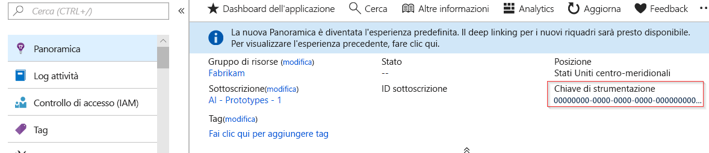
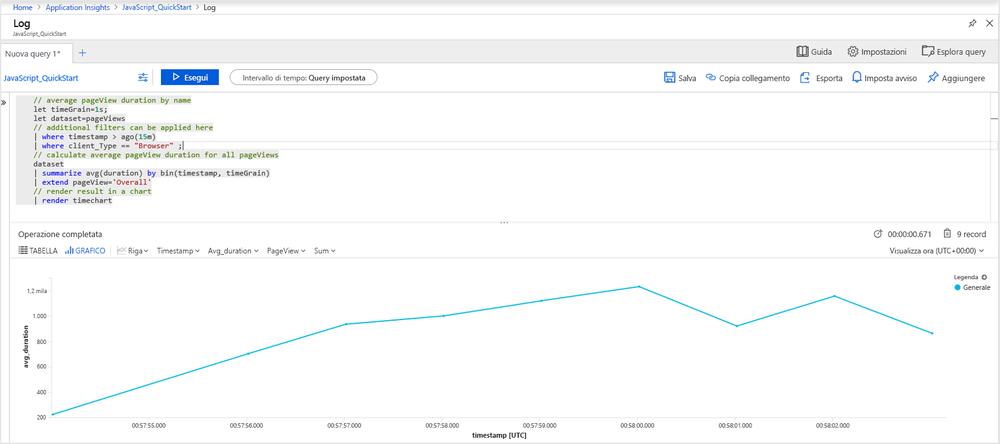
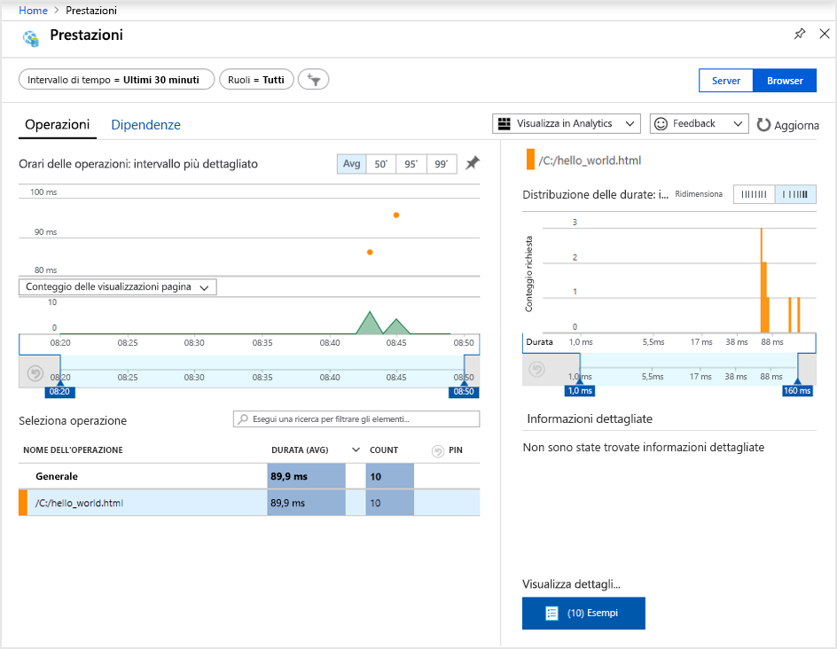
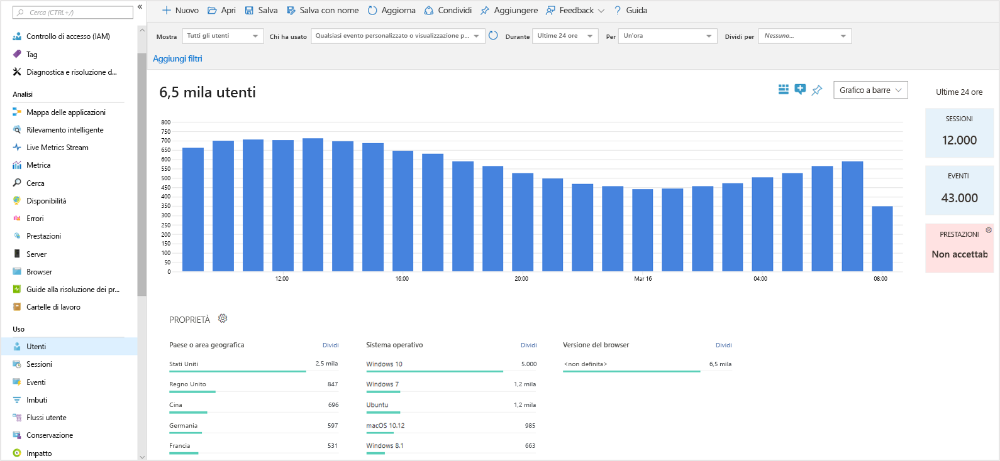
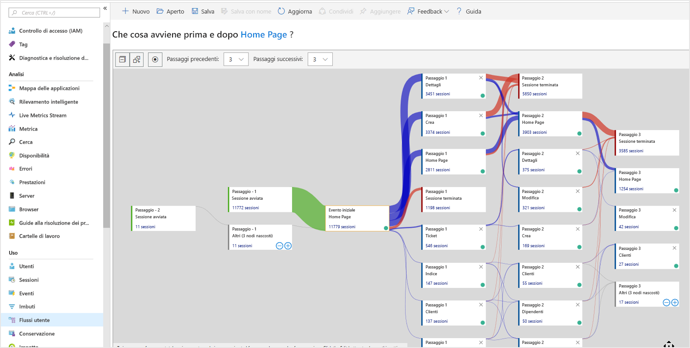

# <a name="quickstart-start-monitoring-your-website-with-azure-monitor-application-insights"></a>Guida introduttiva: Avviare il monitoraggio del sito Web con Application Insights di Monitoraggio di Azure

Questo argomento di avvio rapido illustra come aggiungere JavaScript SDK per Application Insights open source al sito Web. Descrive inoltre in maggior dettaglio l'esperienza lato client/browser per i visitatori del sito Web.

Con Application Insights di Monitoraggio di Azure è possibile monitorare facilmente la disponibilità, le prestazioni e l'utilizzo di un sito Web. È anche possibile identificare e diagnosticare rapidamente gli errori nell'applicazione senza attendere che vengano segnalati da un utente. Application Insights offre funzionalità di monitoraggio sia lato server che lato client/browser.

## <a name="prerequisites"></a>Prerequisiti

* Un account Azure con una sottoscrizione attiva. [Creare un account gratuitamente](https://azure.microsoft.com/free/?ref=microsoft.com&utm_source=microsoft.com&utm_medium=docs&utm_campaign=visualstudio).
* Un sito Web a cui è possibile aggiungere JavaScript SDK per Application Insights.

## <a name="enable-application-insights"></a>Abilitare Application Insights

Application Insights può raccogliere dati di telemetria da qualsiasi applicazione connessa a Internet in esecuzione in locale o nel cloud. Per visualizzare questi dati, procedere come segue:

1. Accedere al [portale di Azure](https://portal.azure.com/).
1. Selezionare **Crea una risorsa** > **Strumenti di gestione** > **Application Insights**.

   > [!NOTE]
   >Se è la prima volta che viene creata una risorsa di Application Insights, vedere [Creare una risorsa di Application Insights](./create-new-resource.md).
1. Quando viene visualizzata la finestra di configurazione, usare la tabella seguente per completare i campi di input:

    | Impostazioni        | valore           | Descrizione  |
   | ------------- |:-------------|:-----|
   | **Nome**      | Valore globalmente univoco | Il nome che identifica l'app da monitorare. |
   | **Gruppo di risorse**     | myResourceGroup      | Il nome del nuovo gruppo di risorse in cui ospitare i dati di Application Insights. è possibile creare un nuovo gruppo di risorse o selezionarne uno esistente. |
   | **Posizione** | Stati Uniti orientali | Scegliere una località nelle vicinanze o vicina a quella in cui è ospitata l'app. |
1. Selezionare **Create** (Crea).

## <a name="create-an-html-file"></a>Creare un file HTML

1. Nel computer locale creare un file denominato ``hello_world.html``. Per questo esempio, creare il file nella radice dell'unità C, ad esempio ``C:\hello_world.html``.
1. Copiare e incollare lo script seguente in ``hello_world.html``:

    ```html
    <!DOCTYPE html>
    <html>
    <head>
    <title>Azure Monitor Application Insights</title>
    </head>
    <body>
    <h1>Azure Monitor Application Insights Hello World!</h1>
    <p>You can use the Application Insights JavaScript SDK to perform client/browser-side monitoring of your website. To learn about more advanced JavaScript SDK configurations, visit the <a href="https://github.com/Microsoft/ApplicationInsights-JS/blob/master/API-reference.md" title="API Reference">API reference</a>.</p>
    </body>
    </html>
    ```

## <a name="configure-application-insights-sdk"></a>Configura Application Insights SDK

1. Selezionare **Panoramica** > **Informazioni di base** e quindi copiare la **chiave di strumentazione** dell'applicazione.

   

1. Aggiungere lo script seguente al file ``hello_world.html`` prima del tag ``</head>`` di chiusura:

    ```javascript
    <script type="text/javascript">
    !function(T,l,y){var S=T.location,u="script",k="instrumentationKey",D="ingestionendpoint",C="disableExceptionTracking",E="ai.device.",I="toLowerCase",b="crossOrigin",w="POST",e="appInsightsSDK",t=y.name||"appInsights";(y.name||T[e])&&(T[e]=t);var n=T[t]||function(d){var g=!1,f=!1,m={initialize:!0,queue:[],sv:"4",version:2,config:d};function v(e,t){var n={},a="Browser";return n[E+"id"]=a[I](),n[E+"type"]=a,n["ai.operation.name"]=S&&S.pathname||"_unknown_",n["ai.internal.sdkVersion"]="javascript:snippet_"+(m.sv||m.version),{time:function(){var e=new Date;function t(e){var t=""+e;return 1===t.length&&(t="0"+t),t}return e.getUTCFullYear()+"-"+t(1+e.getUTCMonth())+"-"+t(e.getUTCDate())+"T"+t(e.getUTCHours())+":"+t(e.getUTCMinutes())+":"+t(e.getUTCSeconds())+"."+((e.getUTCMilliseconds()/1e3).toFixed(3)+"").slice(2,5)+"Z"}(),iKey:e,name:"Microsoft.ApplicationInsights."+e.replace(/-/g,"")+"."+t,sampleRate:100,tags:n,data:{baseData:{ver:2}}}}var h=d.url||y.src;if(h){function a(e){var t,n,a,i,r,o,s,c,p,l,u;g=!0,m.queue=[],f||(f=!0,t=h,s=function(){var e={},t=d.connectionString;if(t)for(var n=t.split(";"),a=0;a<n.length;a++){var i=n[a].split("=");2===i.length&&(e[i[0][I]()]=i[1])}if(!e[D]){var r=e.endpointsuffix,o=r?e.location:null;e[D]="https://"+(o?o+".":"")+"dc."+(r||"services.visualstudio.com")}return e}(),c=s[k]||d[k]||"",p=s[D],l=p?p+"/v2/track":config.endpointUrl,(u=[]).push((n="SDK LOAD Failure: Failed to load Application Insights SDK script (See stack for details)",a=t,i=l,(o=(r=v(c,"Exception")).data).baseType="ExceptionData",o.baseData.exceptions=[{typeName:"SDKLoadFailed",message:n.replace(/\./g,"-"),hasFullStack:!1,stack:n+"\nSnippet failed to load ["+a+"] -- Telemetry is disabled\nHelp Link: https://go.microsoft.com/fwlink/?linkid=2128109\nHost: "+(S&&S.pathname||"_unknown_")+"\nEndpoint: "+i,parsedStack:[]}],r)),u.push(function(e,t,n,a){var i=v(c,"Message"),r=i.data;r.baseType="MessageData";var o=r.baseData;return o.message='AI (Internal): 99 message:"'+("SDK LOAD Failure: Failed to load Application Insights SDK script (See stack for details) ("+n+")").replace(/\"/g,"")+'"',o.properties={endpoint:a},i}(0,0,t,l)),function(e,t){if(JSON){var n=T.fetch;if(n&&!y.useXhr)n(t,{method:w,body:JSON.stringify(e),mode:"cors"});else if(XMLHttpRequest){var a=new XMLHttpRequest;a.open(w,t),a.setRequestHeader("Content-type","application/json"),a.send(JSON.stringify(e))}}}(u,l))}function i(e,t){f||setTimeout(function(){!t&&m.core||a()},500)}var e=function(){var n=l.createElement(u);n.src=h;var e=y[b];return!e&&""!==e||"undefined"==n[b]||(n[b]=e),n.onload=i,n.onerror=a,n.onreadystatechange=function(e,t){"loaded"!==n.readyState&&"complete"!==n.readyState||i(0,t)},n}();y.ld<0?l.getElementsByTagName("head")[0].appendChild(e):setTimeout(function(){l.getElementsByTagName(u)[0].parentNode.appendChild(e)},y.ld||0)}try{m.cookie=l.cookie}catch(p){}function t(e){for(;e.length;)!function(t){m[t]=function(){var e=arguments;g||m.queue.push(function(){m[t].apply(m,e)})}}(e.pop())}var n="track",r="TrackPage",o="TrackEvent";t([n+"Event",n+"PageView",n+"Exception",n+"Trace",n+"DependencyData",n+"Metric",n+"PageViewPerformance","start"+r,"stop"+r,"start"+o,"stop"+o,"addTelemetryInitializer","setAuthenticatedUserContext","clearAuthenticatedUserContext","flush"]),m.SeverityLevel={Verbose:0,Information:1,Warning:2,Error:3,Critical:4};var s=(d.extensionConfig||{}).ApplicationInsightsAnalytics||{};if(!0!==d[C]&&!0!==s[C]){method="onerror",t(["_"+method]);var c=T[method];T[method]=function(e,t,n,a,i){var r=c&&c(e,t,n,a,i);return!0!==r&&m["_"+method]({message:e,url:t,lineNumber:n,columnNumber:a,error:i}),r},d.autoExceptionInstrumented=!0}return m}(y.cfg);(T[t]=n).queue&&0===n.queue.length&&n.trackPageView({})}(window,document,{
    src: "https://az416426.vo.msecnd.net/scripts/b/ai.2.min.js", // The SDK URL Source
    //name: "appInsights", // Global SDK Instance name defaults to "appInsights" when not supplied
    //ld: 0, // Defines the load delay (in ms) before attempting to load the sdk. -1 = block page load and add to head. (default) = 0ms load after timeout,
    //useXhr: 1, // Use XHR instead of fetch to report failures (if available),
    //crossOrigin: "anonymous", // When supplied this will add the provided value as the cross origin attribute on the script tag 
    cfg: { // Application Insights Configuration
        instrumentationKey: "YOUR_INSTRUMENTATION_KEY_GOES_HERE"
        /* ...Other Configuration Options... */
    }});
    </script>
    ```
    
1. Modificare il file ``hello_world.html`` e aggiungere la chiave di strumentazione.

1. Aprire ``hello_world.html`` in una sessione del browser locale. Questa azione crea una visualizzazione a pagina singola. È possibile aggiornare il browser per generare più visualizzazioni di pagine di test.

## <a name="monitor-your-website-in-the-azure-portal"></a>Monitorare il sito Web nel portale di Azure

1. Riaprire la pagina **Panoramica** di Application Insights nel portale di Azure per visualizzare i dettagli relativi all'applicazione in esecuzione. La pagina **Panoramica** è la posizione in cui è stata recuperata la chiave di strumentazione.

   I quattro grafici predefiniti nella pagina di panoramica hanno come ambiti i dati dell'applicazione lato server. Dato che vengono instrumentate le interazioni lato client/browser con JavaScript SDK, questa specifica visualizzazione non si applica a meno che non sia installato anche un SDK lato server.

1. Selezionare **Analisi** .  Questa azione apre la finestra **Analisi**, che fornisce un linguaggio di query avanzato per l'analisi di tutti i dati raccolti da Application Insights. Per visualizzare i dati relativi alle richieste del browser sul lato client, eseguire la query seguente:

    ```kusto
    // average pageView duration by name
    let timeGrain=1s;
    let dataset=pageViews
    // additional filters can be applied here
    | where timestamp > ago(15m)
    | where client_Type == "Browser" ;
    // calculate average pageView duration for all pageViews
    dataset
    | summarize avg(duration) by bin(timestamp, timeGrain)
    | extend pageView='Overall'
    // render result in a chart
    | render timechart
    ```

   

1. Tornare alla pagina **Panoramica**. Nell'intestazione **Analisi** selezionare **Browser** e quindi **Prestazioni**.  Vengono visualizzate le metriche relative alle prestazioni del sito Web. È disponibile una visualizzazione corrispondente per l'analisi degli errori e delle eccezioni nel sito Web. È possibile selezionare **Esempi** per accedere a [Dettagli sulle transazioni end-to-end](./transaction-diagnostics.md).

   

1. Nel menu principale di Application Insights, nell'intestazione **Utilizzo** selezionare [**Utenti**](./usage-segmentation.md) per iniziare a esplorazione gli [strumenti di analisi del comportamento degli utenti](./usage-overview.md). Poiché i test vengono eseguiti da un singolo computer, si vedranno i dati per un unico utente. Per un sito Web live, la distribuzione degli utenti sarà simile alla seguente:

     

1. Per un sito Web più complesso con più pagine, è possibile usare lo strumento [**Flussi utente**](./usage-flows.md) per tenere traccia del percorso seguito dai visitatori attraverso le varie sezioni.

   

Per informazioni su configurazioni più avanzate per il monitoraggio di siti Web, vedere le [informazioni di riferimento sull'API di JavaScript SDK](./javascript.md).

## <a name="clean-up-resources"></a>Pulire le risorse

Se si prevede di continuare a seguire altri argomenti di avvio rapido o esercitazioni, non pulire le risorse create in questa guida. In caso contrario, seguire questa procedura per eliminare tutte le risorse create in questa guida nel portale di Azure.

> [!NOTE]
> Se è stato usato un gruppo di risorse esistente, le istruzioni seguenti non si applicano. È invece possibile eliminare solo la singola risorsa di Application Insights. Tenere presente che ogni volta che si elimina un gruppo di risorse vengono eliminati anche tutti i membri e le risorse di tale gruppo.

1. Nel menu sinistro del portale di Azure selezionare **Gruppi di risorse** e quindi **myResourceGroup** oppure il nome di un proprio gruppo di risorse temporaneo.
1. Nella pagina del gruppo di risorse selezionare **Elimina**, immettere **myResourceGroup** nella casella di testo e quindi scegliere **Elimina**.

## <a name="next-steps"></a>Passaggi successivi

> [!div class="nextstepaction"]
> [Rilevare e diagnosticare i problemi di prestazioni](../log-query/log-query-overview.md)

