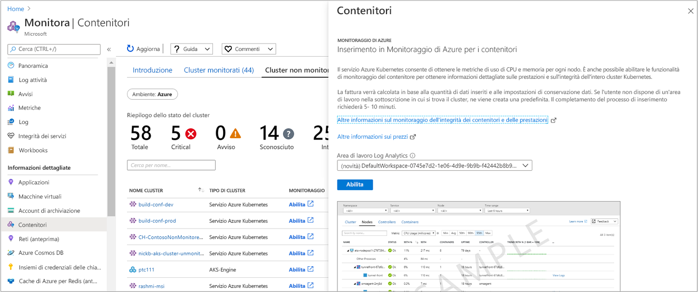

# <a name="how-to-onboard-azure-monitor-for-containers"></a>Come eseguire l'onboarding di Monitoraggio di Azure per contenitori  
Questo articolo descrive come configurare Monitoraggio di Azure per contenitori per monitorare le prestazioni dei carichi di lavoro distribuiti negli ambienti Kubernetes e ospitati nel [servizio Azure Kubernetes](https://docs.microsoft.com/azure/aks/).

Monitoraggio di Azure per i contenitori può essere abilitato per le nuove distribuzioni oppure per una o più distribuzioni esistenti del servizio Azure Kubernetes usando i metodi supportati seguenti:

* Dal portale di Azure oppure con l'interfaccia della riga di comando di Azure
* Usando [Terraform e il servizio Azure Kubernetes](../../terraform/terraform-create-k8s-cluster-with-tf-and-aks.md)

## <a name="prerequisites"></a>Prerequisiti 
Prima di iniziare, verificare di disporre degli elementi seguenti:

- Un'area di lavoro di Log Analytics. È possibile crearla quando si abilita il monitoraggio del nuovo cluster AKS o lasciare che l'esperienza di onboarding crei un'area di lavoro predefinita nel gruppo di risorse predefinito della sottoscrizione del cluster AKS. Se si è scelto di crearla in autonomia, è possibile procedere attraverso [Azure Resource Manager](../../azure-monitor/platform/template-workspace-configuration.md), [PowerShell](../scripts/powershell-sample-create-workspace.md?toc=%2fpowershell%2fmodule%2ftoc.json) o il [portale di Azure](../../azure-monitor/learn/quick-create-workspace.md).
- Si è membri del ruolo di collaboratore di Log Analytics per abilitare il monitoraggio dei contenitori. Per altre informazioni su come controllare l'accesso a un'area di lavoro di Log Analytics, vedere [Gestire le aree di lavoro](../../azure-monitor/platform/manage-access.md).

[!INCLUDE [log-analytics-agent-note](../../../includes/log-analytics-agent-note.md)]

## <a name="components"></a>Componenti 

La capacità di monitorare le prestazioni si basa su un agente di Log Analytics per Linux incluso in un contenitore sviluppato appositamente per Monitoraggio di Azure per i contenitori. L'agente specializzato raccoglie i dati su prestazioni ed eventi da tutti i nodi del cluster e viene distribuito e registrato automaticamente con l'area di lavoro di Log Analytics specificata durante la distribuzione. La versione dell'agente è microsoft/oms:ciprod04202018 o versione successiva ed è rappresentata da una data nel formato seguente: *mmggaaaa*. 

Quando viene rilasciata una nuova versione dell'agente, questo viene aggiornato automaticamente nei cluster Kubernetes gestiti ospitati nel servizio Azure Kubernetes. Per seguire le versioni rilasciate, consultare gli [annunci relativi alla versione dell'agente](https://github.com/microsoft/docker-provider/tree/ci_feature_prod). 

>[!NOTE] 
>Se è già stato distribuito un cluster AKS, si abilita il monitoraggio usando l'interfaccia della riga di comando di Azure o un modello di Azure Resource Manager fornito, come illustrato più avanti in questo articolo. Non è possibile usare `kubectl` per aggiornare, eliminare, distribuire o ridistribuire l'agente. Il modello deve essere distribuito nello stesso gruppo di risorse del cluster.

## <a name="sign-in-to-the-azure-portal"></a>Accedere al portale di Azure
Accedere al [portale di Azure](https://portal.azure.com). 

## <a name="enable-monitoring-for-a-new-cluster"></a>Abilitare il monitoraggio per un nuovo cluster
Durante la distribuzione, è possibile abilitare il monitoraggio di un nuovo cluster del servizio Azure Kubernetes nel portale di Azure, con l'interfaccia della riga di comando di Azure o con Terraform.  Seguire la procedura nell'articolo introduttivo [Distribuire un cluster del servizio Azure Kubernetes](../../aks/kubernetes-walkthrough-portal.md) se si desidera abilitarlo dal portale. Nella pagina **Monitoraggio** selezionare **Sì** per l'opzione **Abilita monitoraggio** e quindi selezionare un'area di lavoro di Log Analytics esistente o crearne una nuova. 

### <a name="enable-using-azure-cli"></a>Abilitare tramite l'interfaccia della riga di comando di Azure
Per abilitare il monitoraggio di un nuovo cluster AKS creato con l'interfaccia della riga di comando di Azure, seguire la procedura nell'articolo introduttivo nella sezione [Creare il cluster AKS](../../aks/kubernetes-walkthrough.md#create-aks-cluster).  

>[!NOTE]
>Se si sceglie di usare l'interfaccia della riga di comando di Azure, è prima necessario installarla ed eseguirla in locale. È richiesta l'interfaccia della riga di comando di Azure 2.0.43 o versione successiva. Per identificare la versione in uso, eseguire `az --version`. Se è necessario eseguire l'installazione o l'aggiornamento, vedere [Installare l'interfaccia della riga di comando di Azure](https://docs.microsoft.com/cli/azure/install-azure-cli). 
>

### <a name="enable-using-terraform"></a>Abilitare con Terraform
Se si [distribuisce un cluster del servizio Azure Kubernetes con Terraform](../../terraform/terraform-create-k8s-cluster-with-tf-and-aks.md), occorre specificare gli argomenti richiesti nel profilo [per creare un'area di lavoro di Log Analytics](https://www.terraform.io/docs/providers/azurerm/r/log_analytics_workspace.html) se non si è scelto di specificarne una esistente. 

>[!NOTE]
>Se si sceglie di usare Terraform, è necessario eseguire il provider per Azure RM di Terraform versione 1.17.0 o successiva.

Per aggiungere Monitoraggio di Azure per i contenitori all'area di lavoro, vedere [azurerm_log_analytics_solution](https://www.terraform.io/docs/providers/azurerm/r/log_analytics_solution.html) e completare il profilo includendo l'argomento [**addon_profile**](https://www.terraform.io/docs/providers/azurerm/r/kubernetes_cluster.html#addon_profile) e specificando **oms_agent**. 

Dopo aver abilitato il monitoraggio e completato tutte le attività di configurazione, è possibile monitorare le prestazioni del cluster in uno dei due modi seguenti:

* Direttamente dal cluster AKS, selezionando **Integrità** nel riquadro sinistro.
* Facendo clic sul riquadro delle **informazioni dettagliate di Monitora Contenitori** nella pagina relativa al cluster AKS selezionato. In Monitoraggio di Azure selezionare **Integrità** nel riquadro sinistro. 

  

Dopo aver abilitato il monitoraggio, possono essere necessari circa 15 minuti prima di poter visualizzare le metriche di integrità per il cluster. 

## <a name="enable-monitoring-for-existing-managed-clusters"></a>Abilitare il monitoraggio per i cluster gestiti esistenti
È possibile abilitare il monitoraggio di un cluster AKS già distribuito usando l'interfaccia della riga di comando di Azure, dal portale o con il modello di Azure Resource Manager fornito usando il cmdlet di PowerShell `New-AzureRmResourceGroupDeployment`. 

### <a name="enable-monitoring-using-azure-cli"></a>Abilitare il monitoraggio usando l'interfaccia della riga di comando di Azure
La procedura seguente abilita il monitoraggio del cluster AKS usando l'interfaccia della riga di comando di Azure. In questo esempio non è necessario creare o specificare un'area di lavoro esistente. Questo comando semplifica il processo creando un'area di lavoro predefinita nel gruppo di risorse predefinito della sottoscrizione del cluster AKS se non ne esiste già una nella regione.  L'area di lavoro predefinita creata ricorda il formato di *DefaultWorkspace-<GUID>-<Region>*.  

```azurecli
az aks enable-addons -a monitoring -n MyExistingManagedCluster -g MyExistingManagedClusterRG  
```

L'output sarà simile al seguente:

```azurecli
provisioningState       : Succeeded
```

Se invece si vuole eseguire l'integrazione con un'area di lavoro esistente, usare il comando seguente per specificare tale area di lavoro.

```azurecli
az aks enable-addons -a monitoring -n MyExistingManagedCluster -g MyExistingManagedClusterRG --workspace-resource-id <ExistingWorkspaceResourceID> 
```

L'output sarà simile al seguente:

```azurecli
provisioningState       : Succeeded
```

### <a name="enable-monitoring-using-terraform"></a>Abilitare il monitoraggio usando Terraform
1. Aggiungere il profilo del componente aggiuntivo **oms_agent** alla [risorsa azurerm_kubernetes_cluster](https://www.terraform.io/docs/providers/azurerm/d/kubernetes_cluster.html#addon_profile) esistente

   ```
   addon_profile {
    oms_agent {
      enabled                    = true
      log_analytics_workspace_id = "${azurerm_log_analytics_workspace.test.id}"
     }
   }
   ```

2. Aggiungere [azurerm_log_analytics_solution](https://www.terraform.io/docs/providers/azurerm/r/log_analytics_solution.html) seguendo i passaggi nella documentazione di Terraform.

### <a name="enable-monitoring-from-azure-monitor"></a>Abilitare il monitoraggio da Monitoraggio di Azure
Per abilitare il monitoraggio del cluster AKS nel portale di Azure da Monitoraggio di Azure, seguire questa procedura:

1. Nel portale di Azure selezionare **Monitoraggio**. 
2. Selezionare **Contenitori** dall'elenco.
3. Nella pagina **Monitoraggio - Contenitori** selezionare **Cluster non monitorati**.
4. Nell'elenco dei cluster non monitorati, trovare il contenitore e fare clic su **Abilita**.   
5. Se nella pagina **Onboarding di Monitoraggio di Azure per i contenitori** è già presente un'area di lavoro di Log Analytics nella stessa sottoscrizione del cluster, selezionarla nell'elenco a discesa.  
    Nell'elenco sono preselezionate l'area di lavoro e la località predefinite in cui è distribuito il contenitore AKS nella sottoscrizione. 

    

    >[!NOTE]
    >Se si vuole creare una nuova area di lavoro di Log Analytics per archiviare i dati di monitoraggio dal cluster, seguire le istruzioni in [Creare un'area di lavoro di Log Analytics](../../azure-monitor/learn/quick-create-workspace.md). Assicurarsi di creare l'area di lavoro nella stessa sottoscrizione in cui viene distribuito il contenitore AKS. 
 
Dopo aver abilitato il monitoraggio, possono essere necessari circa 15 minuti prima di poter visualizzare le metriche di integrità per il cluster. 

### <a name="enable-monitoring-from-aks-cluster-in-the-portal"></a>Abilitare il monitoraggio dal cluster AKS nel portale
Per abilitare il monitoraggio del contenitore AKS nel portale di Azure completare la procedura seguente:

1. Nel portale di Azure fare clic su **Tutti i servizi**. 
2. Nell'elenco delle risorse digitare **Contenitori**.  
    L'elenco viene filtrato in base all'input. 
3. Selezionare **Servizi Kubernetes**.  

    

4. Nell'elenco dei contenitori selezionare un contenitore.
5. Nella pagina di panoramica del contenitore selezionare **Monitora contenitori**.  
6. Se nella pagina **Onboarding di Monitoraggio di Azure per i contenitori** è già presente un'area di lavoro di Log Analytics nella stessa sottoscrizione del cluster, selezionarla dall'elenco a discesa.  
    Nell'elenco sono preselezionate l'area di lavoro e la località predefinite in cui è distribuito il contenitore AKS nella sottoscrizione. 

    

    >[!NOTE]
    >Se si vuole creare una nuova area di lavoro di Log Analytics per archiviare i dati di monitoraggio dal cluster, seguire le istruzioni in [Creare un'area di lavoro di Log Analytics](../../azure-monitor/learn/quick-create-workspace.md). Assicurarsi di creare l'area di lavoro nella stessa sottoscrizione in cui viene distribuito il contenitore AKS. 
 
Dopo aver abilitato il monitoraggio, può essere necessario attendere circa 15 minuti prima di poter visualizzare i dati operativi per il cluster. 

### <a name="enable-monitoring-by-using-an-azure-resource-manager-template"></a>Abilitare il monitoraggio usando un modello di Azure Resource Manager
Questo metodo include due modelli JSON. Un modello JSON specifica la configurazione per abilitare il monitoraggio e l'altro contiene i valori dei parametri da configurare per specificare quanto segue:

* L'ID risorsa del contenitore AKS. 
* Il gruppo di risorse in cui viene distribuito il cluster.
* L'area di lavoro di Log Analytics e l'area geografica in cui creare l'area di lavoro. 

>[!NOTE]
>Il modello deve essere distribuito nello stesso gruppo di risorse del cluster.
>

L'area di lavoro di Log Analytics deve essere creata manualmente. Per creare l'area di lavoro, è possibile configurarla tramite [Azure Resource Manager](../../azure-monitor/platform/template-workspace-configuration.md), [PowerShell](../scripts/powershell-sample-create-workspace.md?toc=%2fpowershell%2fmodule%2ftoc.json) o il [portale di Azure](../../azure-monitor/learn/quick-create-workspace.md).

Se non si ha familiarità con il concetto di distribuzione delle risorse tramite un modello, vedere:
* [Distribuire le risorse con i modelli di Azure Resource Manager e Azure PowerShell](../../azure-resource-manager/resource-group-template-deploy.md)
* [Distribuire le risorse con i modelli di Azure Resource Manager e l'interfaccia della riga di comando di Azure](../../azure-resource-manager/resource-group-template-deploy-cli.md)

Se si sceglie di usare l'interfaccia della riga di comando di Azure, è prima necessario installarla ed eseguirla in locale. È richiesta la versione 2.0.27 o successiva. Per identificare la versione in uso, eseguire `az --version`. Se è necessario eseguire l'installazione o l'aggiornamento, vedere [Installare l'interfaccia della riga di comando di Azure](https://docs.microsoft.com/cli/azure/install-azure-cli). 

#### <a name="create-and-execute-a-template"></a>Creare ed eseguire un modello

1. Copiare e incollare nel file la sintassi JSON seguente:

    ```json
    {
    "$schema": "https://schema.management.azure.com/schemas/2015-01-01/deploymentTemplate.json#",
    "contentVersion": "1.0.0.0",
    "parameters": {
      "aksResourceId": {
        "type": "string",
        "metadata": {
           "description": "AKS Cluster Resource ID"
           }
    },
    "aksResourceLocation": {
    "type": "string",
     "metadata": {
        "description": "Location of the AKS resource e.g. \"East US\""
       }
    },
    "workspaceResourceId": {
      "type": "string",
      "metadata": {
         "description": "Azure Monitor Log Analytics Resource ID"
       }
    },
    "workspaceRegion": {
    "type": "string",
    "metadata": {
       "description": "Azure Monitor Log Analytics workspace region"
      }
     }
    },
    "resources": [
      {
    "name": "[split(parameters('aksResourceId'),'/')[8]]",
    "type": "Microsoft.ContainerService/managedClusters",
    "location": "[parameters('aksResourceLocation')]",
    "apiVersion": "2018-03-31",
    "properties": {
      "mode": "Incremental",
      "id": "[parameters('aksResourceId')]",
      "addonProfiles": {
        "omsagent": {
          "enabled": true,
          "config": {
            "logAnalyticsWorkspaceResourceID": "[parameters('workspaceResourceId')]"
          }
         }
       }
      }
     },
    {
        "type": "Microsoft.Resources/deployments",
        "name": "[Concat('ContainerInsights', '-',  uniqueString(parameters('workspaceResourceId')))]", 
        "apiVersion": "2017-05-10",
        "subscriptionId": "[split(parameters('workspaceResourceId'),'/')[2]]",
        "resourceGroup": "[split(parameters('workspaceResourceId'),'/')[4]]",
        "properties": {
            "mode": "Incremental",
            "template": {
                "$schema": "https://schema.management.azure.com/schemas/2015-01-01/deploymentTemplate.json#",
                "contentVersion": "1.0.0.0",
                "parameters": {},
                "variables": {},
                "resources": [
                    {
                        "apiVersion": "2015-11-01-preview",
                        "type": "Microsoft.OperationsManagement/solutions",
                        "location": "[parameters('workspaceRegion')]",
                        "name": "[Concat('ContainerInsights', '(', split(parameters('workspaceResourceId'),'/')[8], ')')]",
                        "properties": {
                            "workspaceResourceId": "[parameters('workspaceResourceId')]"
                        },
                        "plan": {
                            "name": "[Concat('ContainerInsights', '(', split(parameters('workspaceResourceId'),'/')[8], ')')]",
                            "product": "[Concat('OMSGallery/', 'ContainerInsights')]",
                            "promotionCode": "",
                            "publisher": "Microsoft"
                        }
                    }
                ]
            },
            "parameters": {}
        }
       }
     ]
    }
    ```

2. Salvare questo file come **existingClusterOnboarding.json** in una cartella locale.
3. Incollare nel file la sintassi JSON seguente:

    ```json
    {
       "$schema": "https://schema.management.azure.com/schemas/2015-01-01/deploymentParameters.json#",
       "contentVersion": "1.0.0.0",
       "parameters": {
         "aksResourceId": {
           "value": "/subscriptions/<SubscriptionId>/resourcegroups/<ResourceGroup>/providers/Microsoft.ContainerService/managedClusters/<ResourceName>"
       },
       "aksResourceLocation": {
         "value": "<aksClusterLocation>"
       },
       "workspaceResourceId": {
         "value": "/subscriptions/<SubscriptionId>/resourceGroups/<ResourceGroup>/providers/Microsoft.OperationalInsights/workspaces/<workspaceName>"
       },
       "workspaceRegion": {
         "value": "<workspaceLocation>"
       }
     }
    }
    ```

4. Sostituire i valori di **aksResourceId** e **aksResourceLocation** con i valori indicati nella pagina di **panoramica del servizio Kubernetes di Azure** per il cluster AKS. Il valore per **workspaceResourceId** è l'ID risorsa completo dell'area di lavoro di Log Analytics, che include il nome dell'area di lavoro. Specificare anche l'area geografica in cui si trova l'area di lavoro per **workspaceRegion**. 
5. Salvare questo file come **existingClusterParam.json** in una cartella locale.
6. A questo punto è possibile distribuire il modello. 

    * Usare i comandi di PowerShell seguenti nella cartella che contiene il modello:

        ```powershell
        New-AzureRmResourceGroupDeployment -Name OnboardCluster -ClusterResourceGroupName ClusterResourceGroupName -TemplateFile .\existingClusterOnboarding.json -TemplateParameterFile .\existingClusterParam.json
        ```
        Il completamento della modifica della configurazione può richiedere alcuni minuti. Al termine dell'operazione, viene visualizzato un messaggio simile al seguente in cui è incluso il risultato:

        ```powershell
        provisioningState       : Succeeded
        ```

    * Eseguire il comando seguente usando l'interfaccia della riga di comando di Azure:
    
        ```azurecli
        az login
        az account set --subscription "Subscription Name"
        az group deployment create --resource-group <ResourceGroupName> --template-file ./existingClusterOnboarding.json --parameters @./existingClusterParam.json
        ```

        Il completamento della modifica della configurazione può richiedere alcuni minuti. Al termine dell'operazione, viene visualizzato un messaggio simile al seguente in cui è incluso il risultato:

        ```azurecli
        provisioningState       : Succeeded
        ```
Dopo aver abilitato il monitoraggio, possono essere necessari circa 15 minuti prima di poter visualizzare le metriche di integrità per il cluster. 

## <a name="verify-agent-and-solution-deployment"></a>Verificare la distribuzione dell'agente e della soluzione
Con la versione dell'agente *06072018* o successiva è possibile verificare che l'agente e la soluzione siano stati distribuiti correttamente. Con le versioni precedenti è possibile verificare solo la distribuzione dell'agente.

### <a name="agent-version-06072018-or-later"></a>Versione dell'agente 06072018 o successiva
Eseguire il comando seguente per verificare che l'agente sia distribuito correttamente. 

```
kubectl get ds omsagent --namespace=kube-system
```

L'output dovrebbe essere simile al seguente, in cui è indicato che la distribuzione è stata eseguita correttamente:

```
User@aksuser:~$ kubectl get ds omsagent --namespace=kube-system 
NAME       DESIRED   CURRENT   READY     UP-TO-DATE   AVAILABLE   NODE SELECTOR                 AGE
omsagent   2         2         2         2            2           beta.kubernetes.io/os=linux   1d
```  

Per verificare la distribuzione della soluzione, eseguire questo comando:

```
kubectl get deployment omsagent-rs -n=kube-system
```

L'output dovrebbe essere simile al seguente, in cui è indicato che la distribuzione è stata eseguita correttamente:

```
User@aksuser:~$ kubectl get deployment omsagent-rs -n=kube-system 
NAME       DESIRED   CURRENT   UP-TO-DATE   AVAILABLE    AGE
omsagent   1         1         1            1            3h
```

### <a name="agent-version-earlier-than-06072018"></a>Agente con versione precedente alla 06072018

Per verificare che la versione dell'agente Log Analytics rilasciata prima della *06072018* sia distribuita correttamente, eseguire il comando seguente:  

```
kubectl get ds omsagent --namespace=kube-system
```

L'output dovrebbe essere simile al seguente, in cui è indicato che la distribuzione è stata eseguita correttamente:  

```
User@aksuser:~$ kubectl get ds omsagent --namespace=kube-system 
NAME       DESIRED   CURRENT   READY     UP-TO-DATE   AVAILABLE   NODE SELECTOR                 AGE
omsagent   2         2         2         2            2           beta.kubernetes.io/os=linux   1d
```  

## <a name="view-configuration-with-cli"></a>Visualizzare la configurazione con l'interfaccia della riga di comando di Azure
Usare il comando `aks show` per ottenere dettagli, ad esempio se la soluzione è abilitata o meno, qual è l'ID risorsa dell'area di lavoro di Log Analytics e dati di riepilogo sul cluster.  

```azurecli
az aks show -g <resourceGroupofAKSCluster> -n <nameofAksCluster>
```

Dopo alcuni minuti, il comando viene completato e vengono restituite informazioni in formato JSON sulla soluzione.  I risultati del comando dovrebbero mostrare il profilo del componente aggiuntivo di monitoraggio ed essere simili al seguente output di esempio:

```
"addonProfiles": {
    "omsagent": {
      "config": {
        "logAnalyticsWorkspaceResourceID": "/subscriptions/<WorkspaceSubscription>/resourceGroups/<DefaultWorkspaceRG>/providers/Microsoft.OperationalInsights/workspaces/<defaultWorkspaceName>"
      },
      "enabled": true
    }
  }
```
## <a name="next-steps"></a>Passaggi successivi

* Se si verificano problemi durante il tentativo di onboarding della soluzione, esaminare la [guida risoluzione dei problemi](container-insights-troubleshoot.md).

* Con il monitoraggio abilitato per acquisire le metriche di integrità sia per i nodi del cluster AKS che per i pod, queste metriche di integrità sono disponibili nel portale di Azure. Per informazioni su come usare Monitoraggio di Azure per contenitori, vedere [Visualizzare l'integrità del servizio Azure Kubernetes](container-insights-analyze.md).