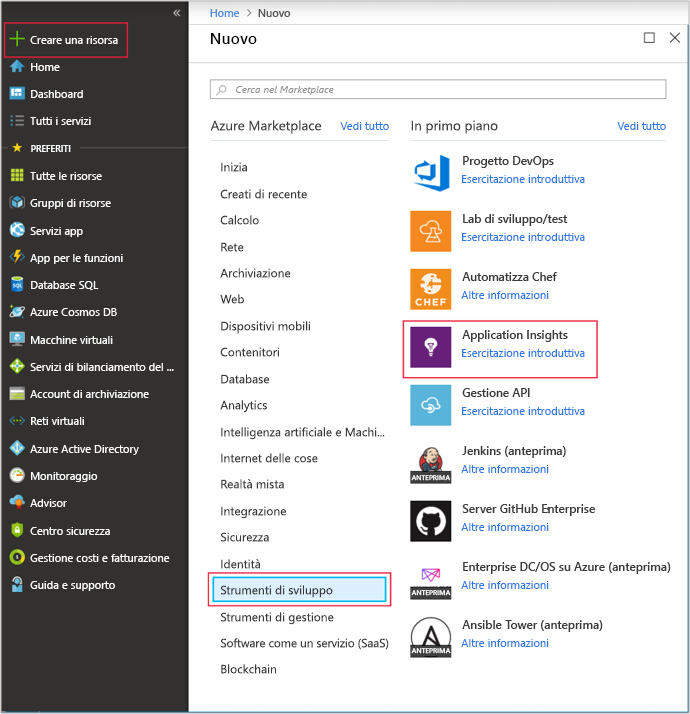
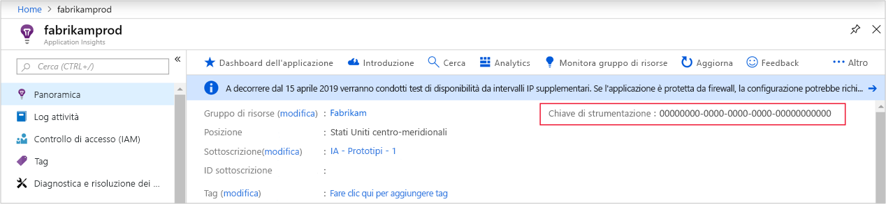
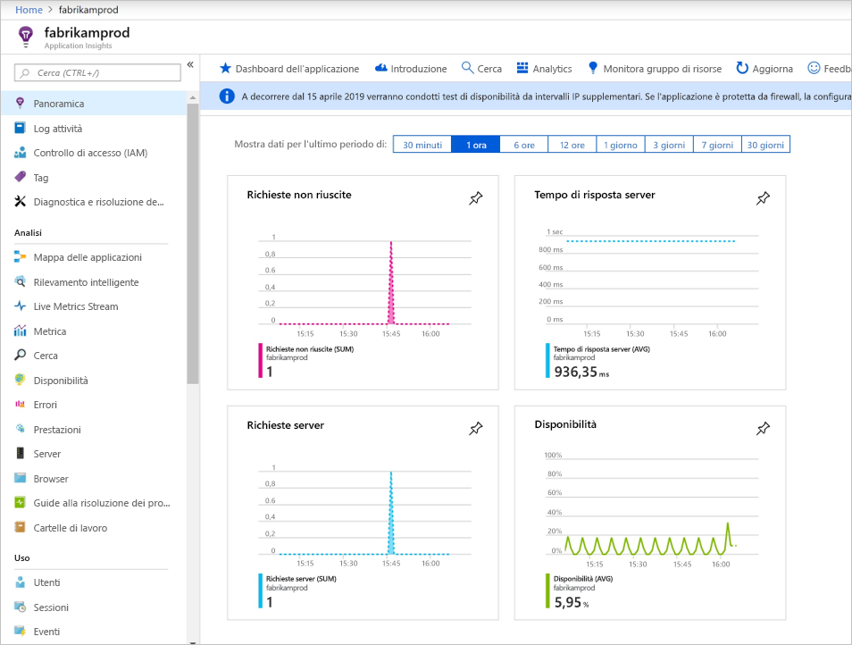
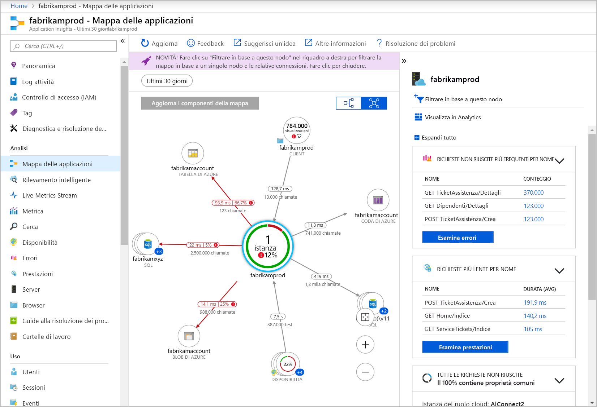
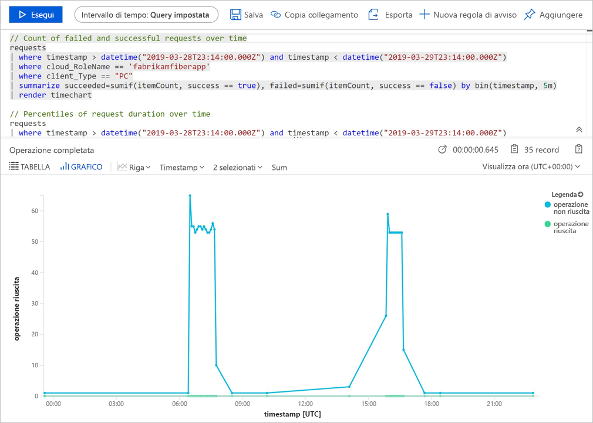
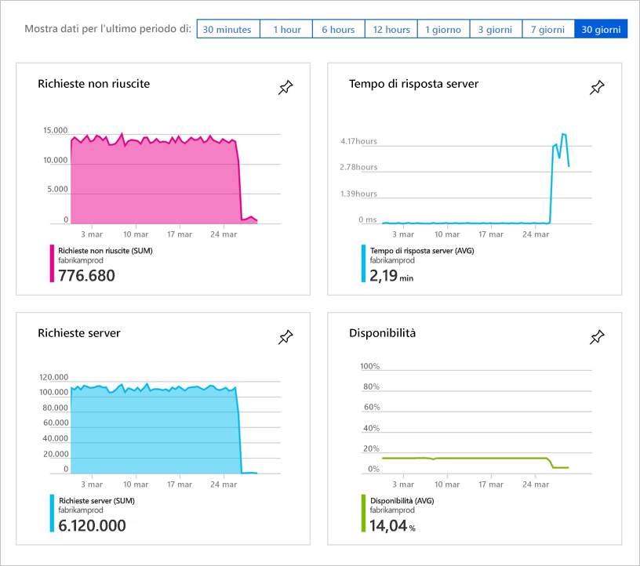
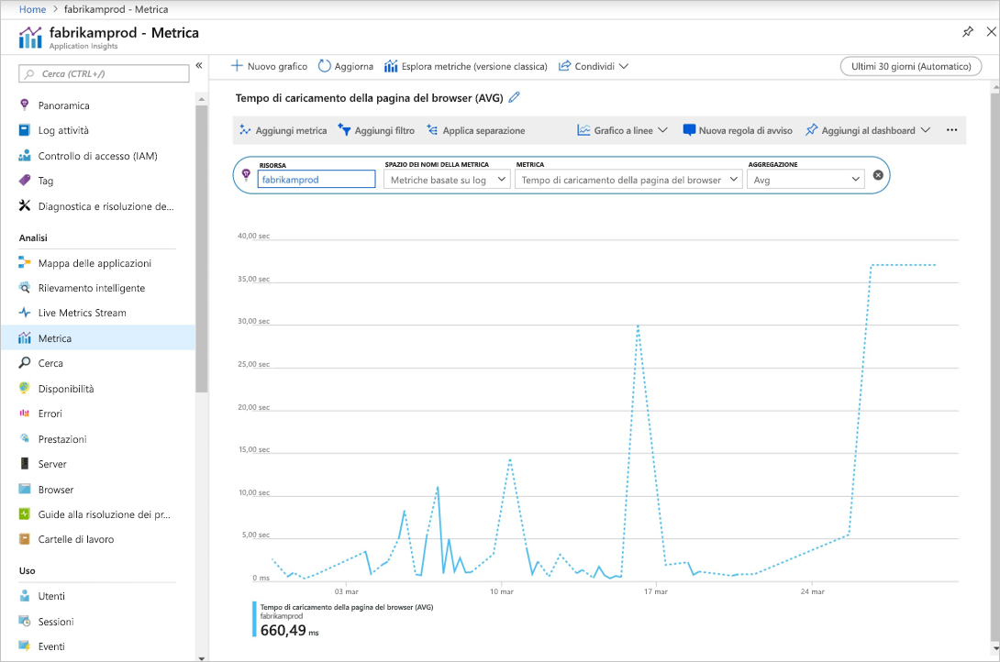

# <a name="quickstart-start-monitoring-your-nodejs-web-application-with-azure-application-insights"></a>Guida introduttiva: Avviare il monitoraggio dell'applicazione Web Node.js con Azure Application Insights

Questa guida introduttiva illustra l'aggiunta di Application Insights SDK per Node.js versione 0.22 a un'applicazione Node.js esistente.

Con Azure Application Insights, è possibile monitorare facilmente la disponibilità, le prestazioni e l'uso dell'applicazione Web. È anche possibile identificare e diagnosticare rapidamente gli errori nell'applicazione senza attendere che vengano segnalati da un utente. A partire dall'SDK versione 0.20 è possibile monitorare i pacchetti di terze parti più diffusi, tra cui MongoDB, MySQL e Redis.

## <a name="prerequisites"></a>Prerequisiti

Per completare questa guida introduttiva:

- Sono necessarie una sottoscrizione di Azure e un'applicazione Web Node.js esistente.

Se non si ha un'applicazione Web Node.js è possibile crearne una seguendo le istruzioni in [Creare un'app Web Node.js in Azure](https://docs.microsoft.com/azure/app-service/app-service-web-get-started-nodejs).

Se non si ha una sottoscrizione di Azure, creare un account [gratuito](https://azure.microsoft.com/free/) prima di iniziare.

## <a name="sign-in-to-the-azure-portal"></a>Accedere al portale di Azure

Accedere al [portale di Azure](https://portal.azure.com/).

## <a name="enable-application-insights"></a>Abilitare Application Insights

Application Insights può raccogliere dati di telemetria da un'applicazione connessa a Internet, indipendentemente dal fatto che sia in esecuzione in locale o nel cloud. Usare la procedura seguente per iniziare a visualizzare questi dati.

1. Selezionare **Crea una risorsa** > **Strumenti di sviluppo** > **Application Insights**.

   

   > [!NOTE]
   >Se è la prima volta che si crea una risorsa di Application Insights, consultare il documento [Create an Application Insights Resource (Creare una risorsa di Application Insights)](https://docs.microsoft.com/azure/azure-monitor/app/create-new-resource) per ulteriori informazioni.

   Verrà visualizzata una pagina di configurazione. Usare la tabella seguente per compilare i campi di input. 

    | Impostazioni        | Valore           | DESCRIZIONE  |
   | ------------- |:-------------|:-----|
   | **Nome**      | Valore globalmente univoco | Nome che identifica l'app da monitorare |
   | **Tipo di applicazione** | Applicazione Node.js | Tipo di app da monitorare |
   | **Posizione** | Stati Uniti orientali | Scegliere una località nelle vicinanze o vicina a quella in cui è ospitata l'app |

2. Selezionare **Create** (Crea).

## <a name="configure-app-insights-sdk"></a>Configurare Application Insights SDK

1. Selezionare **Panoramica** e copiare la **chiave di strumentazione dell'applicazione**.

   

2. Aggiungere Application Insights SDK per Node.js all'applicazione. Dalla cartella radice dell'app eseguire:

   ```bash
   npm install applicationinsights --save
   ```

3. Modificare il primo file con estensione js e aggiungere le due righe seguenti alla parte superiore dello script. Se si usa l'[app introduttiva di Node.js](https://docs.microsoft.com/azure/app-service/app-service-web-get-started-nodejs) è necessario modificare il file index.js. Sostituire &lt;instrumentation_key&gt; con la chiave di strumentazione dell'applicazione. 

   ```JavaScript
   const appInsights = require('applicationinsights');
   appInsights.setup('<instrumentation_key>').start();
   ```

4. Riavviare l'app.

> [!NOTE]
> Prima che i dati vengano visualizzati nel portale trascorrono 3-5 minuti. Se questa app è un'app di test a basso traffico, occorre ricordare che la maggior parte delle metriche viene acquisita solo in caso di richieste oppure operazioni attive.

## <a name="start-monitoring-in-the-azure-portal"></a>Avviare il monitoraggio nel portale di Azure

1. È ora possibile riaprire la pagina **Panoramica** di Application Insights nel portale di Azure, dove è stata recuperata la chiave di strumentazione, per visualizzare informazioni dettagliate sull'applicazione attualmente in esecuzione.

   

2. Selezionare **Mappa delle applicazioni** per ottenere un layout visivo delle relazioni di dipendenza tra i componenti dell'applicazione. Ogni componente mostra indicatori KPI come carico, prestazioni, errori e avvisi.

   

3. Selezionare l'icona per l'**analisi delle app**  **Visualizza in Analisi**.  Verrà aperta la finestra **Application Insights - Analisi**, che fornisce un linguaggio di query avanzato per l'analisi di tutti i dati raccolti da Application Insights. In questo caso viene generata una query che esegue il rendering del conteggio delle richieste sotto forma di grafico. È possibile scrivere query personalizzate per analizzare altri dati.

   

4. Tornare alla pagina **Panoramica** ed esaminare i grafici degli indicatori KPI.  Questo dashboard fornisce statistiche relative all'integrità dell'applicazione, ad esempio il numero di richieste in ingresso, la durata delle richieste ed eventuali errori che si sono verificati.

   

   Per abilitare la popolazione del grafico **Tempo di caricamento della visualizzazione pagina** con i dati di **telemetria lato client**, aggiungere questo script a ogni pagina da verificare:

   ```HTML
   <!-- 
   To collect user behavior analytics tools about your application, 
   insert the following script into each page you want to track.
   Place this code immediately before the closing </head> tag,
   and before any other scripts. Your first data will appear 
   automatically in just a few seconds.
   -->
   <script type="text/javascript">
     var appInsights=window.appInsights||function(config){
       function i(config){t[config]=function(){var i=arguments;t.queue.push(function(){t[config].apply(t,i)})}}var t={config:config},u=document,e=window,o="script",s="AuthenticatedUserContext",h="start",c="stop",l="Track",a=l+"Event",v=l+"Page",y=u.createElement(o),r,f;y.src=config.url||"https://az416426.vo.msecnd.net/scripts/a/ai.0.js";u.getElementsByTagName(o)[0].parentNode.appendChild(y);try{t.cookie=u.cookie}catch(p){}for(t.queue=[],t.version="1.0",r=["Event","Exception","Metric","PageView","Trace","Dependency"];r.length;)i("track"+r.pop());return i("set"+s),i("clear"+s),i(h+a),i(c+a),i(h+v),i(c+v),i("flush"),config.disableExceptionTracking||(r="onerror",i("_"+r),f=e[r],e[r]=function(config,i,u,e,o){var s=f&&f(config,i,u,e,o);return s!==!0&&t["_"+r](config,i,u,e,o),s}),t
       }({
           instrumentationKey:"<insert instrumentation key>"
       });
       
       window.appInsights=appInsights;
       appInsights.trackPageView();
   </script>
   ```

5. A sinistra selezionare **Metriche**. Usare Esplora metriche per esaminare l'integrità e l'utilizzo della risorsa. È possibile selezionare **Aggiungi nuovo grafico** per creare altre visualizzazioni personalizzate oppure **Modifica** per modificare tipi, altezza, tavolozza dei colori, raggruppamenti e metriche dei grafici esistenti. Si può ad esempio creare un grafico che visualizza il tempo medio di caricamento delle pagine del browser selezionando "Tempo di caricamento della pagina del browser" nell'elenco a discesa delle metriche e "Media" in Aggregazione. Per altre informazioni su Esplora metriche di Azure, vedere [Introduzione Esplora metriche di Azure](../../azure-monitor/platform/metrics-getting-started.md).

   

Per altre informazioni sul monitoraggio di Node.js, vedere la [documentazione aggiuntiva su Node.js in Application Insights](../../azure-monitor/app/nodejs.md).

## <a name="clean-up-resources"></a>Pulire le risorse

Dopo aver completato i test, è possibile eliminare il gruppo di risorse e le risorse correlate. A tale scopo, seguire questa procedura.

1. Dal menu a sinistra nel portale di Azure scegliere **Gruppi di risorse** e quindi selezionare **myResourceGroup**.
2. Nella pagina del gruppo di risorse selezionare **Elimina**, immettere **myResourceGroup** nella casella di testo e quindi scegliere **Elimina**.

## <a name="next-steps"></a>Passaggi successivi

> [!div class="nextstepaction"]
> [Rilevare e diagnosticare i problemi di prestazioni](https://docs.microsoft.com/azure/application-insights/app-insights-analytics)
