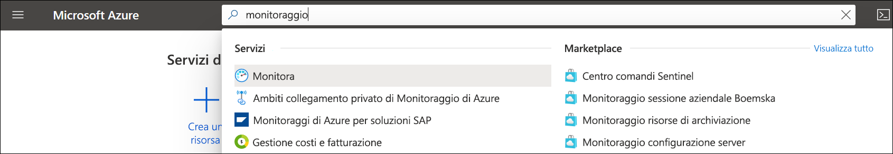
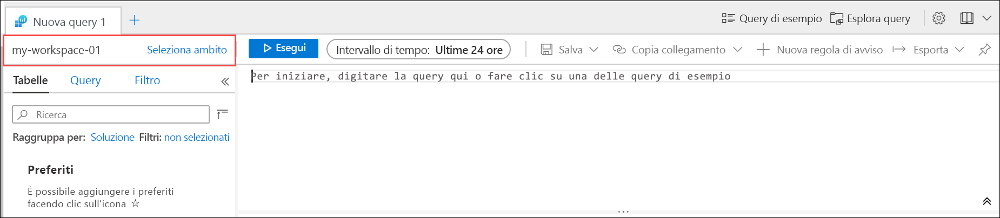
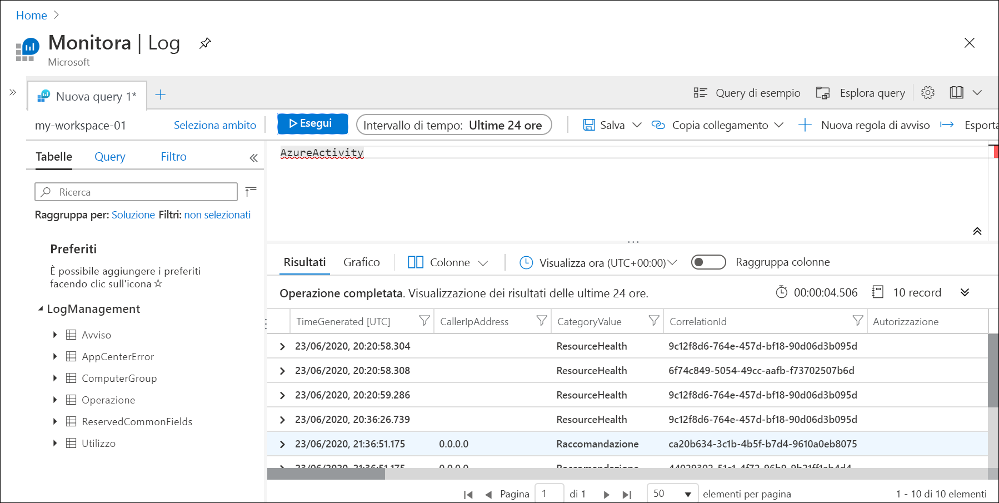
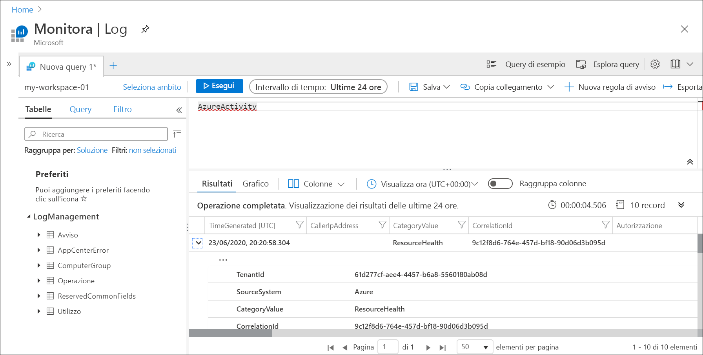
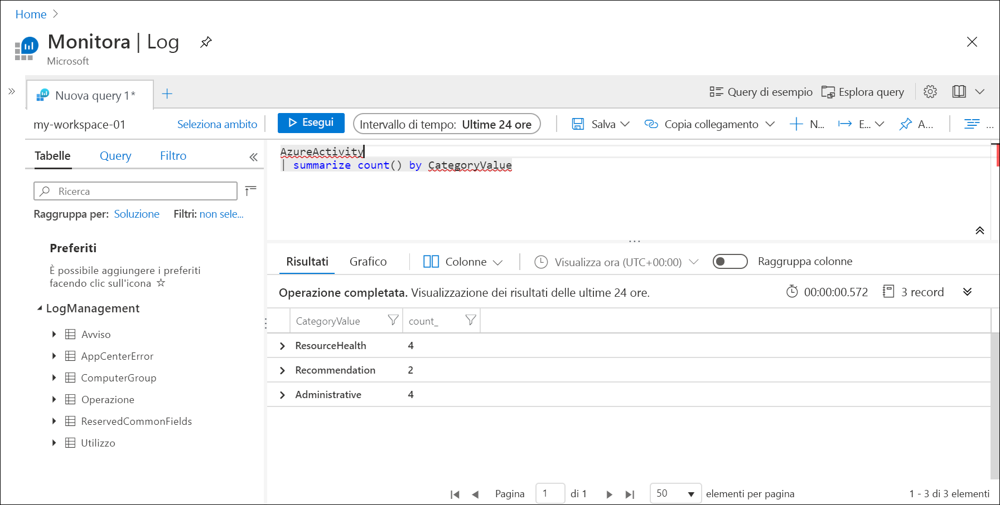

# <a name="quickstart-send-azure-activity-log-to-log-analytics-workspace-using-an-arm-template"></a>Avvio rapido: Inviare il log attività di Azure all'area di lavoro Log Analytics con il modello di Resource Manager

Il log attività è un log della piattaforma presente in Azure che fornisce dati analitici sugli eventi a livello di sottoscrizione. Tali dati includono le informazioni relative, ad esempio, alla modifica di una risorsa o all'avvio di una macchina virtuale. È possibile visualizzare il log attività nel portale di Azure o recuperarne le voci con PowerShell e l'interfaccia della riga di comando. Questo argomento di avvio rapido illustra come usare modelli di Azure Resource Manager (modelli ARM) per creare un'area di lavoro Log Analytics e un'impostazione di diagnostica per inviare il log attività ai log di Monitoraggio di Azure, in cui è possibile analizzarlo usando [query di log](../log-query/log-query-overview.md) e abilitare altre funzionalità, ad esempio [avvisi del log](../platform/alerts-log-query.md) e [cartelle di lavoro](../platform/workbooks-overview.md).

[!INCLUDE [About Azure Resource Manager](../../../includes/resource-manager-quickstart-introduction.md)]

## <a name="prerequisites"></a>Prerequisiti

- Se non si ha una sottoscrizione di Azure, creare un [account gratuito](https://azure.microsoft.com/free/?WT.mc_id=A261C142F) prima di iniziare.
- Per eseguire i comandi dal computer locale, installare l'interfaccia della riga di comando di Azure o i moduli di Azure PowerShell. Per altre informazioni, vedere [Installare l'interfaccia della riga di comando di Azure](/cli/azure/install-azure-cli) e [Installare Azure PowerShell](/powershell/azure/install-az-ps).

## <a name="create-a-log-analytics-workspace"></a>Creare un'area di lavoro Log Analytics

### <a name="review-the-template"></a>Rivedere il modello

Con il modello seguente viene creata una nuova area di lavoro Log Analytics. Salvare questo modello come *CreateWorkspace.json*.

```json
{
  "$schema": "https://schema.management.azure.com/schemas/2019-04-01/deploymentTemplate.json#",
  "contentVersion": "1.0.0.0",
  "parameters": {
    "workspaceName": {
      "type": "string",
        "metadata": {
          "description": "Name of the workspace."
        }
    },
    "sku": {
      "type": "string",
      "allowedValues": [
        "pergb2018",
        "Free",
        "Standalone",
        "PerNode",
        "Standard",
        "Premium"
      ],
      "defaultValue": "pergb2018",
      "metadata": {
        "description": "Pricing tier: PerGB2018 or legacy tiers (Free, Standalone, PerNode, Standard or Premium) which are not available to all customers."
      }
    },
    "location": {
      "type": "string",
      "allowedValues": [
        "australiacentral",
        "australiaeast",
        "australiasoutheast",
        "brazilsouth",
        "canadacentral",
        "centralindia",
        "centralus",
        "eastasia",
        "eastus",
        "eastus2",
        "francecentral",
        "japaneast",
        "koreacentral",
        "northcentralus",
        "northeurope",
        "southafricanorth",
        "southcentralus",
        "southeastasia",
        "switzerlandnorth",
        "switzerlandwest",
        "uksouth",
        "ukwest",
        "westcentralus",
        "westeurope",
        "westus",
        "westus2"
      ],
      "metadata": {
        "description": "Specifies the location for the workspace."
      }
    },
    "retentionInDays": {
      "type": "int",
      "defaultValue": 120,
      "metadata": {
        "description": "Number of days to retain data."
      }
    },
    "resourcePermissions": {
      "type": "bool",
      "defaultValue": true,
      "metadata": {
        "description": "true to use resource or workspace permissions. false to require workspace permissions."
      }
    }
  },
  "resources": [
    {
      "type": "Microsoft.OperationalInsights/workspaces",
      "apiVersion": "2020-03-01-preview",
      "name": "[parameters('workspaceName')]",
      "location": "[parameters('location')]",
      "properties": {
        "sku": {
          "name": "[parameters('sku')]"
        },
        "retentionInDays": "[parameters('retentionInDays')]",
        "features": {
          "searchVersion": 1,
          "legacy": 0,
          "enableLogAccessUsingOnlyResourcePermissions": "[parameters('resourcePermissions')]"
        }
      }
    }
  ]
}
```

Questo modello consente di definire un'unica risorsa:

- [Microsoft.OperationalInsights/workspaces](/azure/templates/microsoft.operationalinsights/workspaces)

### <a name="deploy-the-template"></a>Distribuire il modello

Distribuire il modello usando un metodo standard per la [distribuzione di un modello di Resource Manager](../../azure-resource-manager/templates/deploy-portal.md), come gli esempi seguenti in cui si usano l'interfaccia della riga di comando e PowerShell. Sostituire i valori di esempio per **Resource Group**, **workspaceName** e **location** con quelli appropriati per l'ambiente corrente. Il nome dell'area di lavoro deve essere univoco tra tutte le sottoscrizioni di Azure.

# <a name="cli"></a>[Interfaccia della riga di comando](#tab/CLI)

```azurecli
az login
az deployment group create \
    --name CreateWorkspace \
    --resource-group my-resource-group \
    --template-file CreateWorkspace.json \
    --parameters workspaceName='my-workspace-01' location='eastus'

```

# <a name="powershell"></a>[PowerShell](#tab/PowerShell)

```powershell
Connect-AzAccount
Select-AzSubscription -SubscriptionName my-subscription
New-AzResourceGroupDeployment -Name AzureMonitorDeployment -ResourceGroupName my-resource-group -TemplateFile CreateWorkspace.json -workspaceName my-workspace-01 -location eastus
```

---

### <a name="validate-the-deployment"></a>Convalidare la distribuzione

Per verificare che l'area di lavoro sia stata creata, usare uno dei comandi seguenti. Sostituire i valori di esempio per **Resource Group** e **workspaceName** con quelli usati in precedenza.

# <a name="cli"></a>[Interfaccia della riga di comando](#tab/CLI)

```azurecli
az monitor log-analytics workspace show --resource-group my-workspace-01 --workspace-name my-resource-group
```

# <a name="powershell"></a>[PowerShell](#tab/PowerShell)

```powershell
Get-AzOperationalInsightsWorkspace -Name my-workspace-01 -ResourceGroupName my-resource-group
```

---

## <a name="create-diagnostic-setting"></a>Creare l'impostazione di diagnostica

### <a name="review-the-template"></a>Rivedere il modello

Con il modello seguente viene creata un'impostazione di diagnostica che invia il log attività a un'area di lavoro Log Analytics. Salvare questo modello come *CreateDiagnosticSetting.json*.

```json
{
  "$schema": "https://schema.management.azure.com/schemas/2019-04-01/deploymentTemplate.json#",
  "contentVersion": "1.0.0.0",
  "parameters": {
    "settingName": {
        "type": "String"
    },
    "workspaceId": {
        "type": "String"
    }
  },
  "resources": [
    {
      "type": "Microsoft.Insights/diagnosticSettings",
      "apiVersion": "2017-05-01-preview",
      "name": "[parameters('settingName')]",
      "dependsOn": [],
      "properties": {
        "workspaceId": "[parameters('workspaceId')]",
        "logs": [
          {
          "category": "Administrative",
          "enabled": true
          },
          {
          "category": "Alert",
          "enabled": true
          },
          {
          "category": "Autoscale",
          "enabled": true
          },
          {
          "category": "Policy",
          "enabled": true
          },
          {
          "category": "Recommendation",
          "enabled": true
          },
          {
          "category": "ResourceHealth",
          "enabled": true
          },
          {
          "category": "Security",
          "enabled": true
          },
          {
          "category": "ServiceHealth",
          "enabled": true
          }
        ]
      }
    }
  ]
}
```

Questo modello consente di definire un'unica risorsa:

- [Microsoft.Insights/diagnosticSettings](/azure/templates/microsoft.insights/diagnosticsettings)

### <a name="deploy-the-template"></a>Distribuire il modello

Distribuire il modello usando un metodo standard per la [distribuzione di un modello di Resource Manager](../../azure-resource-manager/templates/deploy-portal.md), come gli esempi seguenti in cui si usano l'interfaccia della riga di comando e PowerShell. Sostituire i valori di esempio per **Resource Group**, **workspaceName** e **location** con quelli appropriati per l'ambiente corrente. Il nome dell'area di lavoro deve essere univoco tra tutte le sottoscrizioni di Azure.

# <a name="cli"></a>[Interfaccia della riga di comando](#tab/CLI)

```azurecli
az deployment sub create --name CreateDiagnosticSetting --location eastus --template-file CreateDiagnosticSetting.json --parameters settingName='Send Activity log to workspace' workspaceId='/subscriptions/00000000-0000-0000-0000-000000000000/resourcegroups/my-resource-group/providers/microsoft.operationalinsights/workspaces/my-workspace-01'

```

# <a name="powershell"></a>[PowerShell](#tab/PowerShell)

```powershell
New-AzSubscriptionDeployment -Name CreateDiagnosticSetting -location eastus -TemplateFile CreateDiagnosticSetting.json -settingName="Send Activity log to workspace" -workspaceId "/subscriptions/00000000-0000-0000-0000-000000000000/resourcegroups/my-resource-group/providers/microsoft.operationalinsights/workspaces/my-workspace-01"
```
---

### <a name="validate-the-deployment"></a>Convalidare la distribuzione

Per verificare che l'impostazione di diagnostica sia stata creata, usare uno dei comandi seguenti. Sostituire i valori di esempio per la sottoscrizione e il nome dell'impostazione con quelli usati in precedenza.

> [!NOTE]
> Non è attualmente possibile usare PowerShell per recuperare le impostazioni di diagnostica a livello di sottoscrizione.

```azurecli
az monitor diagnostic-settings show --resource '/subscriptions/00000000-0000-0000-0000-000000000000' --name 'Send Activity log to workspace'
```

## <a name="generate-log-data"></a>Generare i dati del log

All'area di lavoro Log Analytics verranno inviate solo le nuove voci del log attività, di conseguenza eseguire alcune azioni nella sottoscrizione in modo che vengano registrate, ad esempio l'avvio o l'arresto di una macchina virtuale oppure la creazione o la modifica di un'altra risorsa. Potrebbe essere necessario attendere alcuni minuti prima che l'impostazione di diagnostica venga creata e che i dati vengano scritti inizialmente nell'area di lavoro. Dopo questo ritardo, tutti gli eventi scritti nel log attività verranno inviati all'area di lavoro entro pochi secondi.

## <a name="retrieve-data-with-a-log-query"></a>Recuperare dati con una query di log

Nel portale di Azure è possibile usare Log Analytics per recuperare i dati dall'area di lavoro. Nel portale di Azure cercare e quindi selezionare **Monitoraggio**.



Selezionare **Log** nel menu **Monitoraggio di Azure**. Chiudere la pagina **Query di esempio**. Se l'ambito non è impostato sull'area di lavoro creata, fare clic su **Seleziona ambito** e individuarlo.



Nella finestra della query digitare `AzureActivity` e fare clic su **Esegui**. Si tratta di una query semplice che restituisce tutti i record nella tabella *AzureActivity*, contenente tutti i record inviati dal log attività.



Espandere uno dei record per visualizzarne le proprietà dettagliate.



Provare a eseguire una query più complessa, ad esempio `AzureActivity | summarize count() by CategoryValue`, che fornisce un conteggio degli eventi riepilogati per categoria.



## <a name="clean-up-resources"></a>Pulire le risorse

Se si prevede di usare le guide di avvio rapido e le esercitazioni successive, è consigliabile non cancellare le risorse create. Quando non è più necessario, eliminare il gruppo di risorse per eliminare la regola di avviso e le risorse correlate. Per eliminare il gruppo di risorse con l'interfaccia della riga di comando di Azure oppure con Azure PowerShell

# <a name="cli"></a>[Interfaccia della riga di comando](#tab/CLI)

```azurecli
az group delete --name my-resource-group
```

# <a name="powershell"></a>[PowerShell](#tab/PowerShell)

```powershell
Remove-AzResourceGroup -Name my-resource-group
```

---

## <a name="next-steps"></a>Passaggi successivi

In questo argomento di avvio rapido è stato configurato il log attività da inviare a un'area di lavoro Log Analytics. È ora possibile configurare altri dati da raccogliere nell'area di lavoro e analizzarli insieme usando [query di log](../log-query/log-query-overview.md) in Monitoraggio di Azure e sfruttare funzionalità come gli [avvisi di log](../platform/alerts-log-query.md) e le [cartelle di lavoro](../platform/workbooks-overview.md). In seguito è necessario raccogliere i [log delle risorse](../platform/resource-logs.md) dalle risorse di Azure, che completano i dati nel log attività, fornendo dati analitici sulle operazioni eseguite all'interno delle singole risorse.

> [!div class="nextstepaction"]
> [Raccogliere e analizzare i log delle risorse con Monitoraggio di Azure](tutorial-resource-logs.md)