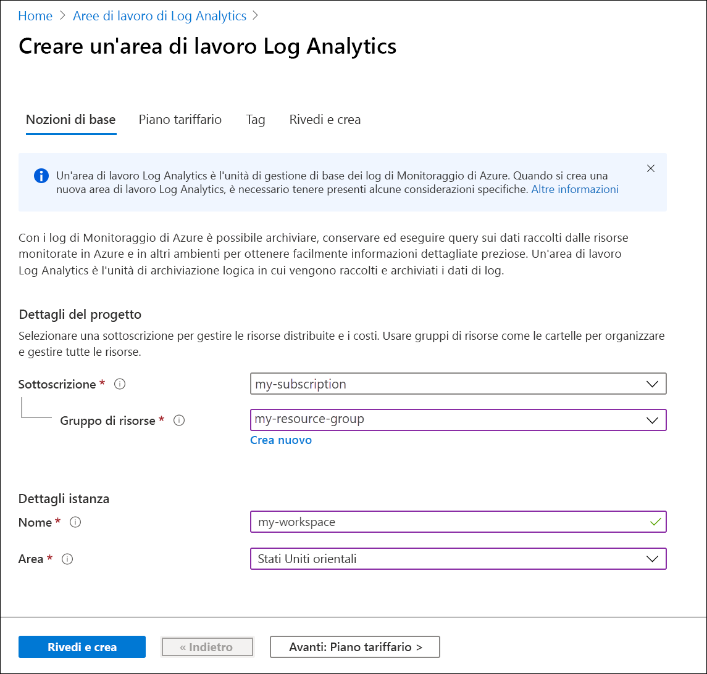
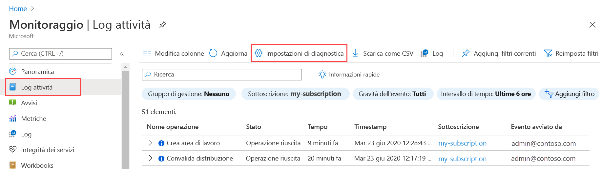
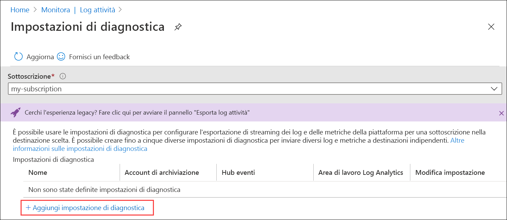
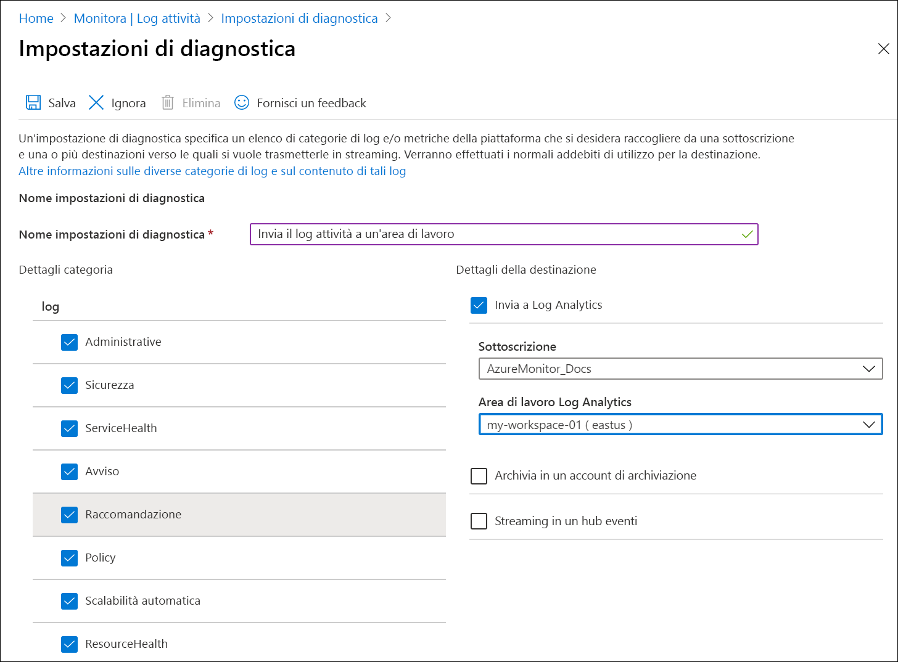

# Inviare il log attività di Azure all'area di lavoro Log Analytics con il portale di Azure
Il log attività è un log della piattaforma presente in Azure che fornisce dati analitici sugli eventi a livello di sottoscrizione. Tali dati includono le informazioni relative, ad esempio, alla modifica di una risorsa o all'avvio di una macchina virtuale. È possibile visualizzare il log attività nel portale di Azure o recuperarne le voci con PowerShell e l'interfaccia della riga di comando. Questo argomento di avvio rapido illustra come usare il portale di Azure per creare un'area di lavoro Log Analytics e un'impostazione di diagnostica per inviare il log attività ai log di Monitoraggio di Azure, in cui è possibile analizzarlo usando [query di log](../log-query/log-query-overview.md) e abilitare altre funzionalità, ad esempio [avvisi del log](../platform/alerts-log-query.md) e [cartelle di lavoro](../platform/workbooks-overview.md). 

## Accedere al portale di Azure
Accedere al portale di Azure all'indirizzo [https://portal.azure.com](https://portal.azure.com). 

## Creare un'area di lavoro Log Analytics
Nel portale di Azure cercare e selezionare **Aree di lavoro Log Analytics**. 

  
Fare clic su **Aggiungi** e quindi specificare i valori per i campi **Gruppo di risorse**, **Nome** (dell'area di lavoro) e **Area**. Il nome dell'area di lavoro deve essere univoco fra tutte le sottoscrizioni di Azure.

Fare clic su **Rivedi e crea** per rivedere le impostazioni e quindi su **Crea** per creare l'area di lavoro. Verrà selezionato il piano tariffario predefinito **Pagamento in base al consumo**, in base al quale non vengono addebitati costi finché non si inizia a raccogliere una quantità di dati sufficiente. Non è previsto alcun addebito per la raccolta del log attività.

## Creare l'impostazione di diagnostica
Nel portale di Azure cercare e quindi selezionare **Monitoraggio**. 

Selezionare **Log attività**. Dovrebbero essere visualizzati gli eventi recenti per la sottoscrizione corrente. Fare clic su **Impostazioni di diagnostica** per visualizzare le impostazioni di diagnostica della sottoscrizione.

Fare clic su **Aggiungi impostazione di diagnostica** per creare una nuova impostazione. 

Digitare un nome, ad esempio *Invia log attività all'area di lavoro*. Selezionare ognuna delle categorie. Selezionare **Invia a Log Analytics**come unica destinazione e quindi specificare l'area di lavoro creata. Fare clic su **Salva** per creare l'impostazione di diagnostica e quindi chiudere la pagina.

## Generare i dati del log
All'area di lavoro Log Analytics verranno inviate solo le nuove voci del log attività, di conseguenza eseguire alcune azioni nella sottoscrizione in modo che vengano registrate, ad esempio l'avvio o l'arresto di una macchina virtuale oppure la creazione o la modifica di un'altra risorsa. Potrebbe essere necessario attendere alcuni minuti prima che l'impostazione di diagnostica venga creata e che i dati vengano scritti inizialmente nell'area di lavoro. Dopo questo ritardo, tutti gli eventi scritti nel log attività verranno inviati all'area di lavoro entro pochi secondi.

## Recuperare dati con una query di log

Selezionare **Log** nel menu **Monitoraggio di Azure**. Chiudere la pagina **Query di esempio**. Se l'ambito non è impostato sull'area di lavoro creata, fare clic su **Seleziona ambito** e individuarlo.

Nella finestra della query digitare `AzureActivity` e fare clic su **Esegui**. Si tratta di una query semplice che restituisce tutti i record nella tabella *AzureActivity*, contenente tutti i record inviati dal log attività.

Espandere uno dei record per visualizzarne le proprietà dettagliate.

Provare a eseguire una query più complessa, ad esempio `AzureActivity | summarize count() by CategoryValue`, che fornisce un conteggio degli eventi riepilogati per categoria.

## Passaggi successivi
In questo argomento di avvio rapido è stato configurato il log attività da inviare a un'area di lavoro Log Analytics. È ora possibile configurare altri dati da raccogliere nell'area di lavoro e analizzarli insieme usando [query di log](../log-query/log-query-overview.md) in Monitoraggio di Azure e sfruttare funzionalità come gli [avvisi di log](../platform/alerts-log-query.md) e le [cartelle di lavoro](../platform/workbooks-overview.md). In seguito è necessario raccogliere i [log delle risorse](../platform/resource-logs.md) dalle risorse di Azure, che completano i dati nel log attività, fornendo dati analitici sulle operazioni eseguite all'interno delle singole risorse.

> [!div class="nextstepaction"]
> [Raccogliere e analizzare i log delle risorse con Monitoraggio di Azure](tutorial-resource-logs.md)
