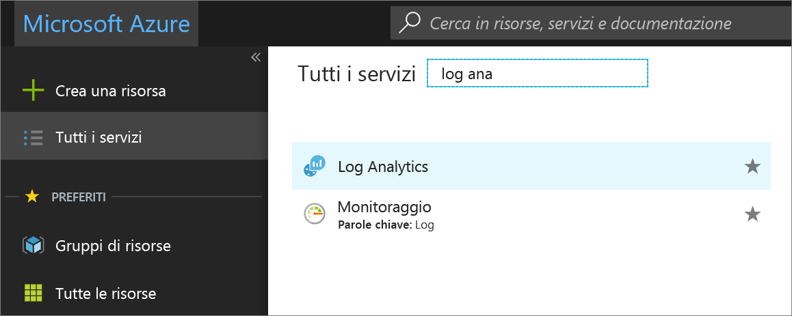
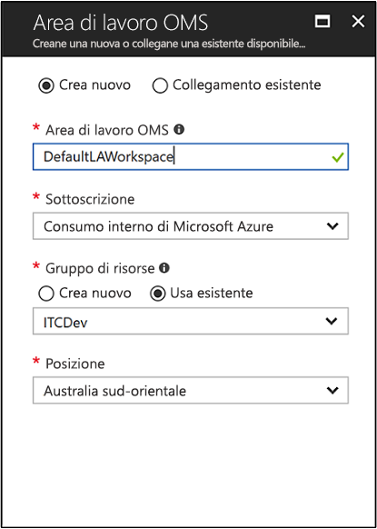
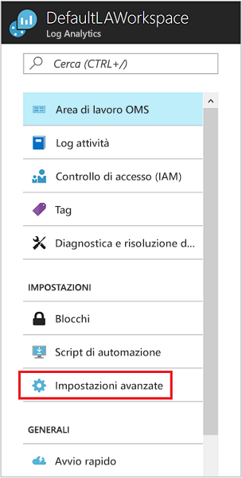
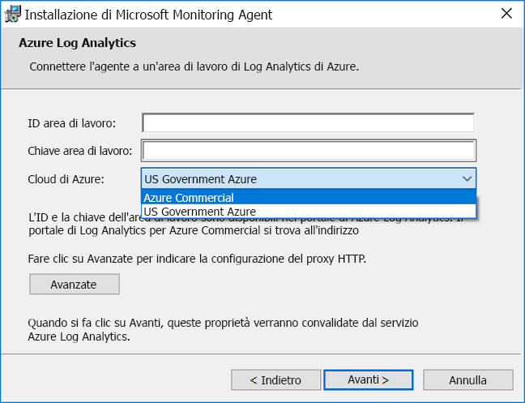
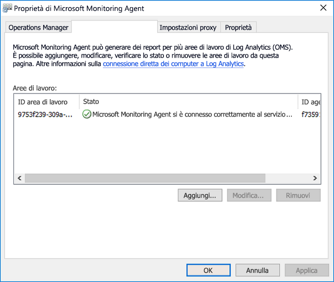
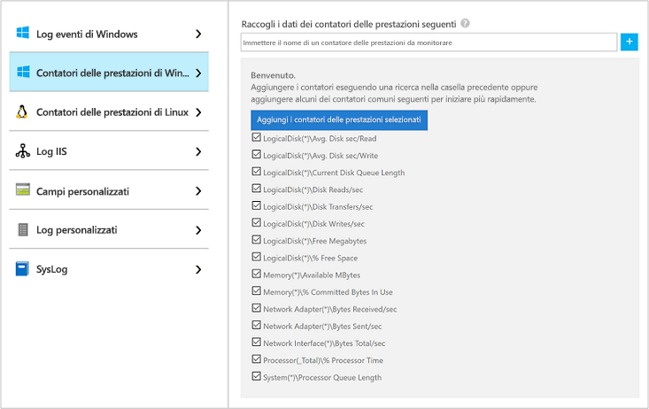
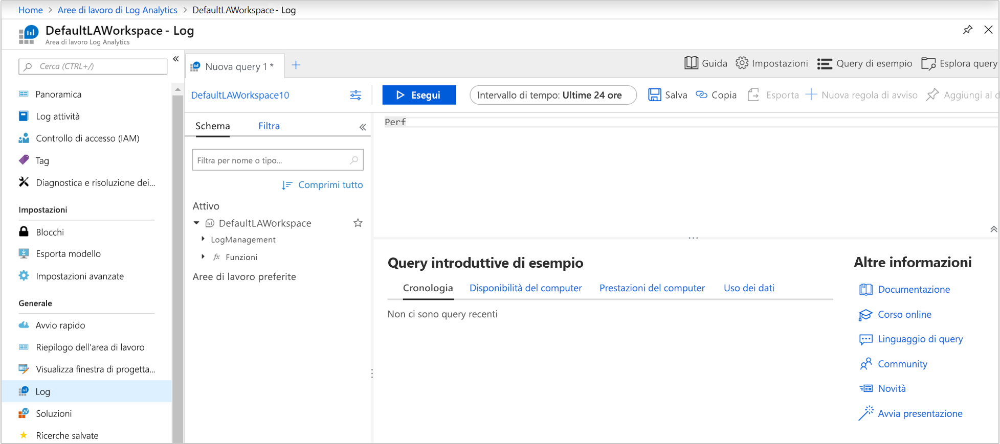
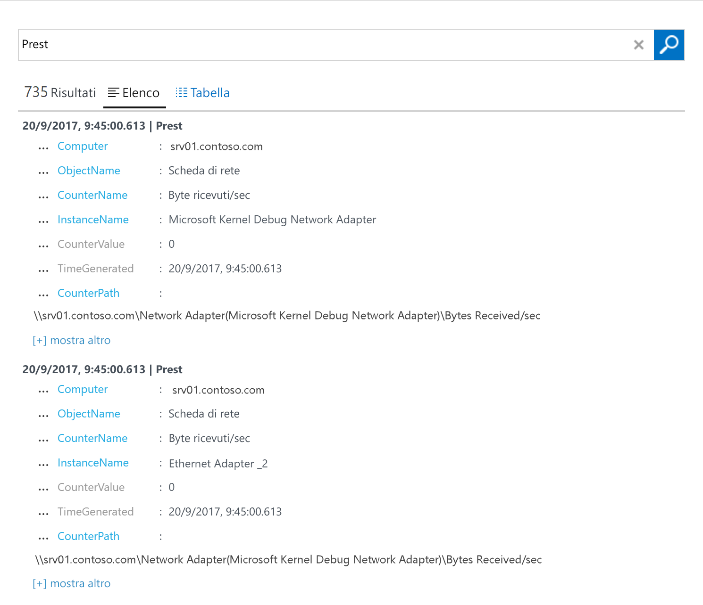
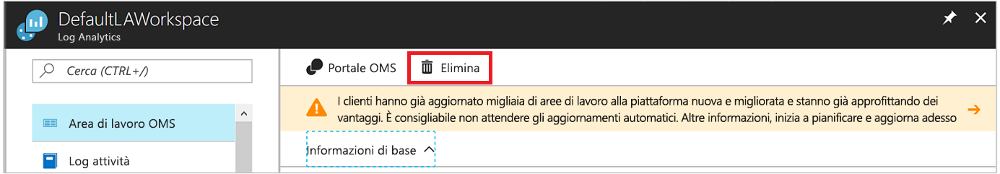

# Configurare l'agente di Log Analytics per computer Windows in un ambiente ibrido
[Azure Log Analytics](../../azure-monitor/platform/agent-windows.md) può raccogliere i dati direttamente dai computer Windows fisici o virtuali in un unico repository per procedere ad analisi dettagliate e alla correlazione. Log Analytics è in grado di raccogliere dati da un data center o da un altro ambiente cloud. Questa guida introduttiva mostra come configurare e raccogliere dati dal computer Windows in pochi semplici passaggi.  Per informazioni sulle macchine virtuali Windows di Azure, vedere [Raccogliere dati sulle macchine virtuali di Azure](../../azure-monitor/learn/quick-collect-azurevm.md).  

Per comprendere la configurazione supportata, vedere i [sistemi operativi Windows supportati](../../azure-monitor/platform/log-analytics-agent.md#supported-windows-operating-systems) e la [configurazione del firewall di rete](../../azure-monitor/platform/log-analytics-agent.md#network-firewall-requirements).
 
Se non si ha una sottoscrizione di Azure, creare un [account gratuito](https://azure.microsoft.com/free/?WT.mc_id=A261C142F) prima di iniziare.

## Accedere al portale di Azure
Accedere al portale di Azure all'indirizzo [https://portal.azure.com](https://portal.azure.com).

## Creare un'area di lavoro
1. Nel portale di Azure fare clic su **Tutti i servizi**. Nella casella di ricerca immettere **Log Analytics**. Mentre si digita, l'elenco viene filtrato in base all'input. Selezionare **Log Analytics**:

    
  
2. Selezionare **Crea** e quindi specificare questi dettagli:

   * Immettere un nome per la nuova **area di lavoro di Log Analytics**, ad esempio **DefaultLAWorkspace**.
   * Selezionare una **sottoscrizione** a cui effettuare il collegamento. Se la sottoscrizione predefinita non è quella che si intende usare, selezionarne un'altra dall'elenco.
   * Per **Gruppo di risorse**, selezionare un gruppo di risorse esistente contenente una o più macchine virtuali di Azure.  
   * Selezionare la **località** in cui sono distribuite le VM. Questo è un elenco di [aree in cui Log Analytics è disponibile](https://azure.microsoft.com/regions/services/).  
   * Se si crea un'area di lavoro in una sottoscrizione creata dopo il 2 aprile 2018, per l'area di lavoro verrà usato automaticamente il piano tariffario **Per GB**. Non sarà pertanto possibile selezionare un piano tariffario diverso. Se si crea un'area di lavoro in una sottoscrizione creata prima del 2 aprile 2018 o in una sottoscrizione collegata all'iscrizione per un Contratto Enterprise esistente, selezionare il piano tariffario che si intende usare. Per informazioni sui piani tariffari, vedere i [dettagli relativi ai prezzi di Log Analytics](https://azure.microsoft.com/pricing/details/log-analytics/).

           

3. Dopo aver specificato le informazioni necessarie nel riquadro **Area di lavoro di Log Analytics**, fare clic su **OK**.  

Per tenere traccia dello stato di avanzamento durante la verifica delle informazioni e la creazione dell'area di lavoro, è possibile usare la voce **Notifiche** disponibile nel menu.

## Ottenere l'ID e la chiave dell'area di lavoro
Prima di installare Microsoft Monitoring Agent per Windows, sono necessari l'ID e la chiave per l'area di lavoro di Log Analytics. Queste informazioni sono richieste dall'installazione guidata per configurare correttamente l'agente e verificare che possa comunicare con Log Analytics.  

1. Nell'angolo superiore sinistro del portale di Azure selezionare **Tutti i servizi**. Nella casella di ricerca immettere **Log Analytics**. Mentre si digita, l'elenco viene filtrato in base all'input. Selezionare **Log Analytics**.
2. Nell'elenco delle aree di lavoro di Log Analytics selezionare l'area di lavoro creata in precedenza. Potrebbe essere stata denominata **DefaultLAWorkspace**.
3. Selezionare **Impostazioni avanzate**:

    
  
4. Selezionare **Origini connesse** e quindi **Server Windows**.
5. Copiare i valori visualizzati a destra di **ID area di lavoro** e **Chiave primaria**. Incollarli nell'editor preferito.

## Installare l'agente per Windows
I passaggi seguenti consentono di installare e configurare l'agente per Log Analytics in Azure e Azure per enti pubblici. Per installare l'agente nel computer, si userà il programma di installazione di Microsoft Monitoring Agent.

1. Proseguendo dalla serie di passaggi precedente, nella pagina **Server Windows** selezionare la voce **Scarica agente Windows** corrispondente alla versione che si intende scaricare. Selezionare la versione appropriata per l'architettura del processore del sistema operativo Windows in uso.
2. Eseguire il programma di installazione per installare l'agente nel computer in uso.
2. Nella pagina di **benvenuto** selezionare **Avanti**.
3. Nella pagina **Condizioni di licenza** leggere la licenza e quindi fare clic su **Accetto**.
4. Nella pagina **Cartella di destinazione** modificare o mantenere la cartella di installazione predefinita e quindi scegliere **Avanti**.
5. Nella pagina **Opzioni di installazione dell'agente** connettere l'agente ad Azure Log Analytics e quindi fare clic su **Avanti**.
6. Nella pagina **Azure Log Analytics** eseguire questa procedura:
   1. Incollare l'**ID area di lavoro** e la **chiave dell'area di lavoro (chiave primaria)** copiati in precedenza. Se il computer deve fare riferimento a un'area di lavoro di Log Analytics in Azure per enti pubblici, selezionare **Azure per enti pubblici statunitensi** nell'elenco **Cloud di Azure**.  
   2. Se il computer deve comunicare tramite un server proxy con il servizio Log Analytics, scegliere **Avanzate** e specificare l'URL e il numero di porta del server proxy. Se il server proxy richiede l'autenticazione, immettere il nome utente e la password per l'autenticazione nel server proxy e quindi fare clic su **Avanti**.  
7. Dopo aver aggiunto le impostazioni di configurazione, fare clic su **Avanti**:

    

8. Nella pagina **Pronto per l'installazione** rivedere le scelte effettuate e quindi scegliere **Installa**.
9. Nella pagina **Configurazione completata** fare clic su **Fine**.

Al termine dell'installazione e della configurazione, Microsoft Monitoring Agent verrà visualizzato nel Pannello di controllo. È possibile rivedere la configurazione e verificare che l'agente sia connesso a Log Analytics. Una volta stabilita la connessione, nella scheda **Azure Log Analytics** l'agente visualizza questo messaggio: **Microsoft Monitoring Agent ha eseguito la connessione al servizio Microsoft Log Analytics**.   

## Raccogliere dati su eventi e prestazioni
Log Analytics può raccogliere gli eventi specificati dal registro eventi e dai contatori delle prestazioni di Windows per l'analisi e la creazione di report più a lungo termine. Può inoltre intervenire quando rileva una particolare condizione. Seguire questi passaggi per configurare la raccolta di eventi dal registro eventi di Windows e di diversi contatori delle prestazioni comuni con cui iniziare.  

1. Nell'angolo inferiore sinistro del portale di Azure selezionare **Altri servizi**. Nella casella di ricerca immettere **Log Analytics**. Mentre si digita, l'elenco viene filtrato in base all'input. Selezionare **Log Analytics**.
2. Selezionare **Impostazioni avanzate**:

    
 
3. Selezionare **Dati** e quindi selezionare **Log eventi Windows**.  
4. Si aggiunge un registro eventi immettendone il nome. Immettere **Sistema** e quindi fare clic sul segno più ( **+** ).  
5. Nella tabella selezionare i livelli di gravità **Errore** e **Avviso**.
6. Fare clic su **Salva** nella parte superiore della pagina.
7. Selezionare **Contatori delle prestazioni di Windows** per abilitare la raccolta di contatori delle prestazioni in un computer Windows.
8. Quando si configurano i contatori delle prestazioni di Windows per la prima volta per una nuova area di lavoro di Log Analytics, è possibile creare rapidamente numerosi contatori comuni. Le singole opzioni vengono elencate con accanto una casella di controllo:

    .
    
    Fare clic su **Aggiungi i contatori delle prestazioni selezionati**. I contatori verranno aggiunti e preimpostati con un intervallo di campionamento per la raccolta pari a dieci secondi.

9. Fare clic su **Salva** nella parte superiore della pagina.

## Visualizzare i dati raccolti
Ora che la raccolta di dati è stata abilitata, verrà eseguita una semplice ricerca nel log per visualizzare alcuni dati dal computer di destinazione.  

1. Nel portale di Azure, nell'area di lavoro selezionata selezionare il riquadro **Log**.  
2. Nel riquadro **Ricerca log** immettere **Perf** nella casella di query e fare clic su **Esegui** nella parte superiore di tale casella:
 
    

    La query in questa figura, ad esempio, ha restituito 735 record relativi alle prestazioni:

    

## Pulire le risorse
È possibile rimuovere l'agente dal computer ed eliminare l'area di lavoro di Log Analytics quando non sono più necessari.  

Per rimuovere l'agente, eseguire questa procedura:

1. Aprire il Pannello di controllo.
2. Aprire **Programmi e funzionalità**.
3. In **Programmi e funzionalità** selezionare **Microsoft Monitoring Agent** e quindi fare clic su **Disinstalla**.

Per eliminare l'area di lavoro di Log Analytics creata in precedenza, selezionarla e nella pagina delle risorse fare clic su **Elimina**:

## Passaggi successivi
Ora che è in corso la raccolta di dati operativi e sulle prestazioni dal computer Windows, è possibile iniziare facilmente a esplorare, analizzare e modificare *gratuitamente* i dati raccolti.  

Per informazioni su come visualizzare e analizzare i dati, passare all'esercitazione:

> [!div class="nextstepaction"]
> [View or analyze data in Log Analytics (Visualizzare o analizzare i dati in Log Analytics)](tutorial-viewdata.md)
