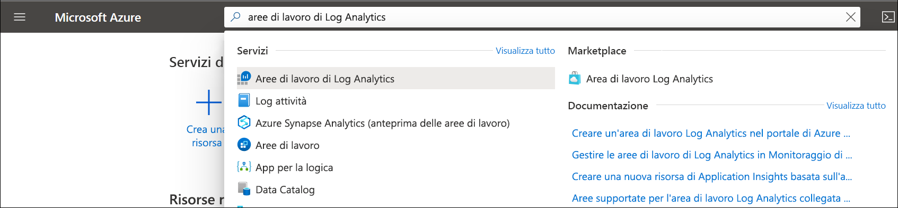

# Creare un'area di lavoro Log Analytics nel portale di Azure
Usare il menu **Aree di lavoro Log Analytics** per creare un'area di lavoro Log Analytics tramite il portale di Azure. Un'area di lavoro Log Analytics è un ambiente univoco per i dati di log di Monitoraggio di Azure. Ogni area di lavoro ha un proprio repository di dati e una propria configurazione, mentre le origini dati e le soluzioni sono configurate per l'archiviazione dei dati in un'area di lavoro specifica. È necessaria un'area di lavoro Log Analytics se si intende raccogliere dati dalle origini seguenti:

* Risorse di Azure nella sottoscrizione
* Computer locali monitorati tramite System Center Operations Manager
* Raccolte di dispositivi da System Center Configuration Manager 
* Dati di diagnostica o di log dall'archiviazione di Azure

Per altre origini, ad esempio macchine virtuali di Azure e macchine virtuali di Windows o Linux presenti nell'ambiente, vedere gli argomenti seguenti:

*  [Raccogliere dati dalle macchine virtuali di Azure](../learn/quick-collect-azurevm.md) 
*  [Raccogliere dati dal computer Linux ibrido](../learn/quick-collect-linux-computer.md)
*  [Raccogliere dati dal computer Windows ibrido](quick-collect-windows-computer.md)

Se non si ha una sottoscrizione di Azure, creare un [account gratuito](https://azure.microsoft.com/free/?WT.mc_id=A261C142F) prima di iniziare.

## Accedere al portale di Azure
Accedere al portale di Azure all'indirizzo [https://portal.azure.com](https://portal.azure.com). 

## Creare un'area di lavoro
1. Nel portale di Azure fare clic su **Tutti i servizi**. Nell'elenco delle risorse digitare **Log Analytics**. Non appena si inizia a digitare, l'elenco viene filtrato in base all'input. Selezionare **Aree di lavoro di Log Analytics**.

    
  
2. Fare clic su **Aggiungi** e quindi selezionare le opzioni per gli elementi seguenti:

   * Specificare un nome per la nuova **area di lavoro Log Analytics**, ad esempio *DefaultLAWorkspace*. 
   * Selezionare una **sottoscrizione** a cui collegarsi. Se la sottoscrizione selezionata per impostazione predefinita non è appropriata, è possibile sceglierne una dall'elenco a discesa.
   * Per **Gruppo di risorse** scegliere di usare un gruppo di risorse esistente già configurato oppure crearne uno nuovo.  
   * Selezionare una **località** disponibile.  Per altre informazioni, vedere quale [aree è disponibile nel Log Analitica](https://azure.microsoft.com/regions/services/) e cercare il monitoraggio di Azure dal **ricerca di un prodotto** campo.  
   * Se si sta creando un'area di lavoro in una nuova sottoscrizione creata dopo il 2 aprile 2018, verrà automaticamente usato il piano di determinazione dei prezzi *Per GB* e non sarà disponibile l'opzione che consente di selezionare un piano tariffario.  Se si sta creando un'area di lavoro per una sottoscrizione esistente creata prima del 2 aprile o per una sottoscrizione collegata a un Contratto Enterprise (EA) esistente, selezionare il piano tariffario preferito.  Per altre informazioni sui piani specifici, vedere [Dettagli prezzi di Log Analytics](https://azure.microsoft.com/pricing/details/log-analytics/).

          

3. Dopo aver specificato le informazioni necessarie nel riquadro **area di lavoro Log Analytics**, fare clic su **OK**.  

Per tenere traccia dello stato di avanzamento della verifica delle informazioni e della creazione dell'area di lavoro, è possibile usare la voce **Notifiche** nel menu. 

## Passaggi successivi
Dopo aver creato un'area di lavoro, è possibile configurare la raccolta di dati di telemetria di monitoraggio, eseguire ricerche nei log per analizzare i dati e aggiungere una soluzione di gestione per fornire informazioni analitiche dettagliate e dati aggiuntivi. 

* Per abilitare la raccolta di dati dalle risorse di Azure con Diagnostica di Azure o l'archiviazione di Azure, vedere [Raccolta di log e metriche per i servizi di Azure da usare in Log Analytics](../platform/collect-azure-metrics-logs.md).  
* [Aggiungere System Center Operations Manager come origine dati](../platform/om-agents.md) per raccogliere i dati da agenti di creazione report per il gruppo di gestione Operations Manager e archiviarli nell'area di lavoro di Log Analytics. 
* Connettere [Configuration Manager](../platform/collect-sccm.md) per importare computer che sono membri di raccolte nella gerarchia.  
* Esaminare le [soluzioni di monitoraggio](../insights/solutions.md) disponibili e verificare come aggiungere o rimuovere una soluzione dall'area di lavoro.
