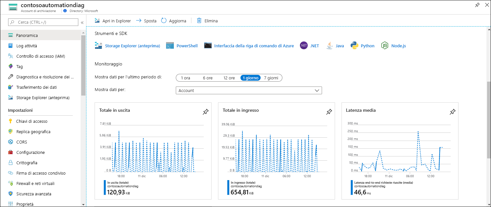
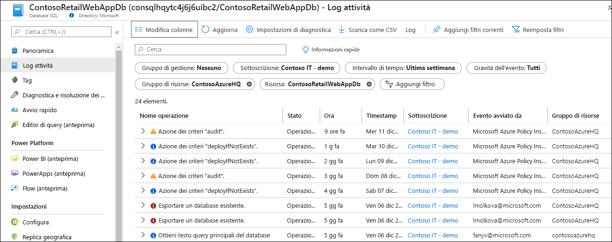
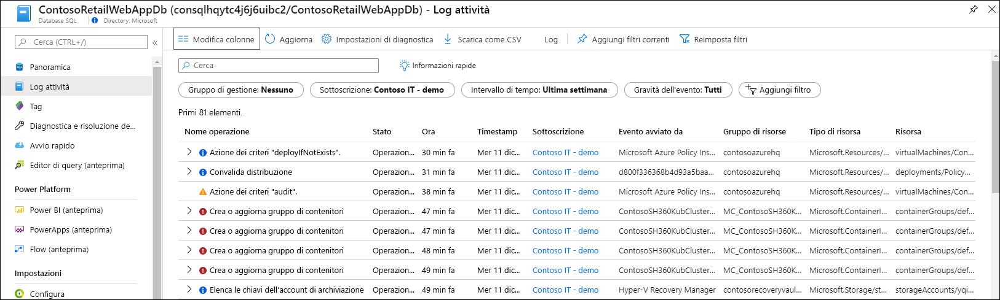
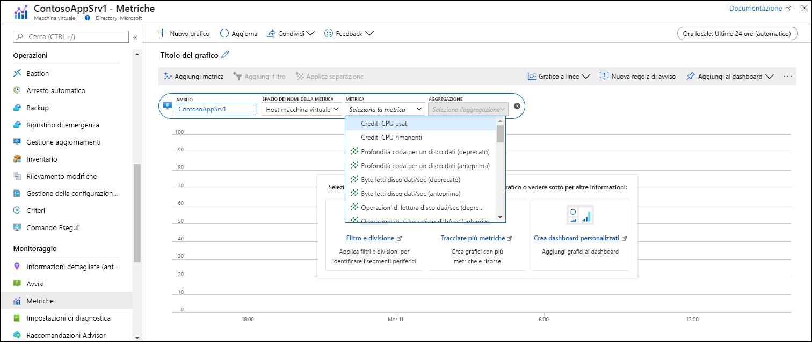
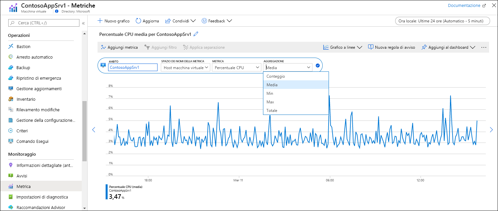
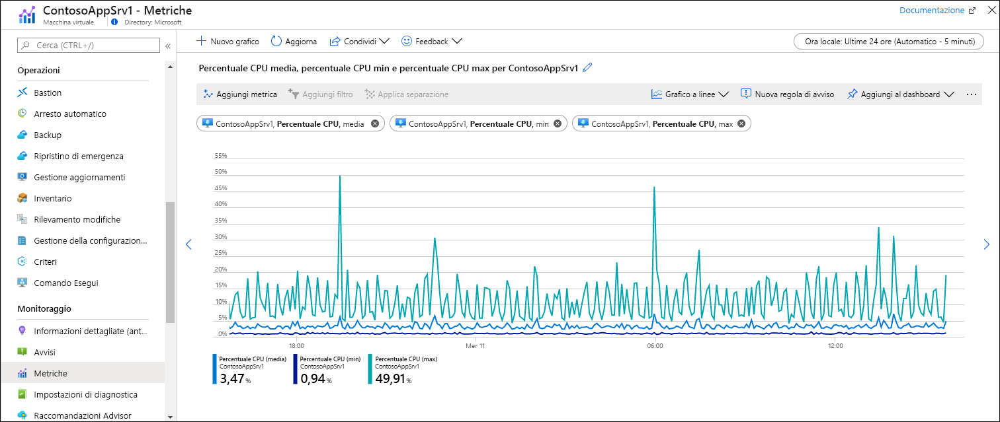

# Avvio rapido: Monitorare una risorsa di Azure con Monitoraggio di Azure
[Monitoraggio di Azure](../overview.md) avvia la raccolta di dati dalle risorse di Azure nel momento in cui vengono create. Questa guida di avvio rapido illustra brevemente i dati raccolti automaticamente per una risorsa e come visualizzare tali dati nel portale di Azure per una determinata risorsa. In un secondo momento, si potrà aggiungere la configurazione necessaria per raccogliere altri dati nonché passare al menu di Monitoraggio di Azure per usare gli stessi strumenti per accedere ai dati raccolti per tutte le risorse nella sottoscrizione.

Per descrizioni più dettagliate dei dati di monitoraggio raccolti dalle risorse di Azure, vedere [Monitoraggio delle risorse di Azure con Monitoraggio di Azure](../insights/monitor-azure-resource.md).

## Accedere al portale di Azure

Accedere al portale di Azure all'indirizzo [https://portal.azure.com](https://portal.azure.com). 

## Pagina di panoramica
Molti servizi includeranno i dati di monitoraggio nella pagina **Panoramica** come riepilogo rapido del proprio funzionamento. Questo riepilogo sarà in genere basato su un sottoinsieme delle metriche della piattaforma archiviate nelle metriche di Monitoraggio di Azure.

1. Individuare una risorsa di Azure nella sottoscrizione.
2. Passare alla pagina **Panoramica** e verificare se vengono visualizzati dati sulle prestazioni. Tali dati saranno forniti da Monitoraggio di Azure. Nell'esempio seguente della pagina **Panoramica** per un account di archiviazione di Azure si può osservare che vengono visualizzate più metriche.

    

3. È possibile fare clic su qualsiasi grafico per aprire i dati in Esplora metriche, come descritto più avanti.

## Visualizzare il log attività
Il log attività offre informazioni dettagliate sulle operazioni per ogni risorsa di Azure nella sottoscrizione, ad esempio quando una risorsa è stata creata o modificata, quando è stato avviato un processo o quando viene eseguita una determinata operazione.

1. Nella parte superiore del menu per la risorsa selezionare **Log attività**.
2. Il filtro corrente è impostato sugli eventi correlati alla risorsa. Se non vengono visualizzati eventi, provare a modificare **Intervallo di tempo** per ampliare l'ambito temporale.

    

4. Se si vogliono visualizzare eventi di altre risorse nella sottoscrizione, modificare i criteri nel filtro oppure rimuovere le proprietà di filtro.

    

## Visualizzare le metriche
Le metriche sono valori numerici che descrivono alcuni aspetti della risorsa in un determinato momento. Monitoraggio di Azure raccoglie automaticamente le metriche della piattaforma a intervalli di un minuto da tutte le risorse di Azure. È possibile visualizzare tali metriche con Esplora metriche.

1. Nella sezione **Monitoraggio** del menu della risorsa selezionare **Metriche**. Verrà aperto Esplora metriche con l'ambito impostato sulla risorsa.
2. Fare clic su **Aggiungi metrica** per aggiungere una metrica al grafico.
   
   
   
4. Selezionare un'opzione per **Metrica** nell'elenco a discesa e quindi una per **Aggregazione**. In questo modo si definisce come verrà eseguito il campionamento dei dati raccolti in ogni intervallo di tempo.

    

5. Fare clic su **Aggiungi metrica** per aggiungere altre combinazioni di metrica e aggregazione al grafico.

    

## Passaggi successivi
In questa guida di avvio rapido si sono visualizzati il log attività e le metriche per una risorsa di Azure che vengono raccolti automaticamente da Monitoraggio di Azure. I log delle risorse offrono informazioni dettagliate sul funzionamento della risorsa, ma devono essere configurati per essere raccolti. Passare all'esercitazione per raccogliere i log delle risorse in un'area di lavoro Log Analytics in cui potranno essere analizzati con query sui log.

> [!div class="nextstepaction"]
> [Raccogliere e analizzare i log delle risorse con Monitoraggio di Azure](tutorial-resource-logs.md)
