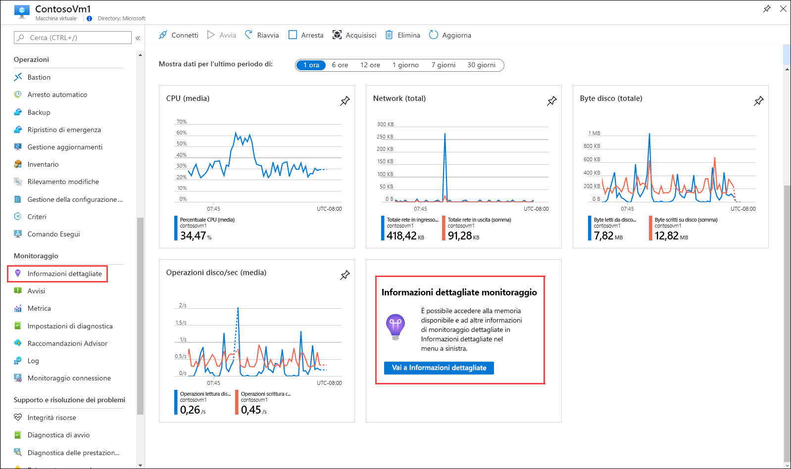
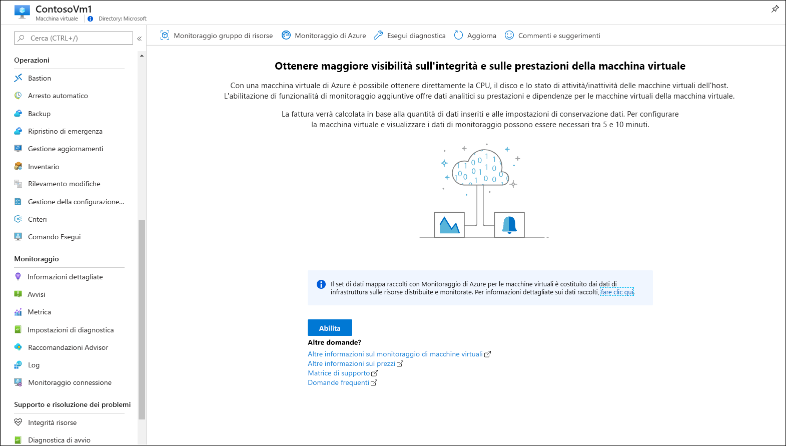
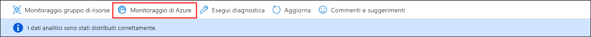
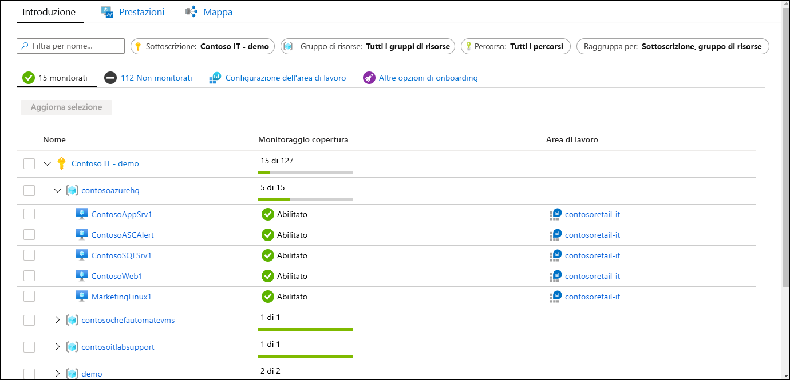
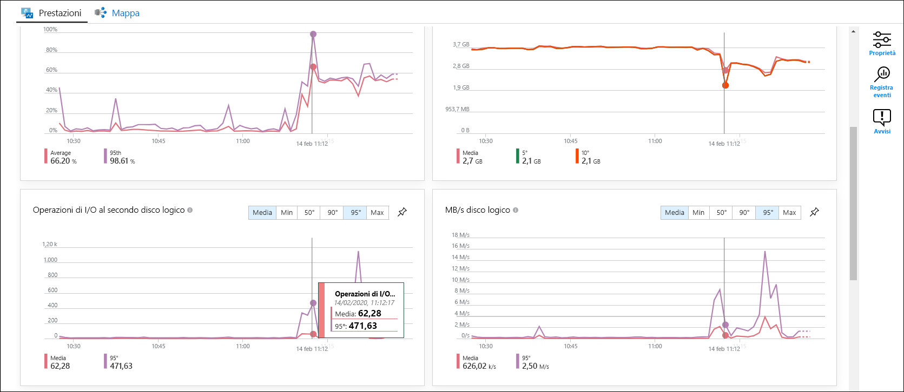
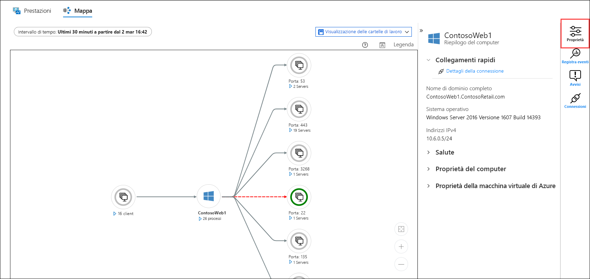
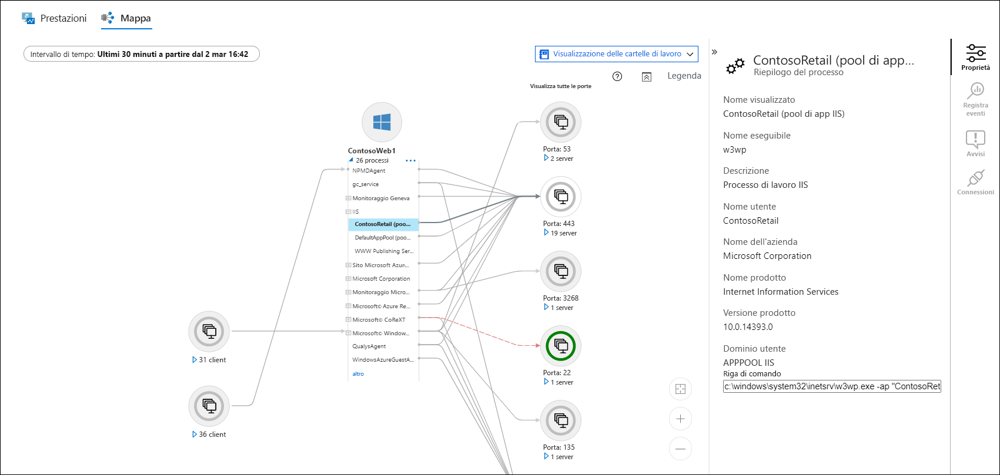
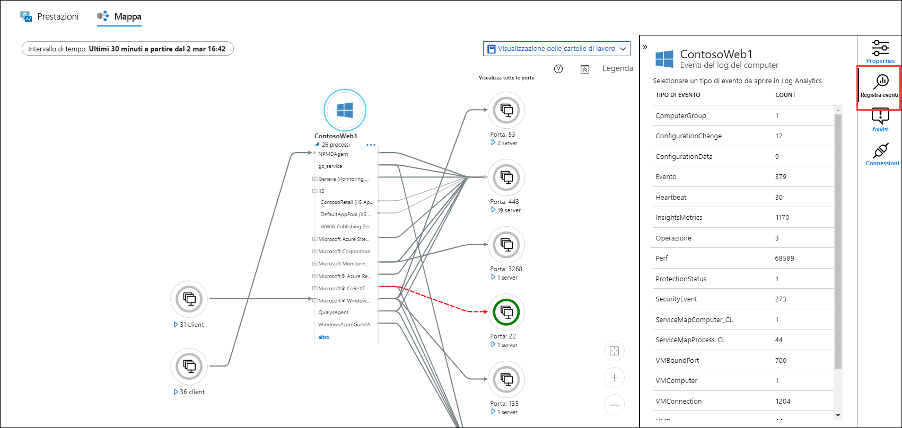
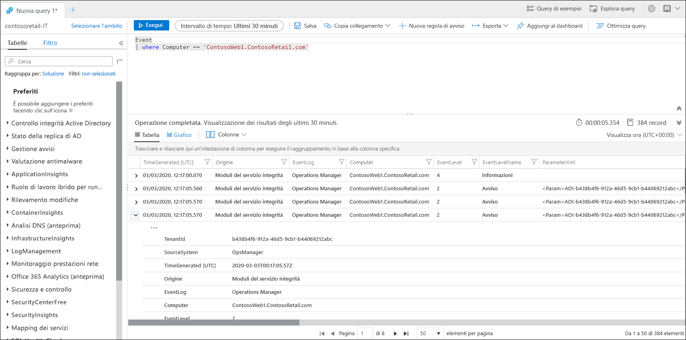

# Monitorare una macchina virtuale di Azure con Monitoraggio di Azure.
[Monitoraggio di Azure](../overview.md) avvia la raccolta di dati dalle macchine virtuali di Azure nel momento in cui vengono create. Questa guida di avvio rapido illustra brevemente i dati raccolti automaticamente per una VM di Azure e come visualizzare tali dati nel portale di Azure. Si abiliterà quindi [Monitoraggio di Azure per le macchine virtuali](../insights/vminsights-overview.md) per la VM per consentire agli agenti nella VM di raccogliere e analizzare i dati del sistema operativo guest, includendo i processi e le relative dipendenze.

Questa guida introduttiva presuppone che esista già una macchina virtuale di Azure. In caso contrario, è possibile creare una [VM Windows](../../virtual-machines/windows/quick-create-portal.md) o una [VM Linux](../../virtual-machines/linux/quick-create-cli.md) seguendo le guide di avvio rapido sulle VM.

Per descrizioni più dettagliate dei dati di monitoraggio raccolti dalle risorse di Azure, vedere [Monitoraggio delle macchine virtuali di Azure con Monitoraggio di Azure](../insights/monitor-vm-azure.md).

## Completare la guida di avvio rapido sul monitoraggio di una risorsa di Azure
Completare [Monitorare una risorsa di Azure con Monitoraggio di Azure](quick-monitor-azure-resource.md) per visualizzare la pagina di panoramica, il log attività e le metriche per una VM nella sottoscrizione. Le VM di Azure raccolgono gli stessi dati di monitoraggio raccolti da qualsiasi altra risorsa di Azure, ma solo per la VM host. Il resto di questa guida di avvio rapido sarà incentrato sul monitoraggio del sistema operativo guest e dei relativi carichi di lavoro.

## Abilita Monitoraggio di Azure per le macchine virtuali
Mentre per la VM host verranno raccolti i log attività e le metriche, per raccogliere e analizzare i dati di monitoraggio del sistema operativo guest e dei relativi carichi di lavoro saranno necessari un agente e alcune attività di configurazione. Monitoraggio di Azure per le macchine virtuali installa gli agenti e offre funzionalità avanzate aggiuntive per il monitoraggio delle macchine virtuali.

1. Passare al menu della macchina virtuale.
2. Fare clic su **Vai a Informazioni dettagliate (anteprima)** nel riquadro nella pagina **Panoramica** oppure su **Informazioni dettagliate** nel menu **Monitoraggio**.

    

3. Se Monitoraggio di Azure per le macchine virtuali non è ancora stato abilitato per la macchina virtuale, fare clic su **Abilita**. 

    

4. Se la macchina virtuale non è già collegata a un'area di lavoro Log Analytics, verrà richiesto di selezionare un'area di lavoro esistente o di crearne una nuova. Selezionare l'impostazione predefinita, che è un'area di lavoro con nome univoco nella stessa area della macchina virtuale.

    

5. L'onboarding richiederà alcuni minuti per l'abilitazione delle estensioni e l'installazione degli agenti nella macchina virtuale. Al termine, verrà visualizzato un messaggio che segnala che la distribuzione delle informazioni dettagliate è stata completata. Fare clic su **Monitoraggio di Azure** per aprire Monitoraggio di Azure per le macchine virtuali.

    

6. La VM verrà visualizzata con tutte le altre VM della sottoscrizione di cui è stato eseguito l'onboarding. Selezionare la scheda **Non monitorato** per visualizzare le macchine virtuali della sottoscrizione di cui non è stato eseguito l'onboarding.

    

## Configurare l'area di lavoro
Quando si crea una nuova area di lavoro Log Analytics, è necessario configurarla per la raccolta dei log. Questa configurazione deve essere eseguita una sola volta perché viene inviata a tutte le macchine virtuali che si connettono.

1. Selezionare **Configurazione dell'area di lavoro** e quindi l'area di lavoro.

2. Selezionare **Impostazioni avanzate**.

    

### Raccolta di dati da una VM Windows

2. Selezionare **Dati** e quindi selezionare **Log eventi Windows**.

3. Aggiungere un registro eventi digitandone il nome.  Digitare **Sistema** e quindi selezionare il segno più **+**.

4. Nella tabella selezionare i livelli di gravità **Errore** e **Avviso**.

5. Selezionare **Salva** nella parte superiore della pagina per salvare la configurazione.

### Raccolta di dati da una VM Linux

1. Selezionare **Syslog**.  

2. Aggiungere un registro eventi digitandone il nome.  Digitare **Syslog** e quindi selezionare il segno più **+**.  

3. Nella tabella deselezionare i livelli di gravità **Informativo**, **Avviso** e **Debug**. 

4. Selezionare **Salva** nella parte superiore della pagina per salvare la configurazione.

## Visualizzare i dati raccolti

7. Fare clic sulla macchina virtuale e quindi selezionare la scheda **Prestazioni** presente nel menu **Monitoraggio** del riquadro **Dati analitici**. Verrà visualizzato un gruppo selezionato di contatori delle prestazioni raccolti dal sistema operativo guest della VM. Scorrere verso il basso per visualizzare altri contatori e spostare il puntatore del mouse su un grafico per visualizzare la media e i percentili in momenti diversi.

    

9. Selezionare **Mappa** per aprire la funzionalità delle mappe che mostra i processi in esecuzione nella macchina virtuale e le relative dipendenze. Selezionare **Proprietà** per aprire il riquadro delle proprietà, se non è già aperto.

    

11. Espandere i processi della macchina virtuale. Selezionare uno dei processi per visualizzarne i dettagli ed evidenziarne le dipendenze.

    

12. Selezionare di nuovo la macchina virtuale e quindi **Eventi del log**. 

    

13. Verrà visualizzato un elenco delle tabelle archiviate nell'area di lavoro Log Analytics per la macchina virtuale. L'elenco sarà diverso a seconda che si usi una macchina virtuale Windows o Linux. Fare clic sulla tabella **Evento**, che include tutti gli eventi del registro eventi di Windows. Verrà aperto Log Analytics con una query semplice per recuperare le voci del registro eventi.

    

## Passaggi successivi
In questa guida di avvio rapido si è abilitato Monitoraggio di Azure per le macchine virtuali per una VM e si è configurata l'area di lavoro Log Analytics per raccogliere gli eventi per il sistema operativo guest. Per informazioni su come visualizzare e analizzare i dati, passare all'esercitazione.

> [!div class="nextstepaction"]
> [View or analyze data in Log Analytics (Visualizzare o analizzare i dati in Log Analytics)](../log-query/log-analytics-tutorial.md)