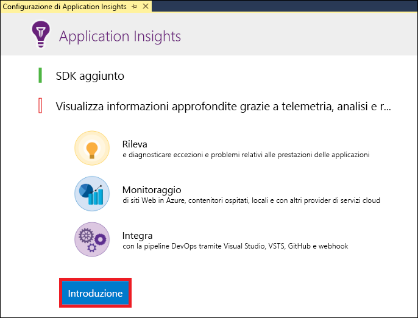
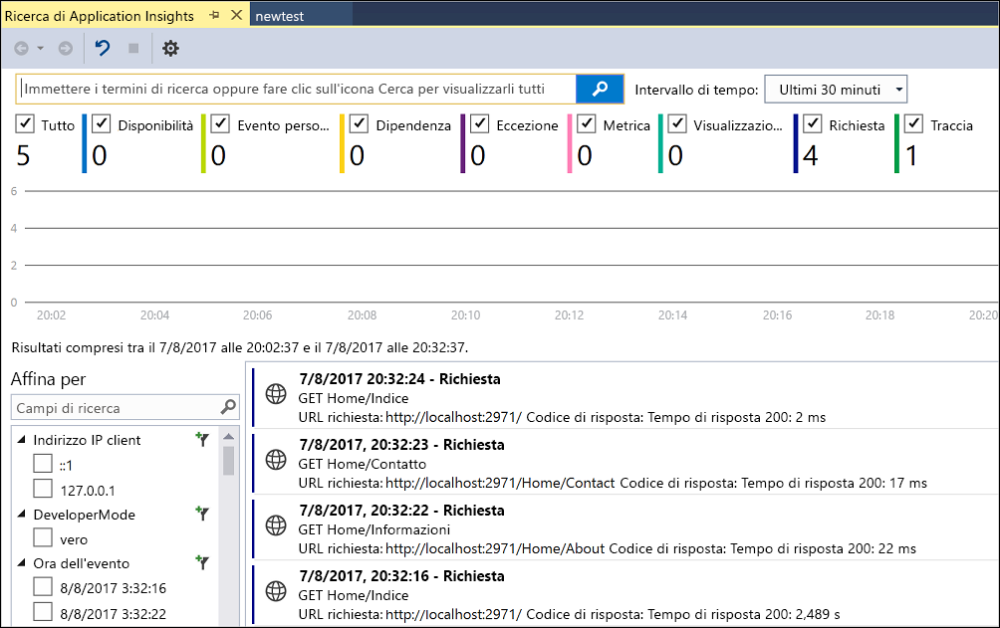
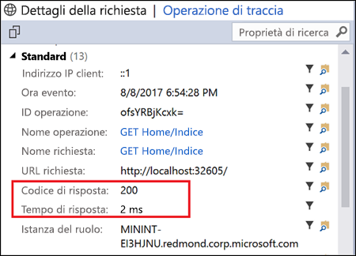
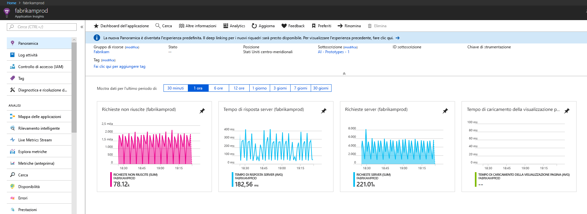
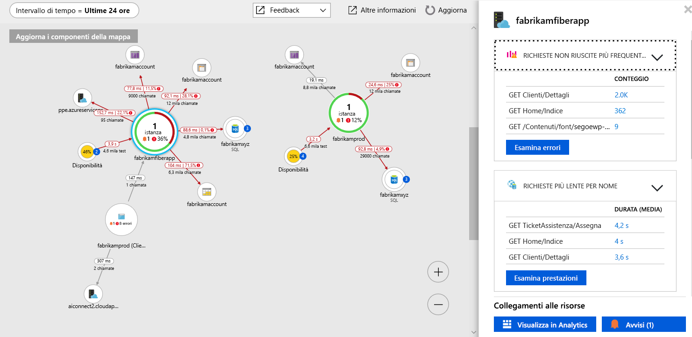
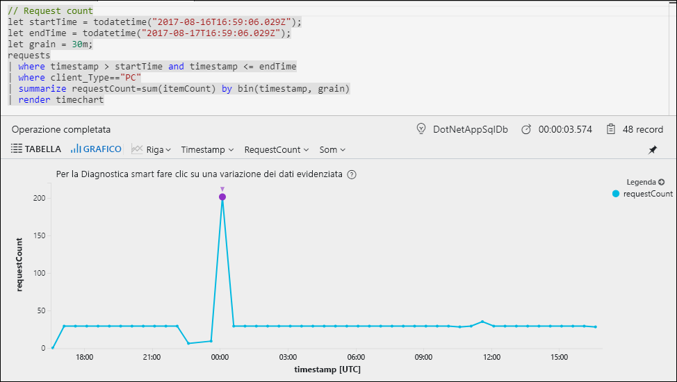
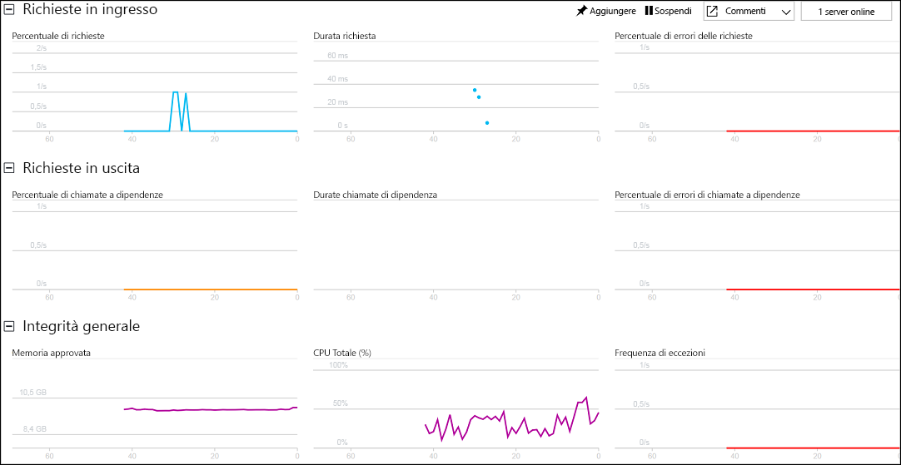

# <a name="start-monitoring-your-aspnet-web-application"></a>Iniziare a monitorare l'applicazione Web ASP.NET

Con Azure Application Insights, è possibile monitorare facilmente la disponibilità, le prestazioni e l'uso dell'applicazione Web.  È anche possibile identificare e diagnosticare rapidamente gli errori nell'applicazione senza attendere che vengano segnalati da un utente.  Con le informazioni raccolte da Application Insights sulle prestazioni e sull'efficacia dell'app, è possibile prendere decisioni informate per gestire e migliorare l'applicazione.

Questa guida introduttiva illustra come aggiungere Application Insights a un'applicazione Web ASP.NET esistente e iniziare ad analizzare le statistiche in tempo reale, che rappresentano solo uno dei vari metodi che è possibile usare per analizzare l'applicazione. Se non si ha un'applicazione Web ASP.NET, è possibile crearne una seguendo le istruzioni in [Creare un'app Web ASP.NET](../../app-service/app-service-web-get-started-dotnet-framework.md).

## <a name="prerequisites"></a>Prerequisiti
Per completare questa guida introduttiva:

- Installare [Visual Studio 2017](https://www.visualstudio.com/downloads/) con i carichi di lavoro seguenti:
    - Sviluppo Web e ASP.NET
    - Sviluppo di Azure


Se non si ha una sottoscrizione di Azure, creare un account [gratuito](https://azure.microsoft.com/free/) prima di iniziare.

## <a name="enable-application-insights"></a>Abilitare Application Insights

1. Aprire il progetto in Visual Studio 2017.
2. Selezionare **Configura Application Insights** dal menu Progetto. Visual Studio aggiunge Application Insights SDK all'applicazione.

    > [!IMPORTANT]
    > Il processo di aggiunta di Application Insights varia in base al tipo di modello ASP.NET. Se si usa il modello **Vuoto** o **App per dispositivi mobili di Azure**, selezionare **Progetto** > **Aggiungi Application Insights Telemetry**. Per tutti gli altri modelli ASP.NET, vedere le istruzioni nel passaggio precedente. 

3. Fare clic su **Inizia** (le versioni precedenti di Visual Studio dispongono invece di un pulsante **Inizia gratis**).

    

4. Selezionare la sottoscrizione e fare clic su **Registra**.

5. Eseguire l'applicazione selezionando **Avvia debug** dal menu **Debug** oppure premendo F5.

## <a name="confirm-app-configuration"></a>Verificare la configurazione dell'app

Application Insights raccoglie i dati di telemetria per l'applicazione indipendentemente dalla posizione in cui è in esecuzione. Usare la procedura seguente per iniziare a visualizzare questi dati.

1. Aprire Application Insights facendo clic su **Visualizza** -> **Altre finestre** -> **Ricerca di Application Insights**.  Verranno visualizzati i dati di telemetria per la sessione corrente.<BR><br>

2. Fare clic sulla prima richiesta nell'elenco (GET Home/Index in questo esempio) per visualizzare i relativi dettagli. Si noti che il codice di stato e il tempo di risposta sono entrambi inclusi insieme ad altre importanti informazioni sulla richiesta.<br><br>

## <a name="start-monitoring-in-the-azure-portal"></a>Avviare il monitoraggio nel portale di Azure

È ora possibile aprire Application Insights nel portale di Azure per visualizzare diversi dettagli sull'applicazione in esecuzione.

1. Fare clic con il pulsante destro del mouse sulla cartella **Servizi connessi di Application Insights** in Esplora soluzioni e quindi fare clic su **Apri portale Application Insights**.  Verranno visualizzate alcune informazioni sull'applicazione e diverse opzioni.

    

2. Fare clic su **Mappa delle applicazioni** per ottenere un layout visivo delle relazioni di dipendenza tra i componenti dell'applicazione.  Ogni componente mostra indicatori KPI come carico, prestazioni, errori e avvisi.

    

3. Fare clic sull'icona di **App Analytics**  in uno dei componenti dell'applicazione.  Verrà aperta la finestra **Application Insights - Analisi**, che fornisce un linguaggio di query avanzato per l'analisi di tutti i dati raccolti da Application Insights.  In questo caso viene generata una query che esegue il rendering del conteggio delle richieste sotto forma di grafico.  È possibile scrivere query personalizzate per analizzare altri dati.

    

4. Tornare alla pagina **Panoramica** e fare clic su **Live Stream**.  Verranno visualizzate le statistiche in tempo reale sull'applicazione mentre è in esecuzione.  Sono incluse informazioni come il numero di richieste in ingresso, la durata di tali richieste e gli eventuali errori che si verificano.  È anche possibile esaminare importanti metriche sulle prestazioni, come processore e memoria.

    

    A questo punto, se si è pronti per ospitare l'applicazione in Azure, è possibile pubblicarla. Seguire i passaggi descritti in [Creare un'app Web ASP.NET in Azure](../../app-service/app-service-web-get-started-dotnet.md#update-the-app-and-redeploy).

5. Se per aggiungere la funzionalità di monitoraggio di Application Insights si usa Visual Studio, è possibile aggiungere la funzione di monitoraggio lato client automaticamente. Per aggiungere manualmente la funzione di monitoraggio lato client a un'applicazione, aggiungere a quest'ultima il codice JavaScript seguente:

```html
<!-- 
To collect user behavior analytics about your application, 
insert the following script into each page you want to track.
Place this code immediately before the closing </head> tag,
and before any other scripts. Your first data will appear 
automatically in just a few seconds.
-->
<script type="text/javascript">
var appInsights=window.appInsights||function(a){
  function b(a){c[a]=function(){var b=arguments;c.queue.push(function(){c[a].apply(c,b)})}}var c={config:a},d=document,e=window;setTimeout(function(){var b=d.createElement("script");b.src=a.url||"https://az416426.vo.msecnd.net/scripts/a/ai.0.js",d.getElementsByTagName("script")[0].parentNode.appendChild(b)});try{c.cookie=d.cookie}catch(a){}c.queue=[];for(var f=["Event","Exception","Metric","PageView","Trace","Dependency"];f.length;)b("track"+f.pop());if(b("setAuthenticatedUserContext"),b("clearAuthenticatedUserContext"),b("startTrackEvent"),b("stopTrackEvent"),b("startTrackPage"),b("stopTrackPage"),b("flush"),!a.disableExceptionTracking){f="onerror",b("_"+f);var g=e[f];e[f]=function(a,b,d,e,h){var i=g&&g(a,b,d,e,h);return!0!==i&&c["_"+f](a,b,d,e,h),i}}return c
  }({
      instrumentationKey:"<your instrumentation key>"
  });

window.appInsights=appInsights,appInsights.queue&&0===appInsights.queue.length&&appInsights.trackPageView();
</script>
```

Per altre informazioni, visitare il repository GitHub per ottenere [JavaScript SDK open source Microsoft](https://github.com/Microsoft/ApplicationInsights-JS).

## <a name="video"></a>Video

* Video esterno dettagliato sulla [configurazione da zero di Application Insights con un'applicazione .NET](https://www.youtube.com/watch?v=blnGAVgMAfA).

## <a name="next-steps"></a>Passaggi successivi
In questa guida introduttiva è stata abilitata un'applicazione per il monitoraggio tramite Azure Application Insights.  Continuare con le esercitazioni per imparare a usare questa soluzione per monitorare le statistiche e rilevare i problemi nell'applicazione.

> [!div class="nextstepaction"]
> [Esercitazioni di Azure Application Insights](tutorial-runtime-exceptions.md)
