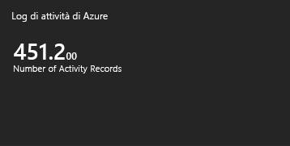
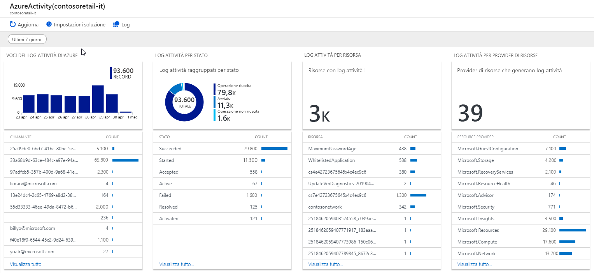

# Raccogliere e analizzare i log attività di Azure nell'area di lavoro Log Analytics in monitoraggio di Azure

> [!NOTE]
> È ora possibile raccogliere il log attività in un'area di lavoro Log Analytics usando un'impostazione di diagnostica simile a come si raccolgono i log delle risorse. Vedere [raccogliere e analizzare i log attività di Azure nell'area di lavoro log Analytics in monitoraggio di Azure](activity-log-collect.md).

Il [log attività di Azure](activity-logs-overview.md) fornisce informazioni sugli eventi a livello di sottoscrizione che si sono verificati nella sottoscrizione di Azure. Questo articolo descrive come raccogliere il log attività in un'area di lavoro Log Analytics e come usare la [soluzione di monitoraggio](../insights/solutions.md)analisi log attività, che fornisce le query e le visualizzazioni di log per l'analisi di questi dati. 

La connessione del log attività a un'area di lavoro di Log Analytics offre i vantaggi seguenti:

- Consolidare il log attività da più sottoscrizioni di Azure in un'unica posizione per l'analisi.
- Archivia le voci del log attività per più di 90 giorni.
- Correlare i dati del log attività con altri dati di monitoraggio raccolti da monitoraggio di Azure.
- Usare le [query di log](../log-query/log-query-overview.md) per eseguire analisi complesse e ottenere informazioni approfondite sulle voci del log attività.

## Connetti a Log Analytics area di lavoro
Una singola area di lavoro può essere connessa al log attività per più sottoscrizioni nello stesso tenant di Azure. Per la raccolta tra più tenant, vedere [raccogliere i log attività di Azure in un'area di lavoro log Analytics tra sottoscrizioni in Azure Active Directory tenant diversi](activity-log-collect-tenants.md).

> [!IMPORTANT]
> È possibile che venga visualizzato un errore con la seguente procedura se i provider di risorse Microsoft. OperationalInsights e Microsoft. OperationsManagement non sono registrati per la sottoscrizione. Per registrare questi provider, vedere [provider e tipi di risorse di Azure](../../azure-resource-manager/resource-manager-supported-services.md) .

Usare la procedura seguente per connettere il log attività all'area di lavoro Log Analytics:

1. Dal menu **log Analytics aree di lavoro** della portale di Azure selezionare l'area di lavoro per raccogliere il log attività.
1. Nella sezione **origini dati dell'area di lavoro** del menu dell'area di lavoro selezionare **log attività di Azure**.
1. Fare clic sulla sottoscrizione che si desidera connettere.

    

1. Fare clic su **Connetti** per connettere il log attività nella sottoscrizione all'area di lavoro selezionata. Se la sottoscrizione è già connessa a un'altra area di lavoro, fare clic su **Disconnetti** prima per disconnetterla.

    

## Analizza nell'area di lavoro Log Analytics
Quando si connette un log attività a un'area di lavoro Log Analytics, le voci vengono scritte nell'area di lavoro in una tabella denominata **AzureActivity** che è possibile recuperare con una [query di log](../log-query/log-query-overview.md). La struttura di questa tabella varia a seconda della [categoria della voce di log](activity-logs-overview.md#categories-in-the-activity-log). Per una descrizione di ogni categoria, vedere [schema degli eventi del log attività di Azure](activity-log-schema.md) .

## Soluzione di monitoraggio dei log attività
La soluzione di monitoraggio di Azure Log Analytics include più query e visualizzazioni di log per analizzare i record del log attività nell'area di lavoro Log Analytics.

### Installare la soluzione
Usare la procedura descritta in [installare una soluzione di monitoraggio](../insights/solutions.md#install-a-monitoring-solution) per installare la soluzione **analisi log attività** . Non è necessaria alcuna configurazione aggiuntiva.

### Usare la soluzione
È possibile accedere alle soluzioni di monitoraggio dal menu **monitoraggio** della portale di Azure. Per aprire la pagina **Panoramica** con i riquadri della soluzione, selezionare **altre informazioni** nella sezione **Insights** . Il riquadro **log attività di Azure** Visualizza un conteggio del numero di record **AzureActivity** nell'area di lavoro.

Fare clic sul riquadro **log attività di Azure** per aprire la visualizzazione **log attività di Azure** . La vista include le parti di visualizzazione nella tabella seguente. Ogni parte elenca fino a 10 elementi corrispondenti ai criteri delle parti per l'intervallo di tempo specificato. È possibile eseguire una query di log che restituisce tutti i record corrispondenti facendo clic su **Visualizza tutto** nella parte inferiore della parte.

| Parte della visualizzazione | DESCRIZIONE |
| --- | --- |
| Voci del Log attività di Azure | Mostra un grafico a barre dei totali dei record di voci del log attività di Azure superiore per l'intervallo di date selezionato e Mostra un elenco dei primi 10 chiamanti di attività. Fare clic sul grafico a barre per eseguire una ricerca di log per `AzureActivity`. Fare clic su un elemento chiamante per eseguire una ricerca log che restituisce tutte le voci del log attività per tale elemento. |
| Log attività per stato | Mostra un grafico ad anello per lo stato del log attività di Azure per l'intervallo di date selezionato e un elenco dei primi dieci record di stato. Fare clic sul grafico per eseguire una query di log per `AzureActivity | summarize AggregatedValue = count() by ActivityStatus`. Fare clic su un elemento di stato per eseguire una ricerca log che restituisce tutte le voci del log attività per il record di stato. |
| Log attività per risorsa | Mostra il numero totale di risorse con log attività ed elenca le prime dieci risorse con conteggi di record per ogni risorsa. Fare clic sull'area totale per eseguire una ricerca di log per `AzureActivity | summarize AggregatedValue = count() by Resource`, che mostra tutte le risorse di Azure disponibili per la soluzione. Fare clic su una risorsa per eseguire una query di log che restituisce tutti i record di attività per tale risorsa. |
| Log attività per provider di risorse | Mostra il numero totale di provider di risorse che producono log attività ed elenca i primi dieci. Fare clic sull'area totale per eseguire una query di log per `AzureActivity | summarize AggregatedValue = count() by ResourceProvider`, che Mostra tutti i provider di risorse di Azure. Fare clic su un provider di risorse per eseguire una query di log che restituisce tutti i record di attività per il provider. |

## Passaggi successivi

- Altre informazioni sul [log attività](activity-logs-overview.md).
- Scopri di più sulla [piattaforma dati di monitoraggio di Azure](data-platform.md).
- Usare le [query di log](../log-query/log-query-overview.md) per visualizzare informazioni dettagliate dal log attività.
