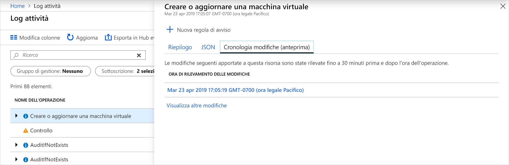
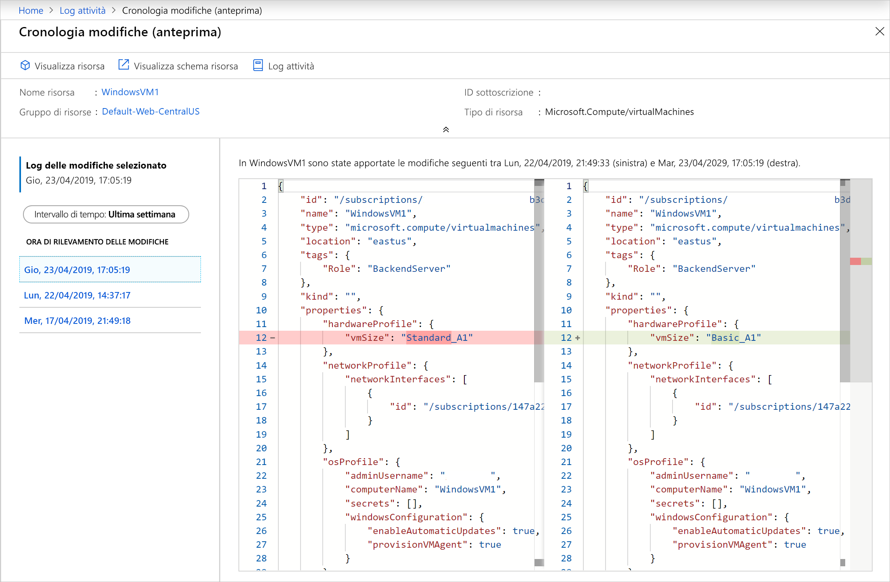

# <a name="view-and-retrieve-azure-activity-log-events"></a>Visualizzare e recuperare gli eventi del log attività di Azure

Il [Log attività di Azure](activity-logs-overview.md) fornisce approfondite sugli eventi a livello di sottoscrizione che si sono verificati in Azure. Questo articolo fornisce informazioni dettagliate sui diversi metodi per la visualizzazione e il recupero di eventi del Log attività.

## <a name="azure-portal"></a>Portale di Azure
Visualizzare il Log attività per tutte le risorse dal **Monitor** menu nel portale di Azure. Visualizzare il Log attività per una determinata risorsa dal **Log attività** opzione nel menu della risorsa.


È possibile filtrare gli eventi del Log attività per i campi seguenti:

* **Intervallo di tempo**: Ora di inizio e fine per gli eventi.
* **Categoria**: La categoria di eventi, come descritto in [categorie nel Log attività](activity-logs-overview.md#categories-in-the-activity-log).
* **Sottoscrizione** Uno o più nomi di sottoscrizione di Azure.
* **Gruppo di risorse**: Uno o più gruppi di risorse all'interno delle sottoscrizioni selezionate.
* **Risorsa (nome)** :-il nome di una risorsa specifica.
* **Tipo di risorsa**: Il tipo di risorsa, ad esempio _COMPUTE/virtualmachines_.
* **Nome dell'operazione** -il nome di un'operazione di Azure Resource Manager, ad esempio _Microsoft.SQL/servers/Write_.
* **Gravità**: Il livello di gravità dell'evento. I valori disponibili sono _Informational_, _avviso_, _errore_, _critico_.
* **Evento avviato da**: L'utente che ha eseguito l'operazione.
* **Aprire la ricerca**: Casella di ricerca di testo aperta che cerca tale stringa in tutti i campi in tutti gli eventi.

### <a name="view-change-history"></a>Visualizzare la cronologia modifiche

Quando si rivede il Log attività, può essere utile per vedere cosa è successo modifiche durante tale ora dell'evento. È possibile visualizzare queste informazioni con **cronologia modifiche**. Selezionare un evento dal Log attività di cui si desidera cercare dettagli della gestione. Selezionare il **cronologia revisioni (anteprima)** scheda per visualizzare qualsiasi associato le modifiche all'evento.



Se sono state apportate modifiche associate all'evento, si verrà visualizzato un elenco di modifiche che è possibile selezionare. Verrà visualizzato il **cronologia revisioni (anteprima)** pagina. In questa pagina visualizzare le modifiche alla risorsa. Come può notare nell'esempio seguente, siamo in grado di vedere non solo che la macchina virtuale modificati dimensioni, ma ciò che le dimensioni VM precedente erano prima della modifica e ciò che è stata modificata in.



Per altre informazioni sulla cronologia delle modifiche, vedere [ottenere le modifiche alle risorse](../../governance/resource-graph/how-to/get-resource-changes.md).


## <a name="log-analytics-workspace"></a>Area di lavoro Log Analytics
Fare clic su **registri** nella parte superiore del **Log attività** pagina per aprire il [Analitica di Log attività di soluzione di monitoraggio](activity-log-collect.md) per la sottoscrizione. Ciò consentirà di visualizzare analitica per il Log attività e di eseguire [query di log](../log-query/log-query-overview.md) con il **AzureActivity** tabella. Se il Log attività non è connesso a un'area di lavoro di Log Analitica, verrà richiesto di eseguire questa configurazione.


## <a name="powershell"></a>PowerShell
Usare la [Get-AzLog](https://docs.microsoft.com/powershell/module/az.monitor/get-azlog) cmdlet per recuperare il Log attività da PowerShell. Di seguito sono riportati alcuni esempi comuni.

> [!NOTE]
> `Get-AzLog` fornisce solo 15 giorni di cronologia. Usare la **- MaxEvents** parametro per eseguire una query ultimi N eventi oltre i 15 giorni. Per accedere agli eventi precedenti ai 15 giorni, usare l'API REST o SDK. Se non si include **StartTime**, il valore predefinito è **EndTime** meno un'ora. Se non si include **EndTime**, il valore predefinito è l’ora corrente. Tutte le ore sono in formato UTC.


Ottenere le voci di log create dopo una data specifica ora:

```powershell
Get-AzLog -StartTime 2016-03-01T10:30
```

Ottenere le voci di log tra un intervallo di tempo data:

```powershell
Get-AzLog -StartTime 2015-01-01T10:30 -EndTime 2015-01-01T11:30
```

Ottenere le voci di log da un gruppo di risorse specifico:

```powershell
Get-AzLog -ResourceGroup 'myrg1'
```

Ottenere le voci di log da un provider di risorse specifico tra un intervallo di tempo data:

```powershell
Get-AzLog -ResourceProvider 'Microsoft.Web' -StartTime 2015-01-01T10:30 -EndTime 2015-01-01T11:30
```

Ottenere le voci di log con un chiamante specifico:

```powershell
Get-AzLog -Caller 'myname@company.com'
```

Ottenere gli ultimi 1000 eventi:

```powershell
Get-AzLog -MaxEvents 1000
```


## <a name="cli"></a>CLI
Uso [az monitor log attività](cli-samples.md#view-activity-log-for-a-subscription) per recuperare il Log attività della riga di comando. Di seguito sono riportati alcuni esempi comuni.


Visualizzare tutte le opzioni disponibili.

```azurecli
az monitor activity-log list -h
```

Ottenere le voci di log da un gruppo di risorse specifico:

```azurecli
az monitor activity-log list --resource-group <group name>
```

Ottenere le voci di log con un chiamante specifico:

```azurecli
az monitor activity-log list --caller myname@company.com
```

Ottenere i log dal chiamante in un tipo di risorsa, all'interno di un intervallo di date:

```azurecli
az monitor activity-log list --resource-provider Microsoft.Web \
    --caller myname@company.com \
    --start-time 2016-03-08T00:00:00Z \
    --end-time 2016-03-16T00:00:00Z
```

## <a name="rest-api"></a>API REST
Usare la [API REST di monitoraggio di Azure](https://docs.microsoft.com/rest/api/monitor/) per recuperare il Log attività da un client REST. Di seguito sono riportati alcuni esempi comuni.

Ottenere i log attività con il filtro:

``` HTTP
GET https://management.azure.com/subscriptions/089bd33f-d4ec-47fe-8ba5-0753aa5c5b33/providers/microsoft.insights/eventtypes/management/values?api-version=2015-04-01&$filter=eventTimestamp ge '2018-01-21T20:00:00Z' and eventTimestamp le '2018-01-23T20:00:00Z' and resourceGroupName eq 'MSSupportGroup'
```

Ottenere i log attività con filtro e selezionare:

```HTTP
GET https://management.azure.com/subscriptions/089bd33f-d4ec-47fe-8ba5-0753aa5c5b33/providers/microsoft.insights/eventtypes/management/values?api-version=2015-04-01&$filter=eventTimestamp ge '2015-01-21T20:00:00Z' and eventTimestamp le '2015-01-23T20:00:00Z' and resourceGroupName eq 'MSSupportGroup'&$select=eventName,id,resourceGroupName,resourceProviderName,operationName,status,eventTimestamp,correlationId,submissionTimestamp,level
```

Ottenere i log attività con l'istruzione select:

```HTTP
GET https://management.azure.com/subscriptions/089bd33f-d4ec-47fe-8ba5-0753aa5c5b33/providers/microsoft.insights/eventtypes/management/values?api-version=2015-04-01&$select=eventName,id,resourceGroupName,resourceProviderName,operationName,status,eventTimestamp,correlationId,submissionTimestamp,level
```

Ottenere i log attività senza filtro oppure selezionare:

```HTTP
GET https://management.azure.com/subscriptions/089bd33f-d4ec-47fe-8ba5-0753aa5c5b33/providers/microsoft.insights/eventtypes/management/values?api-version=2015-04-01
```


## <a name="next-steps"></a>Fasi successive

* [Leggere una panoramica del Log attività](activity-logs-overview.md)
* [Archiviare il Log attività di archiviazione o trasmetterli all'hub eventi](activity-log-export.md)
* [Trasmettere il log attività di Azure a Hub eventi](activity-logs-stream-event-hubs.md)
* [Archiviare il Log attività di Azure all'archiviazione](archive-activity-log.md)

