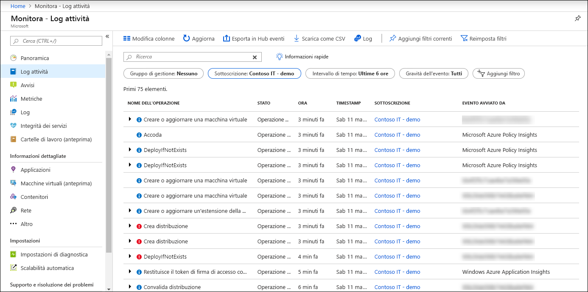

# Panoramica del log attività di Azure

Il **log attività di Azure** fornisce informazioni approfondite sugli eventi a livello di sottoscrizione che si sono verificati in Azure. Ciò include un intervallo di dati che vanno dai dati operativi di Azure Resource Manager agli aggiornamenti sugli eventi di integrità del servizio. Il log attività era noto in precedenza come log di _controllo_ o _log operativi_, poiché la categoria amministrativa segnala gli eventi del piano di controllo per le sottoscrizioni. 

Usare il log attività per determinare l'elemento, _chi_e _quando_ per qualsiasi operazione di scrittura (Put, post, Delete) eseguita sulle risorse nella sottoscrizione. Consente inoltre di comprendere lo stato dell'operazione e altre proprietà specifiche. 

Il log attività non include operazioni di lettura (GET) o operazioni per le risorse che usano il modello classico/RDFE.

## Confronto con i log di diagnostica
È disponibile un singolo log attività per ogni sottoscrizione di Azure. Fornisce dati sulle operazioni su una risorsa dall'esterno (il "piano di controllo"). I [log di diagnostica](diagnostic-logs-overview.md) vengono generati da una risorsa e forniscono informazioni sul funzionamento di tale risorsa (il "piano dati"). È necessario abilitare le impostazioni di diagnostica per ogni risorsa.

> [!NOTE]
> Il log attività di Azure è destinato principalmente alle attività che si verificano in Azure Resource Manager. Non tiene traccia delle risorse che usano il modello classico/RDFE. Alcuni tipi di risorse classiche dispongono di un provider di risorse proxy in Azure Resource Manager (ad esempio, Microsoft.ClassicCompute). Se un utente interagisce con un tipo di risorsa classica tramite Azure Resource Manager con questi provider di risorse di proxy, le operazioni verranno visualizzate nel log attività. Se un utente interagisce con un tipo di risorsa classica all'esterno dei proxy di Azure Resource Manager, le azioni dell'utente verranno registrate solo nel log delle operazioni. È possibile esaminare il log delle operazioni in una sezione distinta del portale.

## Conservazione log attività
Una volta create, le voci del log attività non vengono modificate o eliminate dal sistema. Inoltre, non è possibile modificarli nell'interfaccia o a livello di codice. Gli eventi del log attività vengono archiviati per 90 giorni. Per archiviare i dati per periodi più lunghi, [raccoglierli in monitoraggio di Azure](activity-log-collect.md) o esportarli nell' [archiviazione o in hub eventi](activity-log-export.md).

## Visualizzare il log attività
Visualizzare il log attività per tutte le risorse dal menu **monitoraggio** nel portale di Azure. Visualizzare il log attività per una determinata risorsa dall'opzione **log attività** nel menu di tale risorsa. È anche possibile recuperare i record del log attività con PowerShell, l'interfaccia della riga di comando o l'API REST.  Vedere [visualizzare e recuperare gli eventi del log attività di Azure](activity-log-view.md).

## Raccogliere il log attività in monitoraggio di Azure
Raccogliere il log attività in un'area di lavoro Log Analytics in monitoraggio di Azure per analizzarlo con altri dati di monitoraggio e conservare i dati per più di 90 giorni. Vedere [raccogliere e analizzare i log attività di Azure nell'area di lavoro log Analytics in monitoraggio di Azure](activity-log-collect.md).

## Esporta log attività
Esportare il log attività in archiviazione di Azure per l'archiviazione o lo streaming in un hub eventi per l'inserimento da parte di un servizio di terze parti o di una soluzione di analisi personalizzata. Vedere [esportare il log attività di Azure](activity-log-export.md). È anche possibile analizzare gli eventi del log attività in Power BI usando il [**pacchetto di contenuto Power bi**](https://powerbi.microsoft.com/documentation/powerbi-content-pack-azure-audit-logs/).

## Avviso per il log attività
È possibile creare un avviso quando vengono creati eventi specifici nel log attività con un [Avviso del log attività](activity-log-alerts.md). È inoltre possibile creare un avviso utilizzando una [query di log](alerts-log-query.md) quando il log attività è connesso a un'area di lavoro log Analytics, ma è previsto un costo per la registrazione degli avvisi di query. Non sono previsti costi per gli avvisi del log attività.

## Categorie nel log attività
Ogni evento nel log attività dispone di una categoria specifica descritta nella tabella seguente. Per informazioni dettagliate sugli schemi di queste categorie, vedere [Schema degli eventi del log attività di Azure](activity-log-schema.md). 

| Category | Descrizione |
|:---|:---|
| Amministrativa | Contiene il record di tutte le operazioni di creazione, aggiornamento, eliminazione e azione eseguite tramite Gestione risorse. Esempi di eventi amministrativi includono _creare una macchina virtuale_ ed _eliminare un gruppo di sicurezza di rete_.  Ogni azione eseguita da un utente o da un'applicazione che usa Gestione risorse viene modellata come operazione su un particolare tipo di risorsa. Se il tipo di operazione è _Write_, _Delete_o _Action_, i record di avvio e di esito positivo o negativo di tale operazione vengono registrati nella categoria amministrativa. Gli eventi amministrativi includono anche eventuali modifiche al controllo degli accessi in base al ruolo in una sottoscrizione. |
| Integrità dei servizi | Contiene il record degli eventi imprevisti di integrità del servizio che si sono verificati in Azure. Un esempio di evento di integrità del servizio _SQL Azure negli Stati Uniti orientali sta riscontrando tempi di inattività_.   Gli eventi di integrità del servizio sono disponibili in sei tipi: _Azione richiesta_, _ripristino assistito_, _eventi imprevisti_, _manutenzione_, _informazioni_o _sicurezza_. Questi eventi vengono creati solo se si dispone di una risorsa nella sottoscrizione che potrebbe essere interessata dall'evento.
| Integrità risorsa | Contiene il record degli eventi di integrità delle risorse che si sono verificati nelle risorse di Azure. Un esempio di evento Integrità risorse è _lo stato di integrità della macchina virtuale modificato in non disponibile_.  Gli eventi Integrità risorse possono rappresentare uno dei quattro stati di integrità seguenti: _Disponibile_, non _disponibile_, _danneggiato_e _sconosciuto_. Inoltre, gli eventi Integrità risorse possono essere categorizzati come _avviati dalla piattaforma_ o _avviati dall'utente_. |
| Avviso | Contiene il record delle attivazioni per gli avvisi di Azure. Un esempio di evento di avviso è _la percentuale della CPU su myVM è stata superata 80 per gli ultimi 5 minuti_.|
| Autoscale | Contiene il record degli eventi correlati all'operazione del motore di ridimensionamento automatico in base alle impostazioni di scalabilità automatica definite nella sottoscrizione. Un esempio di evento di scalabilità automatica è l'azione di scalabilità _orizzontale automatica non riuscita_. |
| Recommendation | Contiene gli eventi di raccomandazione da Azure Advisor. |
| Security | Contiene il record degli avvisi generati dal centro sicurezza di Azure. Un esempio di evento di sicurezza è un _file di estensione doppio sospetto eseguito_. |
| Criteri | Contiene i record di tutte le operazioni di azione effetto eseguite da criteri di Azure. Esempi di eventi dei criteri includono _Audit_ e _Deny_. Ogni azione eseguita da Criteri viene modellata come operazione su una risorsa. |

## Fasi successive

* [Creare un profilo di log per esportare il log attività di Azure](activity-log-export.md)
* [Trasmettere il log attività di Azure a Hub eventi](activity-logs-stream-event-hubs.md)
* [Archiviare il log attività di Azure nella risorsa di archiviazione](archive-activity-log.md)

