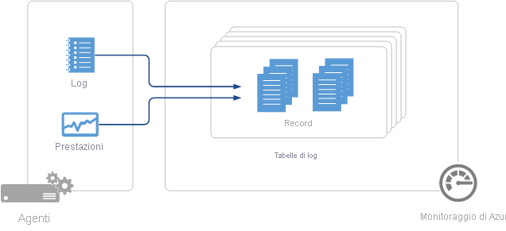

# Origini dati degli agenti in Monitoraggio di Azure
I dati che Monitoraggio di Azure raccoglie dagli agenti sono definiti dalle origini dati configurate.  I dati degli agenti vengono archiviati come [dati di log](data-platform-logs.md) con un set di record.  Ogni origine dati crea record di un tipo specifico in cui ogni tipo ha un proprio set di proprietà.

## Riepilogo delle origini dati
Nella tabella seguente sono elencate le origini dati degli agenti attualmente disponibili in Monitoraggio di Azure.  Ogni origine dati ha un collegamento a un articolo distinto che fornisce informazioni dettagliate.   Sono inoltre disponibili informazioni sul metodo e la frequenza della raccolta. 

| Origine dati | Piattaforma | Microsoft Monitoring Agent | Agente di Operations Manager | Archiviazione di Azure | È necessario Operations Manager? | Dati dell'agente Operations Manager inviati con il gruppo di gestione | Frequenza della raccolta |
| --- | --- | --- | --- | --- | --- | --- | --- |
| [Log personalizzati](data-sources-custom-logs.md) | Windows |&#8226; |  | |  |  | all'arrivo |
| [Log personalizzati](data-sources-custom-logs.md) | Linux   |&#8226; |  | |  |  | all'arrivo |
| [Log IIS](data-sources-iis-logs.md) | Windows |&#8226; |&#8226; |&#8226; |  |  |dipende dall'impostazione dell'opzione Aggiornamento file di registro |
| [Contatori delle prestazioni](data-sources-performance-counters.md) | Windows |&#8226; |&#8226; |  |  |  |come pianificato, almeno 10 secondi |
| [Contatori delle prestazioni](data-sources-performance-counters.md) | Linux |&#8226; |  |  |  |  |come pianificato, almeno 10 secondi |
| [Syslog](data-sources-syslog.md) | Linux |&#8226; |  |  |  |  |dall'Archiviazione di Azure: 10 minuti; dall'agente: all'arrivo |
| [Log eventi di Windows](data-sources-windows-events.md) |Windows |&#8226; |&#8226; |&#8226; |  |&#8226; | all'arrivo |

## Configurazione delle origini dati
Configurare le origini dati nel menu **Dati** in **Impostazioni avanzate** per l'area di lavoro.  Qualsiasi configurazione viene recapitata a tutte le origini connesse nell'area di lavoro.  Attualmente non è possibile escludere gli agenti da questa configurazione.

1. Nel portale di Azure selezionare **Aree di lavoro di Log Analytics** > area di lavoro personale > **Impostazioni avanzate**.
2. Selezionare **Dati**.
3. Fare clic sull'origine dati che si desidera configurare.
4. Per informazioni dettagliate relative alla configurazione, seguire il collegamento alla documentazione per ogni origine dati nella tabella precedente.

## Raccolta dei dati
Le configurazioni dell'origine dati vengono distribuite agli agenti connessi direttamente a Monitoraggio di Azure entro pochi minuti.  I dati specificati vengono raccolti dall'agente e distribuiti direttamente a Monitoraggio di Azure a intervalli specifici per ogni origine dati.  Per informazioni sugli intervalli specifici di ogni origine dati, vedere la documentazione.

Per gli agenti di System Center Operations Manager in un gruppo di gestione connesso, le configurazioni dell'origine dati vengono convertite in Management Pack e recapitate al gruppo di gestione ogni 5 minuti per impostazione predefinita.  L'agente scarica il Management Pack e raccoglie i dati specificati. A seconda dell'origine dati, i dati verranno inviati a un server di gestione che li inoltrerà a Monitoraggio di Azure oppure verranno inviati dall'agente a Monitoraggio di Azure senza passare per il server di gestione. Per informazioni dettagliate, vedere [Informazioni dettagliate sulla raccolta dati per le soluzioni di gestione in Azure](../insights/solutions-inventory.md).  È possibile leggere informazioni sulla connessione di Operations Manager e Monitoraggio di Azure e sulla modifica della frequenza a cui tale configurazione viene distribuita nell'articolo relativo alla [configurazione dell'integrazione con System Center Operations Manager](om-agents.md).

Se l'agente non riesce a connettersi a Monitoraggio di Azure o a Operations Manager, continuerà a raccogliere dati che distribuirà quando stabilirà una connessione.  I dati possono andare persi se la quantità di dati raggiunge la dimensione massima della cache per il client o se l'agente non riesce a stabilire una connessione entro 24 ore.

## Record di log
Tutti i dati raccolti da Monitoraggio di Azure vengono archiviati nell'area di lavoro come record.  I record raccolti da diverse origini dati avranno il proprio set di proprietà e verranno identificati dalla proprietà **Type** .  Per informazioni dettagliate su ogni tipo di record, vedere la documentazione per ogni origine dati e soluzione.

## Passaggi successivi
* Altre informazioni sulle [soluzioni di monitoraggio](../insights/solutions.md) che aggiungono funzionalità a Monitoraggio di Azure e raccolgono anche dati nell'area di lavoro.
* Altre informazioni sulle [query di log](../log-query/log-query-overview.md) per analizzare i dati raccolti dalle origini dati e dalle soluzioni di monitoraggio.  
* Configurare gli [avvisi](alerts-overview.md) per inviare notifiche immediate sui dati critici raccolti da origini dati e soluzioni di monitoraggio.