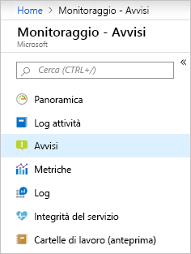
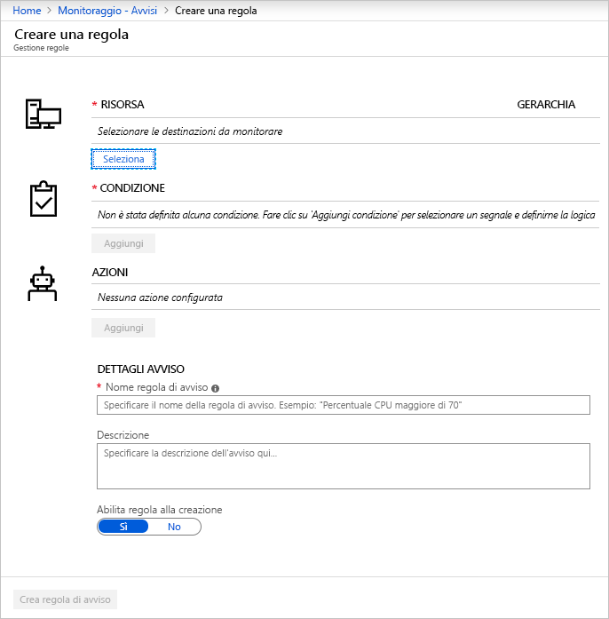
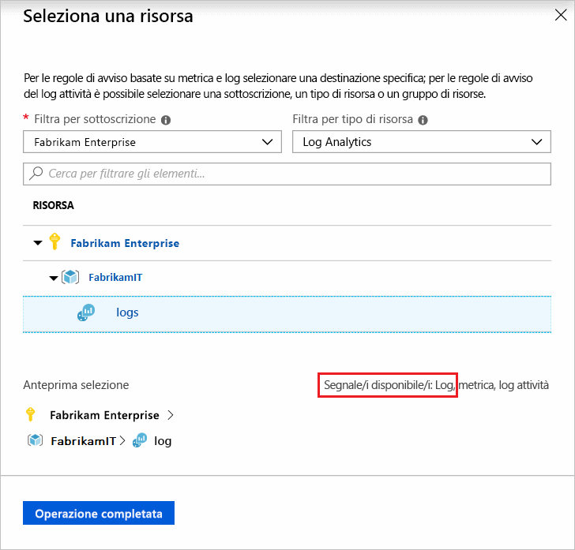
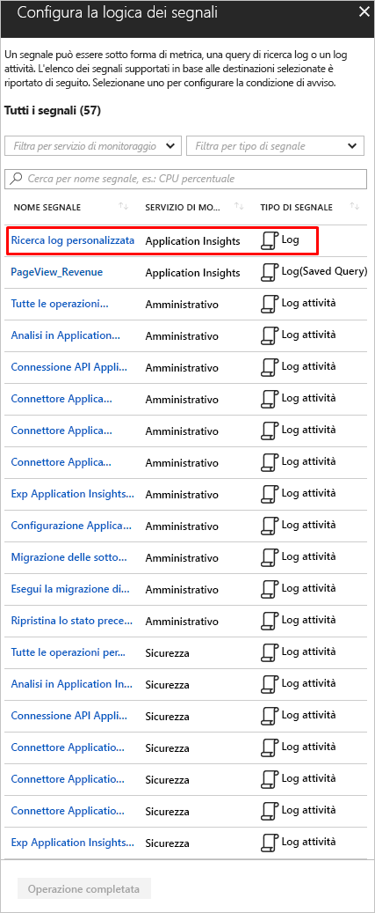
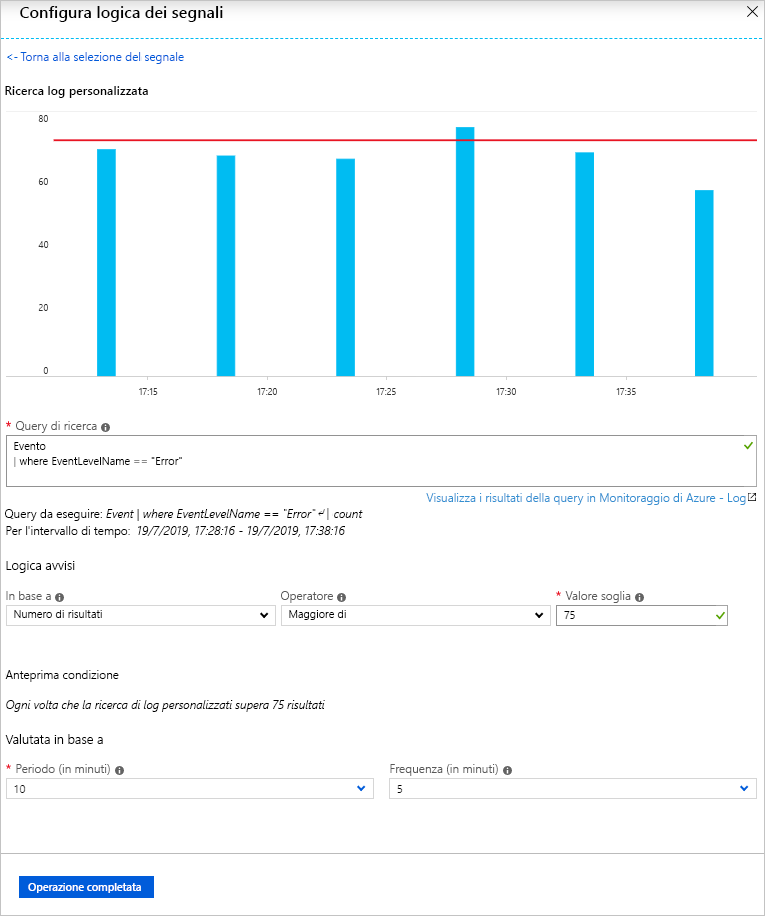
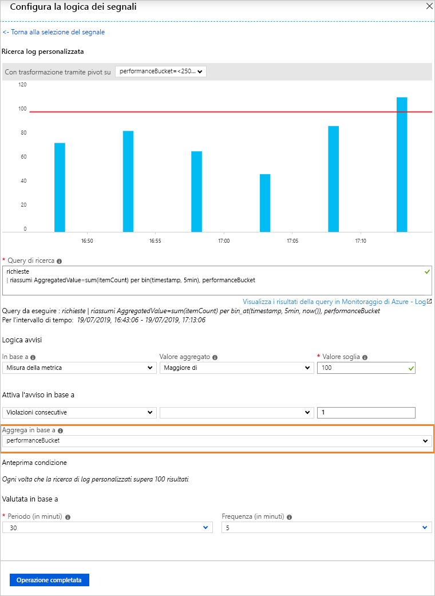
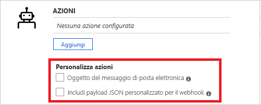
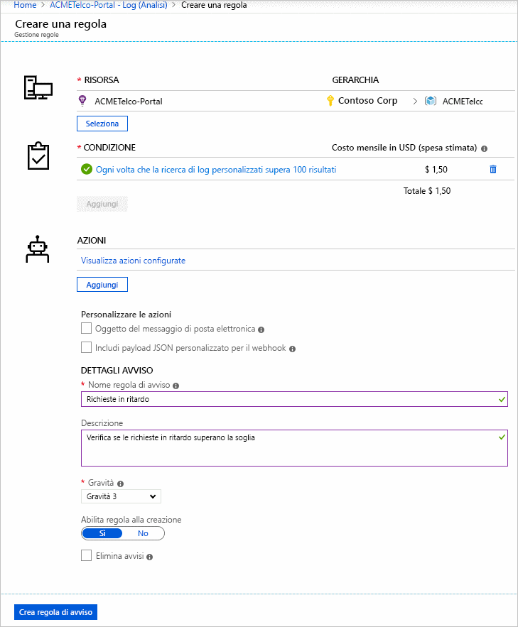
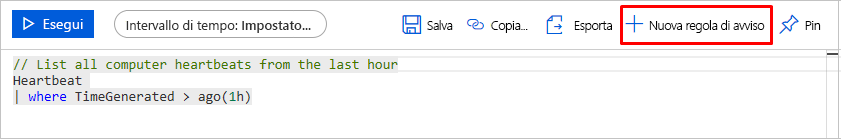

# <a name="create-view-and-manage-log-alerts-using-azure-monitor"></a>Creare, visualizzare e gestire gli avvisi del log tramite Monitoraggio di Azure

## <a name="overview"></a>Panoramica
Questo articolo illustra come configurare gli avvisi del log tramite l'interfaccia degli avvisi nel portale di Azure. La definizione di una regola di avviso è costituita da tre parti:
- Destinazione: la risorsa specifica di Azure da monitorare
- Criteri: condizione specifica o logica che, se rilevata nel segnale, deve attivare l'azione
- Azione: chiamata specifica inviata a un ricevitore di una notifica di posta elettronica, SMS, webhook e così via.

Il termine **gli avvisi del Log** per descrivere gli avvisi in cui il segnale è query di log in un [dell'area di lavoro di Log Analitica](../learn/tutorial-viewdata.md) oppure [Application Insights](../app/analytics.md). Altre informazioni su funzionalità, terminologia e tipi su [Avvisi del log - Panoramica](alerts-unified-log.md).

> [!NOTE]
> Dati di log più diffusi da [un'area di lavoro di Log Analitica](../../azure-monitor/learn/tutorial-viewdata.md) è ora inoltre disponibile nella piattaforma di metriche in Monitoraggio di Azure. Per i dettagli, vedere [Metric Alert for Logs](alerts-metric-logs.md) (Avvisi di metrica per i log).

## <a name="managing-log-alerts-from-the-azure-portal"></a>Gestione degli avvisi del log dal portale di Azure

Di seguito è riportata una Guida dettagliata all'uso degli avvisi del log tramite l'interfaccia del portale di Azure.

### <a name="create-a-log-alert-rule-with-the-azure-portal"></a>Creare una regola per gli avvisi relativi ai log con il portale di Azure
1. Nel [portale](https://portal.azure.com/)selezionare **Monitoraggio** e nella sezione MONITORAGGIO scegliere **Avvisi**.

    

1. Selezionare il pulsante **Nuova regola di avviso** per creare un nuovo avviso in Azure.

    

1. La sezione Crea avviso viene visualizzata con le tre parti costituite da: *Definire la condizione dell'avviso*, *Definire i dettagli dell'avviso* e *Definire il gruppo di azioni*.

    

1. Definire la condizione dell'avviso tramite il collegamento **Seleziona risorsa** e specificare la destinazione selezionando una risorsa. Filtrare scegliendo la _Sottoscrizione_, il _Tipo di risorsa_ e infine la _Risorsa_ necessaria.

   > [!NOTE]
   > 
   > Prima di procedere, per creare un avviso relativo ai log verificare che il segnale di **log** sia disponibile per la risorsa selezionata.
   >  

1. *Avvisi relativi ai log*: verificare che **Tipo di risorsa** sia un'origine dati di analisi come *Log Analytics* o *Application Insights* e un tipo di segnale **Log** quindi, dopo aver selezionato la **risorsa** appropriata, fare clic su *Operazione completata*. Usare quindi il pulsante **Aggiungi criteri** per visualizzare l'elenco delle opzioni di segnale disponibili per la risorsa e nell'elenco dei segnali selezionare l'opzione di **ricerca log personalizzata** per il servizio di monitoraggio del log scelto, ad esempio *Log Analytics* o *Application Insights*.

   

   > [!NOTE]
   > 
   > Avvisi può importare query di Analytics come tipo di segnale **Log (query salvata)** , come illustrato nella figura precedente. In modo che gli utenti possono perfezionare la query in Analitica e salvarlo per utilizzi futuri in avvisi - altri dettagli sull'uso del salvataggio di query disponibile all'indirizzo [l'uso di query di log in Monitoraggio di Azure](../log-query/log-query-overview.md) o [query condivisa in analitica di application insights ](../log-query/log-query-overview.md).

1. *Avvisi relativi ai log*: una volta selezionata, la query per gli avvisi può essere immessa nel campo **Query di ricerca**. Se la sintassi della query non è corretta, nel campo viene visualizzato un errore in ROSSO. Se la sintassi della query è corretta, i dati cronologici della query specificata vengono visualizzati sotto forma di grafico come riferimento con un'opzione per modificare l'intervallo di tempo dalle ultime sei ore alla settimana precedente.

    

   > [!NOTE]
   > 
   > La visualizzazione dei dati cronologici è possibile solo se i risultati della query includono dettagli temporali. Se la query restituisce dati di riepilogo o specifici valori di colonna, questi dati vengono visualizzati come tracciato singolo.
   > Per il tipo di avvisi di log Unità di misura della metrica in cui viene usato Application Insights o [la nuova API](alerts-log-api-switch.md), è possibile indicare la variabile specifica per raggruppare i dati con l'opzione **Aggrega in base a**, come illustrato di seguito:
   > 
   > 

1. *Avvisi relativi ai log*: Con la visualizzazione impostata, è possibile selezionare **Logica avvisi** dalle opzioni visualizzate: Condizione, Aggregazione e infine Soglia. Specificare l'ora in cui valutare la condizione specificata nella logica tramite l'opzione **Periodo**. Specificare la frequenza con cui l'avviso deve essere eseguito selezionando **Frequenza**. Gli **avvisi di log** possono basarsi su:
    - [Numero di record](../../azure-monitor/platform/alerts-unified-log.md#number-of-results-alert-rules): viene creato un avviso se il numero di record restituiti dalla query è maggiore o minore del valore specificato.
    - [Misura della metrica](../../azure-monitor/platform/alerts-unified-log.md#metric-measurement-alert-rules): viene creato un avviso se ogni *valore di aggregazione* nei risultati supera il valore di soglia specificato ed è *raggruppato* in base al valore scelto. Il numero di violazioni per un avviso è il numero di volte in cui viene superata la soglia nel periodo di tempo scelto. È possibile specificare le violazioni totali per qualsiasi combinazione di violazioni nei set di risultati o le violazioni consecutive necessarie che devono verificarsi in campioni consecutivi.


1. Come secondo passaggio, definire un nome per l'avviso nel campo **Nome regola di avviso** insieme a una **Descrizione** con le specifiche per l'avviso e il valore di **Gravità** nelle opzioni disponibili. Questi dettagli vengono riutilizzati in tutti i messaggi di avviso, le notifiche o notifiche push eseguite da Monitoraggio di Azure. Inoltre, l'utente può scegliere di attivare immediatamente la regola di avviso durante la creazione attivando in modo appropriato l'opzione **Abilita regola alla creazione**.

    Solo per gli **avvisi del log** sono disponibili alcune funzionalità aggiuntive nei dettagli degli avvisi:

    - **Elimina avvisi**: Quando si attiva l'eliminazione per la regola di avviso, le azioni della regola vengono disabilitate per un periodo di tempo definito dopo la creazione di un nuovo avviso. La regola è ancora in esecuzione e, se i criteri vengono soddisfatti, crea i record di avviso. L'utente ha il tempo necessario per risolvere il problema senza eseguire azioni duplicate.

        

        > [!TIP]
        > Specificare un valore di eliminazione dell'avviso maggiore della frequenza di avviso per garantire che le notifiche vengano arrestate senza sovrapposizione

1. Come terzo e ultimo passaggio, specificare se un **gruppo di azioni** deve essere attivato per la regola di avviso quando viene soddisfatta la condizione dell'avviso. È possibile scegliere qualsiasi gruppo di azioni esistente con un avviso o creare un nuovo gruppo di azioni. In base al gruppo di azioni selezionato, quando viene attivato l'avviso, Azure eseguirà queste operazioni: invio di messaggi di posta elettronica, invio di SMS, chiamata di webhook, correzione dell'uso di runbook di Azure, invio di notifiche push allo strumento Gestione dei servizi IT e così via. Altre informazioni sui [gruppi di azioni](action-groups.md).

    > [!NOTE]
    > Vedere i [vincoli dei servizi di sottoscrizione di Azure](../../azure-subscription-service-limits.md) per i vincoli sui payload di Runbook attivati per gli avvisi del log tramite i gruppi di azioni di Azure

    Per gli **avvisi del log** sono disponibili alcune funzionalità aggiuntive per eseguire l'override di quelle predefinite:

    - **Notifica tramite posta elettronica**: esegue l'override dell'*oggetto di posta elettronica* nel messaggio di posta elettronica inviato tramite il gruppo di azioni, se esistono una o più azioni di posta elettronica nel gruppo di azioni. Non è possibile modificare il corpo del messaggio e questo campo **non** è destinato agli indirizzi di posta elettronica.
    - **Includi payload JSON personalizzato**: esegue l'override del webhook JSON usato dai gruppi di azioni, se nel gruppo di azioni sono presenti una o più azioni webhook. Un utente può specificare il formato JSON da usare per tutti i webhook configurati nel gruppo di azioni associato. Per altre informazioni sui formati webhook, vedere [Azioni webhook per le regole di avviso relative ai log](../../azure-monitor/platform/alerts-log-webhook.md). L'opzione di visualizzazione Webhook consente di verificare il formato tramite i dati JSON di esempio.

        


1. Se tutti i campi sono validi e hanno un segno di spunta verde, il pulsante **Crea regola di avviso** può essere selezionato e viene creato un avviso in Monitoraggio di Azure - Avvisi. Tutti gli avvisi possono essere visualizzati nella dashboard di Avvisi.

     

     Dopo pochi minuti l'avviso è funzionante e si attiva come descritto in precedenza.

Gli utenti possono anche finalizzare le query di analisi in [Log Analytics](../log-query/portals.md) e quindi eseguirne il push per creare un avviso tramite il pulsante "Imposta avviso", quindi seguendo le istruzioni dal passaggio 6 nell'esercitazione precedente.

 

### <a name="view--manage-log-alerts-in-azure-portal"></a>Visualizzare e gestire gli avvisi del log nel portale di Azure

1. Nel [portale](https://portal.azure.com/)selezionare **Monitoraggio** e nella sezione MONITORAGGIO scegliere **Avvisi**.

1. Verrà visualizzato il **Dashboard degli avvisi**, in cui tutti gli avvisi di Azure (inclusi gli avvisi di log) vengono riportati in una sola scheda, con l'indicazione di ogni istanza relativa al momento in cui è stata attivata la regola di avviso di log. Per altre informazioni, consultare [Gestione avvisi](https://aka.ms/managealertinstances).
    > [!NOTE]
    > Le regole di avviso del log comprendono la logica personalizzata basata su query fornita dagli utenti e quindi senza stato risolto. Per questo motivo viene generata ogni volta che vengono soddisfatte le condizioni specificate nella regola di avviso del log.

1. Selezionare il pulsante **Gestisci regole** nella barra superiore per passare alla sezione di gestione delle regole in cui sono elencate tutte le regole di avviso create, inclusi gli avvisi che sono stati disabilitati.
    

## <a name="managing-log-alerts-using-azure-resource-template"></a>Gestione degli avvisi del log tramite il modello di risorsa di Azure

Gli avvisi dei log in Monitoraggio di Azure sono associati al tipo di risorsa `Microsoft.Insights/scheduledQueryRules/`. Per altre informazioni su questo tipo di risorsa, vedere il [riferimento all'API per regole di query pianificate in Monitoraggio di Azure](https://docs.microsoft.com/rest/api/monitor/scheduledqueryrules/). Gli avvisi dei log per Application Insights o Log Analytics possono essere creati usando l'[API Regole di query pianificate](https://docs.microsoft.com/rest/api/monitor/scheduledqueryrules/).

> [!NOTE]
> Gli avvisi dei log per Log Analytics possono essere gestiti anche usando l'[API degli avvisi di Log Analytics](api-alerts.md) legacy e i modelli legacy di [avvisi e di ricerche salvate di Log Analytics](../insights/solutions-resources-searches-alerts.md). Per altre informazioni sull'uso della nuova API ScheduledQueryRules illustrata qui in dettaglio per impostazione predefinita, vedere [Passare alla nuova API per gli avvisi di Log Analytics](alerts-log-api-switch.md).


### <a name="sample-log-alert-creation-using-azure-resource-template"></a>Creazione di avvisi di log di esempio tramite il modello di risorse di Azure

Di seguito viene riportata la struttura per la [creazione di regole di query pianificate](https://docs.microsoft.com/rest/api/monitor/scheduledqueryrules/createorupdate) basate su modello di risorse in cui viene usata una query di ricerca log standard di [regola di avviso Numero di risultati](alerts-unified-log.md#number-of-results-alert-rules) con un set di dati di esempio come variabili.

```json
{
    "$schema": "https://schema.management.azure.com/schemas/2015-01-01/deploymentTemplate.json#",
    "contentVersion": "1.0.0.0",
    "parameters": {
    },
    "variables": {
        "alertLocation": "southcentralus",
        "alertName": "samplelogalert",
        "alertTag": "hidden-link:/subscriptions/a123d7efg-123c-1234-5678-a12bc3defgh4/resourceGroups/myRG/providers/microsoft.insights/components/sampleAIapplication",
        "alertDescription": "Sample log search alert",
        "alertStatus": "true",
        "alertSource":{
            "Query":"requests",
            "SourceId": "/subscriptions/a123d7efg-123c-1234-5678-a12bc3defgh4/resourceGroups/myRG/providers/microsoft.insights/components/sampleAIapplication",
            "Type":"ResultCount"
        },
        "alertSchedule":{
            "Frequency": 15,
            "Time": 60
        },
        "alertActions":{
            "SeverityLevel": "4"
        },
        "alertTrigger":{
            "Operator":"GreaterThan",
            "Threshold":"1"
        },
        "actionGrp":{
            "ActionGroup": "/subscriptions/a123d7efg-123c-1234-5678-a12bc3defgh4/resourceGroups/myRG/providers/microsoft.insights/actiongroups/sampleAG",
            "Subject": "Customized Email Header",
            "Webhook": "{ \"alertname\":\"#alertrulename\", \"IncludeSearchResults\":true }"
        }
    },
    "resources":[ {
        "name":"[variables('alertName')]",
        "type":"Microsoft.Insights/scheduledQueryRules",
        "apiVersion": "2018-04-16",
        "location": "[variables('alertLocation')]",
        "tags":{"[variables('alertTag')]": "Resource"},
        "properties":{
            "description": "[variables('alertDescription')]",
            "enabled": "[variables('alertStatus')]",
            "source": {
                "query": "[variables('alertSource').Query]",
                "dataSourceId": "[variables('alertSource').SourceId]",
                "queryType":"[variables('alertSource').Type]"
            },
            "schedule":{
                "frequencyInMinutes": "[variables('alertSchedule').Frequency]",
                "timeWindowInMinutes": "[variables('alertSchedule').Time]"
            },
            "action":{
                "odata.type": "Microsoft.WindowsAzure.Management.Monitoring.Alerts.Models.Microsoft.AppInsights.Nexus.DataContracts.Resources.ScheduledQueryRules.AlertingAction",
                "severity":"[variables('alertActions').SeverityLevel]",
                "aznsAction":{
                    "actionGroup":"[array(variables('actionGrp').ActionGroup)]",
                    "emailSubject":"[variables('actionGrp').Subject]",
                    "customWebhookPayload":"[variables('actionGrp').Webhook]"
                },
                "trigger":{
                    "thresholdOperator":"[variables('alertTrigger').Operator]",
                    "threshold":"[variables('alertTrigger').Threshold]"
                }
            }
        }
    } ]
}

```

> [!IMPORTANT]
> Il campo tag con nascosto collegamento a risorsa di destinazione è obbligatorio in uso del [regole di Query pianificata](https://docs.microsoft.com/rest/api/monitor/scheduledqueryrules/) modello di chiamata o la risorsa API.

Per usare il codice JSON di esempio in questa procedura dettagliata, è possibile salvarlo con il nome sampleScheduledQueryRule.json. Può essere distribuito usando [Azure Resource Manager nel portale di Azure](../../azure-resource-manager/resource-group-template-deploy-portal.md#deploy-resources-from-custom-template).


### <a name="log-alert-with-cross-resource-query-using-azure-resource-template"></a>Avviso di log con query tra risorse in cui viene usato il modello di risorse di Azure

Di seguito viene riportata la struttura per la [creazione di regole di query pianificate](https://docs.microsoft.com/rest/api/monitor/scheduledqueryrules/createorupdate) basate su modello di risorse in cui viene usata una [query di ricerca log tra risorse](../../azure-monitor/log-query/cross-workspace-query.md) di [avviso di log di tipo Unità di misura della metrica](../../azure-monitor/platform/alerts-unified-log.md#metric-measurement-alert-rules) con un set di dati di esempio come variabili.

```json

{
    "$schema": "https://schema.management.azure.com/schemas/2015-01-01/deploymentTemplate.json#",
    "contentVersion": "1.0.0.0",
    "parameters": {
    },
    "variables": {
        "alertLocation": "Region Name for your Application Insights App or Log Analytics Workspace",
        "alertName": "sample log alert",
        "alertDescr": "Sample log search alert",
        "alertStatus": "true",
        "alertTag": "hidden-link:/subscriptions/a123d7efg-123c-1234-5678-a12bc3defgh4/resourceGroups/contosoRG/providers/microsoft.OperationalInsights/workspaces/servicews",
        "alertSource":{
            "Query":"union workspace(\"servicews\").Update, app('serviceapp').requests | summarize AggregatedValue = count() by bin(TimeGenerated,1h), Classification",
            "Resource1": "/subscriptions/a123d7efg-123c-1234-5678-a12bc3defgh4/resourceGroups/contosoRG/providers/microsoft.OperationalInsights/workspaces/servicews",
            "Resource2": "/subscriptions/a123d7efg-123c-1234-5678-a12bc3defgh4/resourceGroups/contosoRG/providers/microsoft.insights/components/serviceapp",
            "SourceId": "/subscriptions/a123d7efg-123c-1234-5678-a12bc3defgh4/resourceGroups/contosoRG/providers/microsoft.OperationalInsights/workspaces/servicews",
            "Type":"ResultCount"
        },
        "alertSchedule":{
            "Frequency": 15,
            "Time": 60
        },
        "alertActions":{
            "SeverityLevel": "4",
            "SuppressTimeinMin": 20
        },
        "alertTrigger":{
            "Operator":"GreaterThan",
            "Threshold":"1"
        },
        "metricMeasurement": {
            "thresholdOperator": "Equal",
            "threshold": "1",
            "metricTriggerType": "Consecutive",
            "metricColumn": "Classification"
        },
        "actionGrp":{
            "ActionGroup": "/subscriptions/a123d7efg-123c-1234-5678-a12bc3defgh4/resourceGroups/contosoRG/providers/microsoft.insights/actiongroups/sampleAG",
            "Subject": "Customized Email Header",
            "Webhook": "{ \"alertname\":\"#alertrulename\", \"IncludeSearchResults\":true }"
        }
    },
    "resources":[ {
        "name":"[variables('alertName')]",
        "type":"Microsoft.Insights/scheduledQueryRules",
        "apiVersion": "2018-04-16",
        "location": "[variables('alertLocation')]",
        "tags":{"[variables('alertTag')]": "Resource"},
        "properties":{
            "description": "[variables('alertDescr')]",
            "enabled": "[variables('alertStatus')]",
            "source": {
                "query": "[variables('alertSource').Query]",
                "authorizedResources": "[concat(array(variables('alertSource').Resource1), array(variables('alertSource').Resource2))]",
                "dataSourceId": "[variables('alertSource').SourceId]",
                "queryType":"[variables('alertSource').Type]"
            },
            "schedule":{
                "frequencyInMinutes": "[variables('alertSchedule').Frequency]",
                "timeWindowInMinutes": "[variables('alertSchedule').Time]"
            },
            "action":{
                "odata.type": "Microsoft.WindowsAzure.Management.Monitoring.Alerts.Models.Microsoft.AppInsights.Nexus.DataContracts.Resources.ScheduledQueryRules.AlertingAction",
                "severity":"[variables('alertActions').SeverityLevel]",
                "throttlingInMin": "[variables('alertActions').SuppressTimeinMin]",
                "aznsAction":{
                    "actionGroup": "[array(variables('actionGrp').ActionGroup)]",
                    "emailSubject":"[variables('actionGrp').Subject]",
                    "customWebhookPayload":"[variables('actionGrp').Webhook]"
                },
                "trigger":{
                    "thresholdOperator":"[variables('alertTrigger').Operator]",
                    "threshold":"[variables('alertTrigger').Threshold]",
                    "metricTrigger":{
                        "thresholdOperator": "[variables('metricMeasurement').thresholdOperator]",
                        "threshold": "[variables('metricMeasurement').threshold]",
                        "metricColumn": "[variables('metricMeasurement').metricColumn]",
                        "metricTriggerType": "[variables('metricMeasurement').metricTriggerType]"
                    }
                }
            }
        }
    } ]
}

```

> [!IMPORTANT]
> Il campo tag con nascosto collegamento a risorsa di destinazione è obbligatorio in uso del [regole di Query pianificata](https://docs.microsoft.com/rest/api/monitor/scheduledqueryrules/) modello di chiamata o la risorsa API. Quando si usano query tra risorse in un avviso di log, l'uso di [authorizedResources](https://docs.microsoft.com/rest/api/monitor/scheduledqueryrules/createorupdate#source) è obbligatorio e l'utente deve avere accesso all'elenco delle risorse indicate.

Per usare il codice JSON di esempio in questa procedura dettagliata, è possibile salvarlo con il nome sampleScheduledQueryRule.json. Può essere distribuito usando [Azure Resource Manager nel portale di Azure](../../azure-resource-manager/resource-group-template-deploy-portal.md#deploy-resources-from-custom-template).

## <a name="managing-log-alerts-using-powershell"></a>Gestione degli avvisi di log con PowerShell

[!INCLUDE [updated-for-az](../../../includes/updated-for-az.md)]

Monitoraggio di Azure - [API delle regole di Query pianificata](https://docs.microsoft.com/rest/api/monitor/scheduledqueryrules/) è un oggetto API REST e completamente compatibile con il REST API di Azure Resource Manager. E i cmdlet di PowerShell elencati di seguito sono disponibili per sfruttare il [pianificata per le API Rules Query](https://docs.microsoft.com/rest/api/monitor/scheduledqueryrules/).

1. [New-AzScheduledQueryRule](https://docs.microsoft.com/powershell/module/az.monitor/new-azscheduledqueryrule) : Cmdlet di PowerShell per creare una nuova regola di avviso di log.
1. [Set-AzScheduledQueryRule](https://docs.microsoft.com/powershell/module/az.monitor/set-azscheduledqueryrule) : Cmdlet di PowerShell per aggiornare una regola di avviso di log esistente.
1. [New-AzScheduledQueryRuleSource](https://docs.microsoft.com/powershell/module/az.monitor/new-azscheduledqueryrulesource) : Cmdlet di PowerShell per creare o aggiornare l'oggetto che specifica i parametri di origine per un avviso di log. Utilizzato come input dal [New-AzScheduledQueryRule](https://docs.microsoft.com/powershell/module/az.monitor/new-azscheduledqueryrule) e [Set-AzScheduledQueryRule](https://docs.microsoft.com/powershell/module/az.monitor/set-azscheduledqueryrule) cmdlet.
1. [New-AzScheduledQueryRuleSchedule](https://docs.microsoft.com/powershell/module/az.monitor/New-AzScheduledQueryRuleSchedule): Cmdlet di PowerShell per creare o aggiornare oggetti specificando i parametri di pianificazione di un avviso del log. Utilizzato come input dal [New-AzScheduledQueryRule](https://docs.microsoft.com/powershell/module/az.monitor/new-azscheduledqueryrule) e [Set-AzScheduledQueryRule](https://docs.microsoft.com/powershell/module/az.monitor/set-azscheduledqueryrule) cmdlet.
1. [New-AzScheduledQueryRuleAlertingAction](https://docs.microsoft.com/powershell/module/az.monitor/New-AzScheduledQueryRuleAlertingAction) : Cmdlet di PowerShell per creare o aggiornare l'oggetto che specifica i parametri azione per un avviso di log. Utilizzato come input dal [New-AzScheduledQueryRule](https://docs.microsoft.com/powershell/module/az.monitor/new-azscheduledqueryrule) e [Set-AzScheduledQueryRule](https://docs.microsoft.com/powershell/module/az.monitor/set-azscheduledqueryrule) cmdlet.
1. [New-AzScheduledQueryRuleAznsActionGroup](https://docs.microsoft.com/powershell/module/az.monitor/new-azscheduledqueryruleaznsactiongroup) : Cmdlet di PowerShell per creare o aggiornare l'oggetto che indica l'azione consente di raggruppare i parametri per un avviso di log. Utilizzato come input dal [New-AzScheduledQueryRuleAlertingAction](https://docs.microsoft.com/powershell/module/az.monitor/New-AzScheduledQueryRuleAlertingAction) cmdlet.
1. [New-AzScheduledQueryRuleTriggerCondition](https://docs.microsoft.com/powershell/module/az.monitor/new-azscheduledqueryruletriggercondition) : Cmdlet di PowerShell per creare o aggiornare oggetti specificando i parametri di condizione trigger per l'avviso di log. Utilizzato come input dal [New-AzScheduledQueryRuleAlertingAction](https://docs.microsoft.com/powershell/module/az.monitor/New-AzScheduledQueryRuleAlertingAction) cmdlet.
1. [New-AzScheduledQueryRuleLogMetricTrigger](https://docs.microsoft.com/powershell/module/az.monitor/new-azscheduledqueryrulelogmetrictrigger) : Cmdlet di PowerShell per creare o aggiornare l'oggetto che specifica i parametri di condizione trigger di metrica relativi [avviso di log di tipo di misura della metrica](../../azure-monitor/platform/alerts-unified-log.md#metric-measurement-alert-rules). Utilizzato come input dal [New-AzScheduledQueryRuleTriggerCondition](https://docs.microsoft.com/powershell/module/az.monitor/new-azscheduledqueryruletriggercondition) cmdlet.
1. [Get-AzScheduledQueryRule](https://docs.microsoft.com/powershell/module/az.monitor/get-azscheduledqueryrule) : Cmdlet di PowerShell per l'elenco esistente di log le regole di avviso o una regola di avviso di log specifico
1. [Update-AzScheduledQueryRule](https://docs.microsoft.com/powershell/module/az.monitor/update-azscheduledqueryrule) : Cmdlet di PowerShell per abilitare o disabilitare la regola di avviso di log
1. [Remove-AzScheduledQueryRule](https://docs.microsoft.com/powershell/module/az.monitor/remove-azscheduledqueryrule): Cmdlet di PowerShell per eliminare una regola di avviso di log esistente

> [!NOTE]
> I cmdlet di ScheduledQueryRules PowerShell possono gestire solo le regole create cmdlet se stesso tramite Monitoraggio di Azure - o [pianificata per le API Rules Query](https://docs.microsoft.com/rest/api/monitor/scheduledqueryrules/). Le regole di avviso create utilizzando legacy di log [API di avviso di Log Analitica](api-alerts.md) e i modelli preesistenti di [avvisi e ricerche salvate di Log Analitica](../insights/solutions-resources-searches-alerts.md) possono essere gestite usando i cmdlet di ScheduledQueryRules PowerShell solo dopo che utente [passa la preferenza di API per gli avvisi del Log Analitica](alerts-log-api-switch.md).

## <a name="managing-log-alerts-using-cli-or-api"></a>Gestione degli avvisi di log tramite l'API o della riga di comando

Monitoraggio di Azure - [API delle regole di Query pianificata](https://docs.microsoft.com/rest/api/monitor/scheduledqueryrules/) è un oggetto API REST e completamente compatibile con il REST API di Azure Resource Manager. Di conseguenza può essere utilizzato tramite Powershell usando i comandi di Resource Manager della riga di comando di Azure.


> [!NOTE]
> Gli avvisi dei log per Log Analytics possono essere gestiti anche usando l'[API degli avvisi di Log Analytics](api-alerts.md) legacy e i modelli legacy di [avvisi e di ricerche salvate di Log Analytics](../insights/solutions-resources-searches-alerts.md). Per altre informazioni sull'uso della nuova API ScheduledQueryRules illustrata qui in dettaglio per impostazione predefinita, vedere [Passare alla nuova API per gli avvisi di Log Analytics](alerts-log-api-switch.md).

Gli avvisi del log attualmente non sono disponibili i comandi CLI dedicati attualmente; ma come illustrato di seguito può essere usato tramite il comando CLI di Azure Resource Manager di esempio di modello di risorse indicato in precedenza (sampleScheduledQueryRule.json) nella sezione del modello di risorsa:

```azurecli
az group deployment create --resource-group contosoRG --template-file sampleScheduledQueryRule.json
```

Se l'operazione è stata eseguita correttamente, sarà restituito il valore 201 a indicare la creazione della nuova regola di avviso. Se invece è stata modificata una regola di avviso esistente, sarà restituito il valore 200.

## <a name="next-steps"></a>Passaggi successivi

* Informazioni sugli [avvisi del log in Avvisi di Azure](../../azure-monitor/platform/alerts-unified-log.md)
* Comprendere le [azioni webhook per gli avvisi del log](../../azure-monitor/platform/alerts-log-webhook.md)
* Altre informazioni su [Application Insights](../../azure-monitor/app/analytics.md)
* Altre informazioni sulle [registrare query](../log-query/log-query-overview.md).
