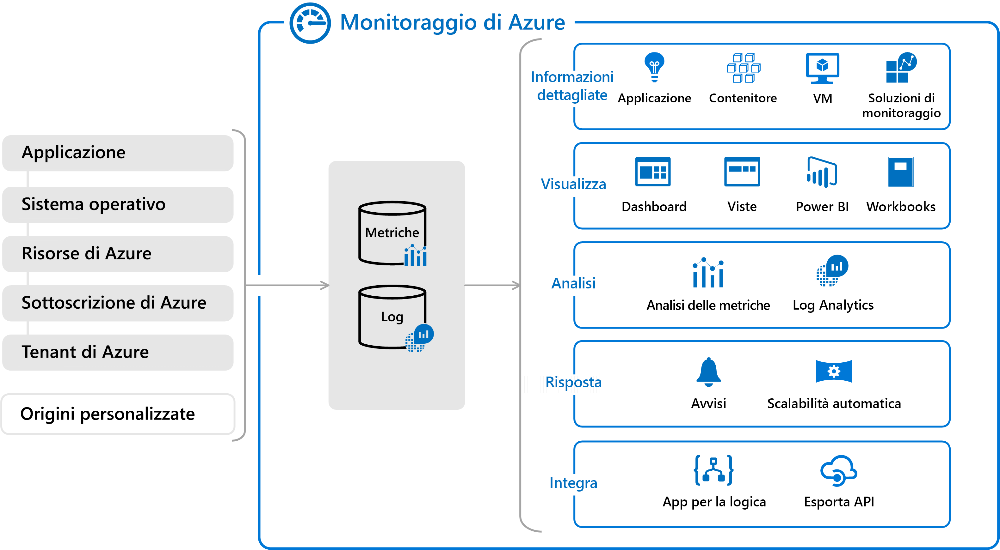

# Origini dei dati di monitoraggio per monitoraggio di Azure
Monitoraggio di Azure è basato su una [piattaforma di dati di monitoraggio comune](data-platform.md) che include [log](data-platform-logs.md) e [metriche](data-platform-metrics.md). La raccolta dei dati in questa piattaforma consente di analizzare i dati di più risorse insieme usando un set comune di strumenti in monitoraggio di Azure. I dati di monitoraggio possono anche essere inviati ad altre posizioni per supportare determinati scenari e alcune risorse possono scrivere in altre posizioni prima di poter essere raccolti in log o metriche.

Questo articolo descrive le diverse origini dei dati di monitoraggio raccolti da monitoraggio di Azure, oltre ai dati di monitoraggio creati dalle risorse di Azure. Vengono forniti collegamenti a informazioni dettagliate sulla configurazione necessaria per raccogliere questi dati in posizioni diverse.

## Livelli di applicazione

Le origini dei dati di monitoraggio delle applicazioni Azure possono essere organizzate in livelli, i livelli più elevati sono l'applicazione stessa e i livelli inferiori sono componenti della piattaforma Azure. Il metodo di accesso ai dati di ogni livello varia. I livelli applicazione sono riepilogati nella tabella seguente e le origini dei dati di monitoraggio in ogni livello sono presentate nelle sezioni seguenti. Per una descrizione di ogni posizione dei dati e per informazioni su come accedere ai dati, vedere [monitoraggio dei percorsi dati in Azure](data-locations.md) .

### Azure
La tabella seguente descrive brevemente i livelli applicazione specifici di Azure. Per ulteriori informazioni su ognuna delle sezioni seguenti, seguire il collegamento.

| Livello | Descrizione | Metodo di raccolta |
|:---|:---|:---|
| [Tenant di Azure](#azure-tenant) | dati relativi al funzionamento dei servizi di Azure a livello di tenant, ad esempio Azure Active Directory. | Visualizzare i dati di AAD nel portale o configurare la raccolta in monitoraggio di Azure usando un'impostazione di diagnostica del tenant. |
| [Sottoscrizione di Azure](#azure-subscription) | Dati relativi all'integrità e alla gestione dei servizi tra le risorse nella sottoscrizione di Azure, ad esempio Gestione risorse e l'integrità del servizio. | Visualizzare nel portale o configurare la raccolta in monitoraggio di Azure usando un profilo di log. |
| [Risorse di Azure](#azure-resources) |  Dati relativi al funzionamento e alle prestazioni di ogni risorsa di Azure. | Metriche raccolte automaticamente, Visualizza in Esplora metriche. Configurare le impostazioni di diagnostica per raccogliere i log in monitoraggio di Azure. Soluzioni di monitoraggio e informazioni dettagliate disponibili per un monitoraggio più dettagliato per tipi di risorse specifici. |

### Azure, altro cloud o in locale 
La tabella seguente descrive brevemente i livelli applicazione che possono trovarsi in Azure, in un altro cloud o in locale. Per ulteriori informazioni su ognuna delle sezioni seguenti, seguire il collegamento.

| Livello | Descrizione | Metodo di raccolta |
|:---|:---|:---|
| [Sistema operativo (Guest)](#operating-system-guest) | Dati sul sistema operativo sulle risorse di calcolo. | Installare Log Analytics Agent per raccogliere le origini dati client in monitoraggio di Azure e l'agente di dipendenza per raccogliere le dipendenze che supportano Monitoraggio di Azure per le macchine virtuali. Per le macchine virtuali di Azure, installare l'estensione diagnostica di Azure per raccogliere i log e le metriche in monitoraggio di Azure. |
| [Codice dell'applicazione](#application-code) | Dati sulle prestazioni e le funzionalità dell'applicazione e del codice effettivi, incluse le analisi delle prestazioni, i registri applicazioni e la telemetria degli utenti. | Instrumentare il codice per raccogliere i dati in Application Insights. |
| [Origini personalizzate](#custom-sources) | Dati da servizi esterni o altri componenti o dispositivi. | Raccogliere dati di log o metriche in monitoraggio di Azure da qualsiasi client REST. |

## Tenant di Azure
I dati di telemetria correlati al tenant di Azure vengono raccolti da servizi a livello di tenant, ad esempio Azure Active Directory.

### Log di controllo di Azure Active Directory
I [report di Azure Active Directory](../../active-directory/reports-monitoring/overview-reports.md) contengono la cronologia dell'attività di accesso e l'audit trail delle modifiche apportate all'interno di un tenant specifico. 

| Destination | Descrizione | Riferimenti |
|:---|:---|:---|
| Log di Monitoraggio di Azure | Configurare Azure AD log da raccogliere in monitoraggio di Azure per analizzarli con altri dati di monitoraggio. | [Integrare i log di Azure AD con i log di monitoraggio di Azure (anteprima)](../../active-directory/reports-monitoring/howto-integrate-activity-logs-with-log-analytics.md) |
| Archiviazione di Azure | Esportare i log di Azure AD in archiviazione di Azure per l'archiviazione. | [Esercitazione: Archiviare i log di Azure AD in un account di archiviazione di Azure (anteprima) ](../../active-directory/reports-monitoring/quickstart-azure-monitor-route-logs-to-storage-account.md) |
| Hub eventi | Eseguire lo streaming dei log Azure AD ad altre posizioni tramite hub eventi. | [Esercitazione: Trasmettere i log Azure Active Directory a un hub eventi di Azure (anteprima) ](../../active-directory/reports-monitoring/tutorial-azure-monitor-stream-logs-to-event-hub.md). |

## Sottoscrizione di Azure
Telemetria correlata all'integrità e al funzionamento della sottoscrizione di Azure.

### Log attività di Azure 
Il [log attività di Azure](activity-logs-overview.md) include i record di integrità dei servizi insieme ai record relativi a tutte le modifiche di configurazione apportate alle risorse nella sottoscrizione di Azure. Il log attività è disponibile per tutte le risorse di Azure e ne rappresenta la visualizzazione _esterna_.

| Destination | Descrizione | Riferimenti |
|:---|:---|
| Log attività | Il log attività viene raccolto nel proprio archivio dati che è possibile visualizzare dal menu monitoraggio di Azure o da usare per creare gli avvisi del log attività. | [Eseguire una query sul log attività nel portale di Azure](activity-log-view.md#azure-portal) |
| Log di Monitoraggio di Azure | Configurare i log di monitoraggio di Azure per raccogliere il log attività per analizzarlo con altri dati di monitoraggio. | [Raccogliere e analizzare i log attività di Azure nell'area di lavoro Log Analytics in monitoraggio di Azure](activity-log-collect.md) |
| Archiviazione di Azure | Esportare il log attività in archiviazione di Azure per l'archiviazione. | [Archiviare il log attività](activity-log-export.md#archive-activity-log)  |
| Hub eventi | Trasmettere il log attività ad altre posizioni usando gli hub eventi | [Trasmettere il log attività a hub eventi](activity-log-export.md#stream-activity-log-to-event-hub). |

### Integrità dei servizi di Azure
[Integrità dei servizi di Azure](../../service-health/service-health-overview.md) presenta informazioni sull'integrità dei servizi di Azure nella sottoscrizione su cui si basano l'applicazione e le risorse in uso.

| Destination | Descrizione | Riferimenti |
|:---|:---|:---|
| Log attività Log di Monitoraggio di Azure | I record di integrità dei servizi vengono archiviati nel log attività di Azure, in modo che sia possibile visualizzarli nel portale di Azure o eseguire altre attività che è possibile eseguire con il log attività. | [Visualizzare le notifiche sull'integrità del servizio tramite il portale di Azure](service-notifications.md) |

## Risorse di Azure
Le metriche e i log delle risorse forniscono informazioni sul funzionamento _interno_ delle risorse di Azure. Sono disponibili per la maggior parte dei servizi di Azure e il monitoraggio di soluzioni e informazioni dettagliate raccoglie dati aggiuntivi per servizi specifici.

### Metriche della piattaforma 
La maggior parte dei servizi di Azure invierà le [metriche della piattaforma](data-platform-metrics.md) che riflettono le prestazioni e il funzionamento direttamente nel database di metriche. Le [metriche specifiche variano in base al tipo di risorsa](metrics-supported.md). 

| Destination | Descrizione | Riferimenti |
|:---|:---|:---|
| Metriche di monitoraggio di Azure | Le metriche della piattaforma scriveranno nel database di metriche di monitoraggio di Azure senza alcuna configurazione. Accedere alle metriche della piattaforma da Esplora metriche.  | [Introduzione a Esplora metriche di Azure](metrics-getting-started.md) [Metriche supportate con il monitoraggio di Azure](metrics-supported.md) |
| Log di Monitoraggio di Azure | Copiare le metriche della piattaforma nei log per la tendenza e altre analisi usando Log Analytics. | [Diagnostica di Azure diretta a Log Analytics](resource-logs-collect-workspace.md) |
| Hub eventi | Trasmettere le metriche ad altre località usando gli hub eventi. |[Trasmettere i dati di monitoraggio di Azure a un hub eventi per il consumo da parte di uno strumento esterno](stream-monitoring-data-event-hubs.md) |

### Log risorse
I [log delle risorse](resource-logs-overview.md) forniscono informazioni dettagliate sul funzionamento _interno_ di una risorsa di Azure.  I log delle risorse vengono creati automaticamente, ma è necessario creare un'impostazione di diagnostica per specificare una destinazione da raccogliere per ogni risorsa.

I requisiti di configurazione e il contenuto dei log delle risorse variano in base al tipo di risorsa e non a tutti i servizi ancora creati. Per informazioni dettagliate su ogni servizio e collegamenti a procedure di configurazione dettagliate, vedere [servizi, schemi e categorie supportati per i log delle risorse di Azure](diagnostic-logs-schema.md) . Se il servizio non è elencato in questo articolo, il servizio attualmente non crea i log delle risorse.

| Destination | Descrizione | Riferimenti |
|:---|:---|:---|
| Log di Monitoraggio di Azure | Inviare i log delle risorse ai log di monitoraggio di Azure per l'analisi con altri dati di log raccolti. | [Raccogliere i log delle risorse di Azure nell'area di lavoro Log Analytics in monitoraggio di Azure](resource-logs-collect-storage.md) |
| Archiviazione | Inviare i log delle risorse ad archiviazione di Azure per l'archiviazione. | [Archiviare i log delle risorse di Azure](resource-logs-collect-workspace.md) |
| Hub eventi | Trasmettere i log delle risorse ad altre posizioni usando gli hub eventi. |[Trasmettere i log delle risorse di Azure a un hub eventi](resource-logs-stream-event-hubs.md) |

## Sistema operativo (Guest)
Le risorse di calcolo in Azure, in altri cloud e in locale dispongono di un sistema operativo guest per il monitoraggio. Con l'installazione di uno o più agenti, è possibile raccogliere dati di telemetria dal Guest in monitoraggio di Azure per analizzarli con gli stessi strumenti di monitoraggio dei servizi di Azure.

### Estensione Diagnostica di Azure
L'abilitazione dell'estensione Diagnostica di Azure per le macchine virtuali di Azure consente di raccogliere i log e le metriche dal sistema operativo guest delle risorse di calcolo di Azure, inclusi i ruoli Web e di lavoro del servizio cloud di Azure (versione classica), le macchine virtuali, la macchina virtuale set di scalabilità e Service Fabric.

| Destination | Descrizione | Riferimenti |
|:---|:---|:---|
| Archiviazione | Quando si Abilita l'estensione di diagnostica, per impostazione predefinita scriverà in un account di archiviazione. | [Archiviare e visualizzare i dati di diagnostica in Archiviazione di Azure](diagnostics-extension-to-storage.md) |
| Metriche di monitoraggio di Azure | Quando si configura l'estensione di diagnostica per raccogliere i contatori delle prestazioni, questi vengono scritti nel database di metriche di monitoraggio di Azure. | [Inviare metriche del sistema operativo guest all'archivio delle metriche di monitoraggio di Azure usando un modello di Gestione risorse per una macchina virtuale Windows](collect-custom-metrics-guestos-resource-manager-vm.md) |
| Log di Application Insights | Raccogliere i log e i contatori delle prestazioni dalla risorsa di calcolo che supporta l'applicazione per l'analisi con altri dati dell'applicazione. | [Inviare i dati di diagnostica del servizio cloud, della macchina virtuale o Service Fabric a Application Insights](diagnostics-extension-to-application-insights.md) |
| Hub eventi | Configurare l'estensione di diagnostica per trasmettere i dati in altri percorsi tramite hub eventi.  | [Flusso di dati Diagnostica di Azure nel percorso critico tramite hub eventi](diagnostics-extension-stream-event-hubs.md) |

### Agente di Log Analytics 
Installare l'agente di Log Analytics per il monitoraggio e la gestione completi delle macchine virtuali Windows o Linux. La macchina virtuale può essere eseguita in Azure, un altro cloud o in locale.

| Destination | Descrizione | Riferimenti |
|:---|:---|:---|
| Log di Monitoraggio di Azure | L'agente di Log Analytics si connette a monitoraggio di Azure direttamente o tramite System Center Operations Manager e consente di raccogliere dati dalle origini dati configurate o dalle soluzioni di monitoraggio che forniscono informazioni aggiuntive sulle applicazioni in esecuzione nella macchina virtuale. | [Origini dati agente in monitoraggio di Azure](agent-data-sources.md) [Connetti Operations Manager a monitoraggio di Azure](om-agents.md) |

### Monitoraggio di Azure per le macchine virtuali 
[Monitoraggio di Azure per le macchine virtuali](../insights/vminsights-overview.md) offre un'esperienza di monitoraggio personalizzata per le macchine virtuali che forniscono funzionalità oltre alle funzionalità di monitoraggio di base di Azure, tra cui lo stato del servizio e l'integrità delle VM Richiede un Dependency Agent in macchine virtuali Windows e Linux che si integra con l'agente Log Analytics per raccogliere i dati individuati sui processi in esecuzione nella macchina virtuale e le dipendenze del processo esterno.

| Destination | Descrizione | Riferimenti |
|:---|:---|:---|
| Log di Monitoraggio di Azure | Archivia i dati relativi a processi e dipendenze dall'agente. | [Uso di Monitoraggio di Azure per le macchine virtuali (anteprima) mappa per comprendere i componenti dell'applicazione](../insights/vminsights-maps.md) |
| Archiviazione VM | Monitoraggio di Azure per le macchine virtuali archivia le informazioni sullo stato di integrità in un percorso personalizzato. Questa funzionalità è disponibile solo per Monitoraggio di Azure per le macchine virtuali nell'portale di Azure oltre all' [API REST di integrità delle risorse di Azure](/rest/api/resourcehealth/). | [Informazioni sull'integrità delle macchine virtuali di Azure](../insights/vminsights-health.md) [API REST di integrità delle risorse di Azure](https://docs.microsoft.com/rest/api/resourcehealth/) |

## Codice dell'applicazione
Il monitoraggio dettagliato delle applicazioni in monitoraggio di Azure viene eseguito con [Application Insights](https://docs.microsoft.com/azure/application-insights/) che raccoglie i dati dalle applicazioni in esecuzione su un'ampia gamma di piattaforme. L'applicazione può essere eseguita in Azure, un altro cloud o in locale.

### Dati dell'applicazione
Quando si abilita Application Insights per un'applicazione mediante l'installazione di un pacchetto di strumentazione, questo servizio raccoglie le metriche e i log relativi alle prestazioni e al funzionamento dell'applicazione. Application Insights archivia i dati raccolti nella stessa piattaforma dati di monitoraggio di Azure utilizzata da altre origini dati. Include strumenti completi per l'analisi di questi dati, ma è anche possibile analizzarli con dati provenienti da altre origini usando strumenti come Esplora metriche e Log Analytics.

| Destination | Descrizione | Riferimenti |
|:---|:---|:---|
| Log di Monitoraggio di Azure | Dati operativi sull'applicazione, tra cui visualizzazioni di pagina, richieste di applicazioni, eccezioni e tracce. | [Analizzare i dati del log in monitoraggio di Azure](../log-query/log-query-overview.md) |
|                    | Informazioni sulle dipendenze tra i componenti dell'applicazione per supportare la correlazione tra mapping applicazioni e telemetria. | [Correlazione di dati di telemetria in Application Insights](../app/correlation.md)   [Mappa delle applicazioni](../app/app-map.md) |
|            | Risultati dei test di disponibilità che verificano la disponibilità e la velocità di risposta dell'applicazione da posizioni diverse sulla rete Internet pubblica. | [Monitorare la disponibilità e la velocità di risposta dei siti Web](../app/monitor-web-app-availability.md) |
| Metriche di monitoraggio di Azure | Application Insights raccoglie le metriche che descrivono le prestazioni e il funzionamento dell'applicazione, oltre alle metriche personalizzate definite nell'applicazione nel database delle metriche di monitoraggio di Azure. | [Metriche basate su log e pre-aggregate in Application Insights](../app/pre-aggregated-metrics-log-metrics.md) [API Application Insights per metriche ed eventi personalizzati](../app/api-custom-events-metrics.md) |
| Archiviazione di Azure | Inviare i dati dell'applicazione ad archiviazione di Azure per l'archiviazione. | [Esportare i dati di telemetria da Application Insights](../app/export-telemetry.md) |
|            | I dettagli dei test di disponibilità vengono archiviati in archiviazione di Azure. Usare Application Insights nel portale di Azure per eseguire il download per l'analisi locale. I risultati dei test di disponibilità vengono archiviati nei log di monitoraggio di Azure. | [Monitorare la disponibilità e la velocità di risposta dei siti Web](../app/monitor-web-app-availability.md) |
|            | I dati di traccia del profiler vengono archiviati in archiviazione di Azure. Usare Application Insights nel portale di Azure per eseguire il download per l'analisi locale.  | [Profilare applicazioni di produzione in Azure con Application Insights](../app/profiler-overview.md) 
|            | I dati di snapshot di debug acquisiti per un subset di eccezioni vengono archiviati in archiviazione di Azure. Usare Application Insights nel portale di Azure per eseguire il download per l'analisi locale.  | [Funzionamento degli snapshot](../app/snapshot-debugger.md#how-snapshots-work) |

## Soluzioni di monitoraggio e informazioni dettagliate
Il [monitoraggio delle soluzioni](../insights/solutions.md) e delle [informazioni dettagliate](../insights/insights-overview.md) raccoglie i dati per fornire informazioni aggiuntive sul funzionamento di un servizio o di un'applicazione specifica. Possono indirizzare le risorse in diversi livelli di applicazione e anche più livelli.

### Soluzioni di monitoraggio

| Destination | Descrizione | Riferimenti
|:---|:---|:---|
| Log di Monitoraggio di Azure | Il monitoraggio delle soluzioni raccoglie i dati nei log di monitoraggio di Azure in cui possono essere analizzati usando il linguaggio di query o le [visualizzazioni](view-designer.md) che sono in genere incluse nella soluzione. | [Dettagli sulla raccolta dei dati per il monitoraggio delle soluzioni in Azure](../insights/solutions-inventory.md) |

### Monitoraggio di Azure per i contenitori
[Monitoraggio di Azure per i contenitori](../insights/container-insights-overview.md) offre un'esperienza di monitoraggio personalizzata per il [servizio Azure Kubernetes (AKS)](/azure/aks/). Raccoglie dati aggiuntivi sulle risorse descritte nella tabella seguente.

| Destination | Descrizione | Riferimenti |
|:---|:---|:---|
| Log di Monitoraggio di Azure | Archivia i dati di monitoraggio per AKS, inclusi inventario, log ed eventi. I dati delle metriche vengono inoltre archiviati nei log per sfruttare le funzionalità di analisi nel portale. | [Conoscere le prestazioni del cluster del servizio Azure Kubernetes con Monitoraggio di Azure per contenitori](../insights/container-insights-analyze.md) |
| Metriche di monitoraggio di Azure | I dati delle metriche vengono archiviati nel database delle metriche per guidare la visualizzazione e gli avvisi. | [Visualizzare le metriche del contenitore in Esplora metriche](../insights/container-insights-analyze.md#view-container-metrics-in-metrics-explorer) |
| Servizio Azure Kubernetes | Per un'esperienza quasi in tempo reale, monitoraggio di Azure per i contenitori presenta i dati direttamente dal servizio Azure Kubernetes nel portale di Azure. | [Come visualizzare i log dei contenitori in tempo reale con Monitoraggio di Azure per contenitori (anteprima)](../insights/container-insights-live-logs.md) |

### Monitoraggio di Azure per le macchine virtuali
[Monitoraggio di Azure per le macchine virtuali](../insights/vminsights-overview.md) offre un'esperienza personalizzata per il monitoraggio delle macchine virtuali. Una descrizione dei dati raccolti da Monitoraggio di Azure per le macchine virtuali è inclusa nella sezione del [sistema operativo (Guest)](#operating-system-guest) precedente.

## Origini personalizzate
Oltre ai livelli standard di un'applicazione, potrebbe essere necessario monitorare altre risorse che contengono dati di telemetria che non possono essere raccolti con le altre origini dati. Per queste risorse, scrivere questi dati in metriche o log usando un'API di monitoraggio di Azure.

| Destination | Metodo | Descrizione | Riferimenti |
|:---|:---|:---|:---|
| Log di Monitoraggio di Azure | API dell'Agente di raccolta dati | Raccogliere i dati di log da qualsiasi client REST e archiviarli nell'area di lavoro Log Analytics. | [Inviare i dati di log a monitoraggio di Azure con l'API dell'agente di raccolta dati HTTP (anteprima pubblica)](data-collector-api.md) |
| Metriche di monitoraggio di Azure | API metriche personalizzate | Raccogliere i dati delle metriche da qualsiasi client REST e archiviarli nel database di metriche di monitoraggio di Azure. | [Inviare metriche personalizzate per una risorsa di Azure all'archivio delle metriche di monitoraggio di Azure usando un'API REST](metrics-store-custom-rest-api.md) |

## Altri servizi
Altri servizi in Azure scrivono i dati nella piattaforma dati di monitoraggio di Azure. Ciò consente di analizzare i dati raccolti da questi servizi con i dati raccolti da monitoraggio di Azure e di sfruttare gli stessi strumenti di analisi e visualizzazione.

| Service | Destination | Descrizione | Riferimenti |
|:---|:---|:---|:---|
| [Centro sicurezza di Azure](/azure/security-center/) | Log di Monitoraggio di Azure | Il Centro sicurezza di Azure archivia i dati di sicurezza raccolti in un'area di lavoro Log Analytics che consente di analizzarli con altri dati di log raccolti da monitoraggio di Azure.  | [Raccolta dati nel Centro sicurezza di Azure](../../security-center/security-center-enable-data-collection.md) |
| [Sentinella di Azure](/azure/sentinel/) | Log di Monitoraggio di Azure | Azure Sentinel archivia i dati raccolti da origini dati diverse in un'area di lavoro Log Analytics che consente di analizzarli con altri dati di log raccolti da monitoraggio di Azure.  | [Connetti origini dati](/azure/sentinel/quickstart-onboard) |

## Passaggi successivi

- Altre informazioni sui [tipi di dati di monitoraggio raccolti da Monitoraggio di Azure](data-platform.md) e su come visualizzare e analizzare i dati.
- Elenca le [diverse posizioni in cui le risorse di Azure archiviano i dati](data-locations.md) e come è possibile accedervi. 
