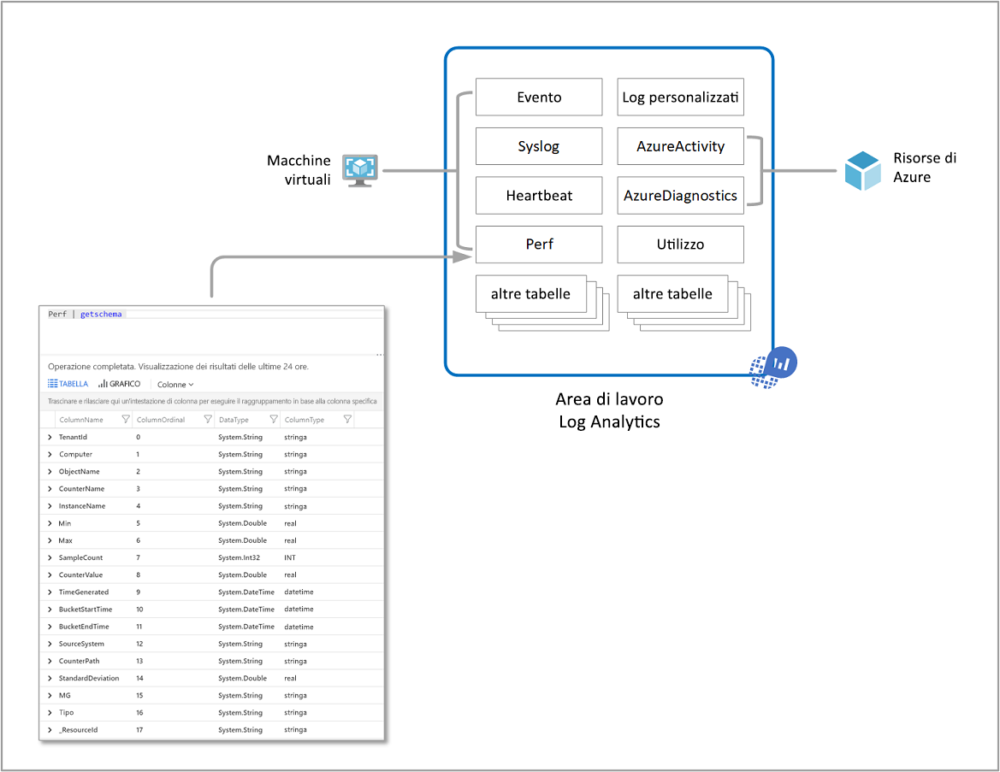
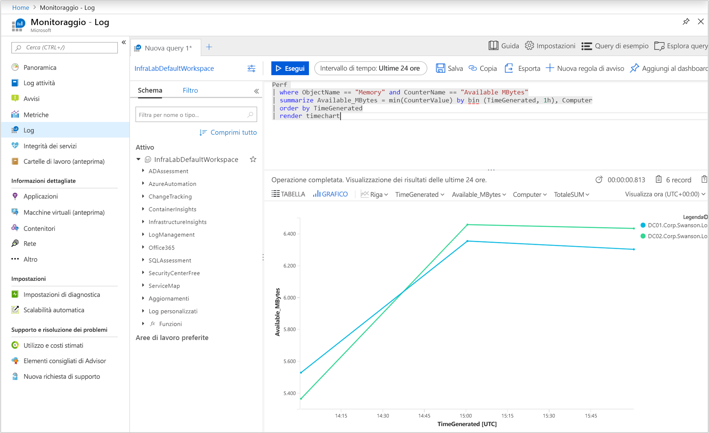
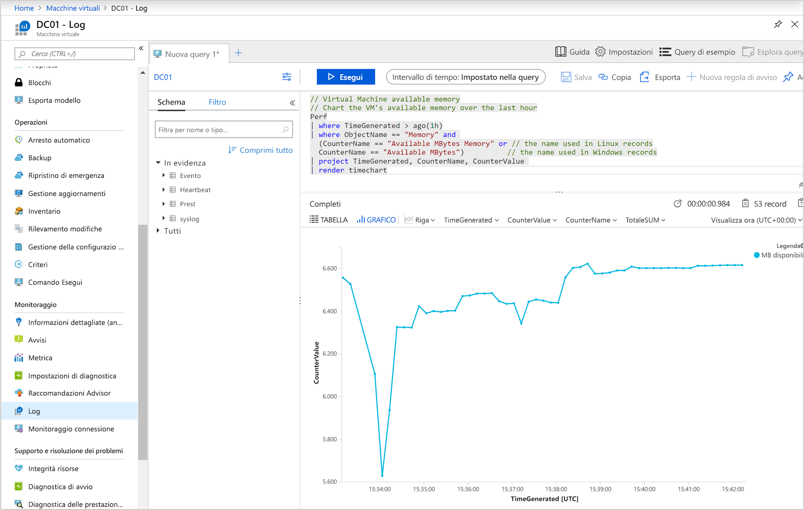
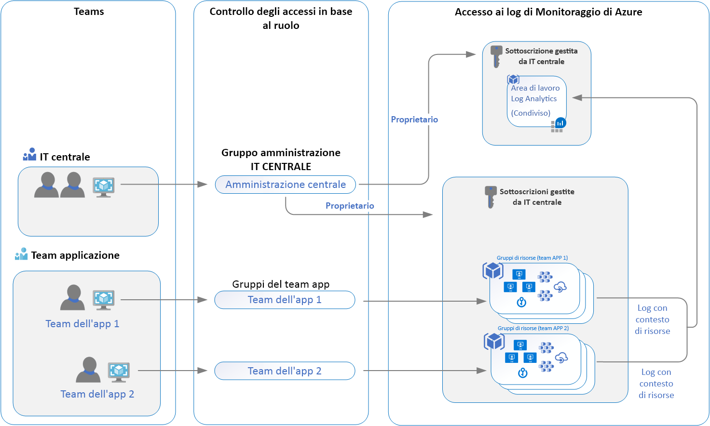

# <a name="designing-your-azure-monitor-logs-deployment"></a>Progettazione della distribuzione dei log di monitoraggio di Azure

Monitoraggio di Azure archivia i dati di [log](data-platform-logs.md) in un'area di lavoro log Analytics, ovvero una risorsa di Azure e un contenitore in cui i dati vengono raccolti, aggregati e utilizzati come limite amministrativo. Sebbene sia possibile distribuire una o più aree di lavoro nella sottoscrizione di Azure, è necessario comprendere alcune considerazioni per assicurarsi che la distribuzione iniziale stia seguendo le linee guida per offrire un costo conveniente, gestibile e scalabile la distribuzione soddisfa le esigenze dell'organizzazione.

I dati in un'area di lavoro sono organizzati in tabelle, ognuna delle quali archivia diversi tipi di dati e dispone di un proprio set univoco di proprietà in base alla risorsa che genera i dati. La maggior parte delle origini dati scriverà nelle proprie tabelle in un'area di lavoro Log Analytics.



Un'area di lavoro Log Analytics offre:

* Una posizione geografica per l'archiviazione dei dati.
* Isolamento dei dati tramite la concessione di diritti di accesso a utenti diversi dopo una delle strategie di progettazione consigliate.
* Ambito per la configurazione di impostazioni quali il [piano tariffario](https://docs.microsoft.com/azure/azure-monitor/platform/manage-cost-storage#changing-pricing-tier), la [conservazione](https://docs.microsoft.com/azure/azure-monitor/platform/manage-cost-storage#change-the-data-retention-period)e la [capsulatura dei dati](https://docs.microsoft.com/azure/azure-monitor/platform/manage-cost-storage#daily-cap).

Questo articolo fornisce una panoramica dettagliata delle considerazioni relative alla progettazione e alla migrazione, alla panoramica del controllo di accesso e alla comprensione delle implementazioni di progettazione consigliate per l'organizzazione IT.


## <a name="important-considerations-for-an-access-control-strategy"></a>Considerazioni importanti per una strategia di controllo di accesso

Identificare il numero di aree di lavoro necessarie è influenzato da uno o più dei requisiti seguenti:

* Si opera in un'azienda globale ed è necessario che i dati di log siano archiviati in aree specifiche per motivi di sovranità o conformità dei dati.
* Si usa Azure e si intendono evitare costi di trasferimento dei dati in uscita tramite un'area di lavoro nella stessa area delle risorse di Azure da essa gestite.
* Si gestiscono più reparti o gruppi aziendali e si vuole che ognuno visualizzi i propri dati, ma non i dati di altri. Non è inoltre previsto alcun requisito aziendale per una visualizzazione consolidata di un reparto o di un gruppo aziendale.

Oggi le organizzazioni IT sono modellate in seguito a un ibrido centralizzato, decentralizzato o tra due strutture. Di conseguenza, i modelli di distribuzione dell'area di lavoro seguenti sono stati comunemente utilizzati per eseguire il mapping a una di queste strutture organizzative:

* **Centralizzata**: Tutti i log vengono archiviati in un'area di lavoro centrale e amministrati da un singolo team, con monitoraggio di Azure che fornisce l'accesso differenziato per Team. In questo scenario, è facile da gestire, eseguire ricerche tra le risorse e i log correlati tra loro. L'area di lavoro può aumentare in modo significativo a seconda della quantità di dati raccolti da più risorse nella sottoscrizione, con un sovraccarico amministrativo aggiuntivo per mantenere il controllo di accesso a utenti diversi.
* **Decentralizzata**: Ogni team ha una propria area di lavoro creata in un gruppo di risorse che possiede e gestisce e i dati di log vengono separati per ogni risorsa. In questo scenario, l'area di lavoro può essere mantenuta sicura e il controllo degli accessi è coerente con l'accesso alle risorse, ma è difficile correlare i log. Gli utenti che necessitano di un'ampia visualizzazione di molte risorse non possono analizzare i dati in modo significativo.
* **Ibrido**: I requisiti di conformità del controllo di sicurezza complicano ulteriormente questo scenario perché molte organizzazioni implementano entrambi i modelli di distribuzione in parallelo. Ciò comporta in genere una configurazione complessa, costosa e difficile da gestire con gap nel code coverage dei log.

Quando si usano gli agenti di Log Analytics per raccogliere dati, è necessario comprendere quanto segue per pianificare la distribuzione dell'agente:

* Per raccogliere i dati dagli agenti Windows, è possibile [configurare ogni agente in modo che faccia riferimento a una o più aree di lavoro](../../azure-monitor/platform/agent-windows.md), anche quando invia un report a un gruppo di gestione di System Center Operations Manager. L'agente Windows può segnalare fino a quattro aree di lavoro.
* L'agente Linux non supporta il multihosting e può segnalare solo a una singola area di lavoro.

Se si usa System Center Operations Manager 2012 R2 o versione successiva:

* Ogni gruppo di gestione di Operations Manager può essere [connesso a una sola area di lavoro](../platform/om-agents.md). 
* I computer Linux che inviano report a un gruppo di gestione devono essere configurati per segnalare direttamente a un'area di lavoro Log Analytics. Se i computer Linux hanno già segnalato direttamente a un'area di lavoro e si desidera monitorarli con Operations Manager, attenersi alla procedura seguente per creare [un report a un gruppo di gestione Operations Manager](agent-manage.md#configure-agent-to-report-to-an-operations-manager-management-group). 
* È possibile installare l'agente di Log Analytics Windows nel computer Windows e fare in modo che il report sia Operations Manager integrato con un'area di lavoro e un'area di lavoro diversa.

## <a name="access-control-overview"></a>Panoramica sul controllo di accesso

Con il controllo degli accessi in base al ruolo, è possibile concedere a utenti e gruppi solo la quantità di accesso necessaria per lavorare con i dati di monitoraggio in un'area di lavoro. Questo consente di allinearsi al modello operativo dell'organizzazione IT usando un'unica area di lavoro per archiviare i dati raccolti abilitati in tutte le risorse. Ad esempio, si concede l'accesso al team responsabile dei servizi di infrastruttura ospitati in macchine virtuali di Azure (VM) e, di conseguenza, avranno accesso solo ai log generati dalle macchine virtuali. Segue il nuovo modello di log del contesto delle risorse. La base per questo modello è relativa a ogni record di log emesso da una risorsa di Azure, che viene automaticamente associato a questa risorsa. I log vengono quindi sottoutilizzati in un'area di lavoro centrale che rispetta l'ambito e il controllo degli accessi in base al ruolo

I dati a cui un utente può accedere sono determinati da una combinazione di fattori elencati nella tabella seguente. Ogni è descritto nelle sezioni riportate di seguito.

| Fattore | DESCRIZIONE |
|:---|:---|
| [Modalità di accesso](#access-mode) | Metodo utilizzato dall'utente per accedere all'area di lavoro.  Definisce l'ambito dei dati disponibili e la modalità di controllo di accesso applicata. |
| [Modalità di controllo di accesso](#access-control-mode) | Impostazione nell'area di lavoro che definisce se le autorizzazioni vengono applicate a livello di area di lavoro o di risorsa. |
| [Autorizzazioni](manage-access.md) | Autorizzazioni applicate a singoli utenti o gruppi di utenti per l'area di lavoro o la risorsa. Definisce i dati a cui l'utente avrà accesso. |
| [RBAC a livello di tabella](manage-access.md#table-level-rbac) | Autorizzazioni granulari facoltative che si applicano a tutti gli utenti indipendentemente dalla modalità di accesso o dal controllo di accesso. Definisce i tipi di dati a cui un utente può accedere. |

## <a name="access-mode"></a>Modalità di accesso

La *modalità di accesso* si riferisce al modo in cui un utente accede a un'area di lavoro di log Analytics e definisce l'ambito dei dati a cui può accedere. 

Gli utenti hanno due opzioni per accedere ai dati:

* **Area di lavoro-contesto**: È possibile visualizzare tutti i log nell'area di lavoro di cui si dispone delle autorizzazioni. Le query in questa modalità hanno come ambito tutti i dati di tutte le tabelle nell'area di lavoro. Questa è la modalità di accesso usata quando si accede ai log con l'area di lavoro come ambito, ad esempio quando si selezionano i **log** dal menu di **monitoraggio di Azure** nel portale di Azure.

    

* **Contesto risorsa**: Quando si accede all'area di lavoro per una risorsa, un gruppo di risorse o una sottoscrizione particolare, ad esempio quando si seleziona **log** da un menu delle risorse nella portale di Azure, è possibile visualizzare i log solo per le risorse in tutte le tabelle a cui si ha accesso. Le query in questa modalità hanno come ambito solo i dati associati a tale risorsa. Questa modalità consente inoltre la granularità RBAC.

    

    > [!NOTE]
    > I log sono disponibili per le query del contesto delle risorse solo se sono stati associati correttamente alla risorsa pertinente. Attualmente, le risorse seguenti presentano limitazioni:
    > - Computer esterni ad Azure
    > - Service Fabric
    > - Application Insights
    >
    > È possibile verificare se i log sono associati correttamente alla propria risorsa eseguendo una query ed esaminando i record a cui si è interessati. Se l'ID di risorsa corretto si trova nella proprietà [_ResourceId](log-standard-properties.md#_resourceid) , i dati sono disponibili per le query incentrate sulle risorse.

Monitoraggio di Azure determina automaticamente la modalità corretta a seconda del contesto in cui si esegue la ricerca log. L'ambito viene sempre presentato nella sezione in alto a sinistra del Log Analytics.

### <a name="comparing-access-modes"></a>Confronto tra modalità di accesso

Nella tabella seguente sono riepilogate le modalità di accesso:

| | Area di lavoro-contesto | Contesto di risorsa |
|:---|:---|:---|
| Per chi è destinato ogni modello? | Amministrazione centrale. Amministratori che devono configurare la raccolta di dati e gli utenti che devono accedere a una vasta gamma di risorse. Attualmente necessaria anche per gli utenti che devono accedere ai log per le risorse esterne ad Azure. | Team di applicazioni. Amministratori delle risorse di Azure da monitorare. |
| Cosa richiede un utente per visualizzare i log? | Autorizzazioni per l'area di lavoro. Vedere **autorizzazioni dell'area di lavoro** in [gestire l'accesso tramite le autorizzazioni dell'area di lavoro](manage-access.md#manage-access-using-workspace-permissions) | Accesso in lettura alla risorsa. Vedere **autorizzazioni** per le risorse in [gestire l'accesso tramite le autorizzazioni di Azure](manage-access.md#manage-access-using-azure-permissions). Le autorizzazioni possono essere ereditate, ad esempio dal gruppo di risorse contenitore, o assegnate direttamente alla risorsa. L'autorizzazione ai log per la risorsa verrà assegnata automaticamente. |
| Qual è l'ambito delle autorizzazioni? | Area. Gli utenti che dispongono dell'accesso all'area di lavoro possono eseguire una query su tutti i log dell'area di lavoro dalle tabelle per cui dispongono delle autorizzazioni. Vedere [controllo di accesso alle tabelle](manage-access.md#table-level-rbac) | Risorsa di Azure. L'utente può eseguire query sui log per risorse, gruppi di risorse o sottoscrizioni specifici a cui ha accesso da qualsiasi area di lavoro, ma non può eseguire query nei log per altre risorse. |
| Come è possibile accedere ai log utente? | <ul><li>Avviare i **log** dal menu di **monitoraggio di Azure** .</li></ul> <ul><li>Avviare i **log** dalle **aree di lavoro log Analytics**.</li></ul> <ul><li>Da cartelle di [lavoro](../visualizations.md#workbooks)di monitoraggio di Azure.</li></ul> | <ul><li>Avviare i **log** dal menu per la risorsa di Azure</li></ul> <ul><li>Avviare i **log** dal menu di **monitoraggio di Azure** .</li></ul> <ul><li>Avviare i **log** dalle **aree di lavoro log Analytics**.</li></ul> <ul><li>Da cartelle di [lavoro](../visualizations.md#workbooks)di monitoraggio di Azure.</li></ul> |

## <a name="access-control-mode"></a>Modalità di controllo di accesso

La *modalità di controllo di accesso* è un'impostazione in ogni area di lavoro che definisce la modalità di determinazione delle autorizzazioni per l'area di lavoro.

* **Richiedi autorizzazioni**per l'area di lavoro: Questa modalità di controllo non consente il controllo degli accessi in base al ruolo. Per consentire a un utente di accedere all'area di lavoro, è necessario concedere le autorizzazioni all'area di lavoro o a tabelle specifiche.

    Se un utente accede all'area di lavoro dopo la modalità di contesto dell'area di lavoro, ha accesso a tutti i dati in qualsiasi tabella a cui è stato concesso l'accesso. Se un utente accede all'area di lavoro dopo la modalità del contesto di risorsa, ha accesso solo ai dati per tale risorsa in qualsiasi tabella a cui è stato concesso l'accesso.

    Questa è l'impostazione predefinita per tutte le aree di lavoro create prima del 2019 marzo.

* **Usare le autorizzazioni per risorse o aree di lavoro**: Questa modalità di controllo consente la granularità RBAC. È possibile concedere agli utenti l'accesso solo ai dati associati alle risorse che possono visualizzare assegnando `read` l'autorizzazione di Azure. 

    Quando un utente accede all'area di lavoro in modalità di contesto dell'area di lavoro, vengono applicate le autorizzazioni dell'area di lavoro. Quando un utente accede all'area di lavoro in modalità del contesto di risorse, vengono verificate solo le autorizzazioni delle risorse e le autorizzazioni dell'area di lavoro vengono ignorate. Abilitare il controllo degli accessi in base al ruolo per un utente rimuovendo tali autorizzazioni dall'area di lavoro e consentendone la riconoscibilità.

    Questa è l'impostazione predefinita per tutte le aree di lavoro create dopo il 2019 marzo.

    > [!NOTE]
    > Se un utente dispone solo delle autorizzazioni di risorse per l'area di lavoro, può accedere solo all'area di lavoro usando la modalità del contesto delle risorse, presupponendo che la modalità di accesso all'area di lavoro sia impostata per l' **uso delle autorizzazioni di risorse o**

Per informazioni su come modificare la modalità di controllo di accesso nel portale, con PowerShell o usando un modello di Gestione risorse, vedere [configurare la modalità di controllo di accesso](manage-access.md#configure-access-control-mode).

## <a name="ingestion-volume-rate-limit"></a>Limite di velocità del volume di inserimento

Monitoraggio di Azure è un servizio dati su larga scala che serve migliaia di clienti che inviano terabyte di dati ogni mese a un ritmo crescente. La soglia della frequenza di inserimento predefinita è impostata su **500 MB/min** per area di lavoro. Se si inviano dati a una velocità superiore a una singola area di lavoro, alcuni dati vengono eliminati e un evento viene inviato alla tabella delle *operazioni* nell'area di lavoro ogni 6 ore mentre la soglia continua a essere superata. Se il volume di inserimento continua a superare il limite di velocità o se si prevede di raggiungerlo presto, è possibile richiedere un aumento dell'area di lavoro aprendo una richiesta di supporto.
 
Per ricevere una notifica su tale evento nell'area di lavoro, creare una [regola di avviso di log](alerts-log.md) usando la query seguente con la logica di avviso base su numero di risultati maggiore di zero.

``` Kusto
Operation
|where OperationCategory == "Ingestion"
|where Detail startswith "The rate of data crossed the threshold"
``` 


## <a name="recommendations"></a>Consigli



In questo scenario viene illustrata una singola progettazione dell'area di lavoro nella sottoscrizione dell'organizzazione IT non vincolata dalla sovranità dei dati o dalla conformità alle normative oppure è necessario eseguire il mapping alle aree in cui vengono distribuite le risorse. Consente alle organizzazioni di sicurezza e amministratore IT di sfruttare la migliore integrazione con la gestione dell'accesso di Azure e un controllo di accesso più sicuro.

Tutte le risorse, le soluzioni di monitoraggio e le informazioni dettagliate, ad esempio Application Insights e Monitoraggio di Azure per le macchine virtuali, il supporto dell'infrastruttura e delle applicazioni gestite dai diversi team sono configurate per l'invio dei dati di log raccolti alle organizzazioni IT. area di lavoro condivisa centralizzata. Agli utenti di ogni team viene concesso l'accesso ai log per le risorse a cui è stato concesso l'accesso.

Una volta distribuita l'architettura dell'area di lavoro, è possibile applicarla alle risorse di Azure con [criteri di Azure](../../governance/policy/overview.md). Fornisce un modo per definire i criteri e garantire la conformità alle risorse di Azure in modo che invii tutti i log di diagnostica a un'area di lavoro specifica. Con le macchine virtuali di Azure o i set di scalabilità di macchine virtuali, ad esempio, è possibile usare i criteri esistenti per valutare la conformità dell'area di lavoro e i risultati del report oppure personalizzarli in modo da correggerli se non conformi.  

## <a name="workspace-consolidation-migration-strategy"></a>Strategia di migrazione per il consolidamento dell'area di lavoro

Per i clienti che hanno già distribuito più aree di lavoro e sono interessati a consolidare il modello di accesso al contesto delle risorse, è consigliabile adottare un approccio incrementale per eseguire la migrazione al modello di accesso consigliato e non tentare di ottenere questo risultato in modo rapido o aggressivo. Seguendo un approccio graduale per pianificare, migrare, convalidare e ritirare in seguito a una ragionevole sequenza temporale, è possibile evitare eventuali eventi imprevisti non pianificati o conseguenze impreviste per le operazioni cloud. Se non si dispone di un criterio di conservazione dei dati per la conformità o per motivi aziendali, è necessario valutare l'intervallo di tempo appropriato per conservare i dati nell'area di lavoro da cui si esegue la migrazione durante il processo. Quando si riconfigurano le risorse per il report nell'area di lavoro condivisa, è comunque possibile analizzare i dati nell'area di lavoro originale in modo necessario. Al termine della migrazione, se si è regolati per conservare i dati nell'area di lavoro originale prima della fine del periodo di conservazione, non eliminarli.

Quando si pianifica la migrazione a questo modello, considerare quanto segue:

* Informazioni sulle normative del settore e sui criteri interni relativi alla conservazione dei dati che è necessario rispettare.
* Assicurarsi che i team di applicazioni possano lavorare all'interno della funzionalità esistente del contesto delle risorse.
* Identificare l'accesso concesso alle risorse per i team dell'applicazione ed eseguire il test in un ambiente di sviluppo prima dell'implementazione nell'ambiente di produzione.
* Configurare l'area di lavoro per abilitare l' **uso delle autorizzazioni di risorse o aree di lavoro**.
* Rimuovere l'autorizzazione per la lettura e l'esecuzione di query nell'area di lavoro.
* Abilita e configura tutte le soluzioni di monitoraggio, informazioni dettagliate, ad esempio monitoraggio di Azure per contenitori e/o Monitoraggio di Azure per le macchine virtuali, gli account di automazione e le soluzioni di gestione come Gestione aggiornamenti, avviare/arrestare macchine virtuali e così via, che sono state distribuite nell'originale area.

## <a name="next-steps"></a>Passaggi successivi

Per implementare le autorizzazioni e i controlli di sicurezza consigliati in questa guida, vedere [gestire l'accesso ai log](manage-access.md).