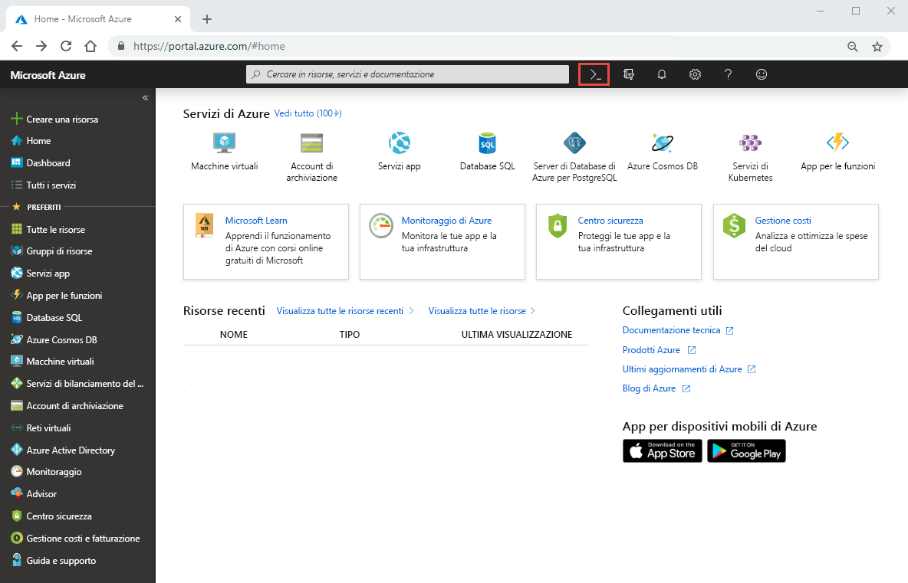
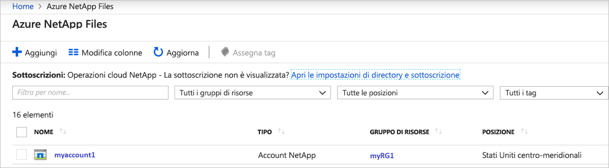
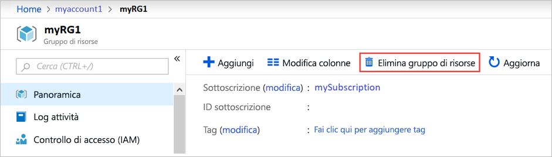

# Guida introduttiva: Configurare Azure NetApp Files e creare un volume NFS 

Questo articolo illustra come configurare rapidamente Azure NetApp Files e creare un volume. 

In questo argomento di avvio rapido si configureranno gli elementi seguenti:

- La registrazione per Azure NetApp Files e il provider di risorse NetApp
- Un account NetApp
- Un pool di capacità
- Un volume NFS per Azure NetApp Files

Se non si ha una sottoscrizione di Azure, creare un [account gratuito](https://azure.microsoft.com/free/?WT.mc_id=A261C142F) prima di iniziare.

## Prima di iniziare 

> [!IMPORTANT] 
> È necessario disporre dell'accesso al servizio Azure NetApp Files.  Per richiedere l'accesso al servizio, vedere la [pagina per l'invio della richiesta di inserimento nella lista di attesa per Azure NetApp Files](https://forms.office.com/Pages/ResponsePage.aspx?id=v4j5cvGGr0GRqy180BHbR8cq17Xv9yVBtRCSlcD_gdVUNUpUWEpLNERIM1NOVzA5MzczQ0dQR1ZTSS4u).  Prima di continuare, è necessario attendere un messaggio di posta elettronica di conferma ufficiale dal team di Azure NetApp Files. 

## Effettuare la registrazione ad Azure NetApp Files e del provider di risorse NetApp

1. Nel portale di Azure fare clic sull'icona di Azure Cloud Shell nell'angolo superiore destro.

    

2. Specificare la sottoscrizione inserita nell'elenco di elementi consentiti per Azure NetApp Files:
    
        az account set --subscription <subscriptionId>

3. Registrare il provider di risorse di Azure: 
    
        az provider register --namespace Microsoft.NetApp --wait  

    Il completamento del processo di registrazione può richiedere del tempo.

## Creare un account di NetApp

1. Nella casella di ricerca del portale di Azure immettere **Azure NetApp Files** e quindi selezionare **Azure NetApp Files** dall'elenco visualizzato.

      

2. Fare clic su **+ Aggiungi** per creare un nuovo account di NetApp.

     

3. Nella finestra New NetApp Account (Nuovo account NetApp) specificare le informazioni seguenti: 
   1. Immettere **myaccount1** nel campo relativo al nome dell'account. 
   2. Selezionare la propria sottoscrizione.
   3. Selezionare **Crea nuovo** per creare un nuovo gruppo di risorse. Immettere **myRG1** nel campo relativo al nome del gruppo di risorse. Fare clic su **OK**. 
   4. Selezionare la località dell'account.  

        

      

4. Fare clic su **Crea** per creare il nuovo account NetApp.

## Configurare un pool di capacità

1. Nel pannello di gestione di Azure NetApp Files selezionare l'account di NetApp appena creato (**myaccount1**).

      

2. Nell'area del pannello di gestione di Azure NetApp Files relativa al proprio account NetApp selezionare **Pool di capacità**.

      

3. Fare clic su **+ Aggiungi pool**. 

      

4. Specificare le informazioni relative al pool di capacità: 
    1. Immettere **mypool1** come nome del pool.
    2. Selezionare **Premium** come livello di servizio. 
    3. Specificare **4 (TiB)** come dimensione del pool. 

5. Fare clic su **OK**.

## Creare un volume NFS per Azure NetApp Files

1. Nell'area del pannello di gestione di Azure NetApp Files relativa al proprio account NetApp selezionare **Volumi**.

      

2. Fare clic su **+ Aggiungi volume**.

      

3. Nella finestra Crea un volume specificare le informazioni relative al volume: 
   1. Immettere **myvol1** come nome del volume. 
   3. Selezionare il pool di capacità appena creato (**mypool1**).
   4. Usare il valore predefinito per la quota. 
   5. Nella rete virtuale fare clic su **Crea nuovo** per creare una nuova rete virtuale.  Specificare quindi le informazioni seguenti:
       * Immettere **myvnet1** come nome della rete virtuale.
       * Specificare uno spazio indirizzi per la configurazione, ad esempio 10.7.0.0/16
       * Immettere **myANFsubnet** come nome della subnet.
       * Specificare l'intervallo di indirizzi della subnet, ad esempio 10.7.0.0/24. Non è possibile condividere una subnet dedicata con altre risorse.
       * Selezionare **Microsoft.NetApp/volumes** come delega per la subnet.
       * Fare clic su **OK** per creare la rete virtuale.
   6. Nella subnet selezionare la rete virtuale appena creata (**myvnet1**) come subnet di delega.

        

        

4. Fare clic su **Protocollo** e quindi selezionare **NFS** come tipo di protocollo per il volume.   

    Immettere **myfilepath1** come percorso del file che verrà usato per creare il percorso di esportazione per il volume. 

    

5. Fare clic su **Rivedi e crea**.

      

5. Verificare le informazioni relative al volume e quindi fare clic su **Crea**.  
    Il volume creato viene visualizzato nel pannello Volumi.

      

## Pulire le risorse

Al termine, se si vuole, è possibile eliminare il gruppo di risorse. L'azione di eliminazione di un gruppo di risorse è irreversibile.  

> [!IMPORTANT]
> Eliminerà in modo definitivo tutte le risorse all'interno dei gruppi di risorse e non potrà essere annullata. 

1. Nella casella di ricerca del portale di Azure immettere **Azure NetApp Files** e quindi selezionare **Azure NetApp Files** dall'elenco visualizzato.

2. Nell'elenco delle sottoscrizioni fare clic sul gruppo di risorse (myRG1) che si vuole eliminare. 

    

3. Nella pagina del gruppo di risorse fare clic su **Elimina gruppo di risorse**.

     

    Si aprirà una finestra con un avviso relativo alle risorse che verranno eliminate con il gruppo di risorse.

4. Immettere il nome del gruppo di risorse (myRG1) per confermare che si intende eliminarlo in modo definitivo con tutte le risorse in esso contenute e quindi fare clic su **Elimina**.

     

## Passaggi successivi  

> [!div class="nextstepaction"]
> [Gestione dei volumi tramite Azure NetApp Files](azure-netapp-files-manage-volumes.md)  
