# Configurare Azure NetApp Files e creare un volume 

Questo articolo illustra come impostare i file di Azure NetApp rapidamente e creare un volume. 

## Prima di iniziare 

È necessario far parte del programma di anteprima pubblica ed essere nell'elenco degli elementi consentiti per l'accesso al provider di risorse Microsoft.NetApp di Azure. Per informazioni dettagliate sulla partecipazione al programma di anteprima pubblica, vedere la [pagina di iscrizione all'anteprima pubblica di Azure NetApp Files](https://aka.ms/nfspublicpreview). 

## Eseguire la registrazione per i file di Azure di NetApp e Provider di risorse di NetApp

1. Dal portale di Azure, fare clic sull'icona Azure Cloud Shell in alto a destra.

      

2. Specificare la sottoscrizione a cui è stato inserito nella whitelist per file di Azure NetApp:
    
        az account set --subscription <subscriptionId>

3. Registrare il Provider di risorse di Azure: 
    
        az provider register --namespace Microsoft.NetApp --wait  

    Il completamento del processo di registrazione può richiedere del tempo.

## Creare un account di NetApp

1. Nella casella di ricerca del portale di Azure, immettere **file di Azure NetApp** e quindi selezionare **Azure NetApp file (anteprima)** dall'elenco visualizzato.

      

2. Fare clic su **+ Aggiungi** per creare un nuovo account di NetApp.

     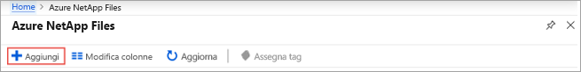

3. Nella finestra Nuovo Account di NetApp, fornire le informazioni seguenti: 
   1. Immettere **myaccount1** per il nome dell'account. 
   2. Selezionare la propria sottoscrizione.
   3. Selezionare **Crea nuovo** creare nuovo gruppo di risorse. Immettere **myRG1** per il nome del gruppo di risorse. Fare clic su **OK**. 
   4. Selezionare la località dell'account.  

      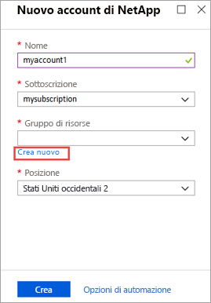  

      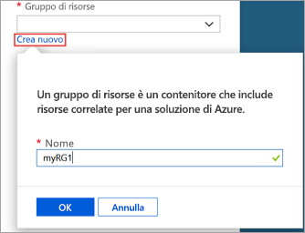

4. Fare clic su **Create** per creare il nuovo account di NetApp.

## Configurare un pool di capacità

1. Dal Pannello di gestione file di Azure NetApp, selezionare l'account di NetApp (**myaccount1**).

    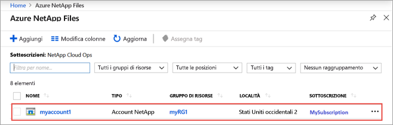  

2. Dal Pannello di gestione file di NetApp Azure dell'account di NetApp, fare clic su **pool di capacità**.

    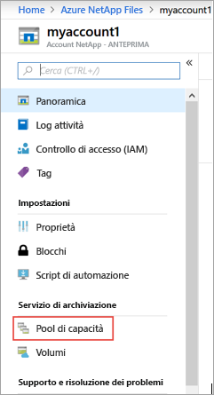  

3. Fare clic su **+ Aggiungi pool**. 

    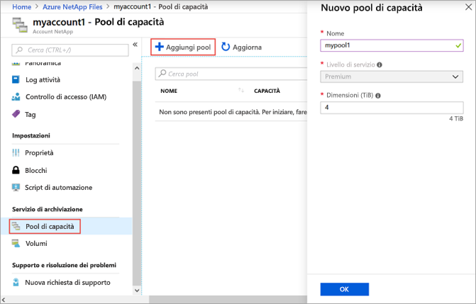  

4. Forniscono informazioni per il pool di capacità: 
    1. Immettere **mypool1** come il nome del pool.
    2. Selezionare **Premium** del livello di servizio. 
    3. Specificare **4 (TiB)** come le dimensioni del pool. 

5. Fare clic su **OK**.

## Creare un volume per Azure NetApp Files

1. Dal Pannello di gestione file di NetApp Azure dell'account di NetApp, fare clic su **volumi**.

    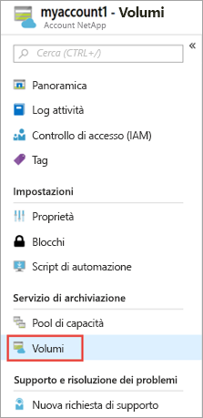  

2. Fare clic su **+ Aggiungi volume**.

    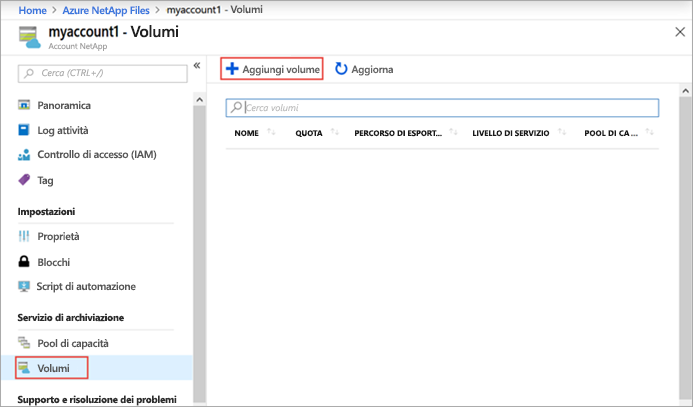  

3. Nella casella Crea una finestra del Volume, forniscono informazioni per il volume: 
   1. Immettere **myvol1** come il nome del volume. 
   2. Immettere **myfilepath1** come percorso del file che verrà utilizzato per creare il percorso di esportazione per il volume.
   3. Selezionare il pool di capacità (**mypool1**).
   4. Usare il valore predefinito per la quota. 
   5. Nella rete virtuale, fare clic su **Crea nuovo** per creare una nuova rete virtuale di Azure (Vnet).  Compilare quindi le informazioni seguenti:
       * Immettere **myvnet1** come nome della rete virtuale.
       * Specificare uno spazio indirizzi per l'impostazione, ad esempio, 10.7.0.0/16
       * Immettere **myANFsubnet** come il nome della subnet.
       * Specificare l'intervallo di indirizzi di subnet, ad esempio, 10.7.0.0/24. Si noti che non è possibile condividere la subnet dedicata con altre risorse.
       * Selezionare **Microsoft.NetApp/volumes** per la delega di subnet.
       * Fare clic su **OK** creare la rete virtuale.
   6. Nella subnet, selezionare la rete virtuale appena creata (**myvnet1**) come subnet del delegato.

      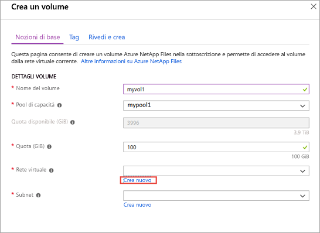  

      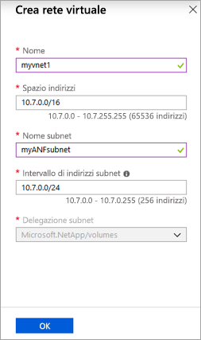  

4. Fare clic su **Rivedi e crea**.

    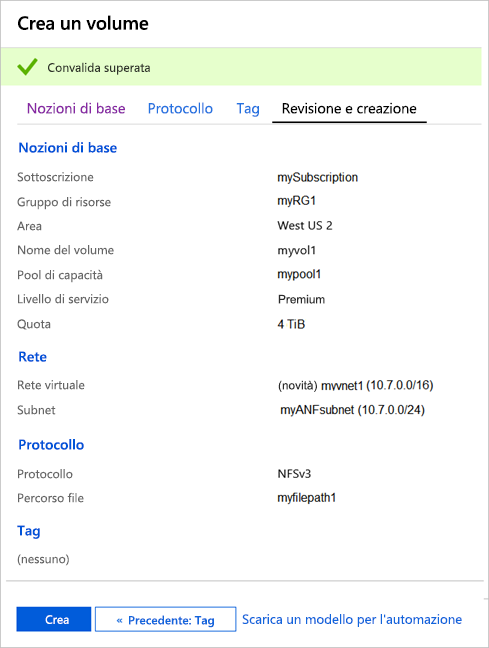  

5. Esaminare le informazioni per il volume, quindi fare clic su **Create**.  
    Il volume creato viene visualizzato nel pannello volumi.

    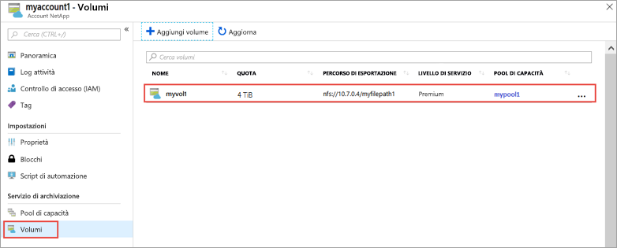  

## Passaggi successivi  

* [Informazioni sulla gerarchia di archiviazione di Azure NetApp Files](azure-netapp-files-understand-storage-hierarchy.md)
* [Gestire i volumi con file di Azure NetApp](azure-netapp-files-manage-volumes.md) 
