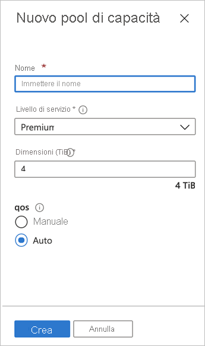

# Configurare un pool di capacità

La configurazione di un pool di capacità consente di creare volumi al suo interno.  

## Prima di iniziare 

È necessario avere già creato un account di NetApp.   

[Creare un account di NetApp](azure-netapp-files-create-netapp-account.md)

## Passaggi 

1. Passare al pannello di gestione per l'account di NetApp e quindi selezionare **Pool di capacità** nel riquadro di spostamento.  
    
    

2. Fare clic su **+ Aggiungi pool** per creare un nuovo pool di capacità.   
    Verrà visualizzata la finestra New Capacity Pool (Nuovo pool di capacità).

3. Specificare le informazioni seguenti per il nuovo pool di capacità:  
   * **Nome**  
     Specificare il nome per il pool di capacità.  
     Il nome del pool di capacità deve essere univoco per ogni account di NetApp.

   * **Livello di servizio**   
     Questo campo mostra le prestazioni di destinazione per il pool di capacità.  
     Specificare il livello di servizio per il pool di capacità: [**Premium**](azure-netapp-files-service-levels.md#Premium) o [**Standard**](azure-netapp-files-service-levels.md#Standard).

   * **Dimensioni**     
     Specificare le dimensioni del pool di capacità da acquistare.        
     Le dimensioni minime del pool di capacità sono di 4 TiB. È possibile creare un pool con dimensioni in multipli di 4 TiB.   
      
     

4. Fare clic su **OK**.

## Passaggi successivi 

- [Livelli di servizio per Azure NetApp Files](azure-netapp-files-service-levels.md)
- Vedere la [pagina dei prezzi di Azure NetApp Files](https://azure.microsoft.com/pricing/details/storage/netapp/) per il prezzo dei diversi livelli di servizio
- [Delegare una subnet ad Azure NetApp Files](azure-netapp-files-delegate-subnet.md)
