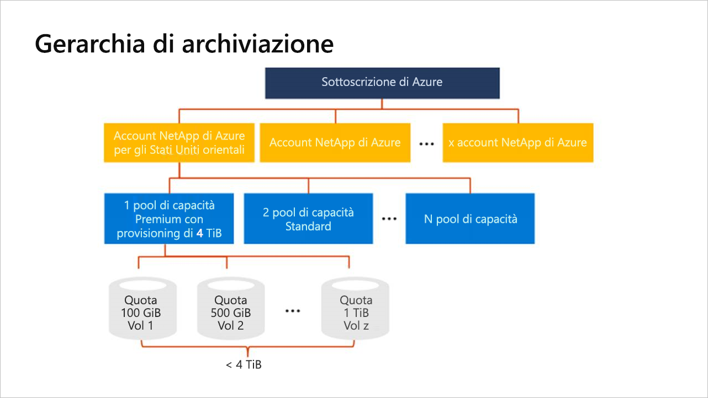

# Che cos'è la gerarchia di archiviazione di Azure NetApp Files

Prima di creare un volume in Azure NetApp Files, è necessario acquistare e configurare un pool di capacità di cui è stato effettuato il provisioning.  Per configurare un pool di capacità, è necessario un account di NetApp. Conoscere la gerarchia di archiviazione è utile per configurare e gestire le risorse di Azure NetApp Files.

## Account di NetApp

- Un account di NetApp funge da raggruppamento amministrativo dei pool di capacità che lo costituiscono.  
- Un account di NetApp non equivale all'account di archiviazione di Azure generale. 
- Un account di NetApp ha un ambito a livello di area.   
- È possibile avere più account di NetApp in un'area, ma ogni account di NetApp è associato a una singola area.

## Pool di capacità

- Un pool di capacità viene misurato in base alla rispettiva capacità di cui è stato effettuato il provisioning.  
- Il provisioning della capacità viene effettuato in base agli SKU fissi acquistati, ad esempio, una capacità di 4 TiB.
- Un pool di capacità può avere un solo livello di servizio.  
- Ogni pool di capacità può appartenere a un solo account di NetApp. Tuttavia, è possibile avere più pool di capacità all'interno di un account di NetApp.  
- Un pool di capacità non può essere spostato tra account di NetApp.   
  Ad esempio, nel [diagramma concettuale della gerarchia di archiviazione](#conceptual_diagram_of_storage_hierarchy) di seguito, il pool di capacità 1 non può essere spostato dall'account di NetApp di Stati Uniti orientali all'account di NetApp di Stati Uniti occidentali 2.  
- Non è possibile eliminare un pool di capacità prima che siano stati eliminati tutti i volumi in esso contenuti.

## Volumi

- Un volume viene misurato in base all'utilizzo della capacità logica ed è scalabile. 
- L'utilizzo della capacità di un volume concorre al calcolo della capacità di cui è stato effettuato il provisioning del pool.
- Ogni volume appartiene a un solo pool, ma un pool può contenere più volumi. 
- Un volume non può essere spostato da un pool di capacità a un altro. <!--Within the same NetApp account, you can move a volume across pools.  -->   
  Ad esempio, nel [diagramma concettuale della gerarchia di archiviazione](#conceptual_diagram_of_storage_hierarchy) riportato di seguito non è possibile spostare i volumi dal pool di capacità 1 al pool di capacità 2.
- Non è possibile eliminare un volume prima che siano stati eliminati tutti i relativi snapshot.

## Diagramma concettuale della gerarchia di archiviazione 
L'esempio seguente mostra le relazioni tra sottoscrizione di Azure, account di NetApp, pool di capacità e volumi.   

## Passaggi successivi

- [Limiti delle risorse per Azure NetApp Files](azure-netapp-files-resource-limits.md)
- [Effettuare la registrazione ad Azure NetApp Files](azure-netapp-files-register.md)
