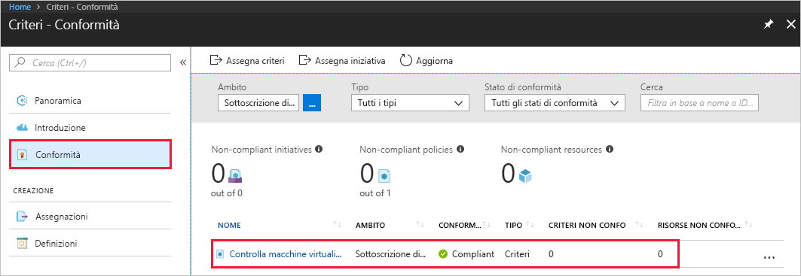

# <a name="create-a-policy-assignment-to-identify-non-compliant-resources-in-your-azure-environment-with-the-azure-cli"></a>Creare un'assegnazione di criteri per identificare le risorse non conformi nell'ambiente Azure usando l'interfaccia della riga di comando di Azure

Il primo passaggio per ottenere informazioni sulla conformità in Azure è sapere qual è lo stato delle risorse correnti. Questa guida introduttiva illustra il processo di creazione di un'assegnazione criteri per identificare le macchine virtuali che non usano dischi gestiti.

Alla fine di questo processo saranno state identificate correttamente le macchine virtuali che non usano dischi gestiti e pertanto *non conformi*.
.

Se non si ha una sottoscrizione di Azure, creare un account [gratuito](https://azure.microsoft.com/free/) prima di iniziare.

[!INCLUDE [cloud-shell-try-it.md](../../includes/cloud-shell-try-it.md)]

Se si sceglie di installare e usare l'interfaccia della riga di comando in locale, per questa guida introduttiva è necessario eseguire la versione 2.0.4 o successiva dell'interfaccia della riga di comando di Azure. Eseguire `az --version` per trovare la versione. Se è necessario eseguire l'installazione o l'aggiornamento, vedere [Installare l'interfaccia della riga di comando di Azure 2.0]( /cli/azure/install-azure-cli).

## <a name="opt-in-to-azure-policy"></a>Consenso esplicito per Criteri di Azure

Criteri di Azure è attualmente disponibile in anteprima pubblica ed è necessario registrarsi per richiedere l'accesso.

1. Passare a Criteri di Azure all'indirizzo https://aka.ms/getpolicy e selezionare **Iscrizione** nel riquadro a sinistra.

   

2. Acconsentire esplicitamente all'uso di Criteri di Azure selezionando le sottoscrizioni che si vuole usare nell'elenco **Sottoscrizione**. Selezionare quindi **Registra**.

   

   La richiesta viene approvata automaticamente per l'anteprima. Attendere fino a 30 minuti che il sistema elabori la registrazione.

## <a name="create-a-policy-assignment"></a>Creare un'assegnazione di criteri

In questa guida introduttiva si crea un'assegnazione di criteri e si assegna la definizione Audit Virtual Machines without Managed Disks (Controllare le macchine virtuali senza i dischi gestiti). Questa definizione di criteri identifica le risorse che non rispettano le condizioni impostate nella definizione dei criteri.

Per creare una nuova assegnazione di criteri, attenersi alla procedura seguente.

Visualizzare tutte le definizioni dei criteri e individuare la definizione dei criteri "Audit Virtual Machines without Managed Disks" (Controllare le macchine virtuali senza i dischi gestiti):

```azurecli
az policy definition list
```

Criteri di Azure include definizioni di criteri predefinite che è possibile usare. Sono disponibili definizioni di criteri predefinite come le seguenti:

- Imporre un tag e il relativo valore
- Applicare un tag e il relativo valore
- Richiedere SQL Server versione 12.0

Fornire le informazioni seguenti, quindi eseguire il comando seguente per assegnare la definizione dei criteri:

- **Name** (Nome): nome visualizzato per l'assegnazione dei criteri. In questo caso, si usa *Audit Virtual Machines without Managed Disks* (Controllare le macchine virtuali senza i dischi gestiti).
- **Policy** (Criterio): si tratta della definizione del criterio, in base a quello che si sta usando per creare l'assegnazione. In questo caso, è la definizione dei criteri: *Audit Virtual Machines without Managed Disks* (Controllare le macchine virtuali senza i dischi gestiti)
- Uno **Scope** (Ambito): determina le risorse o il raggruppamento di risorse a cui viene applicata l'assegnazione dei criteri e può variare da una sottoscrizione a gruppi di risorse.

  Usare la sottoscrizione (o gruppo di risorse) registrata in precedenza quando è stato dato il consenso esplicito all'uso di Criteri di Azure. In questo esempio viene usato l'ID di sottoscrizione **bc75htn-a0fhsi-349b-56gh-4fghti-f84852** e il nome del gruppo di risorse: **FabrikamOMS**. Assicurarsi di sostituire queste informazioni con l'ID della sottoscrizione e il nome del gruppo di risorse in uso.

L'output di questo comando dovrebbe essere simile al seguente:

```azurecli
az policy assignment create --name Audit Virtual Machines without Managed Disks Assignment --policy Audit Virtual Machines without Managed Disks --scope /subscriptions/
bc75htn-a0fhsi-349b-56gh-4fghti-f84852/resourceGroups/FabrikamOMS
```

Un'assegnazione di criterio è un criterio che è stato assegnato per l'implementazione in un ambito specifico. L'ambito può anche comprendere da un gruppo di gestione a un gruppo di risorse.

## <a name="identify-non-compliant-resources"></a>Identificare le risorse non conformi

Per visualizzare le risorse che non sono conformi a questa nuova assegnazione:

1. Ritornare alla pagina Criteri di Azure.
2. Selezionare **Conformità** nel riquadro a sinistra e cercare l'**Assegnazione criteri** creata.

   

   Le eventuali risorse esistenti non conformi a questa nuova assegnazione verranno visualizzate nella scheda **Risorse non conformi**.

## <a name="clean-up-resources"></a>Pulire le risorse

Altre guide in questa raccolta si basano su questa guida introduttiva. Se si prevede di continuare a usare le esercitazioni successive, non eliminare le risorse create in questa guida introduttiva. Se non si prevede di continuare, eliminare l'assegnazione creata eseguendo questo comando:

```azurecli
az policy assignment delete –name  Assignment --scope /subscriptions/ bc75htn-a0fhsi-349b-56gh-4fghti-f84852 resourceGroups/ FabrikamOMS
```

## <a name="next-steps"></a>Passaggi successivi

In questa Guida introduttiva è stata assegnata una definizione dei criteri per identificare le risorse non conformi nell'ambiente Azure.

Per altre informazioni sull'assegnazione di criteri per assicurarsi che le risorse create in **futuro** siano conformi, proseguire con l'esercitazione:

> [!div class="nextstepaction"]
> [Creazione e gestione dei criteri](./create-manage-policy.md)
