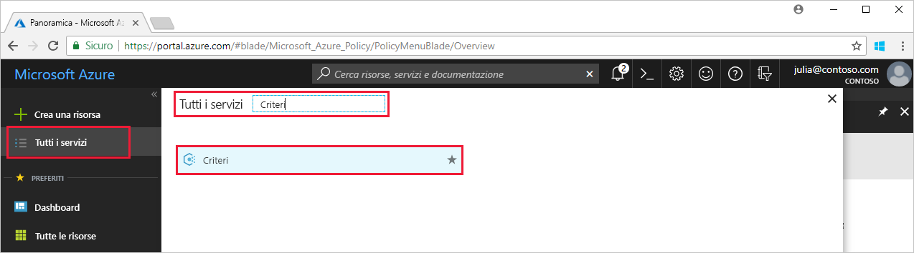

# <a name="create-and-manage-policies-to-enforce-compliance"></a>Creare e gestire i criteri per applicare la conformità

Comprendere come creare e gestire i criteri in Azure è importante per assicurare la conformità agli standard e ai contratti di servizio aziendali. Questa esercitazione illustra come usare Criteri di Azure per eseguire alcune delle attività più comuni correlate alla creazione, all'assegnazione e alla gestione dei criteri dell'organizzazione, ad esempio:

> [!div class="checklist"]
> * Assegnare un criterio per applicare una condizione alle risorse che verranno create in futuro
> * Creare e assegnare una definizione di iniziativa per tenere traccia della conformità di più risorse
> * Risolvere una risorsa non conforme o non consentita
> * Implementare un nuovo criterio all'interno dell'organizzazione

Se non si ha una sottoscrizione di Azure, creare un [account gratuito](https://azure.microsoft.com/free/?WT.mc_id=A261C142F) prima di iniziare.

## <a name="opt-in-to-azure-policy"></a>Consenso esplicito per Criteri di Azure

Criteri di Azure è attualmente disponibile in anteprima limitata, quindi è necessario registrarsi per richiedere l'accesso.

1. Passare a Criteri di Azure all'indirizzo https://aka.ms/getpolicy e selezionare **Iscrizione** nel riquadro a sinistra.

   

2. Acconsentire esplicitamente all'uso di Criteri di Azure selezionando le sottoscrizioni che si vuole usare nell'elenco **Sottoscrizione**. Selezionare quindi **Registra**.

   L'elenco delle sottoscrizioni include tutte le sottoscrizioni di Azure.

   

   Potrebbero trascorrere un paio di giorni prima che Microsoft accetti la richiesta di registrazione, a seconda della domanda. Dopo l'accettazione della richiesta si riceverà conferma tramite posta elettronica che è possibile iniziare a usare il servizio.

## <a name="assign-a-policy"></a>Assegnare i criteri

Il primo passaggio per applicare la conformità a Criteri di Azure consiste nell'assegnare una definizione dei criteri, che consente di definire le condizioni in base alle quali un criterio viene applicato e l'azione da intraprendere. In questo esempio, viene assegnata una definizione dei criteri predefinita, chiamata *Richiedere SQL Server versione 12.0*, per applicare la condizione in base alla quale tutti i database di SQL Server devono essere conformi alla versione 12.0.

1. Avviare il servizio Criteri di Azure nel portale di Azure cercando e selezionando **Policy**(Criterio) nel riquadro a sinistra.

   

2. Selezionare **Assegnazioni**nel riquadro a sinistra della pagina Criteri di Azure. Un'assegnazione è un criterio che è stato assegnato per l'implementazione in un ambito specifico.
3. Selezionare **Assegna criterio** nella parte superiore del riquadro **Assegnazioni**.

   

4. Nella pagina **Assegna criterio** fare clic sul  accanto al campo **Policy** (Criterio) per aprire l'elenco delle definizioni disponibili.

   

5. Selezionare **Richiedere SQL Server versione 12.0**.

   

6. Specificare un nome visualizzato per l'assegnazione del criterio in **Nome**. In questo caso è possibile usare *Richiedere SQL Server versione 12.0*. È anche possibile aggiungere una **descrizione** facoltativa. La descrizione fornisce informazioni dettagliate su come questa assegnazione di criteri garantisce che tutte le istanze di SQL Server create in questo ambiente siano nella versione 12.0.
7. Modificare il piano tariffario impostando **Standard** per garantire che i criteri vengano applicati alle risorse esistenti.

   Per Criteri di Azure esistono due piani tariffari, ovvero *Gratuito* e *Standard*. Con il piano Gratuito è possibile applicare i criteri solo alle risorse future, mentre con quello Standard è possibile applicarli anche a risorse esistenti per ottenere una migliore comprensione dello stato di conformità. Trattandosi di un'anteprima limitata, non è ancora stato rilasciato un modello di determinazione dei prezzi, quindi non si riceverà fattura selezionando *Standard*. Per altre informazioni sui prezzi, vedere [Prezzi di Criteri di Azure](https://acom-milestone-ignite.azurewebsites.net/pricing/details/azure-policy/).

8. Selezionare l'**ambito**, ovvero la sottoscrizione o il gruppo di risorse registrato quando è stato dato il consenso esplicito all'uso di Criteri di Azure. L'ambito determina le risorse o il raggruppamento di risorse a cui viene applicata l'assegnazione di un criterio e può variare da una sottoscrizione a gruppi di risorse.

   In questo esempio viene usata la sottoscrizione **Azure Analytics Capacity Dev**, ma le opzioni disponibili sono diverse.

10. Selezionare **Assegna**.

## <a name="implement-a-new-custom-policy"></a>Implementare un nuovo criterio personalizzato

Dopo aver assegnato la definizione dei criteri, viene creato un nuovo criterio per ridurre i costi verificando che le macchine virtuali create nell'ambiente non rientrino nella serie G. In questo modo, ogni volta che un utente dell'organizzazione tenta di creare una macchina virtuale della serie G, la richiesta verrà negata.

1. Selezionare **Definizione** in **Creazione** nel riquadro a sinistra.

   

2. Selezionare **+ 	Definizione criteri**.
3. Immettere le informazioni seguenti:

   - Il nome della definizione del criterio: *Require VM SKUs smaller than the G series* (Richiedere SKU di VM inferiori rispetto alla serie G).
   - La descrizione della finalità della definizione del criterio: questa definizione di criterio fa sì che tutte le macchine virtuali create in questo ambito abbiamo SKU inferiori rispetto alla serie G per ridurre i costi.
   - La sottoscrizione che contiene la definizione del criterio. In questo caso la definizione del criterio viene inserita in **Advisor Analytics Capacity Dev**, ma le opzioni disponibili sono diverse.
   - Scrivere il codice json con:
      - Parametri dei criteri.
      - Le regole/condizioni del criterio, in questo caso: dimensione dello SKU della VM uguale alla serie G.
      - L'effetto del criterio, in questo caso: **Nega**.

   Di seguito viene mostrato l'aspetto del codice json:

```json
{
    "policyRule": {
      "if": {
        "allOf": [
          {
            "field": "type",
            "equals": "Microsoft.Compute/virtualMachines"
          },
          {
            "field": "Microsoft.Compute/virtualMachines/sku.name",
            "like": "Standard_G*"
          }
        ]
      },
      "then": {
        "effect": "deny"
      }
    }
}
```

<!-- Update the following link to the top level samples page
-->
   Per visualizzare esempi di codice json, leggere l'articolo [Modelli per Criteri di Azure](json-samples.md)

4. Selezionare **Salva**.

## <a name="create-a-policy-definition-with-rest-api"></a>Creare una definizione di criteri con l'API REST

È possibile creare un criterio con l'API REST per le definizioni dei criteri. L'API REST consente di creare ed eliminare le definizioni dei criteri, e di ottenere informazioni sulle definizioni esistenti.
Per creare una definizione criteri, usare l'esempio seguente:

```
PUT https://management.azure.com/subscriptions/{subscription-id}/providers/Microsoft.authorization/policydefinitions/{policyDefinitionName}?api-version={api-version}

```
Includere un corpo della richiesta in modo simile all'esempio seguente:

```
{
  "properties": {
    "parameters": {
      "allowedLocations": {
        "type": "array",
        "metadata": {
          "description": "The list of locations that can be specified when deploying resources",
          "strongType": "location",
          "displayName": "Allowed locations"
        }
      }
    },
    "displayName": "Allowed locations",
    "description": "This policy enables you to restrict the locations your organization can specify when deploying resources.",
    "policyRule": {
      "if": {
        "not": {
          "field": "location",
          "in": "[parameters('allowedLocations')]"
        }
      },
      "then": {
        "effect": "deny"
      }
    }
  }
}
```

## <a name="create-a-policy-definition-with-powershell"></a>Creare una definizione criteri con PowerShell

Prima di passare all'esempio di PowerShell, verificare di avere installato la versione più recente di Azure PowerShell. I parametri dei criteri sono stati aggiunti nella versione 3.6.0. Se si ha una versione precedente, gli esempi restituiscono un errore che indica che non è possibile trovare il parametro.

È possibile creare una definizione di criterio usando il cmdlet `New-AzureRmPolicyDefinition`.

Per creare una definizione dei criteri da un file passare il percorso al file. Per un file esterno, usare l'esempio seguente:

```
$definition = New-AzureRmPolicyDefinition `
    -Name denyCoolTiering `
    -DisplayName "Deny cool access tiering for storage" `
    -Policy 'https://raw.githubusercontent.com/Azure/azure-policy-samples/master/samples/Storage/storage-account-access-tier/azurepolicy.rules.json'
```

Per un file locale, usare l'esempio seguente:

```
$definition = New-AzureRmPolicyDefinition `
    -Name denyCoolTiering `
    -Description "Deny cool access tiering for storage" `
    -Policy "c:\policies\coolAccessTier.json"
```

Per creare una definizione criteri con una regola inline, usare l'esempio seguente:

```
$definition = New-AzureRmPolicyDefinition -Name denyCoolTiering -Description "Deny cool access tiering for storage" -Policy '{
  "if": {
    "allOf": [
      {
        "field": "type",
        "equals": "Microsoft.Storage/storageAccounts"
      },
      {
        "field": "kind",
        "equals": "BlobStorage"
      },
      {
        "not": {
          "field": "Microsoft.Storage/storageAccounts/accessTier",
          "equals": "cool"
        }
      }
    ]
  },
  "then": {
    "effect": "deny"
  }
}'
```

L'output viene archiviato in un oggetto `$definition` che viene usato durante l'assegnazione del criterio.
L'esempio seguente crea una definizione del criterio che include i parametri:

```
$policy = '{
    "if": {
        "allOf": [
            {
                "field": "type",
                "equals": "Microsoft.Storage/storageAccounts"
            },
            {
                "not": {
                    "field": "location",
                    "in": "[parameters(''allowedLocations'')]"
                }
            }
        ]
    },
    "then": {
        "effect": "Deny"
    }
}'

$parameters = '{
    "allowedLocations": {
        "type": "array",
        "metadata": {
          "description": "The list of locations that can be specified when deploying storage accounts.",
          "strongType": "location",
          "displayName": "Allowed locations"
        }
    }
}'

$definition = New-AzureRmPolicyDefinition -Name storageLocations -Description "Policy to specify locations for storage accounts." -Policy $policy -Parameter $parameters
```

## <a name="view-policy-definitions"></a>Visualizzare le definizioni dei criteri

Per visualizzare tutte le definizioni dei criteri nella sottoscrizione, usare il comando seguente:

```
Get-AzureRmPolicyDefinition
```

Restituisce tutte le definizioni dei criteri disponibili, inclusi i criteri predefiniti. Tutti i criteri vengono restituiti nel formato seguente:

```
Name               : e56962a6-4747-49cd-b67b-bf8b01975c4c
ResourceId         : /providers/Microsoft.Authorization/policyDefinitions/e56962a6-4747-49cd-b67b-bf8b01975c4c
ResourceName       : e56962a6-4747-49cd-b67b-bf8b01975c4c
ResourceType       : Microsoft.Authorization/policyDefinitions
Properties         : @{displayName=Allowed locations; policyType=BuiltIn; description=This policy enables you to
                     restrict the locations your organization can specify when deploying resources. Use to enforce
                     your geo-compliance requirements.; parameters=; policyRule=}
PolicyDefinitionId : /providers/Microsoft.Authorization/policyDefinitions/e56962a6-4747-49cd-b67b-bf8b01975c4c
```

## <a name="create-a-policy-definition-with-azure-cli"></a>Creare una definizione criteri con l'interfaccia della riga di comando di Azure

È possibile creare una definizione di criteri usando l'interfaccia della riga di comando di Azure con il comando di definizione dei criteri.
Per creare una definizione criteri con una regola inline, usare l'esempio seguente:

```
az policy definition create --name denyCoolTiering --description "Deny cool access tiering for storage" --rules '{
  "if": {
    "allOf": [
      {
        "field": "type",
        "equals": "Microsoft.Storage/storageAccounts"
      },
      {
        "field": "kind",
        "equals": "BlobStorage"
      },
      {
        "not": {
          "field": "Microsoft.Storage/storageAccounts/accessTier",
          "equals": "cool"
        }
      }
    ]
  },
  "then": {
    "effect": "deny"
  }
}'
```

## <a name="view-policy-definitions"></a>Visualizzare le definizioni dei criteri

Per visualizzare tutte le definizioni dei criteri nella sottoscrizione, usare il comando seguente:

```
az policy definition list
```

Restituisce tutte le definizioni dei criteri disponibili, inclusi i criteri predefiniti. Tutti i criteri vengono restituiti nel formato seguente:

```
{                                                            
  "description": "This policy enables you to restrict the locations your organization can specify when deploying resources. Use to enforce your geo-compliance requirements.",                      
  "displayName": "Allowed locations",
  "id": "/providers/Microsoft.Authorization/policyDefinitions/e56962a6-4747-49cd-b67b-bf8b01975c4c",
  "name": "e56962a6-4747-49cd-b67b-bf8b01975c4c",
  "policyRule": {
    "if": {
      "not": {
        "field": "location",
        "in": "[parameters('listOfAllowedLocations')]"
      }
    },
    "then": {
      "effect": "Deny"
    }
  },
  "policyType": "BuiltIn"
}
```

## <a name="create-and-assign-an-initiative-definition"></a>Creare e assegnare una definizione di iniziativa

Una definizione di iniziativa consente di raggruppare più definizioni di criteri per raggiungere un obiettivo globale. Una definizione di iniziativa viene creata per garantire che le risorse incluse nell'ambito siano conformi alle definizioni dei criteri che costituiscono la definizione dell'iniziativa.  Vedere l'articolo [Azure Policy overview](./azure-policy-introduction.md) (Cenni preliminari su Criteri di Azure) per altre informazioni sulle definizioni di iniziative.

### <a name="create-an-initiative-definition"></a>Creare una definizione di iniziativa

1. Selezionare **Definizioni** in **Creazione** nel riquadro a sinistra.

   

2. Selezionare **Initiative Definition** (Definizione iniziativa) nella parte superiore della pagine, per aprire il modulo **Initiative Definition** (Definizione iniziativa).
3. Inserire il nome e la descrizione dell'iniziativa.

   In questo esempio si vuole garantire che le risorse siano conformi alle definizioni dei criteri relativi alla protezione, pertanto il nome dell'iniziativa potrebbe essere **Ottenere sicurezza** e la descrizione potrebbe essere: **Iniziativa creata per gestire tutte le definizioni dei criteri associati alla protezione delle risorse**.

   

4. Scorrere l'elenco delle **definizioni disponibili** e selezionare una o più definizioni di criteri da aggiungere all'iniziativa. Per l'iniziativa **Ottenere sicurezza**, aggiungere le seguenti definizioni di criteri predefinite:
   - Richiedere SQL Server versione 12.0
   - Monitor unprotected web applications in the security center (Monitorare le applicazioni Web non protette nel Centro sicurezza).
   - Monitor permissive network across in Security Center (Monitorare la rete permissiva nel Centro sicurezza).
   - Monitor possible app Whitelisting in Security Center (Monitorare potenziali elenchi di app consentite nel Centro sicurezza).
   - Monitor unencrypted VM Disks in Security Center (Monitorare dischi di VM non crittografati nel Centro sicurezza).

   

   Dopo aver selezionato le definizioni dei criteri nell'elenco, queste verranno visualizzate in **Policies and parameters** (Criteri e parametri), come illustrato in precedenza.

5. Selezionare **Crea**.

### <a name="assign-an-initiative-definition"></a>Assegnare una definizione di iniziativa

1. Passare alla scheda **Definitions** (Definizioni) in **Authoring** (Creazione).
2. Cercare la definizione dell'iniziativa **Assicura protezione** appena creata.
3. Selezionare la definizione di iniziativa, quindi fare clic su **Assign** (Assegna).

   

4. Compilare il modulo **Assegnazione**, inserendo:
   - Nome - Ottenere assegnazione sicura
   - Descrizione - Questa assegnazione di iniziativa è compilata per far applicare questo gruppo di definizioni dei criteri alla sottoscrizione **Azure Advisor Capacity Dev**.
   - Piano tariffario - Standard
   - Ambito a cui si vuole applicare questa assegnazione - **Azure Advisor Capacity Dev**

5. Selezionare **Assegna**.

## <a name="resolve-a-non-compliant-or-denied-resource"></a>Risolvere una risorsa non conforme o non consentita

Facendo riferimento all'esempio precedente, dopo aver assegnato la definizione dei criteri per richiedere un'istanza di SQL Server versione 12.0, non viene consentita la creazione di un server SQL con una versione diversa. In questa sezione viene risolto un tentativo negato di creare un server SQL di una versione diversa richiedendo un'esclusione.

1. Selezionare **Assegnazioni** nel riquadro a sinistra.
2. Esplorare tutte le assegnazioni dei criteri e avviare l'assegnazione *Richiedere SQL Server versione 12.0*.
3. Richiedere un'esclusione per i gruppi di risorse nei quali si sta tentando di creare il server SQL. In questo caso vengono esclusi Microsoft.Sql/servers/databases: *baconandbeer/Cheetos* e *baconandbeer/Chorizo*.

   

   Per risolvere una risorsa non consentita è anche raggiungere il contatto associato al criterio se è possibile giustificare con certezza la necessità del server SQL server, e modificare direttamente il criterio se è possibile accedervi.

4. Selezionare **Salva**.

In questa sezione è stato risolto il rifiuto al tentativo di creare un server SQL con la versione 12.0, richiedendo un'esclusione per le risorse.

## <a name="clean-up-resources"></a>Pulire le risorse

Se si prevede di continuare a usare le esercitazioni successive, non eliminare le risorse create in questa guida. Se non si prevede di continuare, usare i passaggi seguenti per eliminare tutte le assegnazioni o definizioni create.

1. Selezionare **Definitions** (Definizioni) o **Assegnazioni** se si vuole eliminare un'assegnazione nel riquadro a sinistra.
2. Cercare la nuova iniziativa o definizione (o assegnazione) di criteri appena creata.
3. Selezionare i puntini di sospensione alla fine della definizione o dell'assegnazione e quindi **Delete Definition** (Elimina definizione) o **Elimina assegnazione**.

## <a name="next-steps"></a>Passaggi successivi

In questa esercitazione si è eseguito quanto segue:

> [!div class="checklist"]
> * Assegnazione di un criterio per applicare una condizione alle risorse che verranno create in futuro.
> * Creazione e assegnazione di una definizione di iniziativa per tenere traccia della conformità di più risorse.
> * Risoluzione di una risorsa non conforme o non consentita.
> * Implementazione di un nuovo criterio all'interno dell'organizzazione.

Per altre informazioni sulle strutture delle definizioni di criteri, vedere:

> [!div class="nextstepaction"]
> [Struttura delle definizioni di Criteri di Azure](policy-definition.md)
