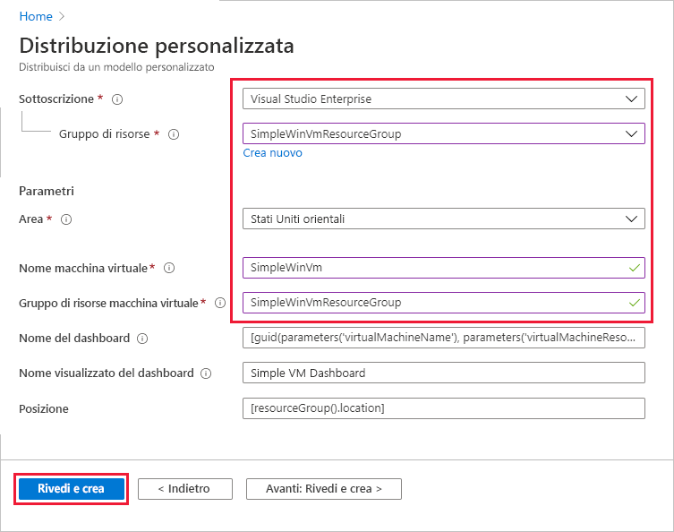
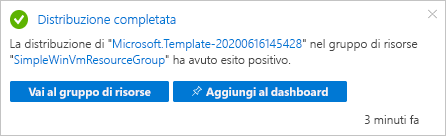
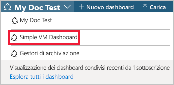
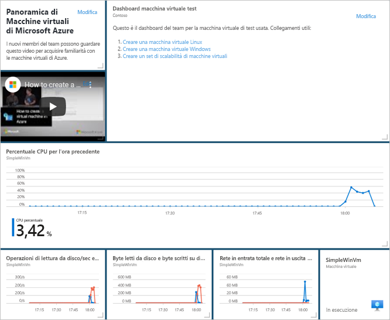
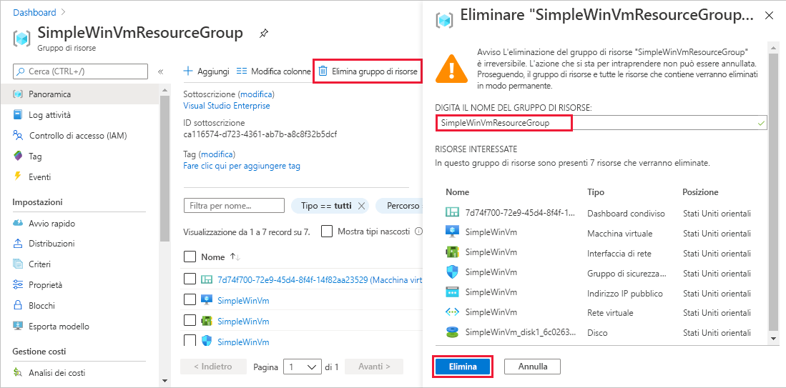

# <a name="quickstart-create-a-dashboard-in-the-azure-portal-by-using-an-arm-template"></a>Avvio rapido: Creare un dashboard nel portale di Azure usando un modello di Resource Manager

Un dashboard nel portale di Azure offre una visualizzazione mirata e organizzata delle risorse cloud. Questo argomento di avvio rapido illustra il processo di distribuzione di un modello di Azure Resource Manager per creare un dashboard. Il dashboard mostra le prestazioni di una macchina virtuale (VM), oltre ad alcune informazioni statiche e alcuni collegamenti.

[!INCLUDE [About Azure Resource Manager](../../includes/resource-manager-quickstart-introduction.md)]

Se l'ambiente soddisfa i prerequisiti e si ha familiarità con l'uso dei modelli di Resource Manager, selezionare il pulsante **Distribuisci in Azure**. Il modello verrà aperto nel portale di Azure.

[](https://portal.azure.com/#create/Microsoft.Template/uri/https%3A%2F%2Fraw.githubusercontent.com%2FAzure%2Fazure-quickstart-templates%2Fmaster%2F101-azure-portal-dashboard%2Fazuredeploy.json)

## <a name="prerequisites"></a>Prerequisiti

- Se non si ha una sottoscrizione di Azure, creare un [account gratuito](https://azure.microsoft.com/free/?WT.mc_id=A261C142F) prima di iniziare.
- Una VM esistente.

## <a name="create-a-virtual-machine"></a>Creare una macchina virtuale

Il dashboard che si creerà nella parte successiva di questo avvio rapido necessita di una macchina virtuale esistente. Creare una VM seguendo questa procedura.

1. Nel portale di Azure selezionare Cloud Shell.

    

1. Copiare il comando seguente e immetterlo al prompt dei comandi per creare un gruppo di risorse.

    ```powershell
    New-AzResourceGroup -Name SimpleWinVmResourceGroup -Location EastUS
    ```

    

1. Copiare il comando seguente e immetterlo al prompt dei comandi per creare una VM nel gruppo di risorse.

    ```powershell
    New-AzVm `
        -ResourceGroupName "SimpleWinVmResourceGroup" `
        -Name "SimpleWinVm" `
        -Location "East US" 
    ```

1. Immettere un nome utente e una password per la VM. Devono essere un nome utente e una password nuovi e non, ad esempio, quelli dell'account usato per accedere ad Azure. Per altre informazioni, vedere i [requisiti relativi ai nomi utente](../virtual-machines/windows/faq.md#what-are-the-username-requirements-when-creating-a-vm) e i [requisiti relativi alle password](../virtual-machines/windows/faq.md#what-are-the-password-requirements-when-creating-a-vm).

    La distribuzione della VM viene avviata e in genere impiega alcuni minuti. Al termine della distribuzione, passare alla sezione successiva.

## <a name="review-the-template"></a>Rivedere il modello

Il modello usato in questo avvio rapido proviene dai [modelli di avvio rapido di Azure](https://azure.microsoft.com/resources/templates/101-azure-portal-dashboard/). Il modello per questo articolo è troppo lungo per essere visualizzato qui. Per visualizzare il modello, vedere [azuredeploy.json](https://raw.githubusercontent.com/Azure/azure-quickstart-templates/master/101-azure-portal-dashboard/azuredeploy.json). Nel modello è definita una risorsa di Azure, [Microsoft.Portal/dashboards](/azure/templates/microsoft.portal/dashboards) - Creare un dashboard nel portale di Azure.

## <a name="deploy-the-template"></a>Distribuire il modello

1. Selezionare l'immagine seguente per accedere ad Azure e aprire un modello.

    [](https://portal.azure.com/#create/Microsoft.Template/uri/https%3A%2F%2Fraw.githubusercontent.com%2FAzure%2Fazure-quickstart-templates%2Fmaster%2F101-azure-portal-dashboard%2Fazuredeploy.json)

1. Selezionare o immettere i valori seguenti, quindi selezionare **Rivedi e crea**.

    

    Se non specificati, usare i valori predefiniti per creare il dashboard.

    * **Sottoscrizione**: selezionare una sottoscrizione di Azure.
    * **Gruppo di risorse**: selezionare **SimpleWinVmResourceGroup**.
    * **Località**: selezionare **Stati Uniti orientali**.
    * **Nome macchina virtuale**: immettere **SimpleWinVm**.
    * **Gruppo di risorse macchina virtuale**: immettere **SimpleWinVmResourceGroup**.

1. Selezionare **Crea** o **Acquista**. Al termine della distribuzione del dashboard, si riceverà una notifica:

    

Per distribuire il modello è stato usato il portale di Azure. Oltre al portale di Azure, è anche possibile usare Azure PowerShell, l'interfaccia della riga di comando di Azure e l'API REST. Per informazioni sugli altri metodi di distribuzione, vedere [Distribuire modelli](../azure-resource-manager/templates/deploy-powershell.md).

## <a name="review-deployed-resources"></a>Esaminare le risorse distribuite

Verificare che il dashboard sia stato creato correttamente e che sia possibile visualizzare i dati della VM.

1. Nel portale di Azure selezionare **Dashboard**.

    

1. Nella pagina del dashboard selezionare **Simple VM Dashboard**.

    

1. Esaminare il dashboard creato dal modello di Resource Manager. Come si può notare, parte del contenuto è statico, ma sono presenti anche alcuni grafici che mostrano le prestazioni della VM creata all'inizio.

    

## <a name="clean-up-resources"></a>Pulire le risorse

Se si vuole rimuovere la VM e il dashboard associato, eliminare il gruppo di risorse che li contiene.

1. Nel portale di Azure cercare **SimpleWinVmResourceGroup**, quindi selezionarlo nei risultati della ricerca.

1. Nella pagina **SimpleWinVmResourceGroup** selezionare **Elimina gruppo di risorse**, immettere il nome del gruppo di risorse per confermare e quindi selezionare **Elimina**.

    

## <a name="next-steps"></a>Passaggi successivi

Per altre informazioni sui dashboard nel portale di Azure, vedere:

> [!div class="nextstepaction"]
> [Creare e condividere dashboard nel portale di Azure](azure-portal-dashboards.md)