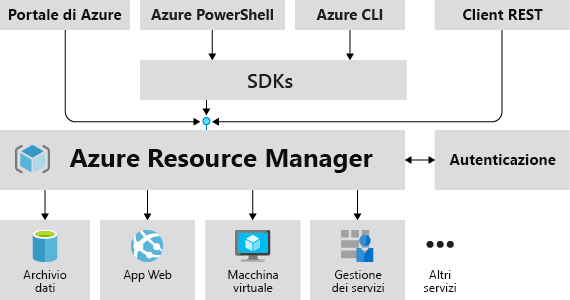
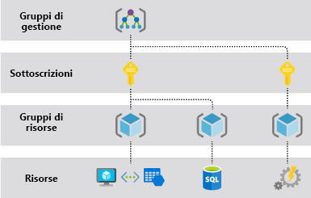

# Informazioni su Azure Resource Manager

Azure Resource Manager è il servizio di distribuzione e gestione di Azure. Fornisce un livello di gestione che consente di creare, aggiornate ed eliminare risorse nell'account Azure. È possibile usare funzionalità di gestione, come il controllo di accesso, i blocchi e i tag, per proteggere e organizzare le risorse dopo la distribuzione.

Per informazioni sui modelli di Azure Resource Manager, vedere [Panoramica della distribuzione di modelli](../templates/overview.md).

## Livello di gestione coerente

Quando un utente invia una richiesta da uno strumento, un'API o un SDK di Azure, Resource Manager riceve la richiesta, la autentica e la autorizza. Resource Manager invia la richiesta al servizio di Azure, che accetta l'azione richiesta. Poiché tutte le richieste vengono gestite tramite la stessa API, i risultati e le funzionalità risultano coerenti in tutti i vari strumenti.

La figura seguente illustra il ruolo di Azure Resource Manager nella gestione delle richieste di Azure.

Tutte le funzionalità disponibili nel portale sono disponibili anche tramite PowerShell, l'interfaccia della riga di comando di Azure, le API REST e gli SDK client. Le funzionalità inizialmente rilasciate tramite API vengono rappresentate nel portale entro 180 giorni dal rilascio iniziale.

## Terminologia

Se non si ha esperienza con Azure Resource Manager, ecco alcuni termini con cui acquisire familiarità.

* **risorsa** : elemento gestibile disponibile tramite Azure. Sono ad esempio risorse le macchine virtuali, gli account di archiviazione, le app Web, i database e le reti virtuali. Anche i gruppi di risorse, le sottoscrizioni, i gruppi di gestione e i tag sono esempi di risorse.
* **gruppo di risorse** : contenitore con risorse correlate per una soluzione Azure. Il gruppo di risorse include le risorse che si vogliono gestire come gruppo. L'utente decide quali risorse appartengono a un gruppo in base alle esigenze specifiche dell'organizzazione. Vedere [Gruppi di risorse](#resource-groups).
* **provider di risorse**: servizio che fornisce le risorse di Azure. Un provider di risorse comune è ad esempio Microsoft.Compute, che fornisce la risorsa macchina virtuale. Microsoft.Storage è un altro provider di risorse comune. Vedere [Provider e tipi di risorse](resource-providers-and-types.md).
* **modello di Resource Manager**: file JSON (JavaScript Object Notation) che definisce una o più risorse da distribuire a un gruppo di risorse, a una sottoscrizione, a un gruppo di gestione o a un tenant. Il modello può essere usato per distribuire le risorse in modo coerente e ripetuto. Vedere [Panoramica della distribuzione di modelli](../templates/overview.md).
* **sintassi dichiarativa** : sintassi che consente di indicare l'oggetto da creare senza dover scrivere la sequenza di comandi di programmazione per crearlo. Il modello di Resource Manager è un esempio di sintassi dichiarativa. Nel file vengono definite le proprietà per l'infrastruttura da distribuire in Azure.  Vedere [Panoramica della distribuzione di modelli](../templates/overview.md).

## Vantaggi dell'utilizzo di Gestione risorse

Con Resource Manager è possibile:

* Gestire l'infrastruttura tramite modelli dichiarativi, invece che con script.

* Distribuire, gestire e monitorare tutte le risorse per la soluzione come un gruppo, invece di gestire singolarmente tali risorse.

* Distribuire ripetutamente la soluzione nel corso del ciclo di vita dello sviluppo con la certezza che le risorse vengano distribuite in uno stato coerente.

* Definire le dipendenze tra risorse in modo che vengano distribuite nell'ordine corretto.

* Applicare il controllo di accesso a tutti i servizi, perché il controllo degli accessi in base al ruolo di Azure è integrato in modo nativo nella piattaforma di gestione.

* Applicare tag a tutte risorse per organizzarle in modo logico nella sottoscrizione.

* Ottenere informazioni dettagliate sulla fatturazione per l'organizzazione visualizzando i costi di un gruppo di risorse che condividono lo stesso tag.

## Informazioni sull'ambito

Azure offre quattro livelli relativi all'ambito: [gruppi di gestione](../../governance/management-groups/overview.md), sottoscrizioni, [gruppi di risorse](#resource-groups) e risorse. Nella figura seguente viene illustrato un esempio di questi livelli.

Le impostazioni di gestione possono essere applicate a qualsiasi di questi livelli di ambito. Il livello selezionato determina l'estensione con cui viene applicata l'impostazione. I livelli inferiori ereditano le impostazioni dai livelli superiori. Ad esempio, quando si applicano [criteri](../../governance/policy/overview.md) alla sottoscrizione, tali criteri vengono applicati a tutti i gruppi di risorse e le risorse nella sottoscrizione. Quando si applicano criteri al gruppo di risorse, tali criteri vengono applicati al gruppo di risorse e a tutte le risorse che contiene. Tuttavia, un altro gruppo di risorse non disporrà di tale assegnazione di criteri.

È possibile distribuire i modelli in tenant, gruppi di gestione, sottoscrizioni o gruppi di risorse.

## Gruppi di risorse

Esistono alcuni fattori importanti da considerare quando si definisce il gruppo di risorse:

* Tutte le risorse del gruppo di risorse devono condividere lo stesso ciclo di vita. Le risorse vengono distribuite, aggiornate ed eliminate insieme. Se una risorsa, ad esempio un server, deve esistere in un ciclo di distribuzione diverso, deve essere inclusa in un altro gruppo di risorse.

* Ogni risorsa può appartenere a un solo gruppo di risorse.

* È possibile aggiungere o rimuovere una risorsa in un gruppo di risorse in qualsiasi momento.

* È possibile spostare una risorsa da un gruppo di risorse a un altro. Per altre informazioni, vedere [Spostare le risorse in un gruppo di risorse o una sottoscrizione nuovi](move-resource-group-and-subscription.md).

* Le risorse in un gruppo di risorse possono trovarsi in aree diverse del gruppo.

* Quando si crea un gruppo di risorse è necessario specificarne il percorso. Perché un gruppo di risorse necessita di un percorso? E se le risorse possono avere percorsi diversi rispetto al gruppo di risorse, perché il percorso del gruppo di risorse è importante? Il gruppo di risorse archivia i metadati delle risorse. Quando si specifica una posizione per il gruppo di risorse, si specifica dove vengono archiviati tali metadati. Per motivi di conformità potrebbe essere necessario assicurarsi che i dati siano archiviati in una determinata area.

   Se l'area del gruppo di risorse è temporaneamente non disponibile, non è possibile aggiornare le risorse nel gruppo di risorse perché i metadati non sono disponibili. Le risorse in altre aree continueranno a funzionare come previsto, ma non è possibile aggiornarle. Per altre informazioni su come creare applicazioni affidabili, vedere [Progettazione di applicazioni Azure affidabili](/azure/architecture/checklist/resiliency-per-service).

* Un gruppo di risorse consente di definire l'ambito di controllo di accesso per operazioni amministrative. Per gestire un gruppo di risorse, è possibile assegnare [Criteri di Azure](../../governance/policy/overview.md), [ruoli di Azure](../../role-based-access-control/role-assignments-portal.md) o [blocchi delle risorse](lock-resources.md).

* È possibile [applicare tag](tag-resources.md) a un gruppo di risorse. Le risorse nel gruppo di risorse non ereditano tali tag.

* Una risorsa può connettersi a risorse in altri gruppi di risorse. Questo scenario è comune quando le due risorse sono correlate ma non condividono lo stesso ciclo di vita. Ad esempio, è possibile avere un'app Web che si connette a un database in un gruppo di risorse diverso.

* Quando si elimina un gruppo di risorse, verranno eliminate anche tutte le risorse presenti nel gruppo. Per informazioni sul modo in cui Azure Resource Manager orchestra tali eliminazioni, vedere [Eliminazione di risorse e gruppi di risorse di Azure Resource Manager](delete-resource-group.md).

* In ogni gruppo di risorse è possibile distribuire fino a 800 istanze di un tipo di risorsa. Alcuni tipi di risorse [non sono soggetti al limite di 800 istanze](resources-without-resource-group-limit.md).

* Alcune risorse possono esistere all'esterno di un gruppo di risorse. Queste risorse vengono distribuite nella [sottoscrizione](../templates/deploy-to-subscription.md), nel [gruppo di gestione](../templates/deploy-to-management-group.md) o nel [tenant](../templates/deploy-to-tenant.md). In questi ambiti sono supportati solo tipi di risorse specifici.

* Per creare un gruppo di risorse, è possibile usare il [portale](manage-resource-groups-portal.md#create-resource-groups), [PowerShell](manage-resource-groups-powershell.md#create-resource-groups), l'[interfaccia della riga di comando di Azure](manage-resource-groups-cli.md#create-resource-groups) o un [modello di Azure Resource Manager](../templates/deploy-to-subscription.md#resource-groups).

## Resilienza di Azure Resource Manager

Il servizio Azure Resource Manager è progettato per la resilienza e la disponibilità continua. Le operazioni a livello di Resource Manager e di piano di controllo (richieste inviate a management.azure.com) nell'API REST presentano le caratteristiche seguenti:

* Sono distribuite tra le aree. Alcuni servizi sono disponibili a livello di area.

* Sono distribuite tra le zone di disponibilità (oltre che tra le aree) in località con più zone di disponibilità.

* Non dipendono da un singolo data center logico.

* Non vengono mai disattivate per attività di manutenzione.

Questa resilienza si applica ai servizi che ricevono le richieste tramite Resource Manager. Key Vault, ad esempio, usufruisce di questa resilienza.

## Passaggi successivi

* Per informazioni sullo spostamento di risorse, vedere [Spostare le risorse in un gruppo di risorse o una sottoscrizione nuovi](move-resource-group-and-subscription.md).

* Per altre informazioni sull'applicazione di tag alle risorse, vedere [Uso dei tag per organizzare le risorse di Azure](tag-resources.md).

* Per informazioni sul blocco delle risorse, vedere [Bloccare le risorse per impedire modifiche impreviste](lock-resources.md).
