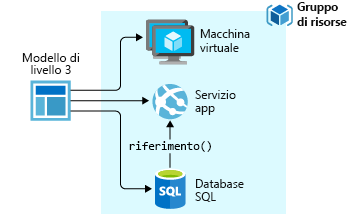
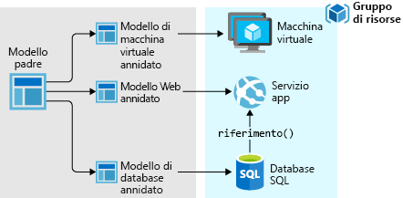
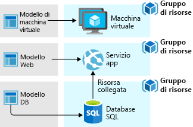

# <a name="azure-resource-manager-overview"></a>Panoramica di Gestione risorse di Microsoft Azure
L'infrastruttura per l'applicazione è in genere costituita da vari componenti, ad esempio una macchina virtuale, un account di archiviazione e una rete virtuale oppure un'app Web, un database, un server di database e servizi di terze parti. Questi componenti non appaiono come entità separate, ma come parti correlate e interdipendenti di una singola entità e devono essere distribuite, gestite e monitorate come gruppo. Gestione risorse di Azure consente di usare le risorse incluse nella soluzione come un gruppo. È possibile distribuire, aggiornare o eliminare tutte le risorse della soluzione con un'unica operazione coordinata. Per la distribuzione viene usato un modello; questo modello può essere usato per diversi ambienti, ad esempio di testing, staging e produzione. Gestione risorse offre funzionalità di sicurezza, controllo e categorizzazione che semplificano la gestione delle risorse dopo la distribuzione. 

## <a name="consistent-management-layer"></a>Livello di gestione coerente
Resource Manager fornisce un livello di gestione coerente per eseguire attività tramite Azure PowerShell, l'interfaccia della riga di comando di Azure, il portale di Azure, l'API REST e gli SDK client. Tutte le funzionalità disponibili nel portale di Azure sono disponibili anche tramite Azure PowerShell, l'interfaccia della riga di comando di Azure, l'API REST di Azure e i client SDK. Le funzionalità inizialmente rilasciate tramite API vengono rappresentate nel portale entro 180 giorni dal rilascio iniziale.

Scegliere gli strumenti e le API più adatte alle proprie esigenze. Hanno infatti le stesse funzionalità e offrono risultati coerenti.

La figura seguente mostra come tutti gli strumenti interagiscono con la stessa API di Azure Resource Manager. L'API passa le richieste al servizio Resource Manager, che autentica e autorizza le richieste. Resource Manager indirizza le richieste ai provider di risorse appropriati.


## <a name="terminology"></a>Terminologia
Se non si ha esperienza con Azure Resource Manager, ecco alcuni termini con cui acquisire familiarità.

* **risorsa** : elemento gestibile disponibile tramite Azure. Alcune risorse comuni sono le macchine virtuali, gli account di archiviazione, le app Web, i database e le reti virtuali, ma ne esistono molte altre.
* **gruppo di risorse** : contenitore con risorse correlate per una soluzione Azure. Il gruppo di risorse può includere tutte le risorse della soluzione o solo le risorse da gestire come gruppo. L'utente decide come allocare le risorse ai gruppi di risorse nel modo più appropriato per l'organizzazione. Vedere [Gruppi di risorse](#resource-groups).
* **provider di risorse** : servizio che mette a disposizione le risorse che è possibile distribuire e gestire con Resource Manager. Ogni provider di risorse offre operazioni per l'uso delle risorse distribuite. Alcuni provider di risorse comuni sono Microsoft.Compute che mette a disposizione la risorsa delle macchine virtuali, Microsoft.Storage che offre la risorsa di account di archiviazione e Microsoft.Web che mette a disposizione risorse correlate alle app Web. Vedere [Provider di risorse](#resource-providers).
* **modello di Resource Manager** : file JavaScript Object Notation (JSON) che definisce una o più risorse da distribuire in un gruppo di risorse. Definisce anche le dipendenze tra le risorse distribuite. Il modello può essere usato per distribuire le risorse in modo coerente e ripetuto. Vedere [Distribuzione del modello](#template-deployment).
* **sintassi dichiarativa** : sintassi che consente di indicare l'oggetto da creare senza dover scrivere la sequenza di comandi di programmazione per crearlo. Il modello di Resource Manager è un esempio di sintassi dichiarativa. Nel file vengono definite le proprietà per l'infrastruttura da distribuire in Azure. 

## <a name="the-benefits-of-using-resource-manager"></a>Vantaggi dell'utilizzo di Gestione risorse
Gestione risorse offre numerosi vantaggi:

* È possibile distribuire, gestire e monitorare tutte le risorse per la soluzione come un gruppo, anziché gestire singolarmente tali risorse.
* È possibile distribuire ripetutamente la soluzione nel corso del ciclo di vita dello sviluppo garantendo al contempo che le risorse vengano distribuite in uno stato coerente.
* È possibile gestire l'infrastruttura con modelli dichiarativi, piuttosto che con script.
* È possibile definire le dipendenze tra risorse in modo che vengano distribuite nell'ordine corretto.
* è possibile applicare il controllo di accesso a tutti i servizi nel gruppo di risorse perché il controllo di accesso basato sui ruoli (RBAC) è integrato in modo nativo nella piattaforma di gestione.
* È possibile applicare tag alle risorse per organizzare in modo logico tutte le risorse nella sottoscrizione.
* È possibile ottenere informazioni dettagliate sulla fatturazione per l'organizzazione visualizzando i costi di un gruppo di risorse che condividono lo stesso tag.  

## <a name="guidance"></a>Indicazioni
I suggerimenti seguenti consentono di sfruttare al meglio Resource Manager per le proprie soluzioni.

1. Definire e distribuire l'infrastruttura tramite la sintassi dichiarativa nei modelli di Gestione risorse, anziché tramite comandi imperativi.
2. Definire tutti i passaggi di distribuzione e configurazione nel modello. Per la configurazione della soluzione, è consigliabile evitare procedure manuali.
3. Eseguire i comandi imperativi per gestire le risorse, ad esempio per avviare o arrestare un'app o un computer.
4. Includere le risorse con lo stesso ciclo di vita in un gruppo di risorse. Usare le categorie per tutte le altre attività di organizzazione delle risorse.

Per indicazioni su come le aziende possono usare Resource Manager per gestire efficacemente le sottoscrizioni, vedere [Azure enterprise scaffold - prescriptive subscription governance](/azure/architecture/cloud-adoption-guide/subscription-governance?toc=%2fazure%2fazure-resource-manager%2ftoc.json) (Scaffolding aziendale Azure - Governance prescrittiva per le sottoscrizioni).

Per consigli su come creare modelli di Resource Manager da usare in Azure a livello globale, nei cloud sovrani di Azure e in Azure Stack, vedere [Sviluppare modelli di Azure Resource Manager per la coerenza del cloud](templates-cloud-consistency.md).

## <a name="resource-groups"></a>Gruppi di risorse
Esistono alcuni fattori importanti da considerare quando si definisce il gruppo di risorse:

1. Tutte le risorse del gruppo devono condividere lo stesso ciclo di vita. Le risorse vengono distribuite, aggiornate ed eliminate insieme. Se una risorsa, ad esempio un server di database, deve esistere in un ciclo di distribuzione diverso deve essere inclusa in un altro gruppo di risorse.
2. Ogni risorsa può appartenere a un solo gruppo di risorse.
3. È possibile aggiungere o rimuovere una risorsa in un gruppo di risorse in qualsiasi momento.
4. È possibile spostare una risorsa da un gruppo di risorse a un altro. Per altre informazioni, vedere [Spostare le risorse in un gruppo di risorse o una sottoscrizione nuovi](resource-group-move-resources.md).
5. Un gruppo di risorse può contenere le risorse che risiedono in aree diverse.
6. Un gruppo di risorse consente di definire l'ambito di controllo di accesso per operazioni amministrative.
7. Una risorsa può interagire con le risorse di altri gruppi di risorse. Questa interazione è comune quando le due risorse sono correlate ma non condividono lo stesso ciclo di vita, ad esempio app Web che si connettono a un database.

Quando si crea un gruppo di risorse è necessario specificarne il percorso. Perché un gruppo di risorse necessita di un percorso? E se le risorse possono avere percorsi diversi rispetto al gruppo di risorse, perché il percorso del gruppo di risorse è importante? Il gruppo di risorse archivia i metadati delle risorse. Quando si specifica un percorso per il gruppo di risorse, si specifica il percorso di archiviazione dei metadati. Per motivi di conformità potrebbe essere necessario assicurarsi che i dati siano archiviati in una determinata area.

## <a name="resource-providers"></a>Provider di risorse
Ogni provider di risorse offre una serie di risorse e operazioni per l'uso di un servizio di Azure. Per archiviare chiavi e segreti sarà ad esempio necessario usare il provider di risorse **Microsoft.KeyVault** . Questo provider di risorse offre un tipo di risorsa denominato **vaults** per creare l'insieme di credenziali delle chiavi. 

Il nome di un tipo di risorsa è nel formato: **{resource-provider}/{resource-type}**. Ad esempio, il tipo di insieme di credenziali delle chiavi è **Microsoft.KeyVault/vaults**.

Prima di iniziare con la distribuzione delle risorse è necessario comprendere i provider di risorse disponibili. Conoscere i nomi dei provider di risorse e delle risorse consente di definire le risorse da distribuire in Azure. Inoltre, è necessario conoscere le posizioni e le versioni dell'API valide per ogni tipo di risorsa. Per altre informazioni, vedere [Provider e tipi di risorse](resource-manager-supported-services.md).

## <a name="template-deployment"></a>Distribuzione del modello
Resource Manager consente di creare un modello in formato JSON che definisce l'infrastruttura e la configurazione della soluzione di Azure. Usando il modello è possibile distribuire ripetutamente la soluzione nel corso del ciclo di vita garantendo al contempo che le risorse vengano distribuite in uno stato coerente. Quando si crea una soluzione dal portale, la soluzione include automaticamente un modello di distribuzione. Non è necessario creare un modello da zero, perché è possibile iniziare con il modello della soluzione e personalizzarlo per soddisfare esigenze specifiche. Per un esempio, vedere [Guida introduttiva: Creare e distribuire modelli di Azure Resource Manager con il portale di Azure](./resource-manager-quickstart-create-templates-use-the-portal.md). È anche possibile recuperare un modello per un gruppo di risorse esistente esportando lo stato corrente del gruppo di risorse oppure visualizzando il modello usato per una distribuzione specifica. Per conoscere la sintassi del modello è molto utile visualizzare il [modello esportato](resource-manager-export-template.md).

Per informazioni sul formato e sulla modalità di creazione del modello, vedere [Guida introduttiva: Creare e distribuire modelli di Azure Resource Manager con il portale di Azure](./resource-manager-quickstart-create-templates-use-the-portal.md). Per visualizzare la sintassi JSON per i tipi di risorse, vedere [Define resources in Azure Resource Manager templates](/azure/templates/) (Definire le risorse nei modelli di Azure Resource Manager).

Resource Manager elabora il modello come qualsiasi altra richiesta. Vedere la figura per il [livello di gestione coerente](#consistent-management-layer). Il modello analizza e converte la sintassi in operazioni dell'API REST per i provider di risorse appropriati. Ad esempio, quando Resource Manager riceve un modello con la definizione di risorsa seguente:

```json
"resources": [
  {
    "apiVersion": "2016-01-01",
    "type": "Microsoft.Storage/storageAccounts",
    "name": "mystorageaccount",
    "location": "westus",
    "sku": {
      "name": "Standard_LRS"
    },
    "kind": "Storage",
    "properties": {
    }
  }
]
```

Converte la definizione nell'operazione dell'API REST seguente, che viene inviata al provider di risorse Microsoft.Storage:

```HTTP
PUT
https://management.azure.com/subscriptions/{subscriptionId}/resourceGroups/{resourceGroupName}/providers/Microsoft.Storage/storageAccounts/mystorageaccount?api-version=2016-01-01
REQUEST BODY
{
  "location": "westus",
  "properties": {
  }
  "sku": {
    "name": "Standard_LRS"
  },   
  "kind": "Storage"
}
```

La modalità di definizione dei modelli e dei gruppi di risorse è una scelta personale e dipende dalla modalità di gestione della soluzione preferita. Ad esempio, è possibile distribuire l'applicazione a tre livelli tramite un unico modello in un singolo gruppo di risorse.



Non è tuttavia necessario definire l'intera infrastruttura in un unico modello. Spesso, è consigliabile dividere i requisiti di distribuzione in un set di modelli specifici mirati, in base allo scopo. È anche possibile riusare i modelli per altre soluzioni. Per distribuire una soluzione specifica è necessario creare un modello master che colleghi tutti i modelli necessari. L'immagine seguente illustra come distribuire una soluzione a tre livelli tramite un modello padre che include tre modelli annidati.



Se si immaginano livelli con cicli di vita separati, è possibile distribuire i tre livelli a gruppi di risorse separati. Si noti che le risorse possono comunque essere collegate alle risorse in altri gruppi.



Per informazioni sui modelli annidati, vedere [Uso di modelli collegati con Azure Resource Manager](resource-group-linked-templates.md).

Azure Resource Manager analizza le dipendenze per far sì che le risorse vengano create nell'ordine corretto. Se una risorsa si basa sul valore di un'altra risorsa, ad esempio una macchina virtuale che richiede un account di archiviazione per i dischi, impostare una dipendenza. Per altre informazioni, vedere [Definizione delle dipendenze nei modelli di Gestione risorse di Azure](resource-group-define-dependencies.md).

Inoltre, è possibile utilizzare il modello per gli aggiornamenti all'infrastruttura. È ad esempio possibile aggiungere una risorsa alla soluzione e quindi aggiungere regole di configurazione per le risorse già distribuite. Se il modello specifica la creazione di una risorsa, ma la risorsa esiste già, Azure Resource Manager esegue un aggiornamento anziché creare un nuovo asset. Gestione risorse di Azure aggiorna l'asset esistente allo stesso stato di quelli nuovi.  

In Resource Manager sono disponibili estensioni utili negli scenari che richiedono operazioni aggiuntive, ad esempio l'installazione di software specifico non incluso nella configurazione. Se si usa già un servizio di gestione della configurazione, ad esempio DSC, Chef o Puppet, è possibile continuare a usarlo tramite estensioni. Per informazioni sulle estensioni delle macchine virtuali, vedere [Informazioni sulle estensioni e sulle funzionalità delle macchine virtuali](../virtual-machines/windows/extensions-features.md?toc=%2fazure%2fvirtual-machines%2fwindows%2ftoc.json). 

Infine, il modello diventa parte del codice sorgente per l'applicazione. È possibile archiviarlo nel repository del codice sorgente e aggiornarlo con l'evoluzione dell'applicazione. È possibile modificare il modello tramite Visual Studio.

Dopo aver definito il modello è possibile distribuire le risorse in Azure. Per i comandi per la distribuzione delle risorse, vedere:

* [Distribuire le risorse con i modelli di Azure Resource Manager e Azure PowerShell](resource-group-template-deploy.md)
* [Distribuire le risorse con i modelli di Azure Resource Manager e l'interfaccia della riga di comando di Azure](resource-group-template-deploy-cli.md)
* [Distribuire le risorse con i modelli di Azure Resource Manager e il portale di Azure](resource-group-template-deploy-portal.md)
* [Distribuire le risorse con i modelli e l'API REST di Resource Manager](resource-group-template-deploy-rest.md)

## <a name="safe-deployment-practices"></a>Procedure di distribuzione sicure

Quando si distribuisce un servizio complesso in Azure, è necessario distribuire il servizio in più aree e verificarne l'integrità prima di procedere al passaggio successivo. Usare [Azure Deployment Manager](deployment-manager-overview.md) per coordinare un'implementazione per fasi del servizio. Con l'implementazione temporanea del servizio, è possibile individuare potenziali problemi prima che il servizio sia distribuito in tutte le aree. Se non sono necessarie queste precauzioni, le operazioni di distribuzione nella sezione precedente sono la scelta migliore.

Deployment Manager è attualmente disponibile nella versione di anteprima pubblica.

## <a name="tags"></a>Tag
Gestione risorse di Azure offre una funzionalità di categorizzazione che consente di suddividere le risorse in categorie in base ai requisiti di gestione o fatturazione. Usare i tag quando si ha un insieme complesso di gruppi di risorse e risorse ed è necessario visualizzare tali risorse nel modo più razionale. Ad esempio, è possibile contrassegnare le risorse che svolgono un ruolo simile nell'organizzazione o che appartengono allo stesso reparto. Senza tag è possibile che gli utenti dell'organizzazione creino più risorse che possono risultare difficili da identificare e gestire in un secondo momento. Si supponga ad esempio di voler eliminare tutte le risorse per un progetto specifico. Se le risorse non hanno tag per il progetto, sarà necessario trovarle manualmente. L'assegnazione di tag può essere un modo importante per ridurre i costi non necessari nella sottoscrizione. 

Non è necessario che le risorse si trovino nello stesso gruppo di risorse per condividere un tag. È possibile creare una propria tassonomia di tag per assicurarsi che tutti gli utenti dell'organizzazione utilizzino tag comuni anziché applichino inavvertitamente tag leggermente diversi (ad esempio "dept" anziché "department").

L'esempio seguente illustra un tag applicato a una macchina virtuale.

```json
"resources": [    
  {
    "type": "Microsoft.Compute/virtualMachines",
    "apiVersion": "2015-06-15",
    "name": "SimpleWindowsVM",
    "location": "[resourceGroup().location]",
    "tags": {
        "costCenter": "Finance"
    },
    ...
  }
]
```

Il [report di uso](../billing/billing-understand-your-bill.md) della sottoscrizione include valori e nomi di tag per suddividere i costi per tag. Per altre informazioni sui tag, vedere [Uso dei tag per organizzare le risorse di Azure](resource-group-using-tags.md).

## <a name="access-control"></a>Controllo di accesso
Gestione risorse di Azure consente di controllare gli utenti autorizzati ad accedere ad azioni specifiche per l'organizzazione. Integra in modo nativo il controllo degli accessi in base al ruolo nella piattaforma di gestione e applica tale controllo degli accessi a tutti i servizi nel gruppo di risorse. 

È necessario comprendere due concetti principali quando si usa il controllo degli accessi in base al ruolo:

* Le definizioni di ruolo: descrivono un insieme di autorizzazioni e possono essere usate in più assegnazioni.
* Le assegnazioni di ruolo: una definizione viene assegnata a un'identità (utente o gruppo) per un particolare ambito (sottoscrizione, gruppo di risorse o risorsa). L'assegnazione viene ereditata dagli ambiti inferiori.

È possibile aggiungere utenti alla piattaforma predefinita e ai ruoli specifici delle risorse. È ad esempio possibile sfruttare il ruolo predefinito denominato Lettore che consente agli utenti di visualizzare le risorse, ma non di modificarle. È possibile aggiungere al ruolo Lettore gli utenti dell'organizzazione che richiedono questo tipo di accesso e applicare il ruolo alla sottoscrizione, al gruppo di risorse o alla risorsa.

Azure offre i quattro ruoli di piattaforma seguenti:

1. Proprietario: può gestire tutto, compresi gli accessi
2. Collaboratore: può gestire tutto ad eccezione degli accessi
3. Lettore: può visualizzare tutto, ma non apportare modifiche
4. Amministratore Accesso utenti: può gestire l'accesso degli utenti alle risorse di Azure

Azure offre anche diversi ruoli specifici delle risorse. Alcuni ruoli comuni sono i seguenti:

1. Collaboratore Macchina virtuale: può gestire le macchine virtuali, ma non può concedere l'accesso alle macchine virtuali e non può gestire la rete virtuale o l'account di archiviazione a cui queste sono connesse
2. Collaboratore Rete: può gestire tutte le risorse di rete, ma non concedere l'accesso a tali risorse
3. Collaboratore Account di archiviazione: può gestire gli account di archiviazione, ma non concedere l'accesso a tali account
4. Collaboratore SQL Server: può gestire server e database SQL, ma non i criteri di sicurezza correlati
5. Collaboratore Sito Web: può gestire i siti Web, ma non i piani Web cui sono connessi

Per l'elenco completo dei ruoli e delle azioni consentite, vedere [Controllo degli accessi in base al ruolo: ruoli predefiniti](../role-based-access-control/built-in-roles.md). Per altre informazioni sul controllo degli accessi in base al ruolo, vedere [Controllo degli accessi in base al ruolo di Azure](../role-based-access-control/role-assignments-portal.md). 

In alcuni casi è necessario eseguire codice o uno script che acceda alle risorse, ma non con le credenziali di un utente. Si vuole invece creare un'identità chiamata "entità servizio" per l'applicazione e assegnare il ruolo appropriato per l'entità servizio. Resource Manager consente di creare le credenziali per l'applicazione e di autenticarla a livello di codice. Per altre informazioni sulla creazione di entità servizio, vedere uno degli argomenti seguenti:

* [Usare Azure PowerShell per creare un'entità servizio per accedere alle risorse](resource-group-authenticate-service-principal.md)
* [Usare l'interfaccia della riga di comando di Azure per creare un'entità servizio per accedere alle risorse](resource-group-authenticate-service-principal-cli.md)
* [Usare il portale per creare un'applicazione Azure Active Directory e un'entità servizio che accedono alle risorse](resource-group-create-service-principal-portal.md)

È anche possibile bloccare in modo esplicito le risorse critiche per impedire agli utenti di eliminarle o modificarle. Per altre informazioni, vedere [Bloccare le risorse con Gestione risorse di Azure](resource-group-lock-resources.md).

## <a name="customized-policies"></a>Criteri personalizzati
Gestione risorse consente di creare criteri personalizzati per gestire le risorse. I tipi di criteri creati possono includere diversi scenari. È possibile applicare una convenzione di denominazione alle risorse e limitare i tipi e le istanze di risorse che possono essere distribuiti o le aree che possono ospitare un tipo di risorsa. È possibile richiedere l'applicazione di un valore di tag per le risorse per organizzare la fatturazione per i reparti. Creare criteri per ridurre i costi e mantenere la coerenza della sottoscrizione. 

È possibile creare molti altri tipi di criteri. Per altre informazioni, vedere [Informazioni su Criteri di Azure](../azure-policy/azure-policy-introduction.md).

## <a name="sdks"></a>SDK
Azure SDK sono disponibili per più linguaggi e piattaforme. Ogni implementazione del linguaggio è disponibile tramite Gestione pacchetti del relativo ecosistema e in GitHub.

Di seguito sono riportati i repository SDK open source.

* [Azure SDK per .NET](https://github.com/Azure/azure-sdk-for-net)
* [Librerie di gestione di Azure per Java](https://github.com/Azure/azure-sdk-for-java)
* [Azure SDK per Node.js](https://github.com/Azure/azure-sdk-for-node)
* [Azure SDK per PHP](https://github.com/Azure/azure-sdk-for-php)
* [Azure SDK per Python](https://github.com/Azure/azure-sdk-for-python)
* [Azure SDK per Ruby](https://github.com/Azure/azure-sdk-for-ruby)

Per informazioni sull'uso di questi linguaggi con le proprie risorse, vedere:

* [Azure for .NET developers](/dotnet/azure/?view=azure-dotnet) (Azure per sviluppatori .NET)
* [Azure for Java developers](/java/azure/) (Azure per sviluppatori Java)
* [Azure for Node.js developers](/nodejs/azure/) (Azure per sviluppatori Node.js)
* [Azure for Python developers](/python/azure/) (Azure per sviluppatori Python)

> [!NOTE]
> Se l'SDK non offre le funzionalità necessarie, è anche possibile chiamare direttamente l' [API REST di Azure](https://docs.microsoft.com/rest/api/resources/) .


## <a name="next-steps"></a>Passaggi successivi

In questo articolo si è appreso come usare Azure Resource Manager per la distribuzione, la gestione e il controllo di accesso delle risorse in Azure. Procedere con l'articolo successivo per imparare a creare il primo modello di Azure Resource Manager.

> [!div class="nextstepaction"]
> [Guida introduttiva: Creare e distribuire modelli di Azure Resource Manager con il portale di Azure](./resource-manager-quickstart-create-templates-use-the-portal.md)
